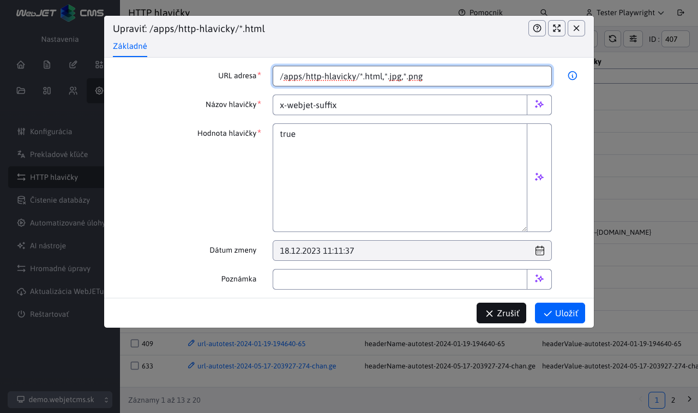

# HTTP hlavičky

Aplikácia HTTP hlavičky v sekcii Nastavenia umožňuje definovať HTTP hlavičky odpovede (`HTTP Response Header`) na základe URL adries zobrazenej stránky. Hlavičky sú oddelené podľa domén, nastavujú sa pre každú doménu samostatne.


Ak existuje viac hlavičiek s rovnakým názvom, použije sa hlavička s najdlhšou zhodou v URL adrese. V ukážke je vidno nastavenie rozdielnych hodnôt pre hlavičku `X-webjet-header` pre URL adresy `/apps/http-hlavicky/` a `/apps/http-hlavicky/podpriecinok/`. Hodnota pre stránku `/apps/http-hlavicky/podpriecinok/stranka.html` sa použije na základe najdlhšej zhody URL, čo znamená, že bude mať hodnotu `sub-folder`.

## Editor



Editor hlavičiek obsahuje polia:

- **URL adresa** určuje, pre ktoré URL adresy sa definuje hlavička. Podporovaný je nasledovný zápis:
    - `/folder/subfolder/` - hlavička sa generuje pre všetky URL, ktoré začínajú na zadanú hodnotu.
    - `^/path/subpath/$` - hlavička sa generuje pre presnú zhodu URL adresy.
    - `/path/subpath/*.pdf` alebo `/path/subpath/*.pdf,*.jpg` - hlavička sa generuje pre URL adresy začínajúce na `/path/subpath/` a končiace na `.pdf` alebo v druhom prípade aj pre `.jpg`.
- **Názov hlavičky** udáva názov samotnej hlavičky, ktorá sa pridáva.
- **Hodnota hlavičky** udáva hodnotu nastavenej hlavičky.
- **Poznámka** doplnková informácia, napr. kto a kedy požadoval nastavenie danej hlavičky. Hodnota sa zobrazuje len v administrácii.


Ako príklad použijeme obrázok vyššie s editorom už vytvoreného záznamu. Tieto hodnoty určujú, že pre každú URL adresu, ktorá začína na `/apps/http-hlavicky/`, sa vygeneruje HTTP hlavička `x-webjet-header` s hodnotou `root-folder`.

V názve aj hodnote môžete použiť makro ```{HTTP_PROTOCOL}, {SERVER_NAME}/{DOMAIN_NAME}/{DOMAIN_ALIAS}, {HTTP_PORT}```, ktoré bude nahradené za hodnotu získanú na serveri. ```SERVER_NAME``` je doménové meno z ```request.getServerName()```, ```DOMAIN_NAME``` a ```DOMAIN_ALIAS``` sú hodnoty domén alebo alias-u nastavené vo web stránkach. Hodnota ```{INSTALL_NAME}``` reprezentuje meno inštalácie. Hodnota ```{HEADER_ORIGIN}``` obsahuje hodnotu HTTP hlavičky ```origin```.

Upozornenie: niektoré hlavičky sa nastavujú priamo cez konfiguračné premenné a môžu niekedy zmeniť nastavenú hodnotu (napr. `x-robots-tag` pre stránku s vypnutým prehľadávaním), viď zoznam pre [Bezpečnostné testy](../../../sysadmin/pentests/README.md#http-hlavičky).

## Web stránky

Pri zobrazení web stránky sa automaticky nastavuje HTTP hlavička `Content-Language` podľa jazyka priečinka/šablóny. Ak nastavíte inú hodnotu v aplikácii hlavičky použije sa nastavená hodnota bez ohľadu na jazyk priečinka/šablóny.

## Nastavenie pre súbory

Pre URL adresy začínajúce na `/files,/images,/shared` sa automaticky nastavuje HTTP hlavička `Content-Language` podľa základného jazyka administrácie v konf. premennej `defaultLanguage`. Naviac sú nastavené podľa nasledovných pravidiel:

- ak URL obsahuje `/en/` nastaví sa `en-GB`
- ak URL obsahuje `/de/` nastaví sa `de-DE`
- ak URL obsahuje `/cz/` nastaví sa `cs-CZ`
- ak URL obsahuje `/sk/` nastaví sa `sk-SK`

Krajina na základe jazyka sa získava z konf. premennej `countryForLng`, ak nie je zadaná použije sa ako krajina rovnaká hodnota ako požadovaný jazyk.