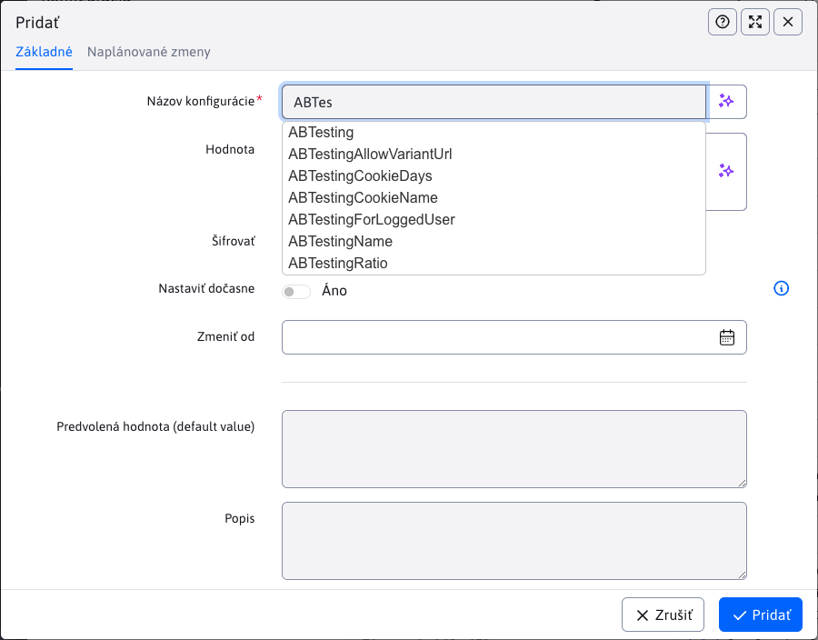
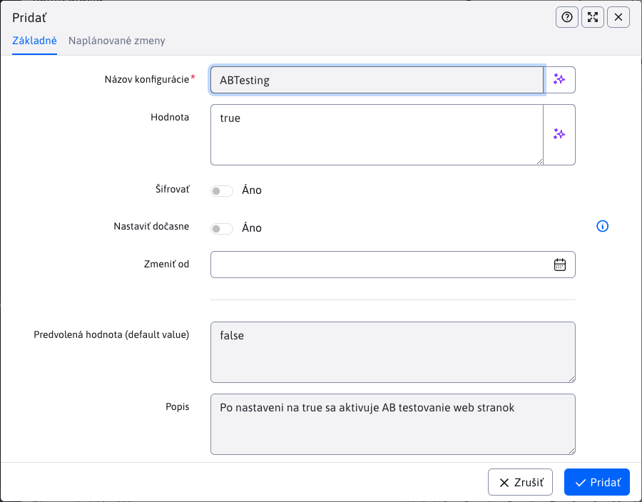

# Konfigurácia

Sekcia konfigurácia slúži na zobrazenie a správu konfiguračných premenných. V ľavej časti sa nachádza strom, ktorý rozdeľuje premenné do nasledujúcich pohľadov:

- **Zmenené** - premenné, ktorých hodnota je uložená v databáze. Tento pohľad je zvolený po otvorení stránky.
- **Zákaznícke** - premenné uložené iba v databáze bez definície v `Constants`/`ConstantsV9` alebo premenné, ktorých názov sa začína aktuálnou hodnotou `Constants.getInstallName()` (napríklad `aceintegration_test`).
- **Všetky** - všetky evidované premenné vrátane ich predvolených hodnôt a vlastných premenných uložených iba v databáze.
- **Moduly** - hierarchické skupiny, napríklad `apps.gallery` alebo `security.oauth2`. Výber rodičovského uzla zobrazí aj premenné zo všetkých jeho poduzlov. Jedna premenná môže byť zaradená vo viacerých vetvách.

Strom je možné prehľadávať. Názvy modulov sú technické názvy a neprekladajú sa. Vo vybranom module je možné existujúcu premennú upraviť, ale nie vytvoriť novú ani spustiť import, pretože vlastná databázová premenná nemá informáciu o zaradení do modulu.

V sekcii inštalácia je zoznam [najpoužívanejších konfiguračných premenných](../../../install/config/README.md).

## Pridávanie konfiguračných premenných

Pri pridávaní je najdôležitejší parameter **Názov konfigurácie**, ktorý sa správa ako textové pole s funkciou automatického doplnenia. Pri zadávaní názvu konfigurácie bude ponúkať názvy už existujúcich premenných, vrátane tých, ktoré ešte nie sú upravené (nie sú v tabuľke).

Môžu nastať 3 situácie:

- využijeme automatické doplnenie a zvolíme už existujúcu konfiguráciu
  - ak táto konfigurácia už JE v tabuľke, **vykoná sa iba úprava** (bude upravený už existujúci záznam v tabuľke)
  - ak táto konfigurácia NIE JE v tabuľke, **vykoná sa pridanie** nového záznamu do tabuľky **ale** nie je pridaná nová konfiguračná premenná (iba sme zmenili jej prednastavenú hodnotu)
- nevyužijeme automatické doplnenie, **vykoná sa pridanie** nového záznamu do tabuľky **a súčasne** tým definujeme úplne novú konfiguračnú premennú

Ak zvolíme ponúknutú možnosť, tak sa v editore zobrazí aktuálna/predvolená hodnota zadanej konfiguračnej premennej.

Zmena sa zvyčajne prejaví hneď po akcií pridania/upravenia. Niektoré konfiguračné premenné ale vyžadujú reštart aplikačného servera.

## Úprava konfiguračných položiek

Môžu nastať 3 situácie:

- nezmeníme **Názov konfigurácie**, tak sa **vykoná úprava** premennej, ktorú sme upravovali
- zmeníme **Názov konfigurácie**, tak sa **nevykoná úprava** pôvodnej konfiguračnej premennej
  - ak zmenený názov, za názov **existujúcej** konfiguračnej premennej, tak sa **vykoná úprava**
  - ak zmenený názov, za názov **neexistujúcej** konfiguračnej premennej, tak sa **vykoná pridanie** novej premennej

## Dočasné nastavenie hodnoty

Ak potrebujete zmeniť hodnotu konfiguračnej premennej iba na overenie jej správania, v editore zapnite možnosť **Nastaviť dočasne**. Hodnota sa nastaví iba v pamäti aktuálneho uzla, neuloží sa do databázy ani sa neprenesie na ostatné uzly klastra. Po reštarte aplikačného servera sa opäť použije hodnota uložená v databáze.

Pri dočasnom nastavení nie je možné hodnotu zašifrovať ani naplánovať jej zmenu, preto sa polia **Šifrovať** a **Zmeniť od** v editore skryjú.

Ak sa aktuálna hodnota na uzle líši od uloženej hodnoty, v stĺpci **Hodnota** sa zobrazia obe hodnoty vo formáte "aktuálna hodnota / uložená hodnota". Druhá hodnota je zobrazená tlmenou farbou a po umiestnení kurzora sa označí ako momentálne neaktívna. Môže ísť o hodnotu uloženú v databáze alebo o predvolenú hodnotu pri premennej bez databázového záznamu. Pri opätovnom otvorení editora sa do poľa **Hodnota** načíta uložená, nie dočasná hodnota.

## Vymazanie konfiguračných položiek

Vymazanie znamená reset databázovej hodnoty. Môžu nastať 2 situácie:

- ak **existuje prednastavená hodnota**, začne sa používať a premenná zostane zobrazená v pohľade **Všetky** a v príslušných moduloch; z pohľadu **Zmenené** zmizne,
- ak **neexistuje prednastavená hodnota**, vlastná databázová premenná po resete prestane existovať.

Premennú, ktorá nemá databázovú hodnotu, nie je možné vymazať.
