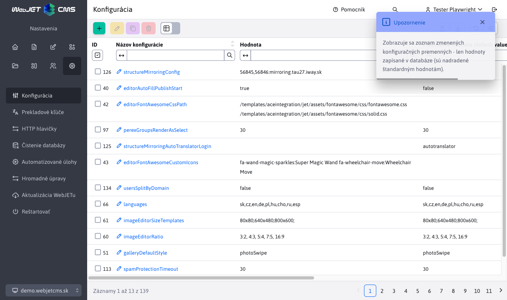
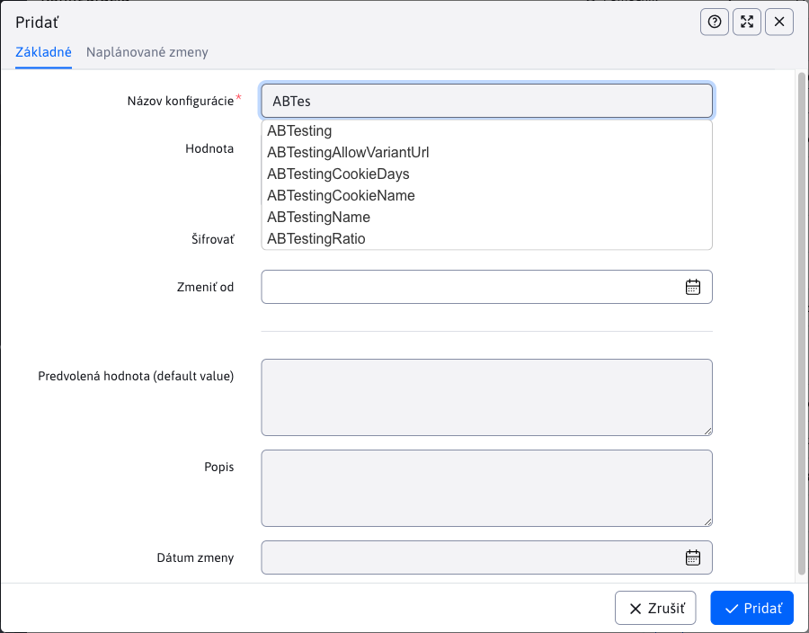
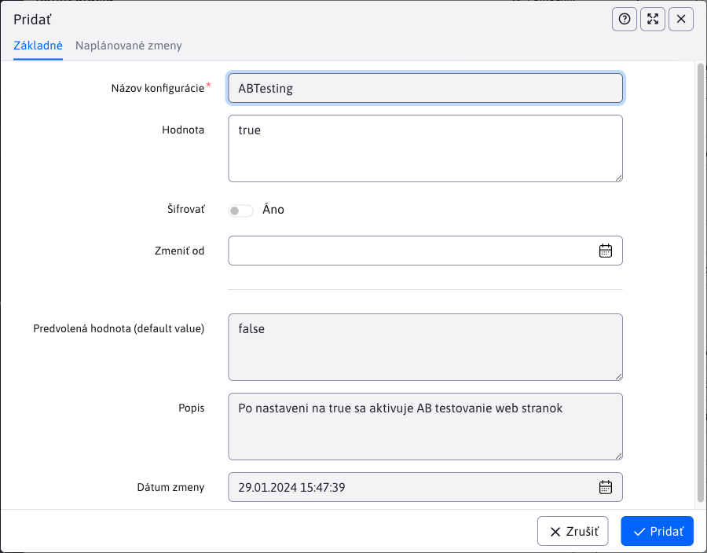

# Konfigurácia

Sekcia konfigurácia slúži na zobrazenie a správu jednotlivých konfiguračných premenných, ktoré sa odlišujú od prednastavených hodnôt.

V sekcii inštalácia je zoznam [najpoužívanejších konfiguračných premenných](../../../install/config/README.md).

## Pridávanie konfiguračných premenných

Pri pridávaní je najdôležitejší parameter ``Názov konfigurácie``, ktorý sa správa ako textové pole s funkciou automatického doplnenia. Pri zadávaní názvu konfigurácie bude ponúkať názvy už existujúcich premenných, vrátane tých, ktoré ešte nie sú upravené (nie sú v tabuľke).

Môžu nastať 3 situácie:

- využijeme automatické doplnenie a zvolíme už existujúcu konfiguráciu
  - ak táto konfigurácia už JE v tabuľke, **vykoná sa iba úprava** (bude upravený už existujúci záznam v tabuľke)
  - ak táto konfigurácia NIE JE v tabuľke, **vykoná sa pridanie** nového záznamu do tabuľky **ale** nie je pridaná nová konfiguračná premenná (iba sme zmenili jej prednastavenú hodnotu)
- nevyužijeme automatické doplnenie, **vykoná sa pridanie** nového záznamu do tabuľky **a súčasne** tým definujeme úplne novú konfiguračnú premennú

Ak zvolíme ponúknutú možnosť, tak sa v editore zobrazí aktuálna/predvolená hodnota zadanej konfiguračnej premennej.

Zmena sa zvyčajne prejaví hneď po akcií pridania/upravenia. Niektoré konfiguračné premenné ale vyžadujú reštart aplikačného servera.

## Úprava konfiguračných položiek

Môžu nastať 3 situácie:

- nezmeníme ``Názov konfigurácie``, tak sa **vykoná úprava** premennej, ktorú sme upravovali
- zmeníme ``Názov konfigurácie``, tak sa **nevykoná úprava** pôvodnej konfiguračnej premennej
  - ak zmenený názov, za názov **existujúcej** konfiguračnej premennej, tak sa **vykoná úprava**
  - ak zmenený názov, za názov **neexistujúcej** konfiguračnej premennej, tak sa **vykoná pridanie** novej premennej

## Vymazanie konfiguračných položiek

Pri vymazaní konfiguračnej premennej môžu nastať 2 situácie:

- vymažeme hodnotu z tabuľky a **existuje prednastavená hodnota** k tejto konfiguračnej premennej, ktorá sa začne využívať (premenná stále existuje)
- vymažeme hodnotu z tabuľky a **neexistuje prednastavená hodnota** k tejto konfiguračnej premennej (premenná už nebude existovať)

**Upozornenie:** oproti vytváraniu/editácií, pri vymazaní sa nastaví prázdna hodnota. Ak má konfiguračná premenná prednastavenú hodnotu, tá sa prejaví **až po reštartovaní** aplikačného servera.