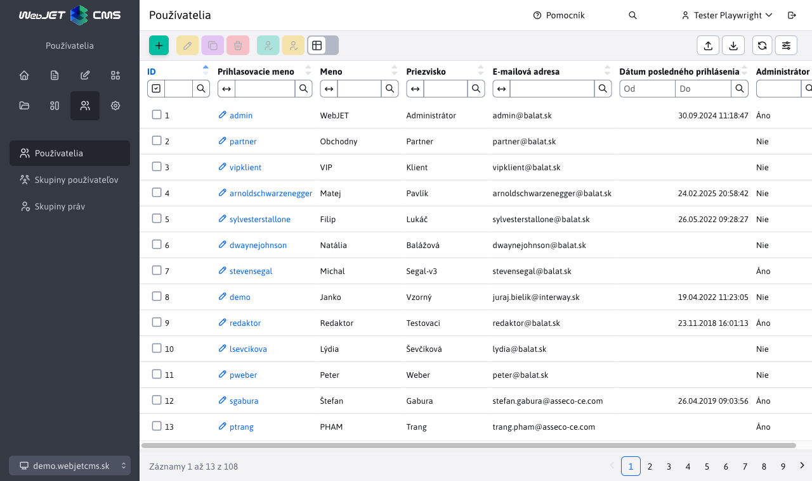
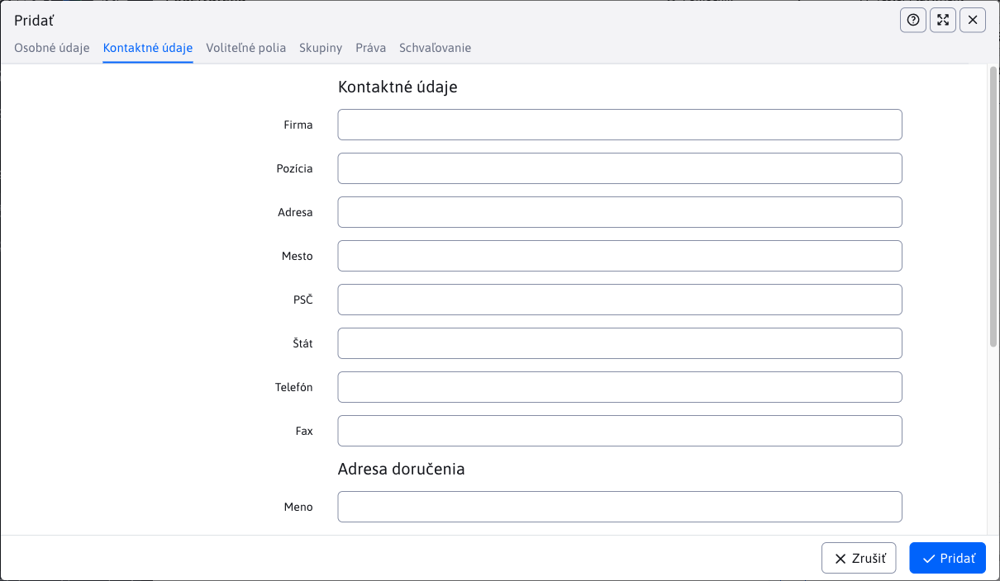
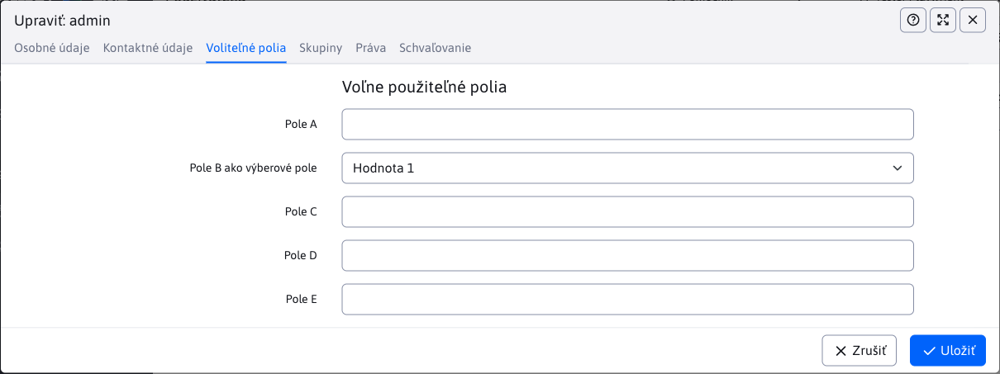
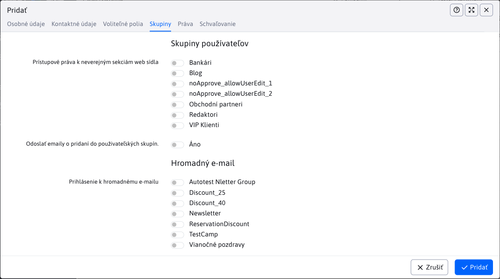
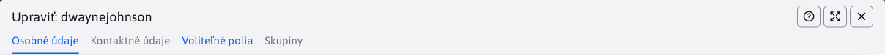
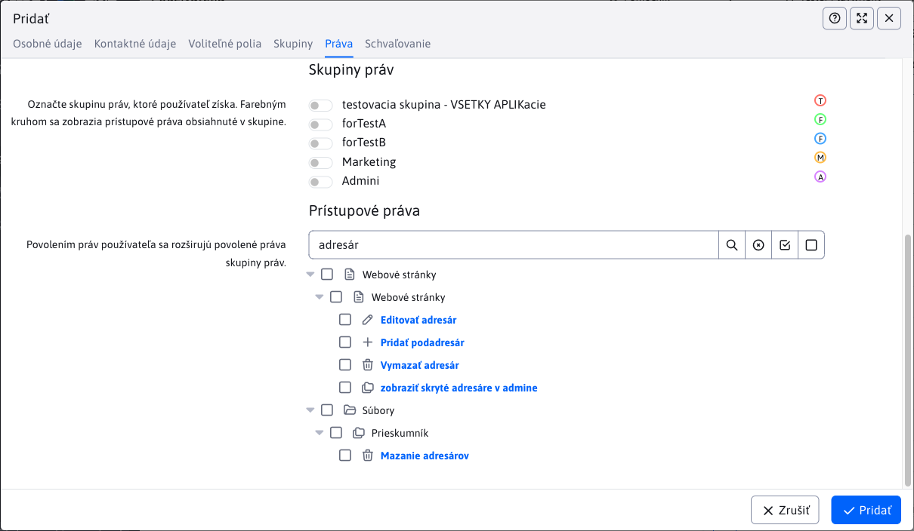

# Zoznam používateľov

V zozname používateľov je možné spravovať administrátorov (vyžaduje právo ```správa administrátorov```) a registrovaných používateľov web sídla/používateľov pre hromadný e-mail (vyžaduje právo ```správa registrovaných používateľov```).



Pri filtrovaní v tabuľke sa v stĺpcoch Prístupové práva k neverejným sekciám web sídla alebo Prihlásenie k hromadnému e-mailu vyhľadáva podľa názvu zadanej skupiny. Ak zvolíte možnosť Rovná sa použije sa vyhľadanie podľa presného názvu zadanej skupiny a zároveň sa vyhľadajú používatelia, ktorí majú iba túto jednu skupinu (nie viacero skupín).


## Karta - Osobné údaje

Karta osobné údaje obsahuje základné údaje používateľa. Delí sa na dve časti a to „Osobné údaje“ a „Prístup“.


### Osobné údaje

V tejto časti karty sa vyplňujú údaje o používateľovi ako Titul, Meno, Priezvisko, Dátum narodenia a pod. Povinné polia v tejto časti, ktoré musia byť vyplnené sú :

- Meno
- Priezvisko

### Prístup

V tejto časti karty sa vyplňujú údaje o používateľskom účte ako Začiatok a Koniec platnosti (umožňujú dátumovo obmedziť platnosť prihlásenia používateľa), Prihlasovacie meno (musí byť jedinečné), Heslo a pod. Povinné polia v tejto časti, ktoré musia byť vyplnené sú :

- Prihlasovacie meno
- E-mailová adresa
- Heslo

Pole heslo obsahuje kontrolu kvality zadaného hesla a odporúča sa, aby heslo bolo čo najbezpečnejšie. Pri zvolení možnosti "Povoliť slabé heslo", sa nebude kontrolovať kvalita zadaného hesla pri uložení používateľa.

Zadaním znaku `*` alebo textu `random` do poľa heslo sa heslo náhodne vygeneruje pri uložení používateľa.

Pre možnosť prihlásenia používateľa je dôležité je, aby používateľ mal zvolenú možnosť "Schválený používateľ".

## Karta - Kontaktné údaje

Karta Kontaktné údaje sa delí na dve časti a to :

- Kontaktné údaje - obsahuje údaje používateľa ako Adresa, Mesto, Telefón a pod.
- Adresa doručenia - obsahuje dodatočné údaje potrebné pre doručenie zásielky ako Meno, Priezvisko, Adresa, Mesto a pod (typicky využité v rámci aplikácie elektronický obchod).

Karta neobsahuje povinné pole, ktoré by bolo nutné vyplniť.



## Karta - Voliteľné polia

Táto karta obsahuje voľne použiteľné polia. Viac informácii k ich konfigurácii nájdete v dokumentácii [voliteľné polia](../../frontend/webpages/customfields/README.md).



## Karta - Skupiny

Karta Skupiny sa delí na dve časti a to :

- Skupiny používateľov - zvolením mena skupiny používateľov získa používateľ prístupové práva k neverejným sekciám web sídla.
- Hromadný e-mail - zvolením mena skupiny sa prihlási používateľ k skupine hromadného e-mailu.



## Karta - Práva

Karta slúži na nastavenie práv pre administračnú sekciu (definuje sa k čomu bude mať daný používateľ prístup / práva). Potrebné časti pre nastavovanie sa zobrazia iba v prípade, ak je zvolená možnosť vstup do admin sekcie (správa web sídla). Pokiaľ používateľ túto možnosť nemá zvolená, tak je v systéme len ako Registrovaný používateľ a nebude mať povolený vstup do administračnej časti web sídla.


Toto povolenie môže pridať iba používateľ s už prideleným administračným právom. Bez administračného práva sa  karta Práva ani nezobrazí.



Po zvolení možnosti prístupu do admin sekcie sa používateľovi zobrazí zvyšok karty, ktorý sa delí na nasledovné časti:

- Práva na adresáre a stránky
- Nahrávanie súborov do adresárov
- Skupiny práv
- Prístupové práva


### Práva na adresáre a stránky

V časti Práva na adresáre a stránky môžete obmedziť možnosť editácie web sídla len na určitú sekciu (adresár) alebo web stránku. Pri kliknutí na jedno s tlačidiel pridať sa zobrazí stromová štruktúra web stránok, kde môžete vybrať Web stránku alebo Adresár.

Kliknutím na ikonu ceruzky pri už pridanom adresári/stránke je možné adresár/stránku zmeniť, kliknutím na ikonu koša je možné právo zmazať.

Štandardne administrátor, ktorý **nemá zvolené žiadne právo na adresár/stránku automaticky získava práva na všetky adresáre a web stránky**.

V multi doménovej inštalácii je v editácii používateľa a skupín práv možné vyberať priečinky web stránok a jednotlivé web stránky bez ohľadu na aktuálne zvolenú doménu. Domény sa zobrazia ako koreňové priečinky, pričom priečinok s názvom domény nie je možné vybrať. Je potrebné vybrať jednotlivé priečinky v doméne, keďže doména samotná nie je reálny priečinok. Zobrazenie vybranej položky obsahuje prefix s doménovým menom, aby bolo možné rozlíšiť jednotlivé priečinky (často sa volajú v rôznych doménach rovnako, napr. Slovensky).


### Nahrávanie súborov do adresárov

V tejto časti je možné zvoliť práva na nahrávanie súborov do adresárov súborového systému. Po kliknutí na tlačidlo pridať sa zobrazí stromová štruktúra súborového systému kde môžete vybrať príslušný adresár.

Štandardne administrátor, ktorý nemá zvolený žiaden adresár súborového systému môže nahrávať súbory do ľubovoľného adresára. Správanie sa dá zmeniť nastavením konfiguračnej premennej ```defaultDisableUpload``` na hodnotu ```true```, čo spôsobí, že nahrávať súbory bude možné len do zvolených adresárov (a ak používateľ nemá zvolený žiaden adresár nebude môcť nahrávať súbory vôbec).


### Skupiny práv a Prístupové práva

V karte práva sa zobrazuje zoznam skupín práv. Pri každej skupine sa zobrazuje **farebný kruh s prvým písmenom mena skupiny**. Rovnaké kruhy sa následne zobrazujú aj v jednotlivých právach. Zvýrazňujú jednotlivé práva z danej skupiny.


Zvolením skupiny práv sa **farba kruhu nastaví aj do pozadia kruhu** pre lepšie zvýraznenie vybraných práv. Odporúčame preto pripraviť skupiny práv pre redaktorov, marketing, správcu a podobne a nenastavovať jednotlivé práva používateľom ale im priraďovať práva skupinovo.

Pri editácii/pridávaní nového používateľa a zvolení skupín práv v zozname Prístupové práva vidíte práva, ktoré skupina obsahuje a môžete prípadne používateľovi **pridať špecifické právo** (ak je to potrebné). Pri prihlásení používateľ automaticky **získa práva nastavené v skupine práv a práva nastavené používateľovi**.

Jednotlivé prístupové práva sú reprezentované v stromovej štruktúre Prístupové práva. Rozlišujeme:

- uzol, ktorý obsahuje potomkov - sám o sebe nie je právo, reprezentuje len zaradenie práva v stromovej štruktúre
- koncový uzol - reprezentuje samotné právo

Zvolením zaškrtávacieho poľa vedľa uzla, ktorý obsahuje potomkov, naraz označíte alebo odznačíte všetkých potomkov tohto uzla. Viete tak efektívne označovať/odznačovať viaceré práva naraz.

**Vyhľadávanie práv**

Pod nadpisom Prístupové práva sa nachádza vyhľadávacie pole. Môžete do neho zadať meno práva a kliknutím na ikonu lupy filtrovať stromovú štruktúru len o na práva obsahujúce zadaný výraz. Filtrovaný výraz zrušíte kliknutím na ikonu krížika vo vyhľadávacom poli.

Pole na konci obsahuje aj ikonu voľby všetkých práv a zrušenia voľky všetkých práv. Jedným kliknutím tak môžete naraz označiť/od-značiť všetky práva.



## Karta - Schvaľovanie

V karte schvaľovanie je možné definovať akciu pri zmene v zvolenom adresári web stránok (typicky schvaľovanie). Karta sa zobrazí len pre už uloženého používateľa (novo vytváraného používateľa je potrebné najskôr uložiť až následne nastaviť proces schvaľovania).

Pri pridaní záznamu kliknutím na ikonu + (Pridať) volíte Adresár (zo štruktúry web stránok) a Akcia. Oba atribúty sú povinné. Môžete vybrať jednu z nasledovných akcií :

- Schválenie (prednastavená voľba) - ak nastane zmena vo vybranom adresári aktuálne editovaný používateľ túto zmenu bude schvaľovať.
- Notifikácia - ak nastane zmena vo vybranom adresári pošle sa aktuálne editovanému používateľovi emailová notifikácia o zmene vo web stránke.
- Žiadna - nevykoná sa žiadna akcia, ale zároveň editovaný používateľ nevyvolá proces schvaľovania v danom adresári. Táto možnosť je vhodná, ak máte viacerých schvaľovateľov a zároveň potrebujete používateľovi nastaviť výnimku, aby zmeny vykonané týmto používateľom boli automaticky schválené.
- Schválenie - druhá úroveň - ak potrebujete viac úrovňové schvaľovanie túto možnosť nastavíte používateľovi schválenia na druhej úrovni.

Viac informácií je v [dokumentácii pre redaktora](../../redactor/webpages/approve/README.md).


## Rozdiely voči verzii 8

Právo "Skrátené menu v editore" je upravené na právo "Kompletné menu v editore" aby nebolo zmyslovo inverzné a pre plné práva bolo možné označiť všetky položky.
