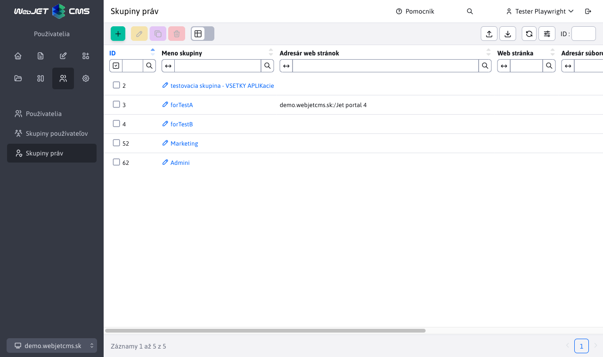
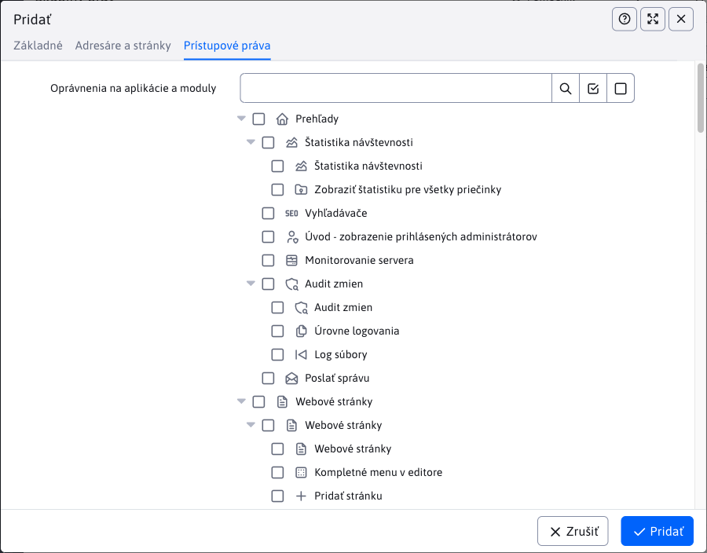

# Skupiny práv

V skupinách práv môžete definovať skupinové oprávnenia. Pomocou tlačidiel, ktoré sa nachádzajú v ľavej hornej časti stránky môžete vytvárať/upravovať/duplikovať/mazať skupiny práv, exportovať skupiny práv do excelu alebo ich importovať z excelu.

Môžete teda vytvoriť skupinu práv s názvom "Redaktor" ktorému definujete práva na web stránky a najčastejšie používané aplikácie (novinky, fotogaléria). Nemusíte tak jednotlivo nastavovať práva. Pri vytváraní a duplikovaní skupiny práv je jediný povinný parameter "Meno skupiny". Dôležitá je karta Prístupové práva kde nastavujete práva na aplikácie/moduly, ktoré daná skupina bude obsahovať.

Používateľovi sú pri prihlásení nastavené všetky práva zo skupín práv, ktoré má zvolené a pridané sú aj jeho individuálne nastavené práva.

