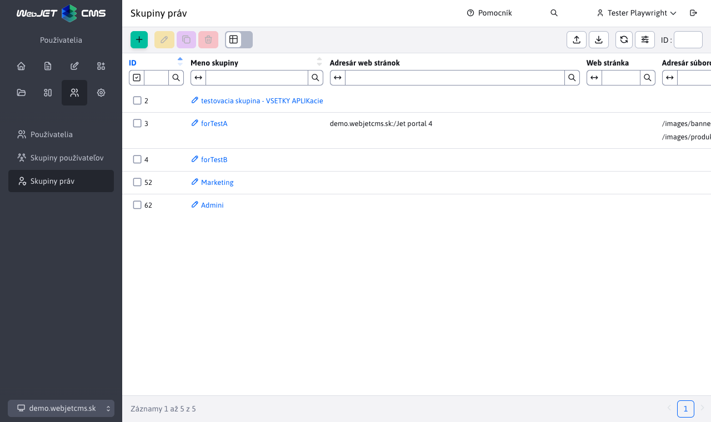
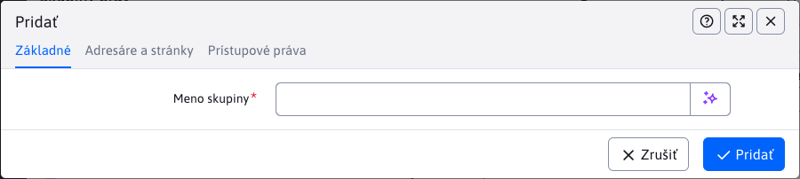
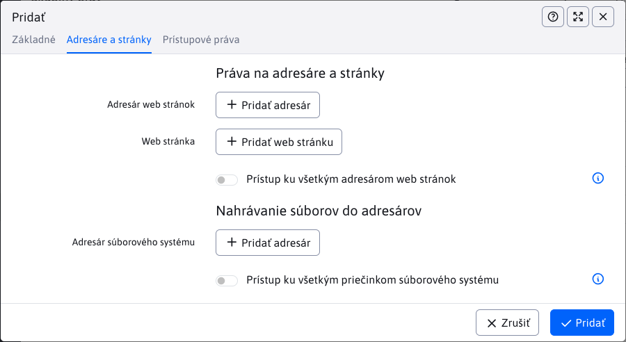
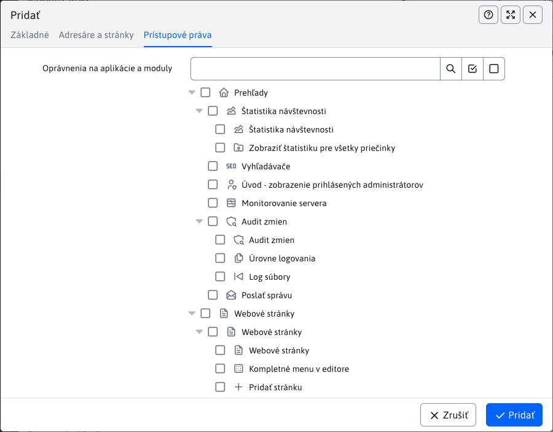

# Skupiny práv

V skupinách práv môžete definovať skupinové oprávnenia. Pomocou tlačidiel, ktoré sa nachádzajú v ľavej hornej časti stránky môžete vytvárať/upravovať/duplikovať/mazať skupiny práv, exportovať skupiny práv do excelu alebo ich importovať z excelu.

Používateľovi sú pri prihlásení nastavené všetky práva zo skupín práv, ktoré má zvolené a pridané sú aj jeho individuálne nastavené práva.

Môžete teda vytvoriť skupinu práv s názvom "Redaktor" ktorému definujete práva na web stránky a najčastejšie používané aplikácie (novinky, fotogaléria). Nemusíte tak jednotlivo nastavovať práva. Pri vytváraní a duplikovaní skupiny práv je jediný povinný parameter "Meno skupiny". Dôležitá je karta Prístupové práva kde nastavujete práva na aplikácie/moduly, ktoré daná skupina bude obsahovať.

Povinné je zadať meno skupiny:

V karte Adresáre a stránky môžete nastaviť ktoré adresáre a stránky môže používateľ modifikovať:

Karta obsahuje nasledovné možnosti:

- **Prístup ku všetkým adresárom web stránok** - ak zapnete túto možnosť, práva z viacerých skupín sa nebudú sčítavať, ale používateľ bude mať prístup ku všetkým adresárom web stránok bez ohľadu na nastavenie práv v iných skupinách. Po zapnutí sa skryjú polia pre výber jednotlivých adresárov a stránok.
- **Prístup ku všetkým priečinkom súborového systému** - ak zapnete túto možnosť, používateľ bude mať prístup ku všetkým priečinkom súborového systému (napr. `/images`, `/files`) bez ohľadu na nastavenie práv v iných skupinách. Po zapnutí sa skryje pole pre výber jednotlivých priečinkov.

Tieto možnosti sú užitočné napríklad pre skupinu "Administrátor", kde chcete zabezpečiť prístup ku všetkým adresárom a priečinkom bez ohľadu na obmedzenia definované v iných skupinách práv priradených používateľovi.

V karte Prístupové práva môžete nastaviť jednotlivé práva na funkcie a aplikácie:

