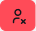
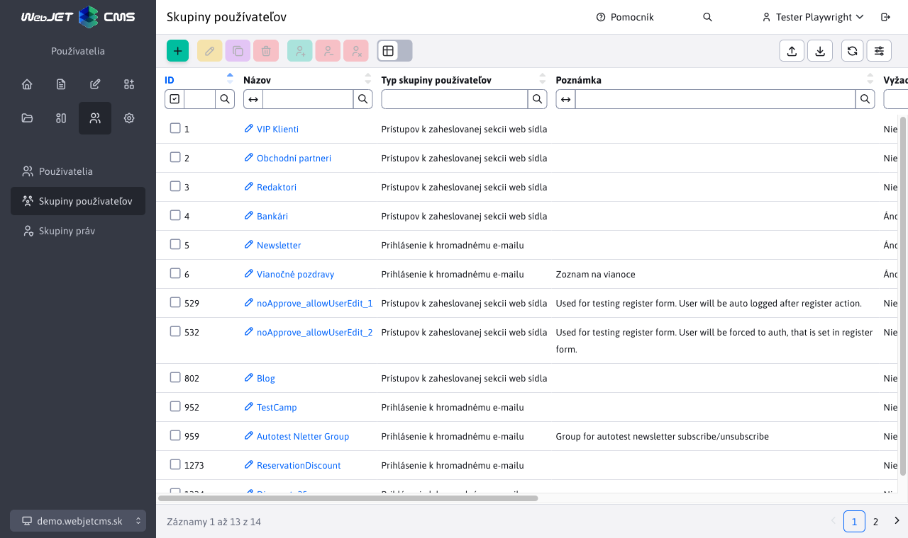
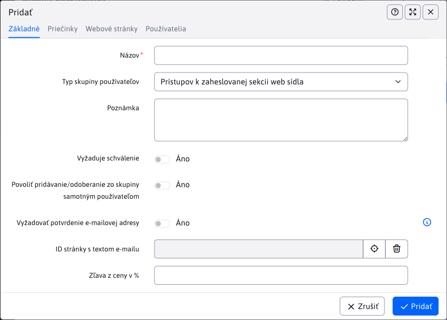

# Skupiny používateľov

Sekcia **Skupiny používateľov** zobrazuje zoznam skupín, do ktorých môžete kategorizovať návštevníkov/používateľov/príjemcov hromadného emailu.

Systémovo rozlišujeme dva typy skupín:

- **Prístupov k zaheslovanej sekcii web sídla** - skupina pre prístupové práva k neverejným sekciám web sídla
- **Prihlásenie k hromadnému e-mailu** - skupina pre distribučný zoznam na posielanie hromadných emailov

Tabuľka ponúka rýchle akcie nad skupinami pomocou tlačidiel:

-  **Pridať zvolenú skupinu všetkým používateľom**- zvolené skupiny budú pridané všetkým existujúcim používateľom.
-  **Odobrať zvolenú skupinu všetkým používateľom** - zvolené skupiny budú odobraté všetkým existujúcim používateľom.
-  **Zmazať všetkých používateľov zvolenej skupiny** - používatelia ktorý majú aspoň jednu zo zvolenej skupiny budú vymazaný.

## Editor

V dialógovom okne editora pre definovanie skupiny máte nasledovné možnosti:

- **Názov** - jednoznačný názov skupiny používateľov.
- **Typ skupiny** - typ skupiny, buď prístupové práva pre skupinu na kontrolu práv, alebo skupinu pre hromadný email.
- **Poznámka** - ľubovoľná poznámka.
- **Vyžaduje schválenie** - ak je zaškrtnuté tak po zaregistrovaní používateľa do tejto skupiny sa najskôr zašle email na schválenie registrácie administrátorovi. Používateľ sa vytvorí v databáze, nebude mať ale zvolené pole Schválený a nebude sa môcť prihlásiť
- **Povoliť pridávanie/odoberanie zo skupiny samotným používateľom** - ak je nastavené, tak skupinu si bude môcť pridať / odobrať sám používateľ. Zvyčajne sa to nastavuje pre e-mail skupiny, aby sám používateľ si mohol nastaviť do akých distribučných zoznamov bude prihlásený. Pre skupiny s prístupovými právami ponechajte nezaškrtnuté.
- **Vyžadovať potvrdenie e-mailovej adresy** - ak je zvolené bude pri registrácii používateľa cez registračný formulár zaslaný odkaz na potvrdenie emailovej adresy. Až po kliknutí na odkaz v email správe bude používateľ do skupiny priradený.
- **ID stránky s textom emailu** - výber stránky s textom emailu, ktorý sa používateľovi zašle po jeho schválení.
- **Zľava z ceny v %** - percentuálna zľava pre používateľov v tejto skupine. Zľava pre používateľa môže byť využitá v rôznych aplikáciách ako sú napríklad [Rezervácie](../../redactor/apps/reservation/reservations/README.md).

