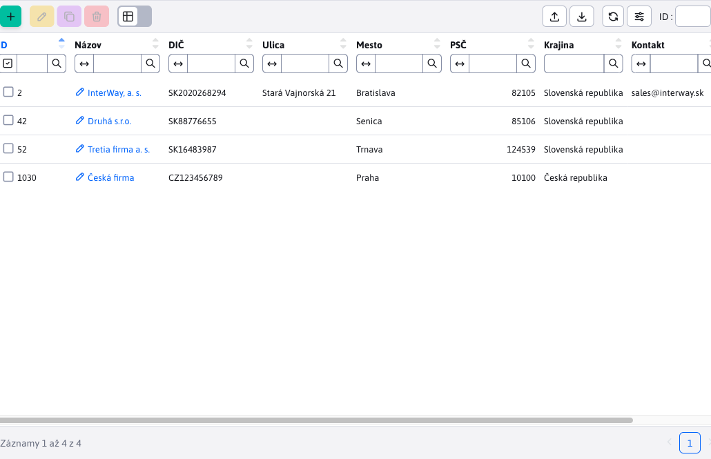

# Položka v menu admin časti

Administrácia je založená na [data tabuľkách](../../developer/datatables/README.md) a [REST rozhraní](../../developer/datatables/restcontroller.md). Ako základ je potrebné pochopiť ich fungovanie podľa dokumentácie pre [Programátora WebJET CMS](../../developer/README.md).

V tejto ukáže naprogramujeme správu kontaktov, využitá je tabuľka ```contact```, ktorá existuje v štandardnej inštalácii WebJET CMS (ale typicky sa nepoužíva).


## Backend

Ideálne riešenie využíva Spring DATA repozitár, REST controller a datatabuľku generovanú z ```@DataTableColumn```, [anotácií](../../developer/datatables-editor/datatable-columns.md).

Ukážková JPA entita aj s anotáciami ```@DataTableColumn```, [pre datatabuľku a editor](../../developer/datatables-editor/datatable-columns.md). Tiež si všimnite anotáciu ```@EntityListeners``` pre automatické [zapisovanie auditu](../../developer/backend/auditing.md) pri zmene entity.

Povinné polia a iné validácie [nastavujete anotáciami](../../developer/datatables/restcontroller.md#validácia--povinné-polia), ```@NotBlank,@Size,@Email``` atď.

POZOR: v entite nepoužívajte primitívne typy `int, long` ale len objektové `Integer, Long`, inak nebude korektne fungovať filtrovanie/vyhľadávanie.

```java
package sk.iway.basecms.contact;

import javax.persistence.Column;
import javax.persistence.Entity;
import javax.persistence.EntityListeners;
import javax.persistence.GeneratedValue;
import javax.persistence.Id;
import javax.persistence.Table;
import javax.persistence.TableGenerator;
import javax.validation.constraints.Email;
import javax.validation.constraints.NotBlank;
import javax.validation.constraints.Size;

import lombok.Getter;
import lombok.Setter;
import sk.iway.iwcm.system.adminlog.EntityListenersType;
import sk.iway.iwcm.system.datatable.DataTableColumnType;
import sk.iway.iwcm.system.datatable.annotations.DataTableColumn;

/**
 * Ukazkova JPA entita pre pouzitie v datatabulke
 * http://docs.webjetcms.sk/v2022/#/custom-apps/admin-menu-item
 */

//nastavenie JPA entity
@Entity
@Table(name = "contact")
//automaticke generovanie getter/setter metod cez lombok
@Getter
@Setter
//nastavenie automatickeho auditovania zmien, dolezite je nastavit Adminlog.TYPE_XXX
@EntityListeners(sk.iway.iwcm.system.adminlog.AuditEntityListener.class)
@EntityListenersType(sk.iway.iwcm.Adminlog.TYPE_CLIENT_SPECIFIC)
public class ContactEntity {

    @Id
    @Column(name = "contact_id")
	@GeneratedValue(generator = "WJGen_contact")
	@TableGenerator(name = "WJGen_contact", pkColumnValue = "contact")
    @DataTableColumn(inputType = DataTableColumnType.ID, title="ID", renderFormat = "dt-format-selector")
    private Long id;

    @DataTableColumn(inputType = DataTableColumnType.OPEN_EDITOR, title="components.contact.property.name")
    @NotBlank
    private String name;

    @DataTableColumn(inputType = DataTableColumnType.TEXT, title="components.contact.property.vatid")
    private String vatid;

    @DataTableColumn(inputType = DataTableColumnType.TEXT, title="components.contact.property.street")
    private String street;

    @DataTableColumn(inputType = DataTableColumnType.TEXT, title="components.contact.property.city")
    private String city;

    @DataTableColumn(inputType = DataTableColumnType.TEXT, title="components.contact.property.zip")
    @Size(min=5, max=8)
    private String zip;

    @DataTableColumn(inputType = DataTableColumnType.SELECT, title="components.contact.property.country")
    private String country;

    @DataTableColumn(inputType = DataTableColumnType.TEXT, title="components.contact.property.contact")
    @Email
    private String contact;

    @DataTableColumn(inputType = DataTableColumnType.TEXT, title="components.contact.property.phone")
    private String phone;

}
```

Ukážkový JPA repozitár, pri jeho použití vždy využívajte aj ```Pageable``` objekt pre stránkovanie a usporiadanie. Pre podporu dynamického generovania vyhľadávacích kritérií (v REST controlleri metóda ```addSpecSearch```) repozitár rozširuje aj ```JpaSpecificationExecutor```.

```java
package sk.iway.basecms.contact;

import org.springframework.data.domain.Page;
import org.springframework.data.domain.Pageable;
import org.springframework.data.jpa.repository.JpaRepository;
import org.springframework.data.jpa.repository.JpaSpecificationExecutor;

/**
 * Ukazkovy Spring DATA repozitar pre pouzitie v datatabulke
 * http://docs.webjetcms.sk/v2022/#/custom-apps/admin-menu-item
 */
public interface ContactRepository extends JpaRepository<ContactEntity, Long>, JpaSpecificationExecutor<ContactEntity> {

    //citanie firiem podla zadanej krajiny pre MVC ukazku
    public Page<ContactEntity> findAllByCountry(String country, Pageable pageable);

}
```

**Upozornenie:** všimnite si použitie ```JpaSpecificationExecutor```. Ten umožňuje dynamickú tvorbu SQL príkazu pre vyhľadávanie/filtrovanie/usporiadanie záznamov v datatabuľke. Ak by ste ho nepoužili, tak sa vyhľadáva vo forme [Query By Example](https://www.baeldung.com/spring-data-query-by-example) kedy ```nesmiete``` použiť primitívne typy a inicializačné hodnoty v Entite (napr. ```String text="test"```). Pri vyhľadávaní by sa potom hodnota ```test``` automaticky hľadala aj keď nie je zadaná. Toto rieši ```JpaSpecificationExecutor```, ktorý hľadá len parametre zadané vo filtri (testovaním request parametrov začínajúcich na ```search```).

Ukážkový REST controller, vždy dávajte pozor na kontrolu práv cez anotáciu ```@PreAuthorize``` a nezabudnite aj anotáciu ```@Datatable``` pre korektné generovanie chybových odpovedí.

V metóde ```getOptions``` nastavuje možnosti pre výberové pole krajina.

V metóde ```beforeSave``` je možné nastaviť dodatočné (needitovateľné) údaje pred uložením entity do databázy.

```java
package sk.iway.basecms.contact;

import java.util.ArrayList;
import java.util.List;

import org.springframework.beans.factory.annotation.Autowired;
import org.springframework.security.access.prepost.PreAuthorize;
import org.springframework.web.bind.annotation.RequestMapping;
import org.springframework.web.bind.annotation.RestController;

import sk.iway.iwcm.system.datatable.Datatable;
import sk.iway.iwcm.system.datatable.DatatablePageImpl;
import sk.iway.iwcm.system.datatable.DatatableRestControllerV2;
import sk.iway.iwcm.system.datatable.json.LabelValue;

/**
 * Ukazkovy Spring REST pre pouzitie v datatabulke
 * http://docs.webjetcms.sk/v2022/#/custom-apps/admin-menu-item
 */

@RestController
//nastavenie URL adresy REST controllera
@RequestMapping("/admin/rest/apps/contact/")
//nastavenie kontroly prav na alikaciu cmp_contact (tento kluc sa definuje v modinfo.properties)
@PreAuthorize("@WebjetSecurityService.hasPermission('cmp_contact')")
@Datatable
public class ContactRestController extends DatatableRestControllerV2<ContactEntity, Long> {

    @SuppressWarnings("unused")
    private final ContactRepository contactRepository;

    @Autowired
    public ContactRestController(ContactRepository contactRepository) {
        super(contactRepository);
        //odlozme si repozitar na pripadne specialne pouzitie
        this.contactRepository = contactRepository;
    }

    @Override
    public void getOptions(DatatablePageImpl<ContactEntity> page) {

        //pridaj zoznam pre pole country
        page.addOptions("country", getCountries(), "label", "value", false);
    }

    @Override
    public void beforeSave(ContactEntity entity) {
        //tu mozete vykonat nastavenie pred ulozenim, napr. nastavit datum poslednej zmeny
    }

    /**
     * Vrati zoznam vyberoveho pola pre krajinu
     * @return
     */
    public static List<LabelValue> getCountries() {
        //vytvor zoznam krajin, toto by sa idealne malo citat z nejakeho ciselnika
        List<LabelValue> countries = new ArrayList<>();
        countries.add(new LabelValue("Slovenská republika", "sk"));
        countries.add(new LabelValue("Česká republika", "cz"));
        countries.add(new LabelValue("Rakúsko", "at"));

        return countries;
    }
}
```

## Frontend

Ako je spomenuté vyššie pre frontend sa využívajú datatabuľky. Administrácia je skompilovaná z pug súborov do html a následne zobrazená.

Pre jednoduché vytvorenie novej stránky v administrácii sme zaviedli pred pripravenú šablónu rozloženia stránky. Vy doplníte len strednú časť stránky (šablóna zabezpečí generovanie hlavičky a menu). [Mapovanie URL adries](../../src/main/java/sk/iway/iwcm/admin/ThymeleafAdminController.java) je pripravené ako ```/apps/{app}/admin/``` alebo ```/apps/{app}/admin/{subpage}```.

Stačí pripraviť súbor ```/apps/{app}/admin/index.html``` alebo ```/apps/{app}/admin/{subpage}.html``` kde ```{app}``` je meno adresára v ktorom je aplikácia (bez diakritiky a medzier) a ```{subpage}``` je prípadné meno súboru bez prípony (ak sa nejedná o meno index.html).

Príkladom je aplikácia ```src/main/webapp/apps/contact/admin/index.html``` volaná cez URL adresu ```/apps/contact/admin/```:

```html
<script>
    var dataTable;

    window.domReady.add(function () {

        WJ.breadcrumb({
            id: "contact",
            tabs: [
                {
                    url: '/apps/contact/admin/',
                    title: '[[#{components.contact.title}]]',
                    active: true
                }
            ]
        })

        //URL adresa REST rozhrania
        let url = "/admin/rest/apps/contact";
        //package a meno triedy s JPA entitou
        let columns = [(${layout.getDataTableColumns("sk.iway.basecms.contact.ContactEntity")})];

        dataTable = WJ.DataTable({
            url: url,
            serverSide: true,
            columns: columns,
            //id musi byt zhodne s tagom table nizsie
            id: "dataTable",
            fetchOnEdit: true,
            fetchOnCreate: true
        });
    });

</script>

<table id="dataTable" class="datatableInit table"></table>
```

Pomocou funkcie [WJ.breadcrumb](../../developer/frameworks/webjetjs.md#navigačná-lišta) je vygenerovaná navigačná lišta.


Funkcia [WJ.DataTable](../../developer/datatables/README.md#možnosti-konfigurácie) inicializuje v stránke datatabuľku do HTML tabuľky s ```id=dataTable```. Upozorňujeme na volanie ```window.domReady.add```, ktoré je potrebné používať namiesto ```$(document).ready``` - volanie čaká na inicializáciu [prekladových kľúčov](../../developer/libraries/translator.md) a až po ich získaní je vyvolaná zadaná funkcia.



Pre zobrazenie položky v menu a zobrazenie práva pre používateľa je ešte potrebné vytvoriť konfiguračný súbor ```modinfo.properties```, ten umiestnite do ```/apps/MENO_APLIKACIE/```, pre náš prípad ```src/main/webapp/apps/contact/modinfo.properties```:

```sh
#prekladovy kluc menu polozky
leftMenuNameKey=components.contact.title
#pouzivatelske pravo
itemKey=cmp_contact
#ak je true, je mozne pravo nastavovat
userItem=true
#linka v menu
leftMenuLink=/apps/contact/admin/
#ikona v menu (https://fontawesome.com/v5/search?s=solid%2Cbrands)
icon=address-book
#ak je true bude po pridani aplikacie zakazana pre vsetkych pouzivatelov a musi sa implicitne povolit
defaultDisabled=true
#ak je true, bude v zozname aplikacii na zaciatku (je to zakaznicka aplikacia)
custom=true

#submenu
#leftSubmenu1NameKey=components.contact.subpage.title
#leftSubmenu1Link=/apps/contact/admin/subpage/
```

Ak máte stránky typu ```master-detail```, ktorá nie je definovaná v ```modinfo.properties``` nemusí sa korektne zobraziť ľavé menu, pretože nevie akú položku má zvýrazniť. Najjednoduchšie riešenie je takúto stránku pomenovať ```meno-details.html``` (ako je napr. URL adresa ```/apps/stat/admin/top-details/?docId=35267&dateRange=``` v súbore ```/apps/stat/admin/top-details.html```). Výraz ```-details``` alebo ```-detail``` sa pri hľadaní položky na zvýraznenie v menu odstráni a zvýrazní sa tak hlavná (```master```) stránka.

Ak takého použitie nie je vhodné môžete využiť vo vašej stránke JavaScript funkciu ```WJ.selectMenuItem(href)``` pre zvýraznenie zadanej menu položky. V parametri ```href``` zadáte priamo URL adresu stránky v menu, ktorú chcete zvýrazniť:

```JavaScript
window.domReady.add(function () {
    WJ.selectMenuItem("/admin/v9/apps/gallery/");
});
```

V prípade starej JSP komponenty funkciu volajte pomocou ```setTimeout``` aby sa vykonala až po zobrazení stránky.

### Priloženie JavaScript súboru

Ak potrebujete k aplikácii pripojiť JavaScript modul WebJET automaticky hľadá súbor ```/apps/{app}/admin/{app}.js``` a ak existuje vloží ho do hlavičky HTML kódu ako modul, pričom ho importuje ako objekt ```appModule```:

```html
<script type="module">
        import * as appModule from "[[${appIncludePathJs}]]";
        window.appModule = appModule;
</script>
```

Napríklad v aplikácii stat by existoval súbor ```/apps/stat/admin/stat.js```:

```javascript
export const ChartType = {
    Bar: "bar"
    ...
}

export class ChartForm {
    constructor(chartType, yAxeName, xAxeName, chartTitle) {
        this.chartType = chartType;
        ...
    }
}

export async function setAmchart(chartForm) {
    ...
}
```

ktorý sa následne v JavaScript/HTML kóde volá ako ```appModule.ChartType.Bar``` atď.

## Automatizovaný test

Pre datatabuľku je pripravený [základný automatizovaný test](../../developer/testing/datatable.md), ktorý stačí nakonfigurovať. Vytvorte nový testovací scenár v ```src/test/webapp/tests/apps/contact.js``` s aspoň základným testom:

```javascript
Feature('contact');

Before(({ I, login }) => {
    login('admin');
    I.amOnPage("/apps/contact/admin/");
});

Scenario('contact-zakladne testy', async ({ I, DataTables, DTE }) => {
    await DataTables.baseTest({
         dataTable: 'dataTable',
         //meno prava na kontrolu podla modinfo.properties
         perms: 'cmp_contact',
         createSteps: function(I, options) {
            //toto pole musime vyplnit rucne, kedze ma specialnu validaciu
            DTE.fillField("zip", "85106");
         }
    });
});
```