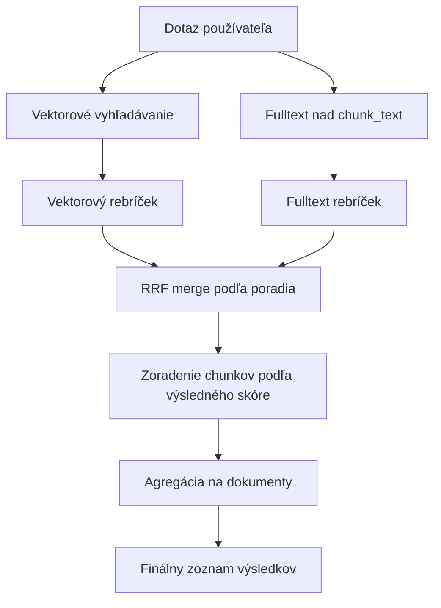
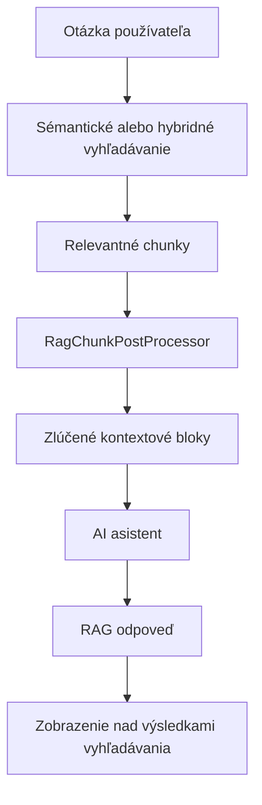

# Sémantické vyhľadávanie (RAG)

Sémantické vyhľadávanie umožňuje návštevníkom nájsť relevantné stránky podľa **významu otázky**, nielen podľa zhody kľúčových slov. Embedding vektory ukladá do PostgreSQL s [pgvector](https://github.com/pgvector/pgvector) alebo do vstavaného úložiska [MariaDB Vector](https://mariadb.com/docs/server/reference/sql-structure/vectors/vector-overview). Vektory generujú poskytovatelia podporovaní knižnicou `webjet-ai`.

Nad rovnakým indexom je možné použiť aj:

- **hybridné vyhľadávanie** - kombináciu vektorového vyhľadávania a fulltextu nad textom chunkov,
- **RAG odpoveď** - AI odpoveď vygenerovanú iba z nájdeného kontextu.

## Ako to funguje

Systém pracuje v dvoch hlavných fázach: indexovanie a online vyhľadávanie.

### 1. Indexovanie

Keď je webová stránka uložená, obnovená z koša alebo zmazaná, listener [DocSaveEventListener](../../../../../../src/main/java/sk/iway/iwcm/rag/listener/DocSaveEventListener.java) zaradí požiadavku do fronty. Úloha na pozadí [RagIndexCronTask](../../../../../../src/main/java/sk/iway/iwcm/rag/service/RagIndexCronTask.java) následne spracúva frontu cez [SemanticIndexService](../../../../../../src/main/java/sk/iway/iwcm/rag/service/SemanticIndexService.java).

Proces indexovania:

1. **Extrakcia obsahu** - z `DocDetails` sa získa čistý text bez HTML značiek cez [DocDetailsContentExtractor](../../../../../../src/main/java/sk/iway/iwcm/rag/indexing/DocDetailsContentExtractor.java).
2. **Rozdelenie na časti** - text sa rozdelí pomocou [SlidingWindowChunker](../../../../../../src/main/java/sk/iway/iwcm/rag/indexing/SlidingWindowChunker.java). Používajú sa konfiguračné premenné `ragEmbeddingChunkSize` a `ragEmbeddingChunkOverlap`.
3. **Opätovné použitie embeddingov** - pre každý chunk sa vypočíta hash. Ak sa text chunku nezmenil a existuje embedding s rovnakým poskytovateľom, modelom a správnou dimenziou, použije sa existujúci vektor.
4. **Generovanie embeddingov** - nové alebo zmenené chunky spracuje [EmbeddingService](../../../../../../src/main/java/sk/iway/iwcm/rag/embedding/EmbeddingService.java) podľa poskytovateľa a modelu nastaveného v indexovacom asistentovi `RAG-EMB-INDEX`.
5. **Uloženie do databázy** - metadáta chunkov sa ukladajú cez JPA repozitár [EmbeddingChunkRepository](../../../../../../src/main/java/sk/iway/iwcm/rag/pgvector/EmbeddingChunkRepository.java). Zvolená implementácia [VectorStore](../../../../../../src/main/java/sk/iway/iwcm/rag/vectorstore/VectorStore.java) uloží vektory pomocou natívneho SQL pre konkrétnu databázu.

Chunking preferuje prirodzené hranice textu: odsek, riadok, vetu, medzeru a až potom tvrdé rozdelenie podľa limitu. Pri desatinných číslach sa bodka nepovažuje za koniec vety.

### 2. Vyhľadávanie

Keď návštevník zadá vyhľadávací dotaz:

1. [SearchAction](../../../../../../src/main/java/sk/iway/iwcm/doc/SearchAction.java) určí typ vyhľadávania z parametra aplikácie `searchType`. Pri hodnote `auto` alebo prázdnej hodnote použije globálnu konfiguračnú premennú `searchType`.
2. Pri hodnote `semantic` alebo `hybrid` sa použije [SemanticSearchAction](../../../../../../src/main/java/sk/iway/iwcm/doc/SemanticSearchAction.java).
3. [SemanticSearchService](../../../../../../src/main/java/sk/iway/iwcm/rag/search/SemanticSearchService.java) vygeneruje embedding dotazu podľa asistenta `RAG-EMB-SEARCH` a vo zvolenom vektorovom úložisku vyhľadá najbližšie chunky s rovnakým poskytovateľom a modelom.
4. Výsledky sa obmedzia podľa domény, jazyka, typu entity a podľa priečinkov zvolených v aplikácii **Vyhľadávanie**.
5. Ak je povolený hybridný režim, spustí sa aj fulltext nad `rag_embedding_chunks.chunk_text` a výsledky sa spoja cez `RRF` (Reciprocal Rank Fusion).
6. Výsledné chunky sa agregujú na dokumenty a dokumenty sa zobrazia rovnakým spôsobom ako pri štandardnom vyhľadávaní.
7. Ak je povolená RAG odpoveď, z nájdených chunkov sa ešte pripraví kontext pre AI odpoveď.

### Rozdelenie zodpovedností medzi WebJET CMS a `webjet-ai`

Jadro embedding logiky bolo vyčlenené z WebJET CMS do samostatnej, od frameworku nezávislej knižnice [webjet-ai](https://github.com/webjetcms/webjet-ai). Knižnica obsahuje poskytovateľsky nezávislé typy `EmbeddingRequest`, `EmbeddingOptions`, `EmbeddingResponse` a `EmbeddingVector`, volanie `AiClient.embed` a implementácie komunikácie s jednotlivými poskytovateľmi. Pôvodné CMS rozhranie `EmbeddingProvider` a implementácia `OpenAiEmbeddingProvider` boli odstránené.

V CMS zostal tenký adaptér [EmbeddingService](../../../../../../src/main/java/sk/iway/iwcm/rag/embedding/EmbeddingService.java), ktorý prevedie nastavenie systémového AI asistenta a domény na požiadavku knižnice, odovzdá konfiguráciu poskytovateľa a skontroluje počet a dimenziu vrátených vektorov. Extrakcia obsahu, chunking, opätovné použitie vektorov podľa hash hodnoty, evidencia tokenov, spracovanie fronty a ukladanie vektorov zostávajú v správe WebJET CMS.

Pri pridaní nového serverového poskytovateľa sa preto embedding komunikácia neimplementuje v RAG module CMS. Poskytovateľ musí podporovať metódu `AiProvider.embed` v knižnici `webjet-ai` a byť zaregistrovaný v CMS podľa postupu v časti [Pridanie poskytovateľa](../../ai/assistants/README.md).

## Požiadavky

- Jedna podporovaná vektorová databáza: **PostgreSQL** s rozšírením **pgvector** (obraz: `pgvector/pgvector:pg18-trixie` alebo novší), alebo **MariaDB 11.8 alebo novšia** so vstavanou podporou Vector.
- **API kľúč zvoleného poskytovateľa** - používa sa rovnaké nastavenie ako pre AI asistentov, napr. `ai_openAiAuthKey` pre OpenAI alebo príslušný kľúč pre Gemini.

WebJET CMS zistí vektorový backend z JDBC metadát. Ak je nastavený datasource `rag_jpa`, použije sa vždy. Inak sa použije primárny datasource `iwcm`. Nedostupný alebo nepodporovaný explicitný `rag_jpa` sa nenahradí fallbackom na `iwcm`; sémantické vyhľadávanie zostane nedostupné a dôvod sa zapíše do logu. Samostatné MySQL, MariaDB staršia ako 11.8 a ostatné typy databáz nemožno použiť ako vektorové úložisko.

RAG perzistencia sa inicializuje až pri prvom použití, oddelene od hlavnej perzistencie CMS. Nedostupná databáza `rag_jpa` neblokuje štart CMS, ak je primárna databáza dostupná. Po neúspešnej inicializácii sa ďalšia požiadavka pokúsi o pripojenie znova; po obnovení dostupnosti databázy nie je potrebný reštart CMS.

### PostgreSQL ako primárna databáza

Vývojový profil PostgreSQL definuje samostatný datasource `rag_jpa`, ktorý smeruje do rovnakej databázy ako primárny datasource `iwcm`.

Datasource `rag_jpa` musí byť nastavený ako v prípade [poolman-docker-pgsql.xml](../../../../../../src/main/resources/poolman-docker-pgsql.xml). Ak používate viac schém, parameter JDBC `currentSchema` musí obsahovať schému s RAG tabuľkami aj schému s funkciami WebJET CMS, napríklad `currentSchema=public,webjet_cms`.

### MariaDB ako primárna databáza

MariaDB 11.8 alebo novšia používa vstavaný typ `VECTOR` bez rozšírenia. Rovnako ako profil PostgreSQL, aj [poolman-docker-mariadb.xml](../../../../../../src/main/resources/poolman-docker-mariadb.xml) definuje samostatný datasource `rag_jpa`, ktorý smeruje do rovnakej databázy ako `iwcm`. Toto druhé spojenie ponechajte v oboch profiloch, aby bolo možné nezávisle zmeniť jeho ovládač, URL a prihlasovacie údaje na inú vektorovú databázu MariaDB alebo PostgreSQL.

MariaDB podporuje metriky vzdialenosti `cosine` a `l2`. Metriku `inner_product` podporuje iba PostgreSQL/pgvector; jej nastavenie na MariaDB vypne vektorové úložisko bez zmeny existujúceho indexu alebo dát.

### Samostatná vektorová databáza

Ak primárna databáza nie je podporovaná, nastavte samostatnú podporovanú PostgreSQL alebo MariaDB databázu ako datasource `rag_jpa`. Explicitný datasource možno použiť aj na oddelenie vektorového úložiska od podporovanej primárnej databázy.

Pre lokálny vývoj je pripravený súbor [.devcontainer/db/docker-compose-rag-pgsql.yml](../../../../../../.devcontainer/db/docker-compose-rag-pgsql.yml):

```bash
docker compose -f .devcontainer/db/docker-compose-rag-pgsql.yml up -d
```

Príklady datasource konfigurácie:

- [poolman-docker-mssql.xml](../../../../../../src/main/resources/poolman-docker-mssql.xml)
- [poolman-docker-oracle.xml](../../../../../../src/main/resources/poolman-docker-oracle.xml)

## Konfigurácia

Aktivácia a nastavenie sa robí v [Konfigurácii](../../../../admin/setup/configuration/README.md).

### Základné nastavenia

| Premenná | Predvolená hodnota | Popis |
| --- | --- | --- |
| `ragSemanticSearchEnabled` | `false` | Zapne sémantické vyhľadávanie nad úložiskom PostgreSQL/pgvector alebo MariaDB Vector. |
| `searchType` | `db` | Globálny typ vyhľadávania: `db`, `lucene`, `semantic`, `hybrid`. |
| `luceneAsDefaultSearch` | `false` | Ak je `true`, Lucene má vyššiu prioritu než `searchType`. |

!> Pre aktiváciu sémantického vyhľadávania nastavte `ragSemanticSearchEnabled=true` a použite `searchType=semantic` alebo `searchType=hybrid`. Typ vyhľadávania možno prepísať aj lokálne v aplikácii **Vyhľadávanie**.

### Embedding a indexovanie

| Premenná | Predvolená hodnota | Popis |
| --- | --- | --- |
| `ragEmbeddingProvider` | `openai` | Poskytovateľ použitý iba pri automatickom vytvorení chýbajúceho embedding asistenta. Vstavané hodnoty sú `openai`, `gemini`, `openrouter`; použiť možno aj identifikátor správne zaregistrovaného vlastného poskytovateľa. |
| `ragEmbeddingModel` | `text-embedding-3-small` | Model použitý iba pri automatickom vytvorení chýbajúceho embedding asistenta. |
| `ragEmbeddingDimensions` | `1536` | Počet dimenzií vektora. Musí zodpovedať použitému modelu a databázovej tabuľke; MariaDB povoľuje hodnoty od `1` do `16383`. |
| `ragEmbeddingChunkSize` | `1000` | Maximálna veľkosť jednej časti textu v znakoch. |
| `ragEmbeddingChunkOverlap` | `200` | Počet znakov, o ktoré sa susedné chunky prekrývajú. |

Systém podľa potreby automaticky vytvorí dvoch systémových AI asistentov:

- `RAG-EMB-INDEX` v skupine `90-embedding-indexing` - generovanie embeddingov pri indexovaní,
- `RAG-EMB-SEARCH` v skupine `91-embedding-search` - generovanie embeddingu vyhľadávacieho dotazu.

Ak asistent už existuje, jeho `provider` a `model` majú prednosť pred konfiguračnými premennými `ragEmbeddingProvider` a `ragEmbeddingModel`. Asistentov je možné upraviť v administrácii v sekcii **Nastavenia → AI asistenti**. Poskytovateľ a model indexovacieho asistenta sa po otvorení stránky **Sémantický index** zobrazia v informačnom oznámení.

Indexy sú oddelené kombináciou poskytovateľa a modelu. Opätovné indexovanie nahradí iba dáta aktuálnej kombinácie, takže napríklad OpenAI a Gemini index tej istej stránky môžu existovať súčasne. Náhľad indexovania počíta iba indexy aktuálneho asistenta; náhľad odstránenia a odstránenie stránky pracujú so všetkými kombináciami.

Fronta `rag_index_queue` ukladá iba typ entity, ID a akciu. Poskytovateľ a model sa načítajú z asistenta `RAG-EMB-INDEX` až pri spracovaní položky. Ak potrebujete dokončiť indexovanie pôvodnou kombináciou, nechajte pred zmenou asistenta frontu úplne spracovať.

!>**Upozornenie:** Indexovací a vyhľadávací asistent musia používať rovnaký identifikátor poskytovateľa a modelu. Vyhľadávanie načíta iba indexy, ktorých obe hodnoty sa presne zhodujú s asistentom `RAG-EMB-SEARCH`.

!>**Upozornenie:** Staršie názvy `ragChunkSize` a `ragChunkOverlap` sa už nepoužívajú.

!>**Upozornenie:** Pri zmene `ragEmbeddingDimensions` sa vymažú všetky dáta z `rag_embedding_chunks` pre všetkých poskytovateľov a modely, upraví sa vektorový typ pre zvolenú databázu a znovu sa vytvorí HNSW index. Následne spustite úplné indexovanie obsahu. Samotná zmena modelu ostatné kombinácie nevymaže, ale novú kombináciu musíte zaindexovať. Zmena datasource alebo typu vektorovej databázy existujúce vektory nemigruje; po zmene spustite úplné indexovanie.

!>**Spoločná dimenzia:** Všetky domény zdieľajú jednu vektorovú schému a musia používať rovnakú globálnu hodnotu `ragEmbeddingDimensions`. Odlišné doménové nastavenie zablokuje sémantické vyhľadávanie a indexovanie pre danú doménu; stránka **Sémantický index** zobrazí chybu. Automatická inicializácia MariaDB pri nesúlade dimenzií zachová existujúce dáta. Ak chcete zmeniť spoločnú dimenziu, uložte globálne nastavenie v **Konfigurácii** — tým sa vymažú embeddingy všetkých domén — a potom spustite úplné indexovanie všetkých domén.

### Vektorové vyhľadávanie

| Premenná | Predvolená hodnota | Popis |
| --- | --- | --- |
| `ragSearchEfSearch` | `40` | Parameter HNSW `ef_search`. Vyššia hodnota zlepšuje recall, ale môže spomaliť vyhľadávanie. MariaDB povoľuje hodnoty od `1` do `10000`; pri neplatnej hodnote zostane jej databázová predvolená hodnota nezmenená. |
| `ragSearchDistanceMetric` | `cosine` | Metrika vzdialenosti: `cosine`, `inner_product`, `l2`. MariaDB podporuje iba `cosine` a `l2`; `inner_product` podporuje iba PostgreSQL. Zmena znovu vytvorí vektorový index. |
| `ragSemanticSearchMinSimilarity` | `0.2` | Minimálna hodnota similarity pre výsledky. Používa sa spolu s adaptívnym prahom podľa najlepšieho výsledku. |
| `ragSemanticSearchMinResults` | `3` | Minimálny počet výsledkov, ktoré sa vrátia aj pri prísnejšom prahu similarity. |

### Hybridné vyhľadávanie

Hybridné vyhľadávanie kombinuje vektorové výsledky a fulltextové výsledky nad `rag_embedding_chunks.chunk_text`. Používa sa vtedy, keď je povolené `ragHybridSearchEnabled` a režim hybridného vyhľadávania nie je `off`.

| Premenná | Predvolená hodnota | Popis |
| --- | --- | --- |
| `ragHybridSearchEnabled` | `true` | Globálne povolí hybridné vyhľadávanie. |
| `ragHybridSearchMode` | `short_query_only` | Režim: `off`, `always`, `short_query_only`, `fallback_on_low_vector`. |
| `ragHybridShortQueryMaxChars` | `12` | Maximálna dĺžka dotazu v znakoch pre režim `short_query_only`. |
| `ragHybridShortQueryMaxTerms` | `2` | Maximálny počet slov dotazu pre režim `short_query_only`. |
| `ragHybridFallbackTopSimilarity` | `0.35` | Prah najlepšej vektorovej similarity pre režim `fallback_on_low_vector`. |
| `ragHybridVectorWeight` | `0.7` | Váha vektorového poradia pri RRF merge. |
| `ragHybridFtsWeight` | `0.3` | Váha fulltextového poradia pri RRF merge. |
| `ragHybridRrfK` | `60` | Parameter `k` pre Reciprocal Rank Fusion. |
| `ragHybridChunkFetchMultiplier` | `3` | Násobič počtu chunkov načítaných oproti požadovanému počtu výsledkov. |
| `ragHybridFtsUseIlikeFallback` | `true` | Ak databázový fulltext vráti prázdny výsledok, použije sa databázovo špecifický fallback cez `ILIKE` alebo `LIKE`. |

V lokálnom nastavení aplikácie má hodnota `searchType=semantic` význam čistého vektorového vyhľadávania bez hybridnej vetvy. Hodnota `searchType=hybrid` použije hybrid, ak je globálne povolený.


```mermaid
flowchart TD
	Q[Dotaz používateľa] --> V[Vektorové vyhľadávanie]
	Q --> F[Fulltext nad chunk_text]

	V --> VR[Vektorový rebríček]
	F --> FR[Fulltext rebríček]

	VR --> RRF[RRF merge podľa poradia]
	FR --> RRF

	RRF --> S[Zoradenie chunkov podľa výsledného skóre]
	S --> D[Agregácia na dokumenty]
	D --> O[Finálny zoznam výsledkov]
```

## RAG odpoveď vo vyhľadávaní

RAG odpoveď je voliteľný doplnok sémantického alebo hybridného vyhľadávania. Po nájdení relevantných chunkov sa pripraví obmedzený kontext a odošle sa AI asistentovi. Odpoveď sa zobrazí nad zoznamom výsledkov v JSP šablóne [search.jsp](../../../../../../src/main/webapp/components/search/search.jsp).

### Konfigurácia RAG odpovede

| Premenná | Predvolená hodnota | Popis |
| --- | --- | --- |
| `ragAnswerAllowed` | `false` | Globálne povolí generovanie RAG odpovede vo vyhľadávaní. |
| `ragAnswerModel` | `gpt-5.4-mini` | Predvolený model pre automaticky vytvoreného RAG asistenta. |
| `ragAnswerMinSimilarity` | `0.3` | Mäkký prah similarity pre chunky vstupujúce do kontextu odpovede. |
| `ragAnswerTopK` | `12` | Počet najrelevantnejších chunkov použitých pred post-processingom. |
| `ragAnswerMaxChunkGap` | `1` | Maximálna medzera medzi indexmi chunkov, ktoré sa ešte môžu zlúčiť. Hodnota `1` znamená susedné chunky. |
| `ragAnswerMaxBlocks` | `4` | Maximálny počet zlúčených kontextových blokov odoslaných modelu. |
| `ragAnswerMaxCharacters` | `6000` | Maximálny celkový počet znakov kontextu. |
| `ragAnswerMaxMergedBlockCharacters` | `2200` | Maximálny počet znakov jedného zlúčeného kontextového bloku. |

V aplikácii **Vyhľadávanie** možno tieto hodnoty prepísať lokálne. Prázdne čísla znamenajú použitie globálnej konfigurácie.

### Post-processing kontextu

[RagChunkPostProcessor](../../../../../../src/main/java/sk/iway/iwcm/rag/search/RagChunkPostProcessor.java) pripravuje kontext pre model:

1. zoradí chunky podľa similarity a vyberie top K,
2. použije adaptívny prah similarity, ale nikdy nevyhodí všetko, ak existuje aspoň jeden použiteľný výsledok,
3. zoskupí chunky podľa entity,
4. zlúči susedné chunky a odstráni duplicitný text z prekrytia,
5. obmedzí počet blokov a celkový počet znakov.

Výsledkom sú objekty [MergedContextBlock](../../../../../../src/main/java/sk/iway/iwcm/rag/search/MergedContextBlock.java), ktoré sa odosielajú modelu ako JSON.

### AI asistent

[RagService](../../../../../../src/main/java/sk/iway/iwcm/rag/search/RagService.java) používa AI asistentov WebJET CMS. Ak nie je vybraný konkrétny asistent, systém nájde alebo vytvorí predvoleného asistenta:

- názov: `RAG-SEARCH`,
- skupina: `92-rag-answer`,
- provider: `openai`,
- model: hodnota `ragAnswerModel`,
- trieda: `sk.iway.iwcm.rag.search.RagService`.

V editore aplikácie sa zobrazia aj asistenti v aktuálnej doméne, ktoré majú rovnakú hodnotu `className`.

Asistent dostane backendom pripravené makrá:

| Makro | Hodnota |
| --- | --- |
| `{userQuestion}` | Otázka používateľa ako JSON string. |
| `{retrievedContext}` | JSON pole zlúčených kontextových blokov. |

Makrá `bonusParams` sú ignorované pri verejných REST volaniach asistenta a nastavujú sa iba na backende. Odpoveď musí vychádzať len z `retrievedContext`. Ak model vráti sentinel `CANNOT_ANSWER_QUESTION`, používateľovi sa zobrazí lokalizovaná fallback odpoveď.


```mermaid
flowchart TD
	Q[Otázka používateľa] --> S[Sémantické alebo hybridné vyhľadávanie]
	S --> C[Relevantné chunky]
	C --> P[RagChunkPostProcessor]
	P --> B[Zlúčené kontextové bloky]
	B --> A[AI asistent]
	A --> R[RAG odpoveď]
	R --> JSP[Zobrazenie nad výsledkami vyhľadávania]
```

## Používanie v šablónach

Sémantické vyhľadávanie sa aktivuje vložením aplikácie **Vyhľadávanie** do stránky. Typ vyhľadávania možno nastaviť globálne alebo priamo v parametri aplikácie.

Globálne nastavenie:

```properties
ragSemanticSearchEnabled=true
searchType=semantic
```

Príklad lokálneho nastavenia aplikácie:

```html
!INCLUDE(/components/search/search.jsp, searchType=hybrid, answerAllowed=trueValue)!
```

Vybrané parametre aplikácie:

| Parameter | Hodnoty | Popis |
| --- | --- | --- |
| `searchType` | `auto`, `db`, `lucene`, `semantic`, `hybrid` | Typ vyhľadávania pre konkrétnu aplikáciu. |
| `answerAllowed` | `auto`, `trueValue`, `falseValue` | Lokálne zapnutie alebo vypnutie RAG odpovede. |
| `semanticSearchMinSimilarity` | číslo | Lokálna hodnota `ragSemanticSearchMinSimilarity`. |
| `semanticSearchMinResults` | číslo | Lokálna hodnota `ragSemanticSearchMinResults`. |
| `hybridSearchMode` | `auto`, `off`, `always`, `short_query_only`, `fallback_on_low_vector` | Lokálny režim hybridného vyhľadávania. |
| `hybridFtsUseIlikeFallback` | `auto`, `trueValue`, `falseValue` | Lokálny fallback pre fulltext. |
| `ragAssistantId` | ID asistenta alebo `-1` | Výber asistenta pre RAG odpoveď. |

## Automatické indexovanie

Systém automaticky zaradí stránku do indexovacej fronty pri jej:

- **uložení** - vytvorenie alebo úprava stránky,
- **obnovení z koša** - stránka sa znovu indexuje,
- **zmazaní** - embeddingy sa odstránia z vektorovej databázy.

Manuálne indexovanie v administrácii pracuje iba so stránkami, ktoré sú povolené pre vyhľadávanie.

## Automatizované úlohy

Frontu spracúva automatizovaná úloha [sk.iway.iwcm.rag.service.RagIndexCronTask](../../../../../../src/main/java/sk/iway/iwcm/rag/service/RagIndexCronTask.java). Odporúčané nastavenie je spúšťanie každých 5 minút.

Cron úloha je bezpečná voči súbežnému spusteniu. Pri behu sa nastaví príznak v cache s platnosťou 60 minút a pri pomalšom spracovaní sa jeho platnosť obnovuje. Spracované položky sa z fronty vymažú dávkovo; pri chybe mazania sa použije mazanie po riadkoch. Chyby pri indexovaní konkrétnej stránky sa uložia ako stav **ERROR** v tabuľke chunkov. Ak zlyhá spracovanie položky ešte na úrovni fronty, položka zostane vo fronte a opätovne sa spracuje pri ďalšom behu.

## Databázová schéma

Systém vždy vytvára tabuľky `rag_index_queue` a `rag_embedding_chunks`. V MariaDB vytvorí aj pomocnú tabuľku `rag_embedding_vectors`.

### `rag_index_queue`

Fronta pre asynchrónne indexovanie. Implementované triedou [IndexQueueEntity](../../../../../../src/main/java/sk/iway/iwcm/rag/jpa/IndexQueueEntity.java).

### `rag_embedding_chunks`

Uložené metadáta chunkov a v PostgreSQL aj embedding vektory. Implementované triedou [EmbeddingChunkEntity](../../../../../../src/main/java/sk/iway/iwcm/rag/pgvector/EmbeddingChunkEntity.java).

Dôležité stĺpce:

- `entity_type`, `entity_id`, `chunk_index` - identifikácia zdrojovej entity a poradia chunku.
- `chunk_text` - text použitý na embedding a fulltext.
- `content_hash` - hash textu chunku pre opätovné použitie embeddingu.
- `embedding` - stĺpec typu pgvector `vector(N)`, ktorý sa používa iba v PostgreSQL.
- `embedding_provider`, `embedding_model`, `dimensions` - poskytovateľ, model a dimenzia embeddingu.
- `language`, `domain_id` - jazyk a doména.
- `group_id`, `root_group_l1`, `root_group_l2`, `root_group_l3` - optimalizované filtrovanie dokumentov podľa priečinkov.
- `status`, `error_message` - stav spracovania.

### `rag_embedding_vectors`

Pomocná tabuľka iba pre MariaDB obsahuje povinnú hodnotu `embedding VECTOR(N) NOT NULL` pre každý úspešne zaindexovaný chunk. `chunk_id` je primárny aj cudzí kľúč na `rag_embedding_chunks.id` s kaskádovým odstránením. Toto oddelenie umožňuje zachovať chybové riadky metadát bez vektora a zároveň splniť požiadavku MariaDB na vektorový index.

!>**Upozornenie:** Vektorové stĺpce nie sú mapované cez JPA. Všetky operácie s vektormi prebiehajú cez databázovo špecifické implementácie natívneho SQL rozhrania [VectorStore](../../../../../../src/main/java/sk/iway/iwcm/rag/vectorstore/VectorStore.java).

Pri migrácii schémy sa doplnia chýbajúce stĺpce `group_id`, `root_group_l1..3` a `embedding_provider`. Hodnoty priečinkov sa spätne doplnia pre existujúce záznamy platných webových stránok. Prázdny `embedding_provider` sa nastaví na aktuálnu hodnotu `ragEmbeddingProvider` a unikátnosť chunku sa rozšíri o kombináciu poskytovateľa a modelu. Keďže starší záznam neobsahoval poskytovateľa, doplnená hodnota nemusí zodpovedať poskytovateľovi, ktorý vektor skutočne vytvoril. Po aktualizácii preto spustite úplné indexovanie; obnovia sa tým aj záznamy, ktoré nebolo možné spätne priradiť k stránke.

## Odporúčania pre slovenský a český obsah

Predvolené hodnoty (`text-embedding-3-small`, `ragEmbeddingChunkSize=1000`, `ragEmbeddingChunkOverlap=200`) sú vyvážený kompromis medzi cenou, rýchlosťou a presnosťou pre bežné web stránky v slovenčine a češtine.

Pri ladení sa riaďte týmito odporúčaniami:

- **Veľkosť časti (`ragEmbeddingChunkSize`)** - pre webové stránky v SK/CZ je vhodný rozsah **800-1 200 znakov**. Pri kratších častiach sa stráca kontext odseku, pri dlhších klesá presnosť výberu konkrétnej pasáže.
- **Prekryv (`ragEmbeddingChunkOverlap`)** - udržiavajte pomer **15-25 %** z `ragEmbeddingChunkSize`. Prekryv zabraňuje strate kontextu na hraniciach medzi časťami.
- **Limit modelu** - modely `text-embedding-3-*` zvládnu max. 8 191 tokenov na jeden vstup. Pri slovenčine a češtine je to s rezervou približne 6 000 znakov.
- **Vyhodnotenie kvality** - pripravte si 10-20 reprezentatívnych otázok v slovenčine alebo češtine a porovnávajte TOP-5 výsledky pri rôznych nastaveniach.

## Alternatívne embedding modely

Predvolený model `text-embedding-3-small` je viacjazyčný a slovenčinu/češtinu zvláda v dostatočnej kvalite pre väčšinu webových projektov. Ak požadujete vyššiu presnosť, k dispozícii sú tieto alternatívy:

| Model | Model asistenta | `ragEmbeddingDimensions` | Kvalita pre SK/CZ | Poznámka |
| --- | --- | --- | --- | --- |
| OpenAI `text-embedding-3-small` | `text-embedding-3-small` | `1536` | Dobrá | Predvolený model - lacný a rýchly. |
| OpenAI `text-embedding-3-large` | `text-embedding-3-large` | `3072` | Vysoká | Najpresnejší OpenAI viacjazyčný model, drahší než `small`. |
| OpenAI `text-embedding-3-large` skrátený | `text-embedding-3-large` | `1024` alebo `1536` | Vysoká | Vďaka MRL je možné vektor skrátiť bez výraznej straty kvality. |

!>**Upozornenie:** Všetky vektory vo zvolenom vektorovom úložisku musia používať nakonfigurovanú dimenziu. Rôzni poskytovatelia a modely môžu existovať súčasne, ale musia generovať rovnaký počet dimenzií. Zmena dimenzie odstráni všetky existujúce vektory a vyžaduje úplné indexovanie obsahu.

### Čo je Matryoshka (MRL)

Modely `text-embedding-3-small` aj `text-embedding-3-large` sú trénované technikou `Matryoshka Representation Learning`. Najdôležitejšie informácie sú sústredené na začiatku vektora, takže vektor je možné bezpečne skrátiť, napríklad použiť iba prvých 1 024 alebo 1 536 hodnôt z 3 072.

V praxi to znamená, že môžete použiť kvalitnejší `text-embedding-3-large`, ale výstup si nechať vrátiť napríklad v 1 536 dimenziách. Získate vyššiu presnosť než `small@1536` pri rovnakej veľkosti tabuľky aj podobnej rýchlosti vyhľadávania.
