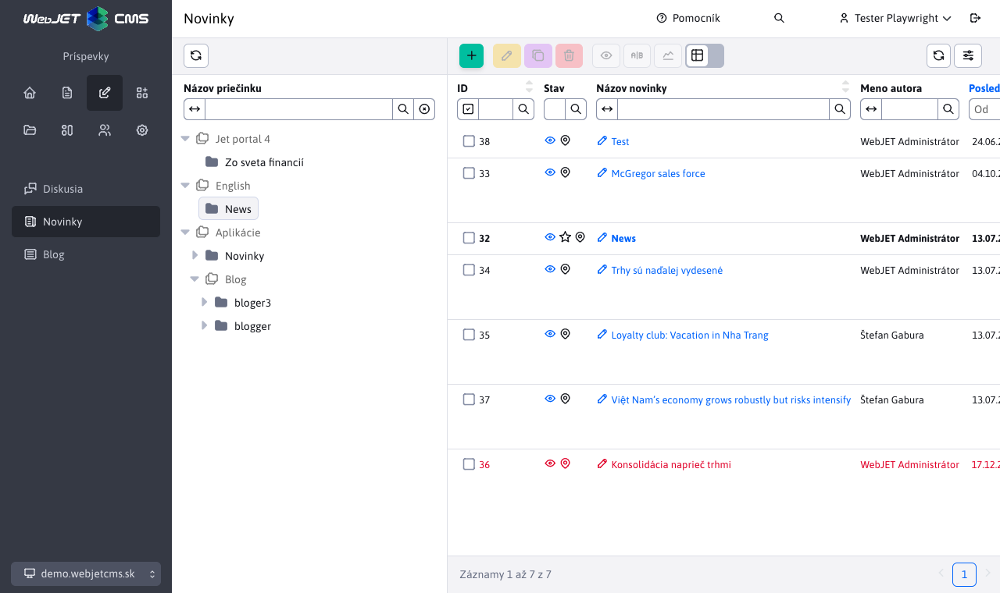

# Zoznam web stránok/noviniek

Aplikácia [Novinky](../../redactor/apps/news/README.md), vloží do stránky zoznam web stránok v zadanom priečinku. Používa sa na vkladanie zoznamu noviniek, tlačových správ, ale aj iných podobných výpisov (zoznam kontaktných miest, osobných kontaktov, produktov a podobne).

Tabuľka poskytuje editačné možnosti podobne ako zoznam web stránok.



Ak má zákazník špecifické požiadavky na zobrazenie stĺpcov (napr. pre zoznam produktov) alebo informácií môžete implementovať vlastnú aplikáciu, ktorá využíva kód pre zoznam noviniek.

Nižšie je uvedený kompletný kód stránky so zoznamom noviniek. Môžete využiť vlastnosť úpravy štandardných stĺpcov pomocou funkcie `window.WJ.DataTable.mergeColumns`. V príklade sa upravuje nastavenie atribútu viditeľnosti stĺpca, môžete ale aj premenovať názov ako je ukázané v prípade názvu stránky.

Strom využíva REST službu `/admin/rest/news/news-list/tree`, ktorá vracia priečinky podľa `newsAdminGroupIds` alebo parametra `include`, ich podpriečinky, nadradené vetvy a výsledky vyhľadávania. Nadradené priečinky mimo rozsahu noviniek majú ikonu `ti ti-folders`, vypnutý výber a nemajú `groupIdList`; ich pridaním sa nesprístupnia ďalšie súrodenecké priečinky. Hodnota `groupIdList` v uzle noviniek určuje filter tabuľky vrátane prípadného znaku `*`; číselné `id` určuje priečinok pre novú stránku. Pôvodná služba `/admin/rest/news/news-list/convertIdsToNamePair` zostáva dostupná pre existujúce integrácie.

Ak potrebujete tabuľku pre pevný priečinok bez stromu, stačí inicializovať `WebPagesDatatable` s URL `/admin/rest/news/news-list?groupId=23&groupIdList=23`.

```html
<script data-th-inline="javascript">
    var webpageColumns = /*[(${layout.getDataTableColumns('sk.iway.iwcm.doc.DocDetails')})]*/ '';
</script>
<script type="text/javascript">
    var newsDataTable;
    const newsInclude = new URLSearchParams(window.location.search).get("include");

    window.getJstreeUrl = function() {
        let url = $("#SomStromcek").data("rest-url");
        if (newsInclude != null) url = WJ.urlUpdateParam(url, "include", newsInclude);
        const hash = window.location.hash.substring(1);
        if (/^\d+\*?$/.test(hash)) url = WJ.urlUpdateParam(url, "selectedId", parseInt(hash, 10));
        return url;
    };

    window.domReady.add(function () {
        const treeElement = $("#SomStromcek");
        let selectedFolder = null;
        let tablePromise = null;
        let currentFilter = null;

        window.WJ.DataTable.mergeColumns(webpageColumns, { name: "title", title: WJ.translate("apps.news.newsTitle.js") });
        for (const name of ["publishStartDate", "publishEndDate", "htmlData", "perexImage"]) {
            window.WJ.DataTable.mergeColumns(webpageColumns, { name: name, visible: true });
        }

        function getTableUrl() {
            let url = newsDataTable ? newsDataTable.getAjaxUrl() : "/admin/rest/news/news-list";
            url = WJ.urlUpdateParam(url, "groupIdList", selectedFolder ? selectedFolder.groupIdList : "-1");
            return WJ.urlUpdateParam(url, "groupId", selectedFolder ? selectedFolder.id : "-1");
        }

        /** Synchronizes the article list and creation defaults with the selected News folder. */
        function selectFolder(node) {
            selectedFolder = node ? node.original : null;
            window.selectedNode = selectedFolder;
            $("#news-folders-empty").toggleClass("d-none", selectedFolder != null);
            if (selectedFolder && (!window.location.hash || /^#\d+\*?$/.test(window.location.hash))) {
                window.history.replaceState(null, "", "#" + selectedFolder.groupIdList);
            }

            if (tablePromise == null) {
                tablePromise = window.importWebPagesDatatable().then(module => {
                    const instance = new module.WebPagesDatatable({
                        url: getTableUrl(),
                        columns: webpageColumns,
                        id: "newsDataTable",
                        order: [ [4, "desc"] ],
                        newPageTitleKey: "apps.news.newsTitle.js"
                    });
                    currentFilter = selectedFolder ? selectedFolder.groupIdList : "-1";
                    newsDataTable = instance.createDatatable();
                    // Include the empty-state message in the header measured by automatic table sizing.
                    $("#news-folders-empty").prependTo("#newsDataTable_wrapper .dt-header-row");
                    newsDataTable.on("draw.dt", function() {
                        newsDataTable.button(".buttons-create").enable(selectedFolder != null);
                    });
                });
            }
            tablePromise.then(() => {
                const filter = selectedFolder ? selectedFolder.groupIdList : "-1";
                if (currentFilter !== filter) {
                    currentFilter = filter;
                    newsDataTable.setAjaxUrl(getTableUrl());
                    newsDataTable.ajax.reload();
                }
                newsDataTable.button(".buttons-create").enable(selectedFolder != null);
            });
        }

        treeElement.on("select_node.jstree", function(e, data) {
            if (!data.node.state.disabled) selectFolder(data.node);
        });

        treeElement.on("ready.jstree refresh.jstree", function() {
            // Searching must not replace the article list when its folder is outside the results.
            if ($("#tree-folder-search-input").val()) return;
            const tree = treeElement.jstree(true);
            const selected = tree.get_selected(true).find(node => !node.state.disabled);
            if (selected) selectFolder(selected);
            else {
                const first = tree.get_json("#", { flat: true }).find(node => !node.state.disabled);
                if (first) tree.select_node(first.id);
                else selectFolder(null);
            }
        });

        window.addEventListener("hashchange", function() {
            if (/^#\d+\*?$/.test(window.location.hash)) treeElement.jstree(true).refresh(false, true);
        });
    });
</script>

<div class="row">
    <div class="col-md-4 tree-col">
        <div class="dt-header-row clearfix">
            <div class="row">
                <div class="col-auto">
                    <div class="dt-buttons">
                        <button class="btn btn-sm btn-outline-secondary buttons-refresh" type="button"
                            data-toggle="tooltip" data-th-title="#{datatables.button.reload.js}"
                            data-th-aria-label="#{datatables.button.reload.js}">
                            <span><i class="ti ti-refresh" aria-hidden="true"></i></span>
                        </button>
                    </div>
                </div>
            </div>
        </div>
        <div id="SomStromcek" class="hide-while-loading" data-rest-url="/admin/rest/news/news-list"
            data-rest-param-name="id" data-single-select="true" data-search-restore-state="false"></div>
    </div>
    <div class="col-md-8 datatable-col">
        <div id="news-folders-empty" class="alert alert-info d-none" role="status" data-th-text="#{apps.news.noFolders}"></div>
        <table id="newsDataTable" class="datatableInit table"></table>
    </div>
</div>
```

Ak používateľ nemá priamo prístup k web stránkam je potrebné pridať ešte vaše právo aplikácie do konf. premennej `webpagesFunctionsPerms`, ktorá obsahuje zoznam práv, ktoré získavajú právo na prácu s web stránkami. Jedná sa aj o funkcie pre vloženie obrázku a podobne.

## Backend

Ak potrebujete špecifickú REST službu pre poskytovanie zoznamu web stránok/noviniek môžete využiť pripravenú triedu [WebpagesDatatable](../../../../src/main/java/sk/iway/iwcm/editor/rest/WebpagesDatatable.java) ktorú rozšírite a prepíšete metódy podľa vašich potrieb.

```java
@Datatable
@RestController
@RequestMapping("/admin/rest/abtesting/list")
@PreAuthorize("@WebjetSecurityService.hasPermission('cmp_abtesting')")
public class AbTestingRestController extends WebpagesDatatable {

    @Autowired
    public AbTestingRestController(DocDetailsRepository docDetailsRepository, EditorFacade editorFacade, DocAtrDefRepository docAtrDefRepository) {
        super(docDetailsRepository, editorFacade, docAtrDefRepository);
    }

    @Override
    public Page<DocDetails> getAllItems(Pageable pageable) {
        GetAllItemsDocOptions options = getDefaultOptions(pageable, true);
        return AbTestingService.getAllItems(options);
    }

    @Override
    public void beforeSave(DocDetails entity) {
        //In abtesting version user cant edit/insert/duplicate page's
        throwError(getProp().getText("admin.editPage.error"));
    }

    @Override
    public boolean deleteItem(DocDetails entity, long id) {
        //In abtesting version user cant delete page's
        throwError(getProp().getText("admin.editPage.error"));

        return false;
    }
}
```
