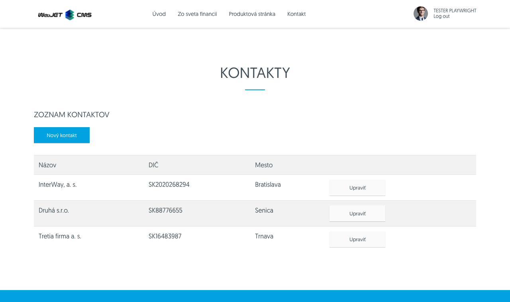
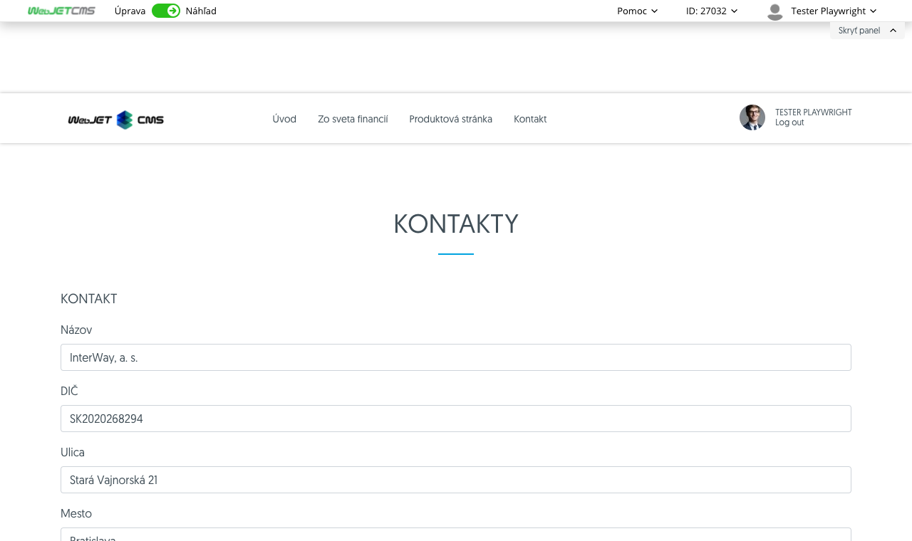
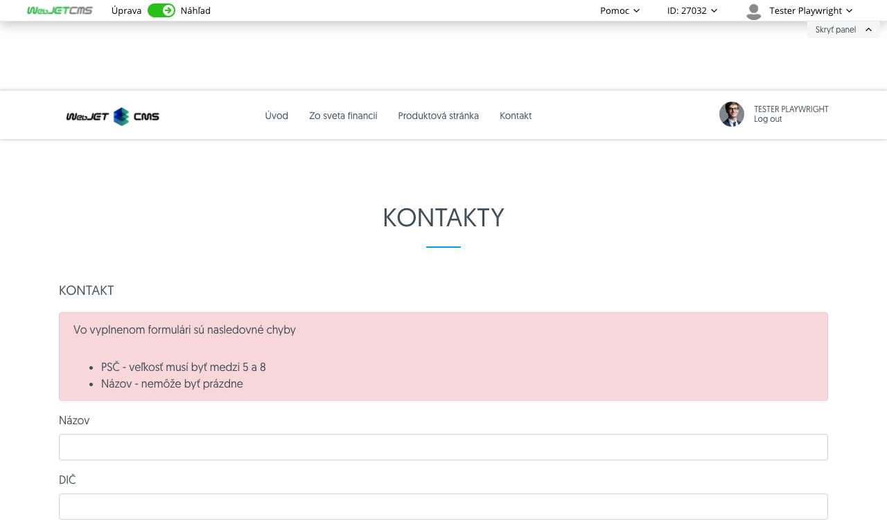

# Spring MVC aplikácia

Ukážková aplikácia vo verejnej web stránke s použitím Spring MVC a Thymeleaf šablón.



## Backend

Vytvorená trieda musí rozširovať triedu ```WebjetComponentAbstract``` a zároveň obsahovať anotáciu ```@WebjetComponent```. To zabezpečí nastavenie Spring ```@Component``` anotácie a vykonanie aplikácie cez ```!INCLUDE()!``` príkaz vo web stránke.

Jednotlivé metódy ```view, edit, add, saveForm``` sú volané na základe zhody URL parametra, napr. metóda ```edit``` sa zavolá pridaním URL parametra ```?edit=true```. Pomocou anotácie ```@DefaultHandler``` sa určí metóda, ktorá sa vykoná ak sa nenájde iná zhoda URL parametra. Meno metódy môže byť ľubovoľné, nemusí byť s uvedeného zoznamu, stačí existencia URL parametra s rovnakým menom.

Príklad:

```java
package sk.iway.basecms.contact;

import javax.servlet.http.HttpServletRequest;
import javax.validation.Valid;

import com.fasterxml.jackson.annotation.JsonIgnore;

import org.springframework.beans.factory.annotation.Autowired;
import org.springframework.ui.Model;
import org.springframework.validation.BindingResult;
import org.springframework.web.bind.annotation.ModelAttribute;
import org.springframework.web.bind.annotation.RequestParam;

import lombok.Getter;
import lombok.Setter;
import sk.iway.iwcm.PathFilter;
import sk.iway.iwcm.components.WebjetComponentAbstract;
import sk.iway.iwcm.system.annotations.DefaultHandler;
import sk.iway.iwcm.system.annotations.WebjetAppStore;
import sk.iway.iwcm.system.annotations.WebjetComponent;
import sk.iway.iwcm.system.datatable.DataTableColumnType;
import sk.iway.iwcm.system.datatable.annotations.DataTableColumn;
import sk.iway.iwcm.system.datatable.annotations.DataTableColumnEditor;
import sk.iway.iwcm.system.datatable.annotations.DataTableColumnEditorAttr;

/**
 * <p>Príkladová trieda pre komponentu - http://docs.webjetcms.sk/v2022/#/custom-apps/spring-mvc/</p>
 * <p>Trieda musí byt anotovaná @WebjetComponent, pre názov v anotácii sa musí použiť celý názov triedy aj s package</p>
 * <p>Príklad include:</p>
 * <code>!INCLUDE(sk.iway.basecms.contact.ContactApp, country="sk")!</code>
 *
 * Anotacia @WebjetAppStore zabezpeci zobrazenie aplikacie v zozname aplikacii v editore (v AppStore)
 *
 * V pripade, ze nejaka metoda ma byt dostupna len pre prihlaseneho pouzivatela, admina, prip. nejaku pouzivatelsku skupinu mozeme pouzit anotacie:
 * @PreAuthorize("@WebjetSecurityService.isLogged()") - prihalseny pouzivatel
 * @PreAuthorize("@WebjetSecurityService.isAdmin()") - admin
 * @PreAuthorize("@WebjetSecurityService.isInUserGroup('nazov-skupiny')") - patri do skupiny
 * @see sk.iway.iwcm.system.spring.services.WebjetSecurityService
 */
@WebjetComponent("sk.iway.basecms.contact.ContactApp")
@Getter
@Setter
public class ContactApp extends WebjetComponentAbstract {

    //Spring DATA repozitar
    @JsonIgnore
    private ContactRepository contactRepository;

    /**
     * Privatne vlastnosti s get/set-rami slúžia na prenesenie parametrov pageParams z !INCLUDE()! do triedy
     */
    private String country;

    @Autowired
    public ContactApp(ContactRepository contactRepository) {
        this.contactRepository = contactRepository;
    }

    /**
     * metoda init sa vola po vytvoreni objektu a nastaveni parametrov,
     * je volana pred kazdym view volanim a umozni nastavit pripadne atributy
     * @param request
     * @param response
     */
    @Override
    public void init(HttpServletRequest request, HttpServletResponse response) {
        Logger.debug(ContactApp.class, "Init call, request.getHeader(User-Agent)="+request.getHeader("User-Agent"));
    }

    /**
     * Metóda anotovaná @DefaultHandler sa vykoná, ak v requeste nie je žiaden parameter, ktorý by sa zhodoval s názvom inej metódy v triede
     * Metóda môže mať ľubovolný názov
     * @param model
     * @param request
     * @return String URL adresa súboru ktorý bude v contente renderovaný namiesto !INCLUDE()!
     */
    @DefaultHandler
	public String view(Model model, HttpServletRequest request)
	{
        model.addAttribute("contants", contactRepository.findAllByCountry(country, null));
		return "/apps/contact/mvc/list";
	}

    /**
     * Metóda edit slúži na zobrazenie formuláru pre úpravu existujúceho záznamu
     * @param id
     * @param model
     * @param request
     * @return
     */
    public String edit(@RequestParam("id") long id, Model model, HttpServletRequest request) {
        ContactEntity contact = contactRepository.getById(id);
        model.addAttribute("entity", contact);

        //pridaj do modelu moznosti pre select country
        model.addAttribute("countries", ContactRestController.getCountries());

        return "/apps/contact/mvc/edit";
    }

    /**
     * Metóda edit slúži na zobrazenie formuláru pre úpravu existujúceho záznamu
     * @param model
     * @param request
     * @return
     */
    public String add(Model model) {
        ContactEntity contact = new ContactEntity();
        //tu mozete nastavit nejake default hodnoty
        contact.setCountry("sk");

        model.addAttribute("entity", contact);
        return "/apps/contact/mvc/edit";
    }

    /**
     * Metóda saveForm slúži na validáciu a uloženie úpravy existujúceho záznamu
     * @param entity
     * @param result
     * @param model
     * @param request
     * @return
     */
    public String saveForm(@Valid @ModelAttribute("entity") ContactEntity entity, BindingResult result, Model model, HttpServletRequest request) {
        if (!result.hasErrors()) {
            contactRepository.save(entity);
            return "redirect:" + PathFilter.getOrigPath(request);
        }
        model.addAttribute("error", result);
        model.addAttribute("entity", entity);
        return "/apps/contact/mvc/edit";
    }

}
```

### Validácia

Pomocou anotácie ```@Valid``` a ```@ModelAttribute``` je možné vykonať validáciu atribútov entity. Výsledok sa uloží do objektu ```BindingResult result```:

```java
public String saveForm(@Valid @ModelAttribute("entity") ContactEntity entity, BindingResult result, Model model, HttpServletRequest request) {
    if (!result.hasErrors()) {
        contactRepository.save(entity);
        return "redirect:" + PathFilter.getOrigPath(request);
    }
    model.addAttribute("error", result);
    model.addAttribute("entity", entity);
    return "/apps/contact/mvc/edit";
}
```

### Vloženie aplikácie do web stránky

Aplikácia sa do verejnej web stránky vkladá rovnako ako iná štandardná aplikácia pomocou značky ```!INCLUDE()!```. Zadané meno sa musí zhodovať s anotáciou ```@WebjetComponent``` v triede. Meno musí byť unikátne, preto je potrebne nastaviť názov triedy s celou cestou napr. ```@WebjetComponent("sk.iway.basecms.contact.ContactApp")```.

```html
!INCLUDE(sk.iway.basecms.contact.ContactApp, country="sk")!
```

### Používanie parametrov aplikácie

Každá aplikácia môže v ```!INCLUDE()!``` značke obsahovať parametre, v našom príklade sa jedná o parameter ```country```. Ten sa automaticky prenesie do atribútu ```country``` v triede ```ContactApp```.

```html
!INCLUDE(sk.iway.basecms.contact.ContactApp, country="sk")!
```

```java
/**
 * Privatne vlastnosti s get/set-rami slúžia na prenesenie parametrov pageParams z !INCLUDE()! do triedy
 */
private String country;
```

Podporované sú nasledovné dátové typy:

```java
String, BigDecimal, Boolean, Integer, Double, Float, boolean, int, double, float
```

Zobrazenie aplikácie v zozname aplikácií a nastavenie jej parametrov je v kapitole [Zobrazenie v zozname aplikácií](../appstore/README.md)

## Frontend

Pre zobrazenie je možné použiť nasledovné typy súborov:
- ```JSP``` - súbor má koncovku ```.jsp```
- ```Freemarker``` - súbor má koncovku ```.ftl```
- ```Thymeleaf``` - súbor má koncovku ```.html```

Pre nové aplikácie odporúčame striktne používať [Thymeleaf](../../developer/frameworks/thymeleaf.md). Všimnite si, že v ```ContactApp``` metódy vracajú cestu bez prípony (napr. ```return "/apps/contact/mvc/edit"```), WebJET automaticky hľadá súbor podľa uvedeného zoznamu a použije prvý, ktorý nájde. Môžete tak ľahko meniť technológiu použitú na frontende bez zmeny backendu.

Pre `Thymeleaf` sú automaticky do modelu vložené objekty `request a session`, ktoré je možné použiť ako napr. `${request.getAttribute('ninja').page.urlPath}`.

### Zobrazenie zoznamu firiem

Zoznam firiem v súbore ```src/main/webapp/apps/contact/mvc/list.html``` využíva [iteráciu zoznamu](https://www.thymeleaf.org/doc/tutorials/3.0/usingthymeleaf.html#using-theach) firiem v štandardnej HTML tabuľke:


```html
<h3 data-th-text="#{components.contact.page.list}">Zoznam kontaktov</h3>

<p><a class="btn btn-primary" data-th-href="${'?add=true'}" data-th-text="#{components.contact.value.name}">Create</a></p>

<div class="table-responsive"></div>
    <table class="table table-striped table-hover">
        <tr>
            <th data-th-text="#{components.contact.property.name}">Firma</th>
            <th data-th-text="#{components.contact.property.vatid}">IČ DPH</th>
            <th data-th-text="#{components.contact.property.city}">Mesto</th>
            <th></th>
        </tr>
        <!--/* https://www.thymeleaf.org/doc/tutorials/3.0/usingthymeleaf.html#using-theach */-->
        <tr data-th-each="contact : ${contants}">
            <td data-th-text="${contact.name}">InterWay</td>
            <td data-th-text="${contact.vatid}">SK123456789</td>
            <td data-th-text="${contact.city}">Blava</td>
            <td>
                <a class="btn btn-secondary" data-th-href="${'?edit=true&id='+contact.id}" data-th-text="#{components.checkform.confirm_table.button.edit}">Edit</a>
            </td>
        </tr>
    </table>
</div>
```

### Editácia firmy

Súbor ```src/main/webapp/apps/contact/mvc/edit.html``` pre editáciu firmy je použitý aj pre pridanie novej firmy. Využíva štandardné možnosti pre [formuláre v Springu](https://spring.io/guides/gs/handling-form-submission/). Vo vrchnej časti zobrazuje [výpis chybových správ](https://www.baeldung.com/spring-thymeleaf-error-messages) v prípade validačnej chyby (napr. nezadané meno firmy, alebo nevhovujúci formát PSČ).



```html
<h3 data-th-text="#{components.contact.dialog_title}">Kontakt</h3>

<!--/* https://spring.io/guides/gs/handling-form-submission/ */-->
<form data-th-action="${request.getAttribute('ninja').page.urlPath}" data-th-object="${entity}" method="post">
    <div data-th-if="${error!=null}" class="alert alert-danger">
        <!--/* https://www.baeldung.com/spring-thymeleaf-error-messages */-->
        <p data-th-text="#{chat.form_fill_error}"></p>
        <ul style="margin: 0px;">
            <li data-th-each="err : ${error.allErrors}">
                <span data-th-text="#{components.contact.property.__${err.field}__}">zložený prekladový kľúč zo statického prefixu a dynamického mena poľa</span> - <span data-th-text="${err.defaultMessage}">chybová správa</span>
            </li>
        </ul>
    </div>

    <div class="mb-3">
      <label class="form-label" data-th-text="#{components.contact.property.name}">Firma</label>
      <input type="text" class="form-control" data-th-field="*{name}">
    </div>
    <div class="mb-3">
        <label class="form-label" data-th-text="#{components.contact.property.vatid}">IČ DPH</label>
        <input type="text" class="form-control" data-th-field="*{vatid}">
    </div>
    <div class="mb-3">
        <label class="form-label" data-th-text="#{components.contact.property.street}"></label>
        <input type="text" class="form-control" data-th-field="*{street}">
    </div>
    <div class="mb-3">
        <label class="form-label" data-th-text="#{components.contact.property.city}"></label>
        <input type="text" class="form-control" data-th-field="*{city}">
    </div>
    <div class="mb-3">
        <label class="form-label" data-th-text="#{components.contact.property.zip}"></label>
        <input type="text" class="form-control" data-th-field="*{zip}">
    </div>
    <div class="mb-3">
        <label class="form-label" data-th-text="#{components.contact.property.country}"></label>
        <!--/* https://www.baeldung.com/thymeleaf-select-option */-->
        <select class="form-control" data-th-field="*{country}">
            <option data-th-each="country : ${countries}" data-th-value="${country.value}" data-th-text="${country.label}"></option>
        </select>
    </div>
    <div class="mb-3">
        <label class="form-label" data-th-text="#{components.contact.property.contact}"></label>
        <input type="text" class="form-control" data-th-field="*{contact}">
    </div>
    <div class="mb-3">
        <label class="form-label" data-th-text="#{components.contact.property.phone}"></label>
        <input type="text" class="form-control" data-th-field="*{phone}">
    </div>
    <button type="submit" class="btn btn-primary" data-th-text="#{button.submit}" name="saveForm">Submit</button>
    <input type="hidden" name="id" data-th-field="*{id}"/>
</form>
```

### Zobrazenie validačných chýb

Validačné chyby sú podmienečne zobrazené v bloku ```<div data-th-if="${error!=null}" class="alert alert-danger">```. V ukážke sa zobrazujú v jednoduchom zozname, je ale možné použiť aj zobrazenie chyby pri [jednotlivých poliach](https://www.baeldung.com/spring-thymeleaf-error-messages).



### Automatické hľadanie súboru

Pokiaľ trieda rozširuje triedu ```WebjetComponentAbstract```, zápis vloženej aplikácie može obsahovať parameter ```viewFolder```, vďaka ktorému vieme určiť podadresár, kde sa majú hľadať súbory pre zobrazenie.

V prípade, že metóda vráti `/components/contact/edit` a je zadaný parameter ```viewFolder```, WebJET automaticky do linky vloží ```installName``` a hodnotu vo ```viewFolder```:

```java
/components/{installName}/contact/{viewFolder}/edit.html

//ak neexistue tak skúsi bez installName:
/components/contact/{viewFolder}/edit.html

//Ak nie je vyplneny viewFolder, automaticky vloží len installName:
/components/{installName}/contact/edit.html

//ak neexistue tak skúsi bez installName:*
/components/contact/{viewFolder}/edit.html
```

Príklad:

```java
!INCLUDE(sk.iway.basecms.contact.ContactApp, viewFolder="subfolder", country="sk")!
```

- v tomto prípade sa použije trieda ``sk.iway.basecms.contact.ContactApp```,
- zavolá sa metóda s anotáciou ```@DefaultHandler```, ktorá vráti ```return "/apps/contact/mvc/list";```,
- WebJET vyhľadá `/components/{installName}/contact/subfolder/list.html`, alebo `/components/contact/subfolder/list.html`
- výsledný HTML kód vloží do stránky.