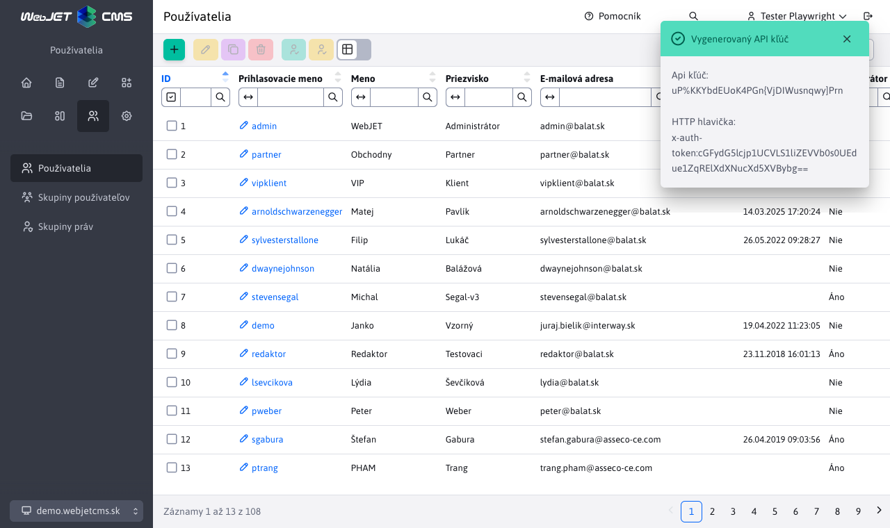
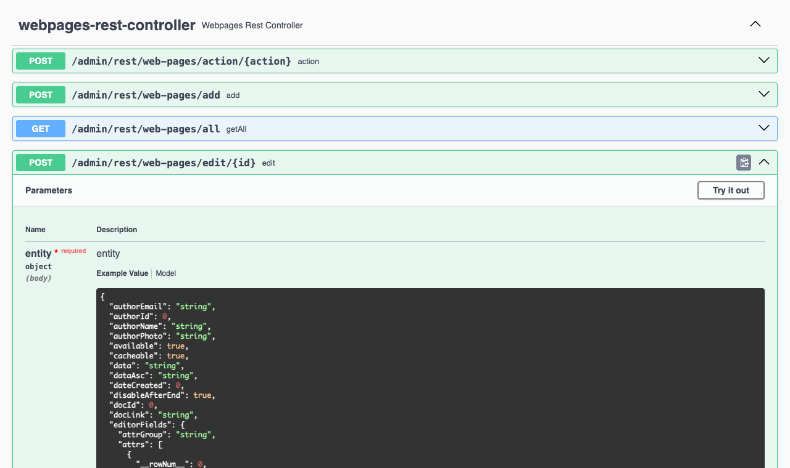

# API autorizácia

Ak potrebujete pristupovať k REST službám/`API WebJET CMS` z externého systému môžete využiť možnosť autorizácie API kľúčom. Ten sa posiela v HTTP hlavičke ```x-auth-token``` pri volaní REST služby. Pri takejto autorizácii nie je potrebné posielať CSRF token.

API [autorizáciu je možné zakázať](../../sysadmin/pentests/README.md#konfigurácia) v konfiguračnej premennej `springSecurityAllowedAuths` z ktorej odstránite hodnotu `api-token`.

## Nastavenie kľúča

API kľúč je priradený k reálnemu používateľskému kontu. V editácii používateľa v karte Osobné údaje zadajte kľúč do poľa API kľúč. Odporúčame zadať znak ```*``` pre vygenerovanie náhodného API kľúča. Po vygenerovaní sa v notifikácii zobrazí kľúč a aj hodnota, ktorá sa zadáva do HTTP hlavičky.



## Zasielanie kľúča

Zadaný API kľúč sa odosiela v HTTP hlavičke ```x-auth-token``` (meno hlavičky je možné zmeniť v konf. premennej ```logonTokenHeaderName```) vo formáte ```base64(login:token)```. Presnú hodnotu vám zobrazí notifikácia pri vygenerovaní náhodného tokenu.

Príklady:

```shell
#zoznam web stranok v priecinku 25
curl -X GET \
  'http://iwcm.interway.sk/admin/rest/web-pages/all?groupId=25' \
  --header 'x-auth-token: dGVzdGVyOkJiO3VLQFA2WlNGYnI4IS9jSmI0QGcyM2A0PkN1RjJw'

#web stranka 4
curl -X GET \
  'http://iwcm.interway.sk/admin/rest/web-pages/4' \
  --header 'x-auth-token: dGVzdGVyOkJiO3VLQFA2WlNGYnI4IS9jSmI0QGcyM2A0PkN1RjJw'
```

## Zoznam všetkých REST služieb

Zoznam všetkých REST služieb môžete získať pri lokálnom spustení WebJETu na URL adrese ```/admin/swagger-ui/index.html``` (vyžaduje nastavenie konf. premennej ```swaggerEnabled``` na ```true```).



## Technické informácie

Autorizácia je zabezpečená pomocou ```SpringSecurity``` filtra implementovaného v triede ```sk.iway.iwcm.system.spring.ApiTokenAuthFilter```. Filter je inicializovaný v ```sk.iway.webjet.v9.V9SpringConfig.configureSecurity```. Technicky prebehne štandardné prihlásenie zadaného používateľa, následne po vykonaní HTTP požiadavky je ```session``` invalidovaná.
