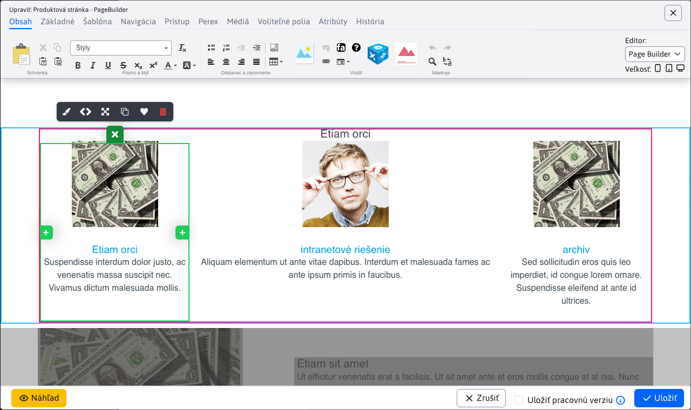

# Page Builder

Page Builder je špeciálny režim editácie stránok. V tomto režime nie je editovaná celá stránka ale len jej vybrané časti.

Pozrite si manuál pre [web dizajnéra](../../../frontend/page-builder/README.md), alebo pre [redaktora](../../../redactor/webpages/pagebuilder.md).



## Implementačné detaily

Režim je aktivovaný nastavením atribútu ```editingMode=pagebuilder``` na objekte [DocEditorFields](../../../../javadoc/sk/iway/iwcm/doc/DocEditorFields.html). V atribúte ```editingModeLink``` je odkaz, ktorý sa načíta do iframe. Nastavuje ich metóda ```setEditingMode```.

Tento odkaz obsahuje URL parameter ```inlineEditorAdmin=true```, podľa neho môžete v kóde nájsť miesta implementujúce funkciu Page Builder. Keď je tento parameter zadaný nevykoná sa presmerovanie stránky (ak má stránka nastavený atribút ```externalLink```).

Technicky je karta Obsah v editore zložená z dvoch ```div``` elementov, jeden obsahuje štandardný CK Editor a jeden iframe pre Page Builder. Kód vzniká v ```field-type-wysiwyg.js```. Okrem toho je zobrazené výberové pole, ktoré zabezpečuje funkciu prepínania medzi editormi (zabezpečuje funkcia ```switchEditingMode```).

## Nová stránka

Page Builder sa otvára v iframe ako zobrazená web stránka, čo komplikuje zobrazenie pre novú web stránku. V takom prípade sa otvorí hlavná stránka adresára, pričom samozrejme sa nastavia prázdne dáta. Po uložení už vznikne korektne nová web stránka, ktorá sa môže editovať. Nastavenie URL adresy pre hlavnú stránku sa deje v [DocEditorFields.setEditingMode](../../../../javadoc/sk/iway/iwcm/doc/DocEditorFields.html).

## Optimalizácia rýchlosti načítania

Pri inicializácii Page Builder je CK Editor prepnutý do režimu HTML kódu, aby sa zbytočne nečítali obrázky, CSS štýly atď pre editor, ktorý nie je zobrazený. Naopak, pri štandardnom režime je iframe pre Page Builder nastavený na URL adresu ```about: blank```.

Vkladané objekty do stránky sú v ```ShowDoc.fixDataForInlineEditingAdmin``` nastavené na prázdne hodnoty, aby sa zbytočne nenačítala hlavička, pätička, menu atď. Štandardne Page Builder získa HTML kód pomocou AJAX volania ```/admin/inline/get_page.jsp```, aby sme jedno volanie ušetrili je hodnota pre ```doc_data``` atribút prenesená v ```inline_page_toolbar.jsp``` cez JSON objekt ```window.inlineEditorDocData```, ktorý ak existuje použije sa namiesto AJAX získania dát.