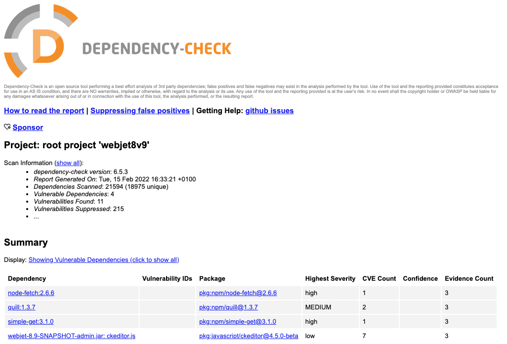

# Bezpečnosť

## Kontrola zraniteľností v knižniciach

V projekte je integrovaný nástroj [OWASP Dependency-Check](https://jeremylong.github.io/DependencyCheck/index.html), ktorý dokáže kontrolovať zraniteľnosti v Java aj JavaScript knižniciach. Kontrolu zraniteľností spustíte príkazom:

```sh
gradlew --info dependencyCheckAnalyze
```

ktorý vytvorí report vo formáte HTML do súboru ```build/reports/dependency-check-report.html```. Tento report môžete jednoducho otvoriť vo web prehliadači. Kontrolu odporúčame vykonávať pred každým ```release``` novej verzie.



Analýza môže obsahovať falošné nálezy. Existujú nasledovné súbory, v ktorých sa nastavujú výnimky:

- ```/dependency-check-suppressions.xml``` - súbor obsahuje výnimky pre štandardný WebJET CMS, nikdy súbor nemodifikujte.
- ```dependency-check-suppressions-project.xml``` - do súboru môžete pridávať výnimky pre váš projekt. Priamo v reporte je tlačidlo ```suppress``` na ktoré keď kliknete zobrazí sa vám XML kód výnimky. Ten jednoducho skopírujte do súboru do vnútra značky ```suppressions```.

Kontrolu je možné vykonávať aj priamo nad vygenerovaným ```war``` archívom pomocou [cli verzie](../../sysadmin/dependency-check/README.md).

## Nebezpečný HTML kód

Ak máte na frontende pole, ktoré umožňuje HTML formátovanie, môže do neho byť vložený potencionálne nebezpečný kód. V datatabuľke sa jedná napr. o pole typu ```DataTableColumnType.QUILL```. Štandardne pri získaní JPA objektu z databázy sú HTML značky ako ```<, >``` konvertované na HTML entity typu ```&lt;, &gt;```. Zabezpečuje to trieda ```XssAttributeConverter``` ktorá má nastavený atribút ```@Converter(autoApply = true)```.

Ak potrebujete pracovať s HTML kódom je potrebné daný atribút anotovať:

- ```@javax.persistence.Convert(converter = AllowHtmlAttributeConverter.class)``` - povolí všetok HTML kód, odporúčame používať v minimálnej miere, respektíve iba v prípade keď HTML kód skutočne má obsahovať aj napr. JavaScript alebo iný potencionálne nebezpečný kód.
- ```@javax.persistence.Convert(converter = AllowSafeHtmlAttributeConverter.class)``` - povolí len základné HTML formátovanie podľa odporúčaní [OWASP](https://owasp.org/www-project-java-html-sanitizer/). Tento konvertor odporúčame používať na všetky vstupy kde je používaný jednoduchý WYSIWYG editor typu ```DataTableColumnType.QUILL```.