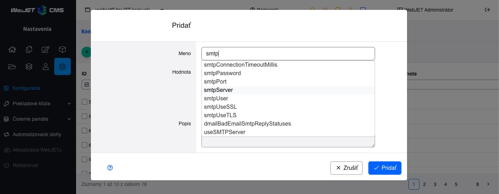

# Autocomplete

V editore je ľahko možné doplniť **"našepkávač" k textovým poliam** pre používateľsky príjemnejšie získanie písanej hodnoty:



## Konfigurácia

Autocomplete pole sa aktivuje nastavením atribútov editora pomocou anotácie ```@DataTableColumnEditorAttr```:

```java
@DataTableColumn(
    inputType = DataTableColumnType.TEXT,
    editor = {
        @DataTableColumnEditor(attr = {
            @DataTableColumnEditorAttr(key = "data-ac-url", value = "/admin/v9/settings/configuration/autocomplete")
        })
    }
)
```

Podporované sú nasledovné atribúty, povinné je len ```data-ac-url```:

- ```data-ac-url``` - URL adresa REST služby, ktorá vráti pole/list ```String``` hodnôt.
- ```data-ac-click``` - meno funkcie, ktorá sa zavolá po kliknutí na možnosť v autocomplete (pre nastavenie ďalších polí). Nastavením na hodnotu ```fireEnter``` je po zvolení hodnoty vyvolaná udalosť stlačenia klávesy ```Enter```.
- ```data-ac-name``` - meno URL parametra, v ktorom sa do REST služby zašle napísaná hodnota (predvolene term).
- ```data-ac-min-length``` - minimálny počet znakov pre volanie REST služby (predvolene 1).
- ```data-ac-max-rows``` - maximálny počet zobrazených riadkov (predvolene 30).
- `data-ac-params` - zoznam selektorov polí, ktorých hodnoty sa pridajú do URL adresy volania REST služby, napr. `#DTE_Field_templateInstallName,#DTE_Field_templatesGroupId`.
- ```data-ac-select``` - pri nastavení na ```true``` sa autocomplete správa podobne ako výberové pole - po kliknutí myšou do vstupného poľa sú načítané a zobrazené všetky možnosti.
- ```data-ac-collision``` - umiestnenie načítaných možností voči vstupnému poľu. Predvolene ```flipfit``` pre automatické umiestnenie, pre možnosť ```select``` je prednastavené na ```none``` pre striktné umiestnenie pod vstupné pole.
- ```data-ac-render-item-fn``` - názov funkcie, ktorá špecificky vygeneruje prvok zoznamu dát

Príklad REST služby vracajúcej údaje je v [ConfigurationController.getAutocomplete](../../../../src/main/java/sk/iway/iwcm/components/configuration/ConfigurationController.java), implementácia je jednoduchá - na základe zadaného ```term``` parametra vráti zoznam ```List<String>``` vyhovujúcich záznamov:

```java
@GetMapping("/autocomplete")
public List<String> getAutocomplete(@RequestParam String term) {
    List<String> ac = new ArrayList<>();
    //na zaklade termu prehladaj zaznamy a do listu dopln len vyhovujuce
    if (...contains(term)) ac.add(...);
    return ac;
}
```

Keďže na backende sa typicky používa LIKE vyhľadávanie je možné zadať do vyhľadávania znak ```%``` pre zobrazenie všetkých výsledkov. To je ale pre používateľov netypické, preto pri zadaní medzery, alebo znaku ```*``` sa do vyhľadávania hodnota nahradí za znak ```%``` pre zobrazenie všetkých záznamov.

## Použitie mimo datatabuľky

```Autocompleter``` je možné využiť aj mimo datatabuľky jednoducho jednoduchým nastavením ```data-ac``` atribútov a CSS triedy ```autocomplete```. Inicializácia je automaticky aktivovaná v [app-init.js](../../../../src/main/webapp/admin/v9/src/js/app-init.js) na všetky ```input``` elementy s CSS triedou ```autocomplete```. Príklad:

```html
<div id="docIdInputWrapper" class="col-auto col-pk-input">
    <label for="tree-doc-id">Doc ID: </label>
    <input type="text" autocomplete="off" class="js-tree-doc-id__input autocomplete" id="tree-doc-id" data-ac-name="docid" data-ac-url="/admin/skins/webjet6/_doc_autocomplete.jsp" data-ac-click="fireEnter"/>
</div>
```

## Poznámky k implementácii

Autocomplete používa [jQuery-ui-autocomplete](https://api.jqueryui.com/autocomplete/) funkcie. Interne je zapuzdrený do JavaScript triedy [AutoCompleter](../../../../src/main/webapp/admin/v9/src/js/autocompleter.js). Tá je upravená z pôvodnej verzie vo WebJET 8, spätne by mala byť kompatibilná (je možné použiť aj URL adresy pôvodných autocomplete služieb vo WebJET 8).

Doplnená je funkcia ```autobind()```, ktorá prevezme nastavenie z data atribútov zadaného input elementu. Inicializácia autocomplete je implementovaná v index.js v kóde:

```javascript
//nastav autocomplete
$('#'+DATA.id+'_modal input.form-control[data-ac-url]').each(function() {
    var autocompleter = new AutoCompleter('#'+$(this).attr("id")).autobind();
    $(this).closest("div.DTE_Field").addClass("dt-autocomplete");
});
```

pričom ako vidno ```div.DTE_Field``` elementu sa aj nastaví CSS trieda ```dt-autocomplete``` pre možnosť budúceho štýlovania elementu.

Funkcia nastavená cez ```click``` parameter sa volá s oneskorením 100ms, aby sa najskôr nastavila hodnota v poli, ktorú je následne možné získať a použiť.

## Špeciálne generovanie prvkov zoznamu

Pomocou parametra ```data-ac-render-item-fn``` sa dá nastaviť názov funkcie, ktorá špecificky vygeneruje prvok do zoznamu dát. Aby to fungovalo musí byť splnené :
- vygenerovaný prvok musí byť ```li``` element (to čo je v ňom je už na vás)
- tento vygenerovaný element musí byť vložený do listu ```ul```
- zadaná funkcia v ```data-ac-render-item-fn``` musí byť zadefinovaná pomocou ```window``` a musí mať vstupné parametre ```ul``` a ```item```

Príklad vlastnej funkcie

```java
    @DataTableColumnEditorAttr(key = "data-ac-render-item-fn", value = "disableDeletedEnum")
```

príklad implementácie takejto funkcie

```js
//Don't forget to add fn into windows AND use correct input params
window.disableDeletedEnum = function(ul, item) {
    var deletedPrefix = WJ.translate("enum_type.deleted_type_mark.js");
    if(deletedPrefix !== undefined && deletedPrefix !== null && deletedPrefix !== "" && item.label.startsWith(deletedPrefix)) {
        //Special element generation - with added "disabled" class
        return $("<li>")
            .append($("<div>").append(item.label))
            .appendTo(ul).addClass("disabled");
    }

    //Classic element generation
    return $("<li>")
        .append($("<div>").append(item.label))
        .appendTo(ul);
}
```

V tomto príklade sme pri splnení podmienky pridali elementu triedu ```disabled```. Autocomplete sme nastavili tak, že dáta (prvky) označené triedou ```disabled``` sa farebne zvýraznia a nie je možné ich zvoliť.