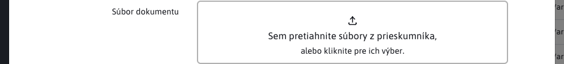
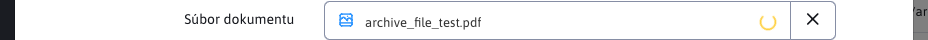
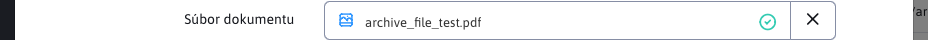

# Pole UPLOAD

Pole umožňuje nahratie súboru.



## Použitie anotácie

Anotácia sa používa ako ```DataTableColumnType.UPLOAD```.

Kompletný príklad anotácie:

```java
@DataTableColumn(
    inputType = DataTableColumnType.UPLOAD,
    tab = "basic",
    title = "fbrowse.file"
)
private String file = "";
```

## Frontend

Pre nahratie nového súboru môžete súbor vložiť priamo pomocou `Drag&Drop`, alebo kliknutím na pole, čím vyvoláte systémový výber súborov.

Predvolene môžete naraz vložiť iba jeden súbor. Počet súborov je možné upraviť konfiguráciou poľa, pozrite časť [Konfigurácia počtu súborov](#konfigurácia-počtu-súborov).

Po vložení súboru sa spustí animácia nahrávania súboru a vyvolá sa udalosť `WJ.AdminUpload.addedfile`, na ktorú môžete počúvať.



Až bude súbor úspešne nahraný, objaví sa v poli potvrdenie nahratia a vyvolá sa udalosť `WJ.AdminUpload.success`. Pri chybe nahrávania sa vyvolá udalosť `WJ.AdminUpload.error`.



Tento súbor sa nahrá ako dočasný súbor a hodnota kľúča sa uloží do poľa, napr. `QUfQEadIJ8B0V8t`. S touto hodnotou už následne vieme na BE pracovať pomocou triedy `AdminUploadServlet`.

Ak chcete nahrať iný súbor, môžete zmazať už nahratý, alebo prerušiť samotnú akciu nahrávania pomocou tlačidla `X`.

## Konfigurácia počtu súborov

Pole `UPLOAD` je predvolene nastavené na jeden súbor. Maximálny počet súborov sa určuje v tomto poradí:

- `data-dt-field-upload-max-files` - číselný limit, má najvyššiu prioritu.
- `data-dt-field-upload-mode` - hodnota `single` alebo `multiple`.
- `className` - spätná kompatibilita cez CSS triedy `wjupload-single` alebo `wjupload-multiple`.

Príklad poľa s podporou viacerých súborov:

```java
@DataTableColumn(
    inputType = DataTableColumnType.UPLOAD,
    tab = "basic",
    title = "fbrowse.file",
    className = "wjupload-multiple"
)
private String file = "";
```

Príklad s explicitným limitom 3 súbory:

```java
@DataTableColumn(
    inputType = DataTableColumnType.UPLOAD,
    tab = "basic",
    title = "fbrowse.file",
    attr = {
        @DataTableColumnEditorAttr(key = "data-dt-field-upload-mode", value = "multiple"),
        @DataTableColumnEditorAttr(key = "data-dt-field-upload-max-files", value = "3")
    }
)
private String file = "";
```

!>**Upozornenie:** hodnota editor poľa je stále jeden reťazec s kľúčom dočasného súboru. Pri viacerých súboroch sa do poľa uloží kľúč posledného úspešne nahraného súboru. Ak potrebujete spracovať všetky nahraté súbory, počúvajte udalosť `WJ.AdminUpload.success` a ukladajte si hodnoty `e.detail.key`.

## Izolácia inštancií a udalosti

Každé `UPLOAD` pole má vlastnú inštanciu `Dropzone`, vlastný kontajner notifikácií a vlastnú šablónu pre zobrazenie nahrávania. Pri opakovanom otvorení editora sa predchádzajúca inštancia zruší, odstránia sa priradené event listenery a vyčistí sa dočasný stav poľa. Vďaka tomu môže byť na jednej stránke viac upload polí alebo samostatných upload zón bez konfliktu nad spoločnými HTML `id`.

Udalosti `WJ.AdminUpload.addedfile`, `WJ.AdminUpload.success` a `WJ.AdminUpload.error` obsahujú v `detail.uploader` referenciu na konkrétnu inštanciu uploadu. Pri počúvaní udalostí vždy overte, že udalosť patrí vašej inštancii:

```javascript
let myUpload = window.AdminUpload({
    element: "#my-upload",
    destinationFolder: "/files/protected/upload/",
    writeDirectlyToDestination: false
});

window.addEventListener("WJ.AdminUpload.success", function(e) {
    if (e.detail == null || e.detail.uploader !== myUpload) return;

    console.log("Dočasný kľúč súboru", e.detail.key);
});
```

Objekt `detail` obsahuje podľa typu udalosti najmä:

- `uploader` - inštancia `AdminUpload`/`Dropzone`, ktorá udalosť vyvolala.
- `file` - objekt súboru z `Dropzone`.
- `key` - kľúč dočasne nahratého súboru, dostupný pri úspešnom nahratí.
- `response` - JSON odpoveď servera pri úspešnom nahratí.
- `errorMessage` - chybová správa pri udalosti `WJ.AdminUpload.error`.

## Samostatné použitie AdminUpload

`window.AdminUpload` môžete použiť aj mimo DataTable Editor poľa, napríklad pre celostránkové `drag&drop` nahrávanie. Podporuje viac nezávislých upload zón na jednej stránke. HTML prvky upload rozhrania sa hľadajú relatívne k elementu zadanému v `options.element`, najprv medzi súrodencami a potom vo vnútri rodičovského elementu. Preto môže mať každá upload zóna vlastný:

- `.upload-wrapper` alebo `#upload-wrapper`,
- `.toast-container-upload` alebo `#toast-container-upload`,
- `.upload-toastr-template` alebo `#upload-toastr-template`.

Príklad:

```html
<div id="my-upload" class="drop-zone-box dropzone"></div>
<div class="upload-wrapper" style="display: none;">
    <div class="toast-container-progress"></div>
    <div id="my-upload-toasts" class="toast-container-upload"></div>
</div>
<div class="upload-toastr-template" style="display: none">
    <i class="ti ti-file"></i>
    <span>{FILE_NAME}</span>
</div>
```

```javascript
let myUpload = window.AdminUpload({
    element: "#my-upload",
    maxFiles: null,
    acceptedFiles: ".pdf,.docx",
    uploadType: "fileArchive",
    destinationFolder: "/files/archiv/",
    writeDirectlyToDestination: true,
    overwriteMode: ""
});
```

Podporované dôležité voľby:

- `element` - CSS selektor alebo DOM element pre `Dropzone`.
- `maxFiles` - maximálny počet súborov, `null` znamená bez limitu.
- `acceptedFiles` - povolené prípony alebo MIME typy.
- `uploadType` - typ nahrávania, napríklad `fileArchive`.
- `destinationFolder` - cieľový priečinok.
- `writeDirectlyToDestination` - ak je `true`, súbor sa zapisuje priamo do cieľového priečinka.
- `overwriteMode` - predvolená akcia pri konflikte súborov, napríklad `skip`, `overwrite` alebo `keepboth`.

Pre skrytý `input[type=file]` generovaný knižnicou `Dropzone` sa automaticky doplní deterministická CSS trieda v tvare `dz-hidden-input-<id_elementu>`. Testy a vlastný kód tak môžu cieliť konkrétnu upload zónu aj vtedy, keď je na stránke viac uploadov naraz.

## Backend

Príklad použitia na BE

```java
String tempKey = "QUfQEadIJ8B0V8t";

//Get path to temp file
String filePath = AdminUploadServlet.getTempFilePath( tempKey );

//Get name of uploaded file
String fileName = AdminUploadServlet.getOriginalFileName( tempKey );

//Remove temp file
boolean wasRemoved = AdminUploadServlet.deleteTempFile( fileKey );
```
