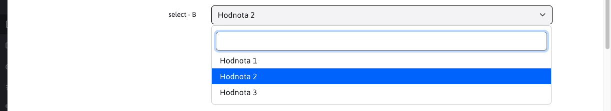
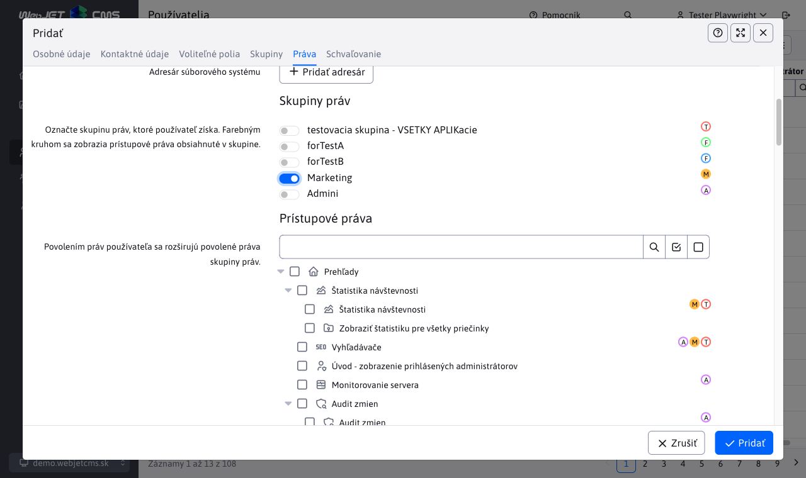

# Typy polí pre editor

V editore je možné použiť všetky štandardné formulárové polia.

## ID

Reprezentuje stĺpec s primárnym kľúčom, príklad:

```java
public class CalendarEventsEntity {

    @Id
    @Column(name = "calendar_id")
    @GeneratedValue(strategy = GenerationType.IDENTITY, generator = "S_calendar")
    @DataTableColumn(inputType = DataTableColumnType.ID)
    private Long id;

}
```

## OPEN_EDITOR

Textový typ poľa ktorý zobrazí odkaz na otvorenie editora záznamu, príklad:

```java
    @Column(name = "title")
    @DataTableColumn(
        inputType = DataTableColumnType.OPEN_EDITOR,
        title="calendar.name",
        tab = "basic"
    )
    @NotBlank
    private String title;
```

## TEXT

Štandardné textové pole, príklad:

```java
    @DataTableColumn(inputType = DataTableColumnType.TEXT, title="components.contact.property.street")
    private String street;
```


## NUMBER / TEXT_NUMBER

Textové pole ```type="number"```, prehliadač typicky zobrazí v poli aj šípky na zväčšenie/zmenšenie zadanej hodnoty. Príklad:

```java
    @Column(name = "priority")
	@NotNull
    @DataTableColumn(
        inputType = DataTableColumnType.NUMBER,
        title="components.banner.priority",
		tab = "main"
    )
	private Integer priority;
```

Rozdiel medzi ```NUMBER``` a ```TEXT_NUMBER``` je v zobrazení v datatabuľke. ```TEXT_NUMBER``` zobrazí zaokrúhlené číslo, pri vyššom čísle vypíše v textovej podobe, napr. ```10 tis.``` namiesto ```10000```. V editore je správanie rovnaké (zobrazí sa presná hodnota).

## PASSWORD

Textové pole ```type="password"``` pre zadanie hesla.

```java
    @DataTableColumn(
        inputType = DataTableColumnType.PASSWORD,
        title = "components.user.password",
        tab = "personalInfo",
        className = "required"
    )
    @Transient //toto nechceme citat z DB
    private String password;
```

## TEXTAREA

Viac riadkové textové pole. Dlhý text sa nezalamuje, ak chcete zalomiť dlhý text do viac riadkov nastavte `className = "wrap"`:

```java
    @Column(name = "gallery_perex")
    @DataTableColumn(
        inputType = DataTableColumnType.TEXTAREA,
        title = "editor.tab.perex",
        tab = "basic"
    )
    private String perex = "";

    @DataTableColumn(
        inputType = DataTableColumnType.TEXTAREA,
        tab = "basic",
        title="components.app-cookiebar.text",
        className = "wrap",
        editor = {
        @DataTableColumnEditor(
            attr = {
                @DataTableColumnEditorAttr(
                    key = "placeholder",
                    value = "components.app-cookiebar.cookie_text")
            }
        )
    })
    private String cookie_text;
```

## DATE

Výber dátumu, po kliknutí do pola zobrazí okno pre výber dátumu.

Všimnite si nastavenie ```@Temporal(TemporalType.TIMESTAMP)``` pre korektnú konverziu poľa do databázového stĺpca (vyžaduje to JPA).

```java
    @Column(name = "date_from")
	@Temporal(TemporalType.TIMESTAMP)
	@DataTableColumn(
        inputType = DataTableColumnType.DATE,
        title="calendar.begin",
        tab = "basic"
    )
	private Date dateFrom;
```

## DATETIME

Podobné pole ako ```DATE``` ale naviac umožňuje aj výber času.

```java
    @Column(name = "date_to")
	@Temporal(TemporalType.TIMESTAMP)
	@DataTableColumn(
        inputType = DataTableColumnType.DATETIME,
        title="components.banner.dateTo",
		visible = false,
		tab = "restrictions"
    )
	private Date dateTo;
```

## TIME_HM a TIME_HMS

Podobné polia ako ```DATETIME``` ale umožňujú IBA výber času. Verzia ```TIME_HM``` je výber času pomocou hodín a minút. Verzia  ```TIME_HMS``` umožňuje výber času pomocou hodín, minút a sekúnd.

Všimnite si nastavenie ```@Convert(converter = DefaultTimeValueConverter.class)```, ktoré nastaví pre každý zvolený čas rovnaký dátum a to ```01.01.2000``` pričom výber času sa nezmení. Toto nastavenie rovnakého dátumu nie je vidieť, ale je dôležité z hľadiska fungovania pri filtrovaní záznamov pomocou týchto časových polí.

Treba si uvedomiť že trieda ```DefaultTimeValueConverter``` implementuje ```AttributeConverter```, čo vlastné znamená, že tento konvertor funguje iba v prípade, keď ide o stĺpec v entite, ktorý reprezentuje stĺpec databázy. Ak vami vybraný stĺpec toto nespĺňa, musíte nastaviť jeho hodnotu pomocou jednej z statických funkcií, ktoré sú obsiahnuté v triede ```DefaultTimeValueConverter```.

```java
    @Column(name = "reservation_time_to")
    @DataTableColumn(
        inputType = DataTableColumnType.TIME_HM,
        title="components.reservation.reservation_objects.date_to",
        visible = false,
        tab = "basic"
    )
    @Convert(converter = DefaultTimeValueConverter.class)
    private Date reservationTimeTo;
```

## SELECT

Výberové pole, nastavuje sa typom ```DataTableColumnType.SELECT```.




Dôležité je definovať možnosti výberového poľa:

### Prenosom údajov z REST služby

Pri čítaní datatabuľky je možné okrem záznamov preniesť aj tzv. ```option``` atribúty. Tie sa následne nastavia aj ako možnosti zadaných polí. Možnosti je možné nastaviť prepísaním metódy ```getOptions```.

```java
public class ContactRestController extends DatatableRestControllerV2<ContactEntity, Long> {

    @Override
    public void getOptions(DatatablePageImpl<ContactEntity> page) {

        //pridaj zoznam pre pole country
        page.addOptions("country", getCountries(), "label", "value", false);
    }

    /**
     * Vrati zoznam vyberoveho pola pre krajinu
     * @return
     */
    public static List<LabelValue> getCountries() {
        //vytvor zoznam krajin, toto by sa idealne malo citat z nejakeho ciselnika
        List<LabelValue> countries = new ArrayList<>();
        countries.add(new LabelValue("Slovenská republika", "sk"));
        countries.add(new LabelValue("Česká republika", "cz"));
        countries.add(new LabelValue("Rakúsko", "at"));

        return countries;
    }
}


public class ContactEntity {

    @DataTableColumn(inputType = DataTableColumnType.SELECT, title="components.contact.property.country")
    private String country;

}
```

Upozornenie: ak by ste prepísali aj metódu ```getAll(Pageable pageable)``` je potrebné volanie ```getOptions``` vykonať vo vašom kóde metódy ```getAll```.

### Prepojením na číselník

V aplikácii číselníky je možné ľahko vytvárať používateľsky upraviteľné zoznamy údajov. Tieto je možné využiť ako možnosti výberového poľa. To sa nastavuje hodnotou ```enumeration:MENO-CISELNIKA```:

```java
public class ContactEntity {

    @DataTableColumn(inputType = DataTableColumnType.SELECT, tab = "basic", editor = {
        @DataTableColumnEditor(
            options = {
                //ukazka napojenia na ciselnik, mozne je zadat meno alebo ID ciselnika, vo value su mena property pre text a hodnotu option pola
                @DataTableColumnEditorAttr(key = "enumeration:Okresne Mestá", value = "string1:string2")
            }
        )
    })
    private String country;

}
```

### Prepojením na Java triedu

Ak sú dáta získavané špeciálnym spôsobom viete získať zoznam možností volaním Java triedy, ktorá vráti zoznam údajov. To sa nastavuje hodnotou ```method:PACKAGE.TRIEDA.METODA```, pričom do ```value``` je možné zadať mená atribútov pre získanie textu a hodnoty vo formáte ```LABEL-PROPERTY:VALUE-PROPERTY```.

```java
public class ContactRestController extends DatatableRestControllerV2<ContactEntity, Long> {
    /**
     * Vrati zoznam vyberoveho pola pre krajinu
     * @return
     */
    public static List<LabelValue> getCountries() {
        //vytvor zoznam krajin, toto by sa idealne malo citat z nejakeho ciselnika
        List<LabelValue> countries = new ArrayList<>();
        countries.add(new LabelValue("Slovenská republika", "sk"));
        countries.add(new LabelValue("Česká republika", "cz"));
        countries.add(new LabelValue("Rakúsko", "at"));

        return countries;
    }
}

public class ContactEntity {

    @DataTableColumn(inputType = DataTableColumnType.SELECT, tab = "basic", editor = {
        @DataTableColumnEditor(
            options = {
                //ukazka ziskania zoznamu krajin volanim statickej metody, vo value su mena property pre text a hodnotu option pola
                @DataTableColumnEditorAttr(key = "method:sk.iway.basecms.contact.ContactRestController.getCountries", value = "label:value")
            }
        )
    })
    private String country;

}
```

### Vymenovaním možností priamo v entite

Jednotlivé možnosti môžete priamo vymenovať pomocou zoznamu ```@DataTableColumnEditorAttr```, ako zobrazený text (atribút ```key```) môžete použiť prekladový kľúč:

```java
	@Column(name = "banner_type")
    @DataTableColumn(
        inputType = DataTableColumnType.SELECT,
        title="[[#{components.banner.banner_type}]]",
		tab = "main",
		editor = {
			@DataTableColumnEditor(
				options = {
					@DataTableColumnEditorAttr(key = "components.banner.picture", value = "1"),
					@DataTableColumnEditorAttr(key = "components.banner.html", value = "3"),
					@DataTableColumnEditorAttr(key = "components.banner.content_banner", value = "4")
				}
			)
		}
    )
	private Integer bannerType;
```

Všimnite si, že aj keď hodnoty do value zadávate ako reťazec korektne sa pretypujú na číslo (technicky v HTML kóde je všetko reťazec, ale pri odoslaní aj zobrazení to Spring korektne konvertuje).


## MULTISELECT

Výberové pole s možnosťou voľby viacerých možností, typ ```DataTableColumnType.MULTISELECT```. Umožňuje pracovať s poľom objektov, alebo s čiarkou oddeleným zoznamom (po nastavení atribútu ```separator``` v ktorom uvediete oddeľovací znak).


Príklady použitia:

```java
public class ContactEntity {

    @DataTableColumn(inputType = DataTableColumnType.MULTISELECT, title="multiple", filter = true, editor = {
        @DataTableColumnEditor(
            options = {
                @DataTableColumnEditorAttr(key = "method:sk.iway.basecms.contact.ContactRestController.getCountries", value = "label:value")
            }
        )
    })
    private String[] multiple;

    @DataTableColumn(inputType = DataTableColumnType.MULTISELECT, title="multipleInt", filter = true, editor = {
        @DataTableColumnEditor(
            options = {
                    @DataTableColumnEditorAttr(key = "1-Jedna", value = "1"),
                    @DataTableColumnEditorAttr(key = "2-Dva", value = "2"),
                    @DataTableColumnEditorAttr(key = "3-Tri", value = "3"),
                    @DataTableColumnEditorAttr(key = "4-Styri", value = "4"),
                    @DataTableColumnEditorAttr(key = "5-Pat", value = "5"),
            }
        )
    })
    private Integer[] multipleInt;


    @DataTableColumn(inputType = DataTableColumnType.MULTISELECT, title="multipleOddeleneCiarkou", filter = true, editor = {
        @DataTableColumnEditor(
            options = {
                    @DataTableColumnEditorAttr(key = "1-Jedna", value = "Jedna"),
                    @DataTableColumnEditorAttr(key = "2-Dva", value = "Dva"),
                    @DataTableColumnEditorAttr(key = "3-Tri", value = "Tri"),
                    @DataTableColumnEditorAttr(key = "4-Styri", value = "Styri"),
                    @DataTableColumnEditorAttr(key = "5-Pat", value = "Pat"),
            },
            separator = ","
        )
    })
    private String multipleOddeleneCiarkou;

}
```

Pre atribút ```multipleOddeleneCiarkou``` sa hodnoty oddeľujú pomocou znaku definovaného v atribúte ```separator```. Hodnota po odoslaní teda bude vyzerať ako napr. ```"Tri,Pat"```.

Hodnoty oddelené čiarkou je potrebné použiť pre ```MULTISELECT``` polia použité pre nastavenie aplikácie (používajúce anotáciu ```@WebjetAppStore```):

```java
@WebjetComponent("sk.iway.basecms.contact.ContactApp")
@WebjetAppStore(nameKey = "Kontakty", descKey = "Ukazkova aplikacia so zoznamom kontaktov", imagePath = "ti ti-id", galleryImages = "/components/map/screenshot-1.jpg,/components/gdpr/screenshot-2.png,/components/gallery/screenshot-3.jpg")
@Getter
@Setter
public class ContactApp extends WebjetComponentAbstract {

    /**
     * Privatne vlastnosti s get/set-rami slúžia na prenesenie parametrov pageParams z !INCLUDE()! do triedy
     * Pomocou anotacie @DataTableColumn vytvarame pole pre nastavenie aplikacie
     */
    @DataTableColumn(inputType = DataTableColumnType.MULTISELECT, tab = "basic", editor = {
        @DataTableColumnEditor(
            options = {
                @DataTableColumnEditorAttr(key = "method:sk.iway.basecms.contact.ContactRestController.getCountries", value = "label:value")
            },
            separator = ","
        )
    })
    private String countries;
}
```

## CHECKBOX

Štandardné zaškrtávacie pole, umožňuje pracovať aj s polom objektov (zvolené viaceré možnosti). Pomocou atribútu ```unselectedValue``` sa nastavuje hodnota ak pole nie je zaškrtnuté.

Môžete využiť aj možnosť nastavenia atribútu ```data-dt-field-headline``` pre samostatný nadpis nad zoznamom polí.

```java
    @DataTableColumn(
        inputType = DataTableColumnType.CHECKBOX,
        title = "editor.perex.group",
        sortAfter = "publishType",
        tab="filter",
        editor = {
            @DataTableColumnEditor(
                attr = {
                    @DataTableColumnEditorAttr(key = "unselectedValue", value = "")
                }
            )
        }
    )
	private String[] perexGroupsIds;


    @DataTableColumn(inputType = DataTableColumnType.CHECKBOX, title = "user.permissions.label", tab = "groupsTab", visible = false, editor = {
        @DataTableColumnEditor(attr = {
            @DataTableColumnEditorAttr(key = "data-dt-field-headline", value = "user.admin.editUserGroups"),
            @DataTableColumnEditorAttr(key = "unselectedValue", value = "") }) })
    private Integer[] permisions;
```

## RADIO

Štandardné pole pre výber jednej z možnosti.

```java
    @Column(name = "sex_male")
    @DataTableColumn(
        inputType = DataTableColumnType.RADIO,
        title = "components.user.newuser.sexMale",
        tab = "personalInfo",
        editor = {
            @DataTableColumnEditor(
                options = {
                    @DataTableColumnEditorAttr(key = "reguser.male", value = "true"),
                    @DataTableColumnEditorAttr(key = "reguser.female", value = "false")
                }
            )
        }
    )
    private Boolean sexMale;
```

## BOOLEAN

Reprezentuje zjednodušený zápis poľa typu ```CHECKBOX``` pre binárnu voľbu áno/nie.

```java
    @Column(name = "require_approve")
    @DataTableColumn(
        inputType = DataTableColumnType.BOOLEAN,
        title = "groupedit.require_approve",
        tab = "basic"
    )
    private Boolean requireApprove;
```

## BOOLEAN_TEXT

Reprezentuje typ ```BOOLEAN``` pre binárnu voľbu áno/nie s titulkom napravo namiesto naľavo a možnosti Áno pri zaškrtávacom poli.

```java
    @DataTableColumn(inputType = DataTableColumnType.BOOLEAN_TEXT, tab = "basic", title="components.news.paging")
    private boolean pagination = true;
```

## HIDDEN

Skryté pole, v editore nebude zobrazené.

```java
	@Column(name = "domain_id")
	@DataTableColumn(
        inputType = DataTableColumnType.HIDDEN,
		tab="basic"
    )
	private Integer domainId;
```

## DISABLED

Zobrazí textové pole, ktorého hodnotu nie je možné meniť. V príklade si všimnite, že typy polí je možné kombinovať. Nastavenie ```DISABLED``` nastaví HTML atribút ```disabled="disabled"```.

```java
    @Size(max = 255)
    @Column(name = "image_name")
    @DataTableColumn(inputType = {DataTableColumnType.OPEN_EDITOR, DataTableColumnType.DISABLED}, tab = "metadata", title="components.gallery.fileName")
    private String imageName;
```

## QUILL

Zobrazí jednoduchý HTML editor, ktorý umožňuje základné formátovanie textu ako tučné písmo/kurzíva/podčiarknuté, nadpisy, zoznamy a odkaz.

Všimnite si použitie konvertora ```@javax.persistence.Convert(converter = AllowSafeHtmlAttributeConverter.class)```, ktorý povolí odoslať len [bezpečný HTML kód](../backend/security.md) (bez vložených JavaScript elementov a podobne).

```java
    @Column(name = "l_description_sk")
    @DataTableColumn(
            inputType = DataTableColumnType.QUILL,
            title = "[[#{gallery.l_description}]] <span class='lang-shortcut'>sk</span>",
            tab = "description"
    )
    @javax.persistence.Convert(converter = AllowSafeHtmlAttributeConverter.class)
    private String descriptionLongSk;
```


## WYSIWYG

Zobrazí plnohodnotný editor HTML ako sa používa pre editáciu web stránok.

```java
    @Column(name = "description")
    @DataTableColumn(
        inputType = DataTableColumnType.WYSIWYG,
        title = "calendar_edit.description",
        tab = "description",
        hidden = true
    )
    private String description;
```

pole musí byť použité v samostatnej karte, ktorá má nastavený atribút ```content: ''```:

```javascript
    var tabs = [
        { id: 'basic', title: /*[[#{calendar_events.tab.basic}]]*/ 'basic', selected: true},
        { id: 'description', title: /*[[#{calendar_events.tab.description}]]*/ 'desc', content: '' },
        { id: 'advanced', title: /*[[#{calendar_events.tab.advanced}]]*/ 'adv' },
        { id: 'notification', title: /*[[#{calendar_events.tab.notification}]]*/ 'notify' }
    ];
```

## JSON

Pole [pridávanie adresárov a web stránok](field-json.md).

```java
    @DataTableColumn(inputType = DataTableColumnType.JSON, title="admin.temp.edit.showForDir", className = "dt-tree-group-array")
    private List<GroupDetails> availableGroups;
```


## DATATABLE

Pole [vnorená datatabuľka v editore](field-datatable.md).

```java
    @Transient
    @DataTableColumn(inputType = DataTableColumnType.DATATABLE, title = "&nbsp;",
        tab = "folders",
        editor = { @DataTableColumnEditor(
            attr = {
                @DataTableColumnEditorAttr(key = "data-dt-field-dt-url", value = "/admin/rest/groups?userGroupId={id}"),
                @DataTableColumnEditorAttr(key = "data-dt-field-dt-columns", value = "sk.iway.iwcm.doc.GroupDetails"),
                @DataTableColumnEditorAttr(key = "data-dt-field-dt-forceVisibleColumns", value = "groupId,groupName,fullPath"),
                @DataTableColumnEditorAttr(key = "data-dt-field-dt-updateColumnsFunction", value = "updateColumnsGroupDetails"),
                @DataTableColumnEditorAttr(key = "data-dt-field-dt-hideButtons", value = "create,edit,duplicate,remove,import,celledit"),
                @DataTableColumnEditorAttr(key = "data-dt-field-full-headline", value = "user.group.groups_title"),
                @DataTableColumnEditorAttr(key = "data-dt-field-dt-serverSide", value = "false")
            }
        )
    })
    private List<GroupDetails> groupDetailsList;
```

## ELFINDER

Pole pre [výber súboru](field-elfinder.md) (odkazu na súbor).

```java
    @Column(name = "watermark")
    @DataTableColumn(
        inputType = DataTableColumnType.ELFINDER,
        title = "components.gallery.watermark",
        tab = "watermark"
    )
    private String watermark;
```


## JSTREE

Pole pre výber [stromovej štruktúry](field-jstree.md).

```java
    @DataTableColumn(inputType = DataTableColumnType.JSTREE, title = "components.user.righrs.user_group_rights", tab = "rightsTab", hidden = true,
    editor = {
        @DataTableColumnEditor(attr = {
                @DataTableColumnEditorAttr(key = "data-dt-field-headline", value = "components.user.permissions"),
                @DataTableColumnEditorAttr(key = "data-dt-field-jstree-name", value = "jstreePerms") }) })
    private String[] enabledItems;

    @DataTableColumn(inputType = DataTableColumnType.JSTREE, title = "user.permgroups.permissions.title", tab = "perms", hidden = true, editor = {
        @DataTableColumnEditor(attr = {
                @DataTableColumnEditorAttr(key = "data-dt-field-jstree-name", value = "jstreePerms") }) })
    private String[] permissions;
```



## COLOR

Pole pre výber farby v `HEX` formáte vrátane priesvitnosti, napr. `#FF0000FF`:

```java
    @DataTableColumn(inputType = DataTableColumnType.COLOR, tab = "basic", title="components.app-cookiebar.textColor")
    private String color_text;
```

## IFRAME

Pole pre vloženie inej stránky do `iframe` elementu, používa sa v aplikáciach v editore pre vloženie napr. foto galérie:

```java
@WebjetComponent("sk.iway.iwcm.components.gallery.GalleryApp")
@WebjetAppStore(nameKey = "components.gallery.title", descKey = "components.gallery.desc", itemKey="menuGallery", imagePath = "/components/gallery/editoricon.png", galleryImages = "/components/gallery/", componentPath = "/components/gallery/gallery.jsp")
@DataTableTabs(tabs = {
    @DataTableTab(id = "basic", title = "components.universalComponentDialog.title", selected = true),
    @DataTableTab(id = "componentIframe", title = "components.gallery.images")
})
@Getter
@Setter
public class GalleryApp extends WebjetComponentAbstract {

    @DataTableColumn(inputType = DataTableColumnType.IFRAME, tab = "componentIframe", title="&nbsp;")
    private String iframe  = "/admin/v9/apps/gallery/?dir={dir}";

}
```

### BASE64

Pole, ktoré kóduje a dekóduje hodnotu pomocou algoritmu `base64`, zobrazené ako `textarea`. Používa sa primárne ako pole pre aplikáciu v editore pre zachovanie špeciálnych znakov vloženej hodnoty. Ak potrebujete použiť `base64` aj na iný typ poľa môžete nastaviť `className = "dt-style-base64"`.

!>**Upozornenie:** JavaScript funkcia `btoa` podporuje len `ASCII` znaky.

```java
    @DataTableColumn(
        inputType = DataTableColumnType.BASE64,
        tab = "basic",
        title="components.app-docsembed.editor_components.url",
    )
    private String url;

    @DataTableColumn(
        inputType = DataTableColumnType.ELFINDER,
        tab = "basic",
        title="components.app-docsembed.editor_components.url",
        className = "dt-style-base64"
    )
    private String url;
```

### STATIC_TEXT

Zobrazenie statického textu na pozícii bežného vstupného poľa, čiže v pravej časti. V prekladovom kľúči je podporovaná markdown syntax.

```java
    @DataTableColumn(
        inputType = DataTableColumnType.STATIC_TEXT,
        tab = "basic",
        title="components.app-vyhladavanie_info"
    )
    private String explain;
```

### IMAGE_RADIO

Zobrazenie výberu jednej z možností na základe obrázka. Používa sa napríklad v aplikácii Anketa. Obrázky sa získajú ako zoznam zo súborového systému, je potrebné ich plniť do objektu `options` odpovede REST služby. Odkaz na obrázok sa zadáva do objektu `OptionDto.original`.

Nastavením `className = "image-radio-horizontal"` je možné prepnúť zobrazenie možností na horizontálne v riadku. Pridaním CSS triedy `image-radio-fullwidth` sa prepne zobrazenie popisku a výberu do riadku namiesto do stĺpca, v takom prípade odporúčame v karte nemať iné polia a nastaviť v definícii karty hodnotu `content = ""` aby karta nemala v pozadí šedý pruh podfarbujúci popisky.

Implementácia je v súbore [field-type-imageradio.js](../../../../src/main/webapp/admin/v9/npm_packages/webjetdatatables/field-type-imageradio.js).

```java
@WebjetComponent("sk.iway.iwcm.components.inquiry.InquiryApp")
@WebjetAppStore(
    nameKey = "components.inquiry.title",
    descKey = "components.inquiry.desc",
    itemKey= "cmp_inquiry",
    imagePath = "/components/inquiry/editoricon.png",
    galleryImages = "/components/inquiry/",
    componentPath = "/components/inquiry/inquiry.jsp"
)
@DataTableTabs(tabs = {
    @DataTableTab(id = "basic", title = "components.universalComponentDialog.title", selected = true),
    @DataTableTab(id = "styleSelectArea", title = "components.roots.new.style", content = ""),
    @DataTableTab(id = "componentIframeWindowTabList", title = "menu.inquiry", content = ""),
})
@Getter
@Setter
public class InquiryApp extends WebjetComponentAbstract {

    @DataTableColumn(
        inputType = DataTableColumnType.IMAGE_RADIO,
        title = "components.roots.new.style",
        tab = "styleSelectArea",
        className = "image-radio-horizontal image-radio-fullwidth"
    )
    private String style = "01";

    @DataTableColumn(
        inputType = DataTableColumnType.IMAGE_RADIO,
        title = "components.catalog.color",
        tab = "styleSelectArea",
        className = "image-radio-horizontal image-radio-fullwidth"
    )
    private String color = "01";

    @Override
    public Map<String, List<OptionDto>> getAppOptions(ComponentRequest componentRequest, HttpServletRequest request) {
        Map<String, List<OptionDto>> options = new HashMap<>();

        //style & color options
        options.put("style", DatatableTools.getImageRadioOptions("/components/inquiry/admin-styles/"));
        options.put("color", DatatableTools.getImageRadioOptions("/components/inquiry/admin-colors/"));

        return options;
    }

}
```

## UPLOAD

Typ poľa umožňujúci [nahratie súboru](field-file-upload.md).


```java
  @DataTableColumn(
        inputType = DataTableColumnType.UPLOAD,
        tab = "basic",
        title = "fbrowse.file"
    )
    private String file = "";
```