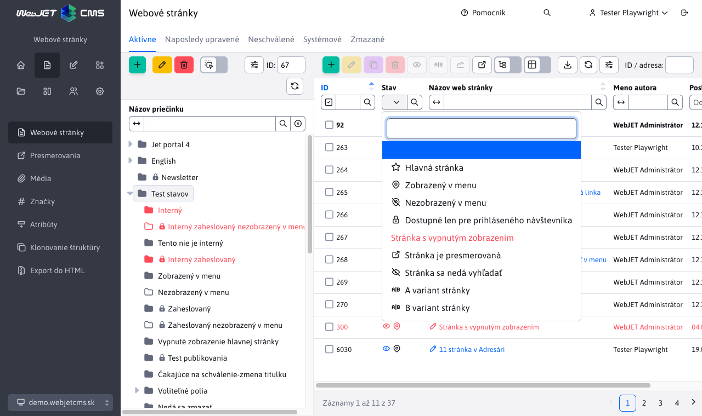

# Datatables

Knižnica [datatables.net](http://datatables.net) je pokročilá tabuľka s napojením na REST služby.

## Základná inicializácia v spolupráca s Spring REST

WebJET implementácia datatables sa konfiguruje pomocou JSON objektu columns. V tomto objekte je definícia stĺpcov pre datatabuľku aj pre datatables editor. Konštruktorom WJ.DataTable sa následne tabuľka inicializuje.

Odporúčame ale vždy generovať columns objekt z [anotácií Java entity](../datatables-editor/datatable-columns.md).

Základný príklad:

```javascript
script.
    let galleryTable = null;
    window.domReady.add(function () {

        //URL adresa REST sluzby
        let url = "/admin/rest/components/gallery";

        //definicia stlpcov
        let columns = [
            {
                data: "id",
                name: "id",
                title: "ID",
                defaultContent: '',
                className: 'dt-select-td',
                renderFormat: "dt-format-selector"
            },
            {
                data: "imageName",
                name: "",
                title: "",
                render: function ( data, type, row ) {
                    //specialna render funkcia pre zobrazenie obrazka galerie
                    return '<div class="img" style="background-image:url(' + row.imagePath + '/' + data +');"></div>';
                },
                className: "dt-image",
                renderFormat: "dt-format-none"
            },
            {
                data: "imageName",
                name: "imageName",
                title: "Nazov suboru",
                renderFormat: "dt-format-text",
                renderFormatLinkTemplate: "javascript:;",
                renderFormatPrefix: '<i class="ti ti-pencil"></i> ',
                className: "dt-row-edit",

                editor: {
                    type:  "text"
                }
            },
            {
                data: "imagePath",
                name: "imagePath",
                title: "Adresar",
                renderFormat: "dt-format-text",

                editor: {
                    type:  "text",
                    attr: {
                        "data-dt-field-hr": "after"
                    }
                }
            }
        ];

        /*
        options pre DataTabulku
        {
            src: zdrojove data (objekt)
            url: URL adresa rest sevisu
            serverSide: ak je nastavene na true bude sa vyhladavanie/sortovanie/strankovanie posielat na server
            columns: definicia stlpcov
            tabs: definicia zaloziek pre Editor
            hideTable: boolean po nastaveni na true sa datatabulka nezobrazi
            noAll: boolean, po nastaveni na true sa nebude k url pridavat /all pre ziskanie vsetkych zaznamov
        }
        */

        galleryTable = WJ.DataTable( {
            url: url,
            serverSide: true,
            columns: columns,
        });

    });


<table class="datatableInit table cardView cardViewS"></table>
```

## Možnosti konfigurácie

```javascript
    WJ.DataTable( {
        Options
    });
```

Možnosti konfigurácie (```options```):

Minimálna konfigurácia:

- ```url {string}``` URL adresa endpointu REST služby pre získanie dát. K tejto URL si datatable pridá ```/all``` pre získanie všetkých dát (ak nie je nastavaná možnosť noAll), ```findByColumns``` pre vyhľadávanie, prípadne ```/editor``` pre uloženie dát.
- ```columns {json}``` definícia stĺpcov, ideálne z [Java anotácií](../datatables-editor/datatable-columns.md).

**Ostatné možnosti:**

- ```serverSide {boolean}``` pri hodnote ```true``` očakáva použitie stránkovania a usporiadania na serveri volaním REST služieb, pri hodnote ```false``` vykonáva stránkovanie a usporiadanie lokálne nad prvotne získanými dátami.
- ```tabs {json}``` definícia [kariet pre editor](../datatables-editor/README.md#karty-v-editore).
- ```id {string}``` jednoznačný identifikátor datatabuľky, ak nie je zadaný použije  sa hodnota ```datatableInit```. Potrebné hlavne ak máte v jednej web stránke viaceré datatabuľky.
- ```editorId {string}``` jednoznačný identifikátor editora, ak nie je zadaný použije sa hodnota ```id```. Potrebné hlavne ak máte v jednej web stránke viaceré datatabuľky.
- ```onXhr {function}``` JavaScript funkcia, ktorá sa zavolá po [načítaní dát](https://datatables.net/reference/event/xhr) vo forme ```function ( TABLE, e, settings, json, xhr ) {}```.
- ```onPreXhr(TABLE, e, settings, data) {function}``` JavaScript funkcia, ktorá sa zavolá [pred načítaním dát](https://datatables.net/reference/event/preXhr), umožňuje pridať do odosielaných dát parametre. Tie sa zadávajú s prefixom ```fixed_``` aby išli odlíšiť od štandardných parametrov datatabuľky. Príklad: ```onPreXhr: function(TABLE, e, settings, data) { data.fixed_searchFilterBotsOut = $('#botFilterOut').is(':checked'); }```.
- ```onEdit(TABLE, row, dataAfterFetch, dataBeforeFetch) {function}```: JavaScript funkcia, ktorá sa zavolá po kliknutí na odkaz editácie záznamu. Ako parametre dostane: ```TABLE``` - inštancia datatabuľky, ```row``` - jQuery objekt riadku na ktorý sa kliklo, ```dataAfterFetch``` - pri zapnutej funkcii ```fetchOnEdit``` json dáta získané po ich obnove, ```dataBeforeFetch``` pôvodné JSON dáta riadku pre volaním ich obnovenia. Štandardný editor otvoríte následne volaním ```TABLE.wjEdit(row);```. Príklad použitia je vo [web-pages-list.pug](../../../src/main/webapp/admin/v9/views/pages/webpages/web-pages-list.pug).
- ```fetchOnCreate {boolean}``` po nastavení na true bude pred vytvorením nového záznamu vykonané REST volanie s hodnotou -1 pre získanie dát nového objektu. Hodnoty sa nastavia volaním ```EDITOR.setJson(json)``` implementované v ```$.fn.dataTable.Editor.prototype.setJson``` v evente ```initCreate```.
- ```fetchOnEdit {boolean}``` po nastavení na true bude pred editáciou záznamu vykonané REST volanie pre získanie aktuánych dát editovaného záznamu. Pri použití datatabuľky napr. pre web stránky sa pred otvorením editora aktualizuje daný záznam zo servera a do editora sa teda otvorí vždy najnovšia verzia. Implementované cez JS funkciu ```refreshRow``` a zákaznícke tlačítko ```$.fn.dataTable.ext.buttons.editRefresh``` ktorým sa nahradí štandardné tlačítko ```edit```.
- ```idAutoOpener {boolean}``` umožňuje nastavením na ```false``` deaktivovať [automatické otváranie editora](../libraries/datatable-opener.md) podľa URL parametra a vloženie poľa pre zadanie ID do hlavičky tabuľky.
- ```hideTable {boolean}``` po nastavení na ```true``` sa datatabuľka nezobrazí v stránke (bude skrytá).
- ```jsonField {function}``` definícia pre pole [typu json](../datatables-editor/field-json.md#použitie-špecifických-json-objektov).
- ```order {array}``` predvolený [spôsob usporiadania](#usporiadanie) tabuľky.
- ```paging {boolean}``` false vypne stránkovanie datatabuľky (zobrazia sa všetky vrátené dáta zo servera, nezobrazí sa možnosť nastavenia veľkosti stránky).
- ```nestedModal {boolean}``` ak je nastavené na true, jedná sa o datatabuľku vloženú ako pole v editore - [vnorená datatabuľka](../datatables-editor/field-datatable.md), vnorená tabuľka má pridanú CSS triedu ```DTE_nested_modal```.
- ```noAll {boolean}``` predvolene k nastavenej url pridá ```/all``` pre získanie všetkých dát, nastavením ```noAll``` na ```false``` sa ```/all``` nepridá, nebude ale funkčné ani vyhľadávanie.
- ```initialData {variable}``` dáta pre prvotné zobrazenie (bez potreby volania REST služby), viď dokumentácia k [optimalizácii rýchlosti zobrazenia](../apps/webpages/README.md) zoznamu web stránok. Technicky ak je nastavený tento objekt tak pri prvom zobrazení sa nevolá REST služba ale sa použijú zadané dáta.
- ```initialData.forceData {boolean}``` po nastavení na ```true``` sa použijú iniciálne dáta bez ohľadu na ich veľkosť, používa sa typicky keď iniciálne dáta sú prázdny objekt, pretože sa následne získajú iným spôsobom. Pre získanie prázdnych dát môžete použiť funkciu ```initialData:  dtWJ.getEmptyData(true)```.
- ```hideButtons {string}``` čiarkou oddelený zoznam mien tlačidiel, ktoré sa majú automaticky v datatabuľke schovať (nezobraziť), napr. ```create,edit,duplicate,remove,import,celledit```.
- ```removeColumns {string}``` čiarkou oddelený zoznam stĺpcov, ktoré sa nemajú zobraziť, aj keď sú v definícii (ak napr. zobrazujete datatabuľku na viacerých miestach a nepotrebujete všetky stĺpce). Napr. ```whenToPublish,datePublished```.
- ```forceVisibleColumns``` čiarkou oddelený zoznam stĺpcov ktoré sa zobrazia (prepíšu nastavené stĺpce používateľom), používa sa typicky vo vnorenej datatabuľke, kde je potrebné zobraziť len niektoré stĺpce.
- ```updateColumnsFunction``` meno JavaScript funkcie, ktorá sa použije pre úpravu zoznamu stĺpcov. Používa sa typicky vo vnorenej datatabuľke, kde je potrebné doplniť/upraviť zobrazené stĺpce (viď ukážka nižšie).
- ```perms``` nastaví [práva pre zobrazenie tlačidiel](#tlačidlá-podľa-práv) na pridanie, editáciu, duplikovanie a mazanie údajov
- ```lastExportColumnName``` ak je zadané zobrazí v exportnom dialógu možnosť exportovať zatiaľ neexportované údaje (používa sa vo formulároch). Hodnota reprezentuje meno stĺpca, ktorý sa pridáva ako ```NULL``` podmienka do výberu dát (je potrebné korektne implementovať v REST službe).
- ```byIdExportColumnName``` ak je zadané v exportnom dialógu povolí export podľa zvolených riadkov. Hodnota je meno stĺpca v databáze s ID hodnotou (typicky id, používa sa vo formulároch). Filtrovanie je potrebné implementovať ako ```predicates.add(root.get("id").in(idsList));``` v REST službe.
- ```editorButtons``` pole tlačidiel, ktoré sa zobrazia v editore. Príklad ```editorButtons: [ {title: "Uložiť", action: function() { this.submit(); } }, { title: ...} ]```. Využíva API pre Datatables Editor.
- ```createButtons``` pole tlačidiel pre pridanie nového záznamu, formát rovnaký ako pre ```editorButtons```.
- ```keyboardSave {boolean}``` - nastavením na hodnotu ```false``` deaktivujete možnosť uložiť záznam v editore klávesovou skratkou ```CTRL+S/CMS+S```.
- ```stateSave {boolean}``` - nastavením na hodnotu ```false``` deaktivujete možnosť pamätania si poradia stĺpcov a usporiadania tabuľky v prehliadači.
- ```customFieldsUpdateColumns {boolean}``` - nastavením na hodnotu ```true``` sa pri získaní [voliteľných polí](../datatables-editor/customfields.md) aktualizujú aj názvy stĺpcov v tabuľke a v nastavení zobrazených stĺpcov (predvolene pri hodnote ```false``` sa názvy voliteľných polia aktualizujú len v editore).
- `customFieldsUpdateColumnsPreserveVisibility {boolean}` - nastavením na hodnotu `true` sa pre používateľa zachová nastavenie zobrazenia stĺpcov pre režim `customFieldsUpdateColumns`. Je možné použiť len v prípade, kedy pre datatabuľku nie sú menené stĺpce počas zobrazenia. Napr. v sekcii Prekladové kľúče sa dáta nemenia, je možné nastaviť na `true`, ale v sekcii Číselníky sa menia aj stĺpce pri zmene číselníka, tam táto možnosť nie je použiteľná.
- ```autoHeight {boolean}``` - predvolene tabuľka počíta svoju výšku aby maximálne využila priestor okna. Nastavením na hodnotu ```false``` bude mať tabuľka výšku podľa obsahu (počtu riadkov).
- ```editorLocking {boolean}``` - predvolene tabuľka volá službu notifikácie pri editácii rovnakého záznamu viacerými používateľmi, ak je toto neželané nastavte na hodnotu `false`.
- ```updateEditorAfterSave {boolean}``` - nastavením na ```true``` sa aktualizuje obsah editora po uložení dát (ak editor zostáva otvorený).

```javascript
let columns = [
    {
        data: "audit",
        name: "audit",
        title: "Auditované",

        renderFormat:   "dt-format-checkbox"
                        "dt-format-selector"
                        "dt-format-text"
                        "dt-format-text-wrap"
                        "dt-format-none"
                        "dt-format-date-time"
                        "dt-format-select" //moznosti bere z editor: { options: }

        renderFormatLinkTemplate:   "javascript:;",
                                     "/temps-list.html"
        renderFormatPrefix: '<i class="ti ti-pencil"></i> ',
        renderHideValue: false, //TODO ???
        render: function ( data, type, row ) {
            //console.log("data", data, "type", type, "row", row);
            return '<div class="img" style="background-image:url(' + row.imagePath + '/' + data +');"></div>';
        },

        className: "dt-image",

        defaultContent: '',

        perms: "multiDomain" //stĺpec sa zobrazí len ak používateľ má právo multiDomain

    }
];

//Ukazka pouzitia updateColumnsFunction
//@DataTableColumnEditorAttr(key = "data-dt-field-dt-updateColumnsFunction", value = "updateColumnsGroupDetails"),
    function updateColumnsGroupDetails(columns) {
        //doplnenie kliknutia na stlpec fullPath
        WJ.DataTable.mergeColumns(columns, {
            name: "fullPath",
            renderFormatLinkTemplate: "javascript:openGroupDetails({{groupId}})"
        });
    }
    function openGroupDetails(groupId) {
        window.open("/admin/v9/webpages/web-pages-list/?groupid="+groupId);
    }
```

**Inicializovanie vyhľadávania:**

Môžu existovať prípady, keď pri zobrazení tabuľky potrebujete ihneď inicializovať aj (zapamätané) vyhľadávanie. Používa sa to v aplikácii Štatistika, ktorá si pamätá  rozsah nastavených dátumov od-do. Už pri prvom volaní REST služby sú aplikované vyhľadávacie kritéria. Možnosť sa nastavuje JSON objektom v ```options.defaultSearch```. Obsahuje zoznam selektorov s hodnotou, ktoré sa aplikujú do filtra pred prvým volaním REST služby, napr.:

```json
{
    ".dt-filter-from-dayDate": "06.06.2022",
    ".dt-filter-to-dayDate": "22.08.2022"
}
```

Príklad použitia so zapamätaním v ```sessionStorage``` prehliadača:

```javascript
//inicializacia datatabulky
errorDataTable = WJ.DataTable({
    url: url,
    serverSide: false, //false lebo sa nevyužíva repositár
    columns: columns,
    id: "errorDataTable",
    idAutoOpener: false,
    defaultSearch: ChartTools.getSearchCriteria(),
    onPreXhr: function(TABLE, e, settings, data) {
        //console.log('onPreXhr, url=', $('#searchUrl').val());
        data.fixed_searchurl = $('#searchUrl').val();
    }
});
//Onchange events - update table
$("#errorDataTable_extfilter").on("click", "button.filtrujem", function() {
    //reload table values
    ChartTools.saveSearchCriteria(errorDataTable.DATA);
    errorDataTable.ajax.reload();
});

//appModule
/**
 * Save last search criteria to session storage, so all stats page will have same criteria when loaded
 * @param {*} DATA
 */
export function saveSearchCriteria(DATA) {
    var inputs = [".dt-filter-from-dayDate", ".dt-filter-to-dayDate", "#rootDir", "#botFilterOut", "#searchUrl", ".dt-filter-lastLogon"];
    var defaultSearch = {};

    for (const name of inputs) {
        var value = $("#"+DATA.id+"_extfilter "+name).val();
        if ("true"===value) {
            //it's checkbox
            value = $("#"+DATA.id+"_extfilter "+name).is(":checked");
        }
        if (value != "" && value != "-1" && value != "false") defaultSearch[name] = value;
    }
    var json = JSON.stringify(defaultSearch);
    if (json != "{}") window.sessionStorage.setItem("webjet.apps.stat.filter", json);
    else window.sessionStorage.removeItem("webjet.apps.stat.filter");
}

/**
 * Gets saved search criteria from session storage
 * @returns
 */
export function getSearchCriteria() {
    var defaultSearch = window.sessionStorage.getItem("webjet.apps.stat.filter");
    if ("{}"==defaultSearch) defaultSearch = null;
    if (defaultSearch != null) {
        defaultSearch = JSON.parse(defaultSearch);
        for (const property in defaultSearch) {
            var value = defaultSearch[property];
            if (property == "#rootDir") {
                var $property = $(property)
                $property.val(value);
                $property.selectpicker("val", value);
            }
            if (property == "#botFilterOut") {
                $("#botFilterOut").prop("checked", value);
            }
            if (property == "#searchUrl") {
                $("#searchUrl").val(value);
            }
        }
    }
    return defaultSearch;
}
```

### Nastavenie stĺpcov

```renderFormat```:

- ```dt-format-selector``` - zaškrtávacie pole na označenie riadku, malo by byt ako prvý stĺpec
- ```dt-format-none``` - stĺpec nebude mať žiadne možnosti v hlavičke
- ```dt-format-text, dt-format-text-wrap``` - štandardný text, ```escapuje``` HTML kód
- ```dt-format-select``` - výberové pole
- ```dt-format-checkbox``` - HTML typ ```checkbox```
- ```dt-format-boolean-true, dt-format-boolean-yes, dt-format-boolean-one``` - ```true/false``` možnosti
- ```dt-format-number, dt-format-percentage``` - zobrazenie čísla
- ```dt-format-number--decimal, dt-format-percentage--decimal```
- ```dt-format-number--text``` - zobrazí zaokrúhlené číslo, pri vyššom čísle vypíše v textovej podobe, napr. ```10 tis.``` namiesto ```10000```
- ```dt-format-filesize``` - formátovanie veľkosti súboru ako `10,24 kB`
- ```dt-format-date, dt-format-date-time, dt-format-date--text, dt-format-date-time--text``` - dátum/čas, filter zobrazí od-do
- ```dt-format-link``` - zobrazí text ako odkaz, možnosť použiť ```renderFormatLinkTemplate```
- ```dt-format-image``` - zobrazí malý náhľad obrázku a odkaz na jeho plné zobrazenie, pod obrázkom je text linky na obrázok.
- ```dt-format-mail``` - zobrazí text ako email odkaz
- ```dt-row-edit``` - umožní editáciu riadku

Ak potrebujete aby stĺpec mal špecifickú (maximálnu) šírku je potrebné túto nastaviť pomocou CSS na oba riadky v hlavičke pomocou CSS štýlu ```max-width```. Príklad:

```css
.datatableInit {
    thead tr {
        th.dt-th-editorFields-statusIcons {
            width: 75px;
            max-width: 75px;
        }
    }
}
```

Nastavenie ```max-width``` zabezpečí nastavenie šírky stĺpca. Datatabuľka dopočíta zvyšné šírky. Pozor, ak text presahuje zadanú šírku oddiali v samotnej tabuľke ďalšie stĺpce, potom nesedí šírka hlavičky a tabuľky, je potrebné prípadne na danej bunke nastaviť ```overflow``` vlastnosť. Bunke môžete pridať potrebný CSS štýl nastavením atribútu ```className``` v anotácii.

### Zobrazenie HTML kódu

Datatabuľka predvolene ```escapuje``` HTML znaky do entít, aby nedošlo k nechcenému vykonaniu HTML kódu. Ak v bunke potrebujete zobraziť HTML kód je možné v anotácii nastaviť v atribúte ```className``` CSS štýl ```allow-html```, ktorý povolí vykonanie HTML kódu v bunke. Dávajte ale na toto použitie pozor, aby sa nemohla nastať chyba typu XSS.

```java
    @DataTableColumn(
        inputType = DataTableColumnType.TEXTAREA,
        title="[[#{admin.conf_editor.value}]]",
        className = "allow-html"
    )
    private String value;
```

## Pridanie/odobratie tlačidiel

Cez API je možné v ```toolbare``` odobrať/pridať tlačidlá:

```javascript
//odstranenie tlacitka (kazde tlacitko ma atribut dt-dtbtn podla ktoreho viete zistit jeho meno)
galleryTable.hideButton("create");
galleryTable.hideButton("import");
galleryTable.hideButton("export");

//pridanie tlacitka na 5 poziciu
let buttonCounter = 5;
galleryTable.button().add(buttonCounter++, {
    text: 'S',
    action: function (e, dt, node) {
        switchGallerySize(e, dt, node, 'S');
    },
    className: 'btn btn-outline-secondary btn-gallery-size active',
    attr: {
        'title': 'Size S'
    }
});

galleryTable.button().add(buttonCounter++, {
    text: '<i class="ti ti-list-details"></i>',
    action: function (e, dt, node) {
        console.log("btn, e=",e,"dt=",dt,"node=",node);
        //ziskaj data selectnuteho riadku
        let selectedRows = dt.rows({ selected: true }).data();
    },
    init: function ( dt, node, config ) {
        //zobraz tlacidlo aktivne iba ked je oznaceny aspon jeden riadok
        $.fn.dataTable.Buttons.showIfRowSelected(this, dt);
        //ALEBO ked je oznaceny PRESNE jeden riadok
        //$.fn.dataTable.Buttons.showIfOneRowSelected(this, dt);
    },
    className: 'btn btn-outline-secondary btn-gallery-size',
    attr: {
        //zobrazi tooltip po prechode mysou
        title: 'Table view',
        'data-toggle': 'tooltip'
    }
});

//wrapnutie 4 tlacitok do grupy (v galerii prepinanie velkosti SMLT)
$('.btn-gallery-size').wrapAll('<div class="btn-group-wrapper buttons-divider-both" data-toggle="tooltip" data-original-title="Veľkosť obrázkov"><div class="btn-group btn-group-toggle gallery-buttons-size" /></div>');

//znova zobrazenie tlacidla
galleryTable.showButton("export");
```

V `init` funkcii je možné použiť nasledovné volania:

- `$.fn.dataTable.Buttons.showIfRowSelected(this, dt);` - tlačidlo je aktívne len ak je označený aspoň jeden riadok
- `$.fn.dataTable.Buttons.showIfRowUnselected(this, dt);` - tlačidlo je aktívne len ak nie je označený žiaden riadok
- `$.fn.dataTable.Buttons.showIfOneRowSelected(this, dt);` - tlačidlo je aktívne len ak je označený presne jeden riadok

## Tlačidlo pre vykonanie serverovej akcie

Datatabuľka ponúka možnosť pridať tlačidlo pre vykonanie serverovej akcie (napr. rotácia obrázka, zmazanie všetkých záznamov).

JS funkcia ```nejakaTable.executeAction(action, doNotCheckEmptySelection, confirmText, noteText, customData = null, forceIds = null)``` má parametre:

- ```action``` (String) - meno akcie, ktorá sa odošle na server na vykonanie.
- ```doNotCheckEmptySelection``` (true) - nastavením na ```true``` sa nevykoná kontrola, či sú zvolené nejaké riadky a do REST služby sa ako ID zvoleného riadku pošle hodnota -1. Vhodné to je na tlačítka, ktoré nepotrebujú mať zvolené riadky, napr. Obnoviť všetky záznamy a podobne.
- ```confirmText``` (String) - ak je zadané zobrazí sa pred vykonaním akcie potvrdenie (napr. Ste si istý, že chcete ...?).
- ```noteText``` (String) - doplnkový text zobrazený nad tlačítkami pre potvrdenie vykonania akcie (napr. Operácia môže trvať niekoľko minút).
- `customData` - objekt pridaný do volania REST služby ako parameter `customData` (napr. dodatočné údaje potrebné pre korektné vykonanie akcie).
- `forceIds` - číslo alebo pole čísel s hodnotou ID záznamu pre ktorý sa má akcia vykonať. Využívané ak potrebujete kliknutím na stavovú ikonu vyvolať akciu (bez potreby označenia riadku).

Na serveri sa v REST službe vykoná volanie ```/action/rotate``` implementované v metóde [DatatableRestControllerV2.processAction](../../../src/main/java/sk/iway/iwcm/system/datatable/DatatableRestControllerV2.java). REST službe sa pošle zoznam vybratých riadkov (ich ID), čo sa spracuje v metóde DatatablesRestControllerV2.action.

**Príklad použitia** - pridané tlačidlo do ```toolbaru``` nad datatabuľkou s volaním akcie:

```javascript
cacheObjectsTable.button().add(3, {
    extends: 'remove',
    editor: cacheObjectsTable.EDITOR,
    text: '<i class="ti ti-camera"></i>',
    action: function (e, dt, node) {
        cacheObjectsTable.executeAction("deletePictureCache", true, "[[\#{components.data.deleting.imgcache.areYouSure}]]", "[[\#{components.data.deleting.imgcache.areYouSureNote}]]");
    },
    className: 'btn btn-danger',
    attr: {
        'title': '[[\#{components.memory_cleanup.deleteImageCache}]]',
        'data-toggle': 'tooltip'
    }
});
```

Tlačidlo aj s kontrolou, že je zvolený nejaký riadok (v init option):

```javascript
galleryTable.button().add(buttonCounter++, {
    extends: 'remove',
    editor: galleryTable.EDITOR,
    text: '<i class="ti ti-repeat"></i>',
    action: function (e, dt, node) {
        //console.log("Rotate, e=",e," dt=",dt," node=",node);
        galleryTable.executeAction("rotate");
    },
    init: function ( dt, node, config ) {
        $.fn.dataTable.Buttons.showIfRowSelected(this, dt);
    },
    className: 'btn btn-outline-secondary',
    attr: {
        'title': 'Otočiť',
        'data-toggle': 'tooltip'
    }
});
```

Akcia vyvolá nasledovné udalosti:

- `WJ.DT.executeAction` - po úspešnom vykonaní akcie.
- `WJ.DT.executeActionCancel` - po neúspešnom vykonaní akcie, alebo kliknutí na tlačidlo Zrušiť pri potvrdení akcie.

## Tlačidlá podľa práv

Ak potrebujete zobrazovať tlačidlá podľa práv (napr. tlačidlo Pridať len ak má používateľ určité právo) je možné do konfigurácie datatabuľky pridať atribút ```perms```:

```javascript
webpagesDatatable = WJ.DataTable({
    url: webpagesInitialUrl,
    ...
    perms: {
        create: 'addPage',
        edit: 'pageSave',
        duplicate: 'pageSaveAs',
        remove: 'deletePage'
    }
});
```

definícia v ```perms``` objekte definuje konkrétne meno práva pre jednotlivé operácie vytvorenia (```create```), editácie (```edit```), duplikovania (```duplicate```) a zmazania (```remove```) záznamu.

Nastavenie práv prestane zobrazovať tlačidlá v nástrojovej lište a zároveň nebudú zobrazovať tlačidlo na uloženie/pridanie/zmazanie záznamu v dialógovom okne editora (tlačidlá sa schovajú pri zobrazení okna editora).

Tabuľka poskytuje API pre overenie práva ako ```TABLE.hasPermission(action)```:

```javascript
if (webpagesDatatable.hasPermission("create")) {
    ...
}
```

!>**Upozornenie:** nespoliehajte sa len na kontrolu práv na frontende, práva je potrebné kontrolovať aj v REST službe alebo v service triede. Využiť môžete metódy [beforeSave alebo beforeDelete](restcontroller.md#zabránenie-zmazania--editácie-záznamu).

## Štýlovanie riadku

Niekedy je potrebné nastaviť CSS štýl celého riadku (napr. tučné písmo pre hlavnú stránku, alebo červené pre nedostupnú). Na prenos týchto doplnkových údajov využívame prenos vnorených atribútov cez objekt [EditorFields](../datatables-editor/datatable-columns.md#vnorené-atribúty). Vytvorili sme triedu [BaseEditorFields](../../../src/main/java/sk/iway/iwcm/system/datatable/BaseEditorFields.java), ktorá má metódu ```addRowClass(String addClass)``` pre pridanie CSS triedy na riadku.

Príklad použitia je v [DocEditorFields](../../../src/main/java/sk/iway/iwcm/doc/DocEditorFields.java):

```java
...
public class DocEditorFields extends BaseEditorFields {
    public void fromDocDetails(DocDetails doc) {
        ...
        //hlavna stranka adresara
        if (groupDetails != null && doc.getDocId()>0 && groupDetails.getDefaultDocId()==doc.getDocId()) {
            addRowClass("is-default-page");
        }

        //vypnute zobrazovanie
        if (doc.isAvailable()==false) addRowClass("is-not-public");
    }
}
```

Dostupné sú nasledovné CSS štýly riadku:

- ```is-disabled``` - reprezentuje neaktívnu položku, zobrazené červeným písmom.
- ```is-disapproved``` - reprezentuje neschválenú položku, zobrazené červeným písmom.
- ```is-default-page``` - reprezentuje hlavnú web stránku adresára, zobrazené tučným písmom.
- ```is-not-public``` - reprezentuje neverejnú položku, zobrazené červeným písmom.

Nastavenie CSS štýlu riadku je implementované v [index.js](../../../src/main/webapp/admin/v9/npm_packages/webjetdatatables/index.js) pomocou možnosti ```rowCallback``` konštruktora datatabuľky. Overuje existenciu property ```data.editorFields.rowClass``` a ak existuje tak hodnotu aplikuje na riadok.

Nastavenie štýlu riadku môžete vykonať aj v JavaScript kóde (napr. na základe atribútov) pomocou voľby ```onRowCallback```. Môžete tak ľahko označiť riadky ako neaktívne CSS štýlom ```is-not-public```.

```javascript
domainRedirectTable = WJ.DataTable({
    url: '/admin/rest/settings/domain-redirect',
    columns: columns,
    serverSide: false,
    editorId: "redirectId",
    onRowCallback: function(TABLE, row, data) {
        if (data.active === false) $(row).addClass("is-not-public");
    }
});
```

## Stavové ikony

Niekedy je potrebné zobraziť stavové ikony záznamu (napr. vo web stránkach ikony Nezobrazené v menu, Presmerovaná stránka a podobne). Na prenos týchto doplnkových údajov využívame prenos vnorených atribútov cez objekt [EditorFields](../datatables-editor/datatable-columns.md#vnorené-atribúty). Vytvorili sme triedu [BaseEditorFields](../../../src/main/java/sk/iway/iwcm/system/datatable/BaseEditorFields.java), ktorá má metódu ```addStatusIcon(String className)```. Ikony sú zo sady FontAwesome.



Príklad použitia je v [DocEditorFields](../../../src/main/java/sk/iway/iwcm/doc/DocEditorFields.java). Je potrebné definovať atribút ```statusIcons``` s ```@DataTableColumn``` anotáciou, aby sa stĺpec zobrazil. Je zobrazený ako výberové pole, do ```options``` atribútu odporúčame definovať ikonu a opisný text. Ako ```value``` sa prenášajú vyhľadávacie podmienky (viď nižšie):

```java
...
public class DocEditorFields extends BaseEditorFields {

    @DataTableColumn(inputType = DataTableColumnType.SELECT, title = "webpages.icons.title",
        hiddenEditor = true, hidden = false, visible = true, sortAfter = "id", className = "allow-html", orderable = false,
        editor = { @DataTableColumnEditor(
            options = {
                @DataTableColumnEditorAttr(key = "<i class=\"ti ti-map-pin\"></i> [[#{webpages.icons.showInMenu}]]", value = "showInMenu:true"),
                @DataTableColumnEditorAttr(key = "<i class=\"ti ti-map-pin-off\"></i> [[#{webpages.icons.notShowInMenu}]]", value = "showInMenu:false"),
                @DataTableColumnEditorAttr(key = "<i class=\"ti ti-lock-filled\"></i> [[#{webpages.icons.onlyForLogged}]]", value = "passwordProtected:notEmpty"),
                @DataTableColumnEditorAttr(key = "<span style=\"color: #FF4B58\">[[#{webpages.icons.disabled}]]</span>", value = "available:false"),
                @DataTableColumnEditorAttr(key = "<i class=\"ti ti-external-link\"></i> [[#{webpages.icons.externalLink}]]", value = "externalLink:notEmpty"),
                @DataTableColumnEditorAttr(key = "<i class=\"ti ti-eye\"></i> [[#{webpages.icons.notSearchable}]]", value = "searchable:false")
            }
        )}
    )
    private String statusIcons;

    public void fromDocDetails(DocBasic doc, boolean loadSubQueries) {
        //ikony
        if (doc.isShowInMenu()) addStatusIcon("ti ti-map-pin");
        else addStatusIcon("ti ti-map-pin-off");
        if (Tools.isNotEmpty(doc.getExternalLink())) addStatusIcon("ti ti-external-link");
        if (doc.isSearchable()==false) addStatusIcon("ti ti-eye-off");
        if (Tools.isNotEmpty(doc.getPasswordProtected())) addStatusIcon("ti ti-lock-filled");
    }

    public getStatusIcons() {
        return getStatusIconsHtml();
    }
}
```

ak potrebujete programovo niečo co stavových ikon doplniť (v prípade web stránok sa jedná o odkaz na zobrazenie stránky), môžete upraviť stavové ikony priamo v kóde (v tom prípade neimplementujte metódu ```getStatusIcons```):

```java
    public void fromDocDetails(DocDetails doc) {
        ...
        StringBuilder iconsHtml = new StringBuilder();

        //pridaj odkaz na zobrazenie stranky
        Prop prop = Prop.getInstance();
        String link = "/showdoc.do?docid="+doc.getDocId();
        if (doc instanceof DocHistory) {
            //v history je otocene docid a historyid
            link = "/showdoc.do?docid="+doc.getId()+"&historyId="+doc.getDocId();
        }
        iconsHtml.append("<a href=\""+link+"\" target=\"_blank\" title=\""+ResponseUtils.filter(prop.getText("history.showPage"))+"\"><i class=\"ti ti-eye\"></i></a> ");

        iconsHtml.append(getStatusIconsHtml());
        statusIcons = iconsHtml.toString();
        ...
    }
```

Vyhľadávanie po zvolení možnosti filtra je implementované v ```DatatableRestControllerV2.addSpecSearchStatusIcons``` a zavolá sa automaticky pri volaní ```addSpecSearch``` (ak túto metódu rozširujete, musíte to volať implicitne), repozitár musí rozširovať ```JpaSpecificationExecutor```. Aktuálne sú podporované nasledovné možnosti vyhľadávania:

- ```property:true``` - hodnota atribútu ```property``` je ```true```
- ```property:false``` - hodnota atribútu ```property``` je ```false```
- ```property:notEmpty``` - hodnota atribútu ```property``` nie je prázdna
- ```property:empty``` - hodnota atribútu ```property``` je prázdna (null alebo '')
- ```property:%text%``` - hodnota atribútu ```property``` obsahuje zadaný text (```like``` vyhľadávanie)
- ```property:!%text%``` - hodnota atribútu ```property``` neobsahuje zadaný text (```not like``` vyhľadávanie)

## Zobrazenie dát na základe práv

V columns definícii je možné nastaviť požadované právo pre zobrazenie daného stĺpca v datatabuľke alebo v editore pomocou atribútu ```perms```. Príklad v súbore [redirect.pug](../../../src/main/webapp/admin/v9/views/pages/settings/redirect.pug):

```javascript
{
    data: "domainName",
    name: "domainName",
    title: "[[\#{groupedit.domain}]]",
    editor: {
        type: "text"
    },
    renderFormat: "dt-format-text",
    renderFormatLinkTemplate: "javascript:;",
    renderFormatPrefix: '<i class="ti ti-pencil"></i> ',
    className: "dt-row-edit",
    perms: "multiDomain" //stĺpec sa zobrazí len ak používateľ má právo multiDomain
},
```

WebJET pri zobrazení stránky vygeneruje do HTML kódu JS pole ```nopermsJavascript``` v ktorom je zoznam modulov, na ktoré používateľ nemá práva. Rovnako sa vygeneruje aj CSS štýl s triedami ```.noperms-menomodulu``` s nastaveným ```display: none```.

## Usporiadanie

Datatable podporuje nastavenie usporiadania atribútom [order:](https://datatables.net/reference/option/order). Tento je možné prenášať ako ```option``` pri inicializácii tabuľky. Z dôvodu pugjs/thymeleaf parsingu ale nie je možné zapísať priamo výraz ```[[0, 'asc']]```, pretože ho Thymeleaf vykoná. Je potrebné pole usporiadania pripraviť okľukou cez premennú a push:

```javascript
var order = [];
order.push([5, 'desc']);

configurationDatatable = WJ.DataTable({
    url: "/admin/v9/settings/configuration",
    columns: columns,
    order: order
});
```

tak sa "oklame" Thymeleaf parser a pole pre usporiadanie sa korektne definuje.

## Vyhľadávania

**Filtrovanie HTML značiek**

Datatabuľka pri **lokálnom vyhľadávaní** (neaplikuje sa na serverové vyhľadávanie) predvolene filtruje HTML značky a vyhľadáva len v texte (obsah HTML značiek ignoruje). To je neželaný stav pre polia typu ```textarea``` kde sa HTML kód zadáva (napr. kód skriptu v aplikácii Skripty). Následne vyhľadávanie výraz v HTML kóde nenájde.

Do index.js je doplnený vyhľadávací typ html-input, ktorý nefiltruje HTML značky ```$.fn.dataTableExt.ofnSearch['html-input'] = function(value)...```. V ```columnDefs``` je automaticky nastavený pre stĺpce s CSS štýlom ```dt-format-text-wrap``` (nastavené automaticky anotáciou ```DataTableColumnType.TEXTAREA```) alebo ```html-input```.

## Externý filter

Okrem zobrazenia filtrov v záhlaví každého stĺpca tabuľky je možné pridať samostatné filtrovacie pole na ľubovoľné miesto v HTML kóde stránky. Príkladom je [Mazanie záznamov v databáze](../../../src/main/webapp/admin/v9/views/pages/settings/database-delete.pug) kde je filter presunutý priamo do hlavičky stránky k nadpisu.

V pug súbore je potrebné pripraviť základnú HTML štruktúru vytvorením div kontajnera s ID ```TABLEID_extfilter```. V ňom sa vyhľadajú div elementy s CSS triedou ```dt-extfilter-title-FIELD``` do ktorého sa vloží názov stĺpca a ```dt-extfilter-FIELD``` do ktorého sa vloží vyhľadávacie pole.

```
div#dateDependentEntriesTable_extfilter
    div.row.datatableInit
        div.col-auto.dt-extfilter-title-from
        div.col-auto.dt-extfilter.dt-extfilter-from
```

!>**Upozornenie:** v elemente pre vyhľadávacie pole je CSS trieda ```.dt-extfilter``` aj ```.dt-extfilter-FIELD```, je potrebné použiť obe. Podľa CSS triedy ```.dt-extfilter``` sa vyhľadá element po kliknutí na lupu, v data atribúte ```data-column-index``` je uložené poradové číslo stĺpca.

Ak chcete presunúť filter do hlavičky stránky, môžete ho jednoducho presunúť pomocou jQuery ako je v [database-delete.pug](../../../../src/main/webapp/admin/v9/views/pages/settings/database-delete.pug).

**Poznámky k implementácii:**

Interne kliknutím na ikonu lupy sa prenesie zadaný text filtra do filtra datatabuľky a uloží sa aj do objektu ```TABLE.DATA.columns[inputIndex].searchVal```. Tento je dostupný pre AJAX volanie. Vo funkcii ```datatable2SpringData``` sa následne prehľadávajú hodnoty ```.searchVal``` pre externý filter a ak sú nastavené pridajú sa do parametrov vyhľadávania pre AJAX požiadavku.

Takéto riešenie bolo zvolené z dôvodu pre-použitia existujúceho kódu pre výpočet hodnoty vyhľadávania (hlavne pre dátumy), zároveň stĺpce používajúce externý filter môžu mať nastavený atribút ```filter=false``` v ```@DatatableColumn anotácii```.

## Export/import

Implementovaný systém pre import a export dát medzi datatabuľkami. Pre každú datatabuľku po jej vytvorení a nastavení overte funkčnosť importu a exportu. Overte aj všetky možnosti importu, vrátane párovania na základe stĺpca. Ak export/import nechcete použiť vypnite tlačidlá kódom (datatableInstance je meno inštancie datatabuľky):

```javascript
datatableInstance.hideButton("import");
datatableInstance.hideButton("export");
```

Ak potrebujete z exportu vynechať niektorý stĺpec stačí nastaviť/pridať do ```columns``` atribútu ```className``` hodnotu ```not-export```:

```java
@DataTableColumn(
    inputType = DataTableColumnType.TEXT,
    title="[[#{components.banner.fieldName}]]",
    className = "not-export"
)
private String fieldName;
```

Viac informácií je v dokumentácii pre [vývojára](export-import.md) alebo pre [redaktora](../../redactor/datatables/export-import.md).

## API volania

```javascript
//zoznam selectnutych riadkov
galleryTable.rows( { selected: true }).data();
//zmena URL adresy
galleryTable.setAjaxUrl("/admin/rest/nova-url");
//refresh dat
galleryTable.ajax.reload();
//nastavenie filtra a reload dat
galleryTable.columns(3).search("^"+virtualPath+"$").draw();

//nastavenie JSON dat do aktualneho editora
EDITOR.setJson(json);
//aktualne editovane data (json objekt)
EDITOR.currentJson

//options z odpovede REST služby pre rendering (potrebujeme pre export číselníkových dáta)
TABLE.DATA.jsonOptions
//kompletná URL adresa posledného REST volania
TABLE.DATA.urlLatest
//všetky parametre posledného REST volania (aktuálna stránka, veľkosť stránky, filtre)
TABLE.DATA.urlLatestParams

//schovanie/zobrazenie tlacidla - name je hodnota atributu data-dtbtn button elementu
TABLE.hideButton(name);
TABLE.hideButtons(['name1', 'name2']);
TABLE.showButton(name);

//deaktivuje rezim editacie bunky (ak je zapnuty) - ak cez karty prepinate obsah datatabulky vzdy deaktivujte rezim editacie bunky
TABLE.cellEditOff()

/**
 * Vypocita/prepocita velkost stranky (zobrazeny pocet zaznamov)
 * @param {*} updateLengthSelect - ak je true aj sa reloadnu udaje (napr. pri zmene velkosti obrazka v galerii)
 */
TABLE.calculateAutoPageLength(updateLengthSelect)
```

## Ukážky kódu

### Počúvanie udalosti obnovenia tabuľky

Kliknutie na tlačítko ```reload``` vyvolá udalosť ```WJ.DTE.forceReload``` na ktorý môžete počúvať a napr. aktualizovať stromovú štruktúru:

```javascript
window.addEventListener('WJ.DTE.forceReload', (e) => {
    //console.log("FORCE RELOAD listener, e=", e);
    $('#SomStromcek').jstree(true).refresh();
}, false);
```

### Zmena hodnôt výberového poľa

Ak potrebujete dynamicky meniť možnosti výberového poľa `select` je potrebné okrem zmeny `option` objektov nastaviť aj atribút `_editor_val`, ktorý sa použije ako zvolená hodnota. Príklad je pre vnorenú datatabuľku, kde bolo potrebné na základe hodnoty načítať možnosti do výberového poľa.

```javascript
var documentItemsEventsBinded = false;
window.addEventListener("WJ.DTE.opened", function(e) {
    if ("datatableFieldDTE_Field_documentItems"===e.detail.id) {
        let select = document.getElementById("DTE_Field_adressId");
        //reset options
        select.options.length=0
        $.ajax({
            url: "/admin/rest/apps/appname/list/" + $("#DTE_Field_customerId").val(),
            success: function(data) {
                if (data) {
                    $.each(data, function (i, item) {
                        let option = new Option(item.label, item.value);
                        //this value is important, DT use this value instead of option.value
                        option._editor_val = item.value;
                        select.add(option);
                    });
                    //refresh selectpicker
                    $(select).selectpicker('refresh');
                }
            }
        });
    }
});
```