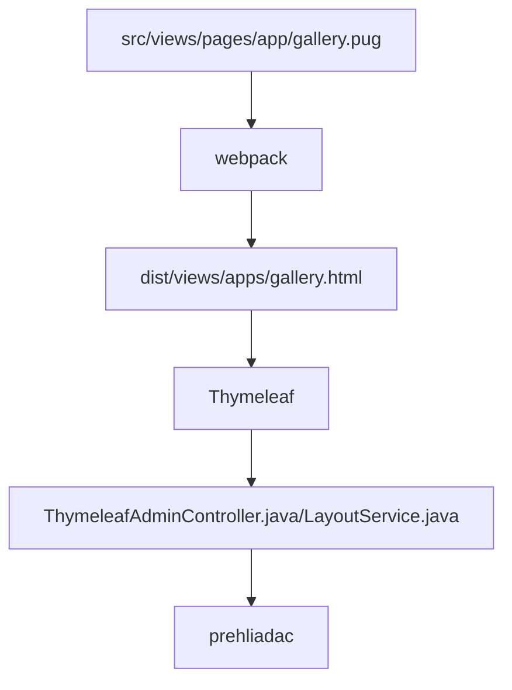

# Základný opis použitých frameworkov

Použité technológie:

- [Spring REST + Spring DATA](spring.md)
- [thymeleaf.org](thymeleaf.md) - šablónovací systém napojený na Java backend
- ```webpack+node``` pre kompilovanie html/PUG/JS súborov
- datatables.net + [editor](https://editor.datatables.net) - základná práca a editácia tabuľkových dát, napojené na Spring cez DatatablesRestControllerV2 - príklad v [GalleryRestController.java](../../../src/main/java/sk/iway/iwcm/components/gallery/GalleryRestController.java) a [gallery.pug](../../../src/main/webapp/admin/v9/views/pages/apps/gallery.pug)
- [pugjs.org](pugjs.md) - ```preprocessor``` pre generovanie HTML kódu stránok
- [Vue.js](vue.md) - dostupné ako ```window.Vue```, krátka ukážka vo [foto galerii](../../../src/main/webapp/admin/v9/views/pages/apps/gallery.pug)

Celý postup generovania web stránky v ```/admin/v9/``` je nasledovný:



je teda potrebné rozmýšľať čo sa v ktorom kroku deje.

## npm

Pre build JS/CSS súborov sa používa ```node```, základné príkazy:

- ```npm install``` - nainštaluje všetky potrebné moduly
- ```npm outdated``` - vypíše zoznam zastaralých modulov
- ```npm update MODUL``` - aktualizuje zadaný modul, pozor aktualizuje len ```minor``` verziu, ak meno modulu nezadáte, aktualizuje všetky moduly
- ```npm i MODUL@VERZIA``` - nainštaluje/aktualizuje modul do zadanej verzie
- ```npm audit``` - vypíše zoznam modulov obsahujúcich zraniteľnosť
- ```npm audit fix``` - aktualizuje moduly obsahujúce zraniteľnosť
- ```npm list --depth=0``` - vypíše zoznam nainštalovaných modulov, parametrom depth je možné určiť hĺbku vnorenia
- ```npm view MODUL version``` - vypíše aktuálnu najnovšiu verziu daného modulu

Ak potrebujete aktualizovať aj závislosti, môžete postupovať s využitím modulu [npm-check-updates](https://flaviocopes.com/update-npm-dependencies/):

```shell
//instalacia modulu
npm install -g npm-check-updates
//vypis verzii na aktualizaciu
ncu
//aktualizacia verzii v zavislostiach
ncu -u
//aktualizacia
npm install
```

## Udalosti

!>**Upozornenie:** v JavaScript kóde nie je možné využívať udalosť ```$(document).ready```, pretože najskôr musí byť inicializované úložisko prekladových kľúčov. Implementovali sme vlastnú funkciu ```window.domReady.add``` v knižnici [ready](../libraries/ready-extender.md), ktorá je vykonaná až po inicializácii úložiska prekladových kľúčov.

```javascript
window.domReady.add(function () {
    //vas kod
});

//nastavenie poradia na 10, cize typicky na koniec
window.domReady.add(function () {
    //vas kod
}, 10);
```

## Webpack

Skladanie a kompilácia ```pug/js/css``` sa vykonáva pomocou [webpack](https://webpack.js.org/).

JS a CSS súbory sa ukladajú po skompilovaní do ```dist``` priečinka. Z neho sú do PUG vkladané s využitím zoznamu z ```htmlWebpackPlugin.files```. Zároveň sa predvolene vkladajú len skripty, ktoré nezačínajú na prefix ```pages_```. Súbor s týmto prefixom sa vloží len v prípade, že sa jeho meno zhoduje s menom pug súboru.

```javascript
// Outpul all script files
-
    let filename = htmlWebpackPlugin.options.filename;
    var slash = filename.lastIndexOf("/");
    var dot = filename.indexOf(".", slash);
    if (slash > 0 && dot > slash) filename = filename.substring(slash+1, dot);

each js in WPF.js
    - if (js.indexOf("pages_")==-1 || js.indexOf("pages_"+filename+".")!=-1)
        script(type='text/javascript', src=js)
```

Ak teda potrebujete pre niektorú stránku v administrácii vložiť špeciálny JavaScript súbor vytvorte ho v priečinku ```src/main/webapp/admin/v9/src/js/pages/```, ak predpokladáte použitie viacerých samostatných JS súborov kombinovaných do jedného celku vytvorte si aj podpriečinok. Príkladom je ```src/main/webapp/admin/v9/src/js/pages/web-pages-list/web-pages-list.js``` ktorý je v podpriečinku ```web-pages-list``` a v skripte ```web-pages-list.js``` sa importuje trieda z ```preview.js```.

Tento skript sa vloží len pri volaní web stránky ```web-pages-list.pug```, čiže pri URL adrese ```/admin/v9/webpages/web-pages-list/```.

Uvedený postup je možné použiť len pre PUG súbory, keďže skript sa vkladá do vygenerovaného HTML počas kompilácie. Pre aplikácie z ```/apps``` priečinka, ktoré používajú priamo ```.html``` súbory je pripravené vkladanie JavaScript [súboru ako modul](../../custom-apps/admin-menu-item/README.md#priloženie-javascript-súboru) počas zobrazenia HTML stránky.