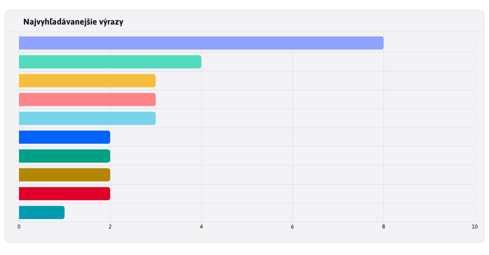
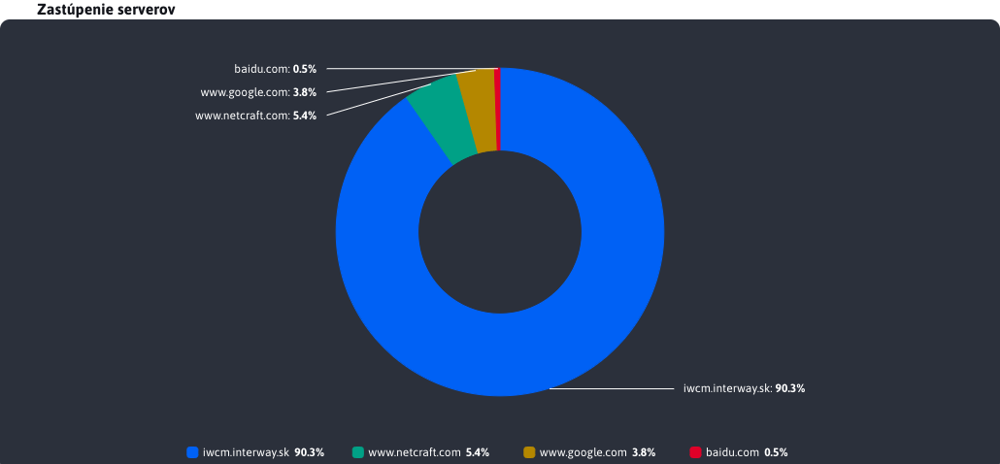
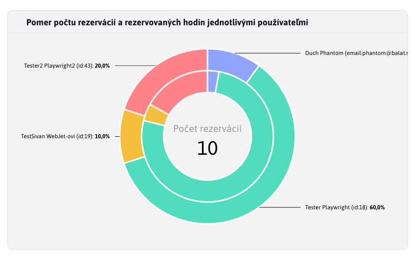
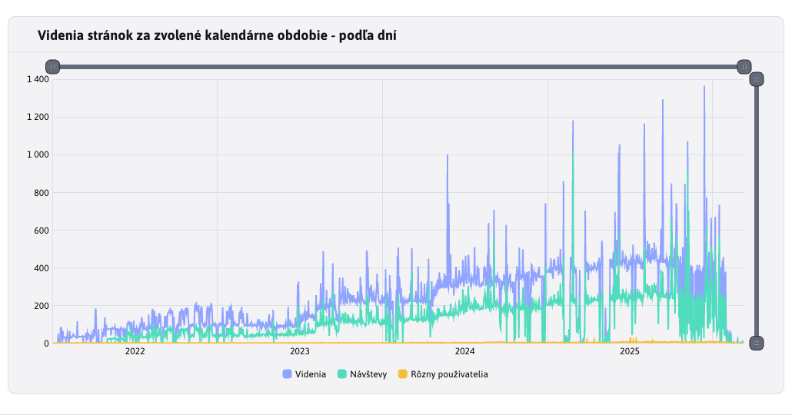
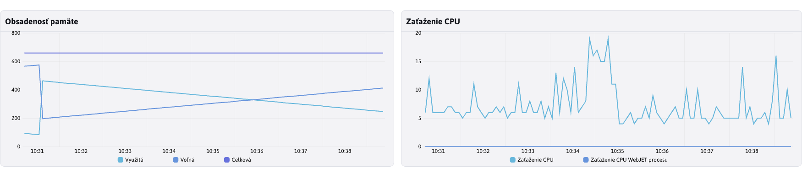

# Spoločné JS funkcie

Táto časť sa zoberá spoločnými funkciami na prácu s grafmi, ktoré ponúka súbor [chart-tools.js](../../../../../../src/main/webapp/admin/v9/src/js/libs/chart/chart-tools.js), ktorý je dostupný ako ```window.ChartTools``` objekt.

## Graf typu BAR

Graf typu **BAR** je vytváraný pomocou inštancie triedy ```BarChartForm```, ktorá je dostupná ako ```ChartTools.BarChartForm```.

```javascript
export class BarChartForm {
    constructor(yAxeName, xAxeName, chartTitle, chartDivId, chartData) {
        this.yAxeName = yAxeName;
        this.xAxeName = xAxeName;
        this.chartTitle = chartTitle;
        this.chartDivId = chartDivId;
        this.chartData = chartData;
        this.chart = undefined;
    }
}
```

Jednotlivé parametre triedy  slúžia na:

- `yAxeName`, textová hodnota reprezentujúca názov premennej v objekte, ktorá uchováva textovú hodnotu osi Y (predstavuje kategóriu).
- `xAxeName`, textová hodnota reprezentujúca názov premennej v objekte, ktorá uchováva číselnú hodnotu osi X (predstavuje hodnotu kategórie).
- `chartTitle`, textová hodnota reprezentujúca nadpis, ktorý sa zobrazí vo forme hlavičky nad grafom.
- `chartDivId`, textová hodnota reprezentujúca ID div elementu, ktorý má zobraziť vytváraný graf.
- `chartData`, pole objektov, ktoré reprezentujú dáta grafu. V každom objekte musí byť spomínaná premenná kategórie (yAxeName) a premenná hodnoty kategórie(xAxeName).
- `chart`, chart predstavuje náš graf, ktorý bude pri vytvorení automaticky uložený do tohto parametra triedy.

**Pozor**, parameter `chart` sa nedá nastaviť skrz konštruktor a slúži na pozadí ako pomocná premenná.

### Príklad použitia

Príklad použitia **BAR** grafu zo súboru [search-engine.html](../../../../../../src/main/webapp/apps/stat/admin/search-engines.html)

```javascript
    $.ajax({url: getUrl(ChartTools.ChartType.Bar), success: function(result) {

        barChartQueries = new ChartTools.BarChartForm("queryName", "queryCount", '[[#{stat.graph.searchQueriesBars}]]', "searchEngines-barQueries", result['content']);

        ChartTools.createAmchart(barChartQueries);
    }});
```

Výsledný vygenerovaný graf aj s nadpisom



## Graf typu PIE

Graf typu **PIE** je vytváraný pomocou inštancie triedy ```PieChartForm```, ktorá je dostupná ako ```ChartTools.PieChartForm```.

```javascript
export class PieChartForm {
    constructor(yAxeName, xAxeName, chartTitle, chartDivId, chartData, labelKey, labelTransformationFn = null) {
        this.yAxeName = yAxeName;
        this.xAxeName = xAxeName;
        this.chartTitle = chartTitle;
        this.chartDivId = chartDivId;
        this.chartData = chartData;
        this.labelKey = labelKey;
        this.labelTransformationFn = labelTransformationFn;
        this.chart = undefined;
        this.chartLegend = undefined;
    }
}
```

Jednotlivé parametre triedy  slúžia na:

- `yAxeName`, textová hodnota reprezentujúca názov premennej v objekte, ktorá uchováva číselnú hodnotu kategórie.
- `xAxeName`, textová hodnota reprezentujúca názov premennej v objekte, ktorá uchováva textovú hodnotu predstavujúcu kategóriu.
- `chartTitle`, textová hodnota reprezentujúca nadpis, ktorý sa zobrazí vo forme hlavičky nad grafom.
- `chartDivId`, textová hodnota reprezentujúca ID div elementu, ktorý má zobraziť vytváraný graf.
- `chartData`, pole objektov, ktoré reprezentujú dáta grafu. V každom objekte musí byť spomínaná premenná kategórie (xAxeName) a premenná hodnoty kategórie(yAxeName).
- `labelKey`, **nepovinná** textová hodnota predstavujúcu prekladový kľuč s nadpisom k sumáru
- `labelTransformationFn`, **nepovinná** funkcia, ktorá sa použije na transformáciu textu v štítokoch kategórií (formát ako taký ostane rovnaký, iba sa zmení text), Funkcia musí mať jeden vstupný parameter, ktorý predstavuje pôvodný text a musí vrátiť text transformovaný.
- `chart`, predstavuje náš graf, ktorý bude pri vytvorení automaticky uložený do tohto parametra triedy.
- `chartLegend`, predstavuje nastavenú legendu grafu. Nenastavuje ju používateľ, nastavená automaticky a je potrebná na pozadí pri aktualizovaní grafu.

**Pozor**, parametre `chart` a `chartLegend` sa nedajú nastaviť skrz konštruktor a slúžia na pozadí ako pomocné premenné.

### Príklad použitia

Príklad použitia **PIE** grafu zo súboru [referer.html](../../../../../../src/main/webapp/apps/stat/admin/referer.html)

```javascript
    $.ajax({url: getGraphUrl(), success: function(result) {

        pieChartVisits = new ChartTools.PieChartForm("visits", "serverName", '[[#{stat.referer.pieChart}]]', "referer-pieReferer", result['content']);

        ChartTools.createAmchart(pieChartVisits);
    }});
```

Výsledný vygenerovaný graf aj s nadpisom



### Parameter ```labelKey```

Parameter ```labelKey``` je špeciálny v tom, že nie je povinný pri vytváraní inštancie triedy ```PieChartForm```. Môžete to vidieť v predchádzajúcej ukážke použitia, nakoľko tam chýba. Ak by ste ho však zadali, tak sa použije ako prekladový kľuč k získaniu textu. Tento text sa automatický nastaví do stredu grafu ako nadpis a pod ním sa zobrazí vypočítaná hodnota reprezentujúca celkový sumár hodnôt v sérii grafu.

Vďaka tomu môžete mať prehľadne v grafe celkovú hodnotu dát sérii. Veľkosť písma sa automatický upraví tak, aby sa text zmestil do vnútra grafu. Po zmene dát grafu sa hodnota automatický prepočíta.

**Pozor**, neodporúčame dlhý text inak bude font textu veľmi malý.

Graf typu **PIE** s takýmto nastavením aktuálne nemáme, ale môžete sa pozrieť na sekciu s graf typu **DOUBLE_PIE**, kde je takýto text viditeľný.

## Graf typu DOUBLE_PIE

Graf typu **DOUBLE_PIE** je vytváraný pomocou inštancie triedy ```DoublePieChartForm```, ktorá je dostupná ako ```ChartTools.DoublePieChartForm```. Ide o variáciu grafu typu **PIE**, ktorý však obsahuje dve vnorené časti.

```javascript
export class DoublePieChartForm {
    constructor(yAxeName_inner, yAxeName_outer, xAxeName, chartTitle, chartDivId, chartData, labelSeries, labelKey) {
        this.yAxeName_inner = yAxeName_inner;
        this.yAxeName_outer = yAxeName_outer;
        this.xAxeName = xAxeName;
        this.chartTitle = chartTitle;
        this.chartDivId = chartDivId;
        this.chartData = chartData;
        this.labelSeries = labelSeries;
        this.labelKey = labelKey;
        this.chart = undefined;
        this.chartLegend = undefined;
    }
}
```

Jednotlivé parametre triedy  slúžia na:

- `yAxeName_inner`, textová hodnota reprezentujúca názov premennej v objekte, ktorá uchováva číselnú hodnotu kategórie. Ide o vnútorný kruh.
- `yAxeName_outer`, textová hodnota reprezentujúca názov premennej v objekte, ktorá uchováva číselnú hodnotu kategórie. Ide o vonkajší kruh.
- `xAxeName`, textová hodnota reprezentujúca názov premennej v objekte, ktorá uchováva textovú hodnotu predstavujúcu kategóriu.
- `chartTitle`, textová hodnota reprezentujúca nadpis, ktorý sa zobrazí vo forme hlavičky nad grafom.
- `chartDivId`, textová hodnota reprezentujúca ID div elementu, ktorý má zobraziť vytváraný graf.
- `chartData`, pole objektov, ktoré reprezentujú dáta grafu. V každom objekte musí byť spomínaná premenná kategórie (xAxeName) a premenná hodnoty kategórie(yAxeName).
- `labelSeries`, **nepovinná** textová hodnota na označenie série k súčtu s povolenými hodnotami `inner` a `outer`
- `labelKey`, **nepovinná** textová hodnota na prekladový kľuč s textom, ktorý bude slúžiť ako nadpis pre súčet hodnôt
- `chart`, predstavuje náš graf, ktorý bude pri vytvorení automaticky uložený do tohto parametra triedy.
- `chartLegend`, predstavuje nastavenú legendu grafu. Nenastavuje ju používateľ, nastavená automaticky a je potrebná na pozadí pri aktualizovaní grafu.

**Pozor**, parametre `chart` a `chartLegend` sa nedajú nastaviť skrz konštruktor a slúžia na pozadí ako pomocné premenné.

### Príklad použitia

Príklad použitia **DOUBLE_PIE** grafu zo súboru [reservation-stat.html](../../../../../../src/main/webapp/apps/reservation/admin/reservation-stat.html)

```javascript
    $.ajax({url: getGraphUrl("pie", "users"), success: function(result) {

        doublePieChartTimeUsers = new ChartTools.DoublePieChartForm("valueB", "valueA", "category", '[[#{reservation.reservation_stat.hours_user_chart.title}]]', "reservationStat-doublePieTimeUsers", result, "outer", "reservation.reservation_stat.hours_user_chart.label.js");

        ChartTools.createAmchart(doublePieChartTimeUsers);
    }});
```

Výsledný vygenerovaný graf, s nadpisom nad grafom, ktorý obsahuje aj voliteľný popisom v strede grafu s číselným sumárom hodnôt



### Parametre ```labelKey``` a ```labelSeries```

Parametre ```labelKey``` a ```labelSeries``` sú špeciálne v tom, že nie sú povinné pri vytváraní inštancie triedy ```DoublePieChartForm```. Ak však zadané sú, slúžia k nastaveniu informácie o sumáre hodnôt v strede grafu.

Parametre `labelKey` sa použije ako prekladový kľuč k získaniu textu. Tento text sa automatický nastaví do stredu grafu ako nadpis pre vypočítanú hodnotu.

Parameter `labelSeries` sa používa na nastavenie toho, ktorú sériu dát chceme mať spočítanú. môže nadobudnúť hodnotu:

- `inner`, spočítajú sa hodnoty vnútorného grafu (`yAxeName_inner`)
- `outer`, spočítajú sa hodnoty vonkajšieho grafu (`yAxeName_outer`)

Vďaka tomu môžete mať prehľadne v grafe celkovú hodnotu dát sérii. Veľkosť písma sa automatický upraví tak, aby sa text zmestil do vnútra grafu. Po zmene dát grafu sa hodnota automatický prepočíta.

**Pozor**, neodporúčame dlhý text inak bude font textu veľmi malý.

## Graf typu LINE

Graf typu **LINE** je vytváraný pomocou inštancie triedy ```LineChartForm```, ktorá je dostupná ako ```ChartTools.LineChartForm```. Oproti grafom ako **BAR** alebo **PIE** je jedinečný v schopnosti zobraziť viacero rôznych hodnôt pre viaceré datasety. Práve táto schopnosť grafu typu **LINE** vyžaduje aj špeciálne vstupné a konfiguračné hodnoty, ktoré sú opísané v nasledujúcich pod-kapitolách.

```javascript
export class LineChartForm {
    constructor(yAxeNames, xAxeName, chartTitle, chartDivId, chartData, dateType, legendTransformationFn = null, hideEmpty = true) {
        this.yAxeNames = yAxeNames;
        this.xAxeName = xAxeName;
        this.chartTitle = chartTitle;
        this.chartDivId = chartDivId;
        this.chartData = chartData;
        this.dateType = dateType;
        this.legendTransformationFn = legendTransformationFn;
        this.hideEmpty = hideEmpty;
        this.chart = undefined;
    }
}
```

Jednotlivé parametre triedy  slúžia na:

- `yAxeName`, (podrobnejšie rozobrané v samostatnej pod-kapitole)
- `xAxeName`, textová hodnota reprezentujúca názov premennej v objekte, ktorá uchováva číselnú hodnotu osi Y (zaznamenaná hodnota).
- `chartTitle`, textová hodnota reprezentujúca nadpis, ktorý sa zobrazí vo forme hlavičky nad grafom.
- `chartDivId`, textová hodnota reprezentujúca ID div elementu, ktorý má zobraziť vytváraný graf.
- `chartData`, (podrobnejšie rozobrané v samostatnej pod-kapitole)
- `dateType`, (podrobnejšie rozobrané v samostatnej pod-kapitole)
- `legendTransformationFn`, **nepovinná** funkcia, ktorá sa použije na transformáciu textu v legende grafu. Funkcia musí mať jeden vstupný parameter, ktorý predstavuje pôvodný text a musí vrátiť text transformovaný.
- `hideEmpty`, **nepovinná** logická hodnota, ktorá určuje či sa majú v grafe zobraziť tooltipy aj pre prázdne hodnoty (null alebo 0). Predvolená hodnota je `true`, čo znamená že prázdne hodnoty sa nezobrazia. Aplikuje sa to iba ak graf zobrazuje viac ako 8 čiar.
- `chart`, chart predstavuje náš graf, ktorý bude pri vytvorení automaticky uložený do tohto parametra triedy.

**Pozor**, parameter `chart` sa nedá nastaviť skrz konštruktor a slúži na pozadí ako pomocná premenná.

### Príklad použitia

Príklad použitia **LINE** grafu

```javascript
    let yAxeNames =
        ChartTools.getLineChartYAxeNameObjs(
            ["visits", "sessions", "uniqueUsers"],
            ["stat.visits.js", "stat.sessions.js", "stat.unique_users.js"]
        );

    await $.ajax({url: getGraphUrl(), success: function(result) {

        lineChartVisits = new ChartTools.LineChartForm(yAxeNames, "dayDate", '[[#{stat.top.lineChart}]]', "stat-lineVisits", convertData(result['content']), ChartTools.DateType.Days);

        ChartTools.createAmchart(lineChartVisits);
    }});
```

Výsledný vygenerovaný graf aj s nadpisom



### Parameter yAxeName

Ako sme mohli z príkladu použitia vidieť, parameter **yAxeName** má výrazne odlišný tvar ako pri grafoch PIE a BAR, kde ide iba o textovú hodnotu. Rozdiel je v schopnosti LINE grafu zobraziť viaceré číselné parametre z datasetu ako samostatné čiary. Pre vygenerovanie správneho tvaru **yAxeName** využívame pripravenú funkciu ```getLineChartYAxeNameObjs()``` zo súboru [chart-tools.js](../../../../../../src/main/webapp/admin/v9/src/js/libs/chart/chart-tools.js). To, ako táto funkcia funguje, nie je podstatné. Nás zaujíma iba fakt, že vstupné parametre tvoria 2 polia s textovými hodnotami.

Prvé pole obsahuje názov parametrov objektov z dát pre graf, reprezentujúce nejaké číselné hodnoty, ktoré chceme zobraziť ako samostatné čiary na grafe. Druhé pole obsahuje prekladové kľúče, ktoré sa v rovnakom poradí mapujú k názvom parametrov a reprezentujú danú čiaru grafu v legende grafu.

Príklad použitia sme videli v predchádzajúcej kapitole. Vidíme, že chceme zobraziť 3 číselné parametre a to ```visits```, ```sessions``` a ```uniqueUsers```. V priloženom obrázku vidíme 3 vygenerované čiary reprezentujúce tieto parametre a v legende grafu vidíme napríkad namiesto názvu parametra ```visits``` textovú hodnotu **Videnia**, ktorá bola získana z prekladového kľúča ```stat.visits.js``` (kľuč bol namapovaný k parametru lebo sa nachádzali na rovnakých pozíciách v poliach).

```javascript
    let yAxeNames =
        ChartTools.getLineChartYAxeNameObjs(
            ["visits", "sessions", "uniqueUsers"],
            ["stat.visits.js", "stat.sessions.js", "stat.unique_users.js"]
        );
```

Samozrejme, prekladové kľúče (niektoré alebo všetky) nie sú povinné a môžu byť nahradené hodnotou ```undefined```. !! Musí byť však dodržaný rovnaký počet parametrov v ocboch poliach, aj keď ide iba o ```undefined``` hodnoty.

Príklad použitia ```getLineChartYAxeNameObjs``` s prázdnou hodnotou prekladového kľúča.

```javascript
    let yAxeNames = ChartTools.getLineChartYAxeNameObjs(["visits"], [undefined]);
```

### Parameter chartData

Pre LINE graf majú dáta špecifický formát ako mapa obsahujúca listy objektov, kde každý prvok v mape (list objektov) predstavuje rozdielny dataset. Z týchto objektov v liste môžeme zobraziť 1 alebo viac číselných hodnôt ako samostatné čiary v grafe. Pri zobrazovaní týchto dát pomocou LINE grafu môžu nastať 3 rozdielne situácie.

```java
Map<List<T>>
```

**1 dataset a 1 parameter**

1 dataset znamená, že mapa obsahuje iba jeden prvok reprezentovaný listom objektov. Parameter **yAxeName** obsahuje iba 1 prvok, čo znamená, že výsledný LINE graf bude zobrazovať iba 1 čiaru, ktorej identifikačný názov v legende grafu bude reprezentovaný prekladovým kľúčom z parametra **yAxeName**.

**1 dataset N parametrov**

1 dataset znamená, že mapa obsahuje iba jeden prvok reprezentovaný listom objektov. Parameter **yAxeName** obsahuje N prvkov, čo znamená, že výsledný LINE graf bude zobrazovať N čiar, ktorých identifikačný názov v legende grafu bude reprezentovaný prekladovými kľúčmi z parametra **yAxeName**. Takže ide o viacero číselných parametrov z rovnakej série dát.

Takýto typ grafu sme videli v ukážke grafu, vyššie v tejto kapitole.

**M datasetov 1 parametrov**

M datasetov znamená, že mapa obsahuje M prvok reprezentovaných ako listy objektov. Parameter **yAxeName** obsahuje iba 1 prvok, čo znamená, že výsledný LINE graf bude zobrazovať M čiar, ktorých identifikačný názov v legende grafu bude reprezentovaný kľúčom z mapy. Tento kľúč označoval jednotlivé datasety. Vo výsledku graf bude zobrazovať rovnaký číselný parameter (napr. `visits`) ale pre niekoľko rozdielnych sérii dát.

**M datasetov N parametrov**

Tento prípad je kombinácia predošlých. Vo výsledku bude graf obsahovať M * N čiar, ktorých identifikačný názov v legende grafu bude reprezentovaný ako kombinácia kľúča mapy (identifikátor datasetu) cez pomlčku ("-") spojený s hodnotou prekladového kľúča z parametra **yAxeName**. Vo výsledku tak graf bude zobrazovať niekoľko číselných hodnôt pre niekoľko rozdielnych listov dát (datasetov).

### Parameter dateType

Posledný špeciálny parameter LINE grafu je **dateType**. Nakoľko X osa grafu je dátumová, vzniká tu potreba správnej granulity tejto osi. To znamená, že ak X osa grafu zobrazuje interval 1 rok a dátumové hodnoty sú od seba vzdialené 1 týždeň, chceme aby granulita bola nastavená na týždne s krokom 1. V inom prípade, ak X osa grafu zobrazuje interval niekoľko dni a dátumové hodnoty sú od seba vzdialené 5 minút, schéme X osi grafu nastaviť granulitu na minúty s krokom 5.

K nastaveniu granulity využívame poskytnutú enumeráciu ```DateType``` zo súboru [chart-tools.js](../../../../../../src/main/webapp/admin/v9/src/js/libs/chart/chart-tools.js).

Hodnota **DateType.Auto** sa nastavuje, ak chceme nastavenie granulity nechať na prednastavenú logiku (ktorá je v súbore chart-tools.js). Tá okrem správneho výberu hodnoty granulity nastaví aj najlepší krok tak, aby to vyhovovalo dátam grafu.

Hodnota **DateType.Day_1** je špeciálna hodnota, ktorá sa používa v prípade potreby nastavenia rozsahu presne na 1 deň. V takom prípade sa odignoruje parameter označený ako **xAxeName** (predstavujúci dátumovú hodnotu) a využije sa parameter ```hour```, ktorý musí byť obsiahnutý v dátach pre graf a to v číselnom formáte v rozsahu 0 - 23 (predstavujúci celé hodiny dňa).

Ešte môže nastať situácia ako v prípade stránky **Návštevnosť** zo sekcie štatistika, kde dáta pre LINE graf sú špecifický granulované na BackEnd-e podľa zadaného zoskupenia. To znamená že automatická granulácia nastavená pomocou **DateType.Auto** fungovať nebude, nakoľko aj pri nastavenom intervale na 3 roky budú dáta stále granulované po dňoch. Pre tento prípad enumerácia ```DateType``` ponúka aj možnosť ručného nastavenia granulácie a to na hodnoty:

- `DateType.Seconds`
- `DateType.Minutes`
- `DateType.Hours`
- `DateType.Days`
- `DateType.Weeks`
- `DateType.Months`

V prípade ručného nastavenia granulácie, logik okolo grafu vypočíta iba krok ale nastavenú granuláciu ponechá, aj keby bola nastavená nesprávne. Treba si dať pozor pri ručnom nastavovaní granulácie, nakoľko nastavenie väčšej hodnoty ako je potrebné začne skresľovať graf a nastavenie menšej hodnoty ako je potrebné poškodí fungovanie ```Tooltip``` logiky.

## Špeciálne (LIVE) grafy

Spomenieme aj špeciálne grafy, ktoré sú využité v sekcií `Monitorovanie servera - Aktuálne hodnoty`. Jedná sa o špeciálne grafy typu LINE, ktoré sa dokážu automaticky aktualizovať. Tieto grafy a logika ich obsluhujúca je nastavená napevno pre túto stránku a nedá sa znovu použiť na iných stránkach. Implementované použitie je v súbore [vue-amchart-monitoring-server.vue](../../../../../../src/main/webapp/admin/v9/src/vue/components/webjet-server-monitoring/components/vue-amchart-monitoring-server.vue).

Na vytvorenie grafov je opäť využitá logika poskytnutá súborom [chart-tools.js](../../../../../../src/main/webapp/admin/v9/src/js/libs/chart/chart-tools.js) a jedná sa o funkciu `createServerMonitoringChart()`. Jej vstupné parametre sú iba id div elementu v ktorom bude graf zobrazený a textová hodnota typu grafu. Podporovaný je typ `memoryAmchart` a `cpuAmchart`.

### Príklad použitia

Príklad vytvorenia monitoring grafov

```javascript
    if(this.type == "memoryAmchart") {
        ChartTools.createServerMonitoringChart("serverMonitoring-lineChartMemory", this.type).then((chart) => {
            this.chart = chart;
        });
    } else if(this.type == "cpuAmchart") {
        ChartTools.createServerMonitoringChart("serverMonitoring-lineChartCpu", this.type).then((chart) => {
            this.chart = chart;
        });
    }
```

Aktualizovanie hodnôt týchto grafov sa vykonáva pomocou funkcie `addData()` zo súboru `chart-tools.js`, ktorej vstupné parametre sú:

- `allSeries`, všetky série grafu (čiary), dajú sa získať z inštancie grafu
- `xAxis`, X osa grafu, dá sa získať z inštancie grafu
- `data`, nové dáta, ktoré sa pridajú už k existujúcim dátam
- `type`, textový typ dát, ktorý bol spomenutý pri vytváraní grafu

Príklad aktualizácie monitoring grafu

```javascript
    ChartTools.addData(this.chart.series.values, this.chart.xAxes.values[0],  this.chartData, this.type);
```

V tomto prípade je podstatné práve to ako sme z inštancie grafu získali `allSeries` a `xAxis`.

Ukážka oboch LIVE grafov za aplikácie `Monitorovanie servera - Aktuálne hodnoty` aj s vygenerovanými nadpismi

