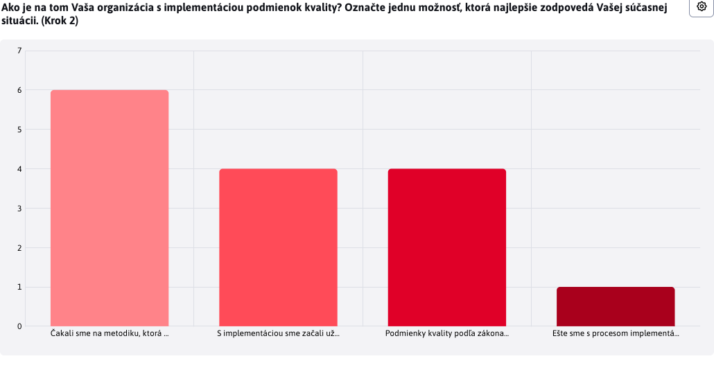
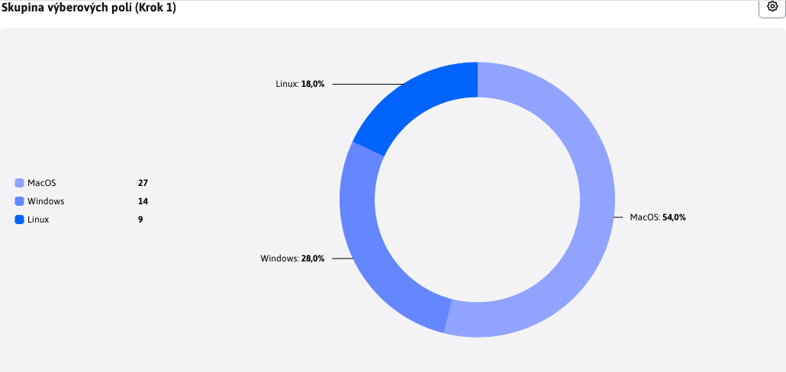
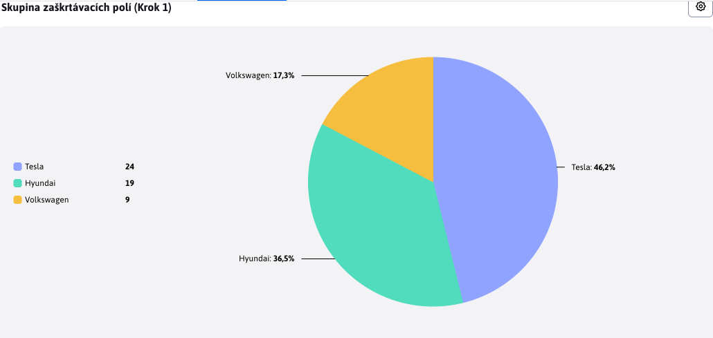
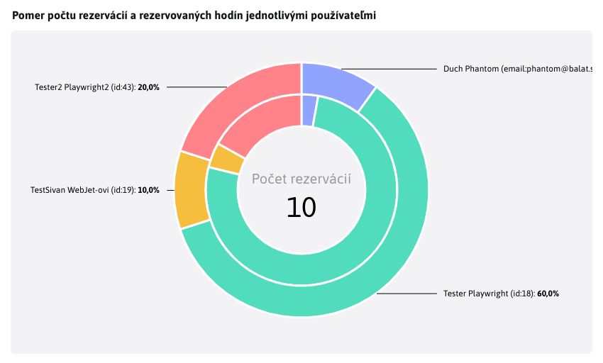
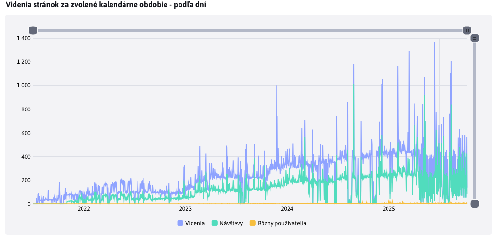
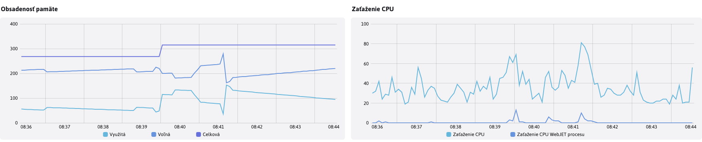
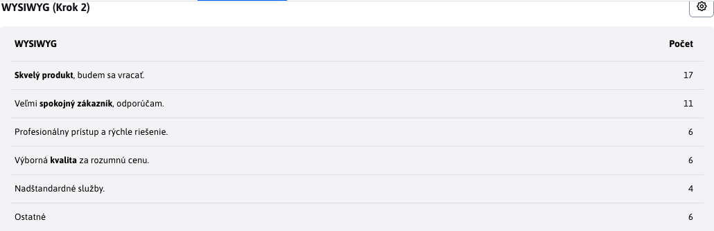

# Spoločné JS funkcie

Táto časť popisuje spoločné funkcie na prácu s grafmi, ktoré poskytuje súbor [chart-tools.js](../../../../../../src/main/webapp/admin/v9/src/js/libs/chart/chart-tools.js). Funkcie sú dostupné cez objekt `window.ChartTools`.

!>**Upozornenie:** Historicky sa používal zápis bez konfiguračného objektu, kde sa parametre zadávali priamo do konštruktora triedy. Tento spôsob je stále podporovaný, ale neodporúčame ho používať.

## Prehľad tried a typov grafov

| Trieda | Dostupná ako | Typ grafu |
|--------|--------------|-----------|
| `LineChartForm` | `ChartTools.LineChartForm` | Čiarový graf s dátumovou osou |
| `BarChartForm` | `ChartTools.BarChartForm` | Stĺpcový graf (horizontálny / vertikálny) |
| `PieChartForm` | `ChartTools.PieChartForm` | Koláčový graf (klasický alebo donut) |
| `DoublePieChartForm` | `ChartTools.DoublePieChartForm` | Dvojvrstvový koláčový graf |
| `WordCloudChartForm` | `ChartTools.WordCloudChartForm` | Oblak slov |
| `TableChartForm` | `ChartTools.TableChartForm` | Jednoduchá tabuľka v dizajne grafov |

## Enumerácia `ChartType`

Konštantný objekt `ChartType` sa používa na identifikáciu typu dát pri AJAX volaniach na backend. Je dostupný ako `ChartTools.ChartType`.

| Hodnota | Reťazec | Popis |
|---------|---------|-------|
| `ChartType.Line` | `"line"` | Čiarový graf |
| `ChartType.Bar_Vertical` | `"bar_vertical"` | Vertikálny stĺpcový graf |
| `ChartType.Bar_Horizontal` | `"bar_horizontal"` | Horizontálny stĺpcový graf |
| `ChartType.Pie_Classic` | `"pie_classic"` | Klasický koláčový graf |
| `ChartType.Pie_Donut` | `"pie_donut"` | Donut koláčový graf |
| `ChartType.Double_Pie` | `"double_pie"` | Dvojvrstvový koláčový graf |
| `ChartType.Word_Cloud` | `"word_cloud"` | Oblak slov |
| `ChartType.Table` | `"table"` | Tabuľkový komponent |
| `ChartType.Not_Chart` | `"not_chart"` | Špeciálny prípad bez grafu |

```javascript
// Príklad použitia pri zostavení URL pre AJAX volanie
$.ajax({ url: getUrl(ChartTools.ChartType.Bar_Horizontal), success: function(result) { ... }});
```

## Graf typu `BAR`

Graf typu **`BAR`** sa vytvára pomocou inštancie triedy `BarChartForm`, ktorá je dostupná ako `ChartTools.BarChartForm`.

```javascript
export class BarChartForm {

    constructor(yAxeName_or_config, xAxeName, chartTitle, chartDivId, chartData, horizontal = true) {
        if(typeof yAxeName_or_config === "object") {
            this.initFromConfig(yAxeName_or_config);
        } else {
            console.warn("Deprecated constructor signature. Use config object instead.");
            this.initFromConfig({
                yAxeName: yAxeName_or_config,
                xAxeName: xAxeName,
                chartTitle: chartTitle,
                chartDivId: chartDivId,
                chartData: chartData,
                horizontal: horizontal
            });
        }
    }

    initFromConfig(config) {
        if (!config.yAxeName) throwConstructorError("BarChartForm", "yAxeName");
        if (!config.xAxeName) throwConstructorError("BarChartForm", "xAxeName");
        if (!config.chartDivId) throwConstructorError("BarChartForm", "chartDivId");
        if (config.chartData == null || config.chartData === undefined) throwConstructorError("BarChartForm", "chartData");

        Object.assign(this, {
            yAxeName: config.yAxeName,
            xAxeName: config.xAxeName,
            chartTitle: config.chartTitle,
            chartDivId: config.chartDivId,
            chartData: config.chartData,
            horizontal: config.horizontal == null ? true : config.horizontal,
            colorScheme: config.colorScheme
        });
    }
}
```

Jednotlivé parametre triedy slúžia na:

- `yAxeName` je textová hodnota reprezentujúca názov premennej v objekte, ktorá uchováva textovú hodnotu osi Y (kategóriu).
- `xAxeName` je textová hodnota reprezentujúca názov premennej v objekte, ktorá uchováva číselnú hodnotu osi X (hodnotu kategórie).
- `chartTitle` je textová hodnota reprezentujúca nadpis, ktorý sa zobrazí vo forme hlavičky nad grafom.
- `chartDivId` je textová hodnota reprezentujúca ID elementu `div`, v ktorom sa graf vykreslí.
- `chartData` je pole objektov reprezentujúcich dáta grafu. Každý objekt musí obsahovať premennú kategórie (`yAxeName`) aj premennú hodnoty kategórie (`xAxeName`).
- `horizontal` je logická hodnota, ktorá určuje, či bude graf horizontálny alebo vertikálny.
- `colorScheme` je textová hodnota určujúca farebnú schému grafu (povolené hodnoty sú popísané v sekcii [Farebné schémy](#farebné-schémy)).

!>**Upozornenie:** Povinné parametre sú `yAxeName`, `xAxeName`, `chartDivId` a `chartData`.

### Príklad použitia

Príklad použitia **`BAR`** grafu zo súboru [search-engine.html](../../../../../../src/main/webapp/apps/stat/admin/search-engines.html)

```javascript
    $.ajax({url: getUrl(ChartTools.ChartType.Bar), success: function(result) {

        const barConfig = {
            yAxeName: "queryName",
            xAxeName: "queryCount",
            chartTitle: '[[#{stat.graph.searchQueriesBars}]]',
            chartDivId: "searchEngines-barQueries",
            chartData: result['content']
        }

        barChartQueries = new ChartTools.BarChartForm(barConfig);

        ChartTools.createAmchart(barChartQueries);
    }});
```

Výsledný vygenerovaný graf typu `BAR_HORIZONTAL` aj s nadpisom:


Ak je parameter `horizontal` nastavený na `false`, výsledkom je graf typu `BAR_VERTICAL`. V ukážke nižšie je zároveň upravená farebná schéma cez parameter `colorScheme`.



## Graf typu `PIE`

Graf typu **`PIE`** sa vytvára pomocou inštancie triedy `PieChartForm`, ktorá je dostupná ako `ChartTools.PieChartForm`.

```javascript
export class PieChartForm {

    constructor(yAxeName_or_config, xAxeName, chartTitle, chartDivId, chartData, labelKey, labelTransformationFn = null, innerRadius = 50, leftLegendPosition = false) {
        if(typeof yAxeName_or_config === "object") {
            this.initFromConfig(yAxeName_or_config);
        } else {
            console.warn("Deprecated constructor signature. Use config object instead.");
            this.initFromConfig({
                yAxeName: yAxeName_or_config,
                xAxeName: xAxeName,
                chartTitle: chartTitle,
                chartDivId: chartDivId,
                chartData: chartData,
                labelKey: labelKey,
                labelTransformationFn: labelTransformationFn,
                innerRadius: innerRadius,
                leftLegendPosition: leftLegendPosition
            });
        }
    }

    initFromConfig(config) {
        if (!config.yAxeName) throwConstructorError("PieChartForm", "yAxeName");
        if (!config.xAxeName) throwConstructorError("PieChartForm", "xAxeName");
        if (!config.chartDivId) throwConstructorError("PieChartForm", "chartDivId");
        if (config.chartData == null || config.chartData === undefined) throwConstructorError("PieChartForm", "chartData");

        Object.assign(this, {
            yAxeName: config.yAxeName,
            xAxeName: config.xAxeName,
            chartTitle: config.chartTitle,
            chartDivId: config.chartDivId,
            chartData: config.chartData,
            labelKey: config.labelKey,
            labelTransformationFn: config.labelTransformationFn,
            innerRadius: config.innerRadius == null ? 50 : config.innerRadius,
            leftLegendPosition: config.leftLegendPosition == null ? false : config.leftLegendPosition,
            legendValueText: config.legendValueText,

            colorScheme: config.colorScheme
        });
    }
}
```

Jednotlivé parametre triedy slúžia na:

- `yAxeName` je textová hodnota reprezentujúca názov premennej v objekte, ktorá uchováva číselnú hodnotu kategórie.
- `xAxeName` je textová hodnota reprezentujúca názov premennej v objekte, ktorá uchováva textovú hodnotu kategórie.
- `chartTitle` je textová hodnota reprezentujúca nadpis, ktorý sa zobrazí vo forme hlavičky nad grafom.
- `chartDivId` je textová hodnota reprezentujúca ID elementu `div`, v ktorom sa graf vykreslí.
- `chartData` je pole objektov reprezentujúcich dáta grafu. Každý objekt musí obsahovať premennú kategórie (`xAxeName`) aj premennú hodnoty kategórie (`yAxeName`).
- `labelKey` je textová hodnota predstavujúca prekladový kľúč pre nadpis sumára.
- `labelTransformationFn` je funkcia na transformáciu textu v štítkoch kategórií. Formát ostáva rovnaký, mení sa iba text. Funkcia musí mať jeden vstupný parameter (pôvodný text) a musí vrátiť transformovaný text.
- `innerRadius` je číselná hodnota vnútorného polomeru grafu v rozsahu 0 - 100. Hodnota 0 znamená klasický koláčový graf, hodnota väčšia ako 0 znamená donut.
- `leftLegendPosition` je logická hodnota určujúca, či sa legenda zobrazí na ľavej strane grafu.
- `legendValueText` je textová hodnota definujúca textový formát legendy.
- `colorScheme` je textová hodnota určujúca farebnú schému grafu (povolené hodnoty sú popísané v sekcii [Farebné schémy](#farebné-schémy)).

!>**Upozornenie:** Povinné parametre sú `yAxeName`, `xAxeName`, `chartDivId` a `chartData`.

### Príklad použitia

Príklad použitia **`PIE`** grafu zo súboru [referer.html](../../../../../../src/main/webapp/apps/stat/admin/referer.html)

```javascript
    $.ajax({url: getGraphUrl(), success: function(result) {

        const pieConfig = {
            yAxeName: "visits",
            xAxeName: "serverName",
            chartTitle: '[[#{stat.referer.pieChart}]]',
            chartDivId: "referer-pieReferer",
            chartData: result['content']
        }

        pieChartVisits = new ChartTools.PieChartForm(pieConfig);
        ChartTools.createAmchart(pieChartVisits);
    }});
```

Výsledný vygenerovaný graf typu `PIE_DONUT` aj s nadpisom:



Ak je parameter `innerRadius` nastavený na 0, výsledkom je klasický koláčový graf typu `PIE_CLASSIC`. Parametrom `leftLegendPosition` nastaveným na `true` sa legenda presunie do ľavej časti grafu.



### Parameter `labelKey`

Parameter `labelKey` je špeciálny tým, že pri vytváraní inštancie `PieChartForm` nie je povinný. V predchádzajúcej ukážke preto nie je uvedený. Ak ho však zadáte, použije sa ako prekladový kľúč na získanie textu. Tento text sa automaticky zobrazí v strede grafu ako nadpis a pod ním sa zobrazí vypočítaná hodnota reprezentujúca celkový súčet série.

Vďaka tomu máte v grafe okamžitý prehľad o celkovej hodnote dát. Veľkosť písma sa automaticky upraví tak, aby sa text zmestil do vnútra grafu. Po zmene dát sa hodnota automaticky prepočíta.

!>**Upozornenie:** Neodporúčame používať príliš dlhý text, inak bude písmo v strede grafu veľmi malé.

Podobné správanie nájdete aj pri grafe typu **`DOUBLE_PIE`**.

## Graf typu `DOUBLE_PIE`

Graf typu **`DOUBLE_PIE`** sa vytvára pomocou inštancie triedy `DoublePieChartForm`, ktorá je dostupná ako `ChartTools.DoublePieChartForm`. Ide o variant grafu typu **`PIE`** s dvoma vnorenými časťami.

```javascript
export class DoublePieChartForm {

    constructor(yAxeName_inner_or_config, yAxeName_outer, xAxeName, chartTitle, chartDivId, chartData, labelSeries = null, labelKey = null) {
        if(typeof yAxeName_inner_or_config === "object") {
            this.initFromConfig(yAxeName_inner_or_config);
        } else {
            console.warn("Deprecated constructor signature. Use config object instead.");
            this.initFromConfig({
                yAxeName_inner: yAxeName_inner_or_config,
                yAxeName_outer: yAxeName_outer,
                xAxeName: xAxeName,
                chartTitle: chartTitle,
                chartDivId: chartDivId,
                chartData: chartData,
                labelSeries: labelSeries,
                labelKey: labelKey
            });
        }
    }

    initFromConfig(config) {
        if (!config.yAxeName_inner) throwConstructorError("DoublePieChartForm", "yAxeName_inner");
        if (!config.yAxeName_outer) throwConstructorError("DoublePieChartForm", "yAxeName_outer");
        if (!config.xAxeName) throwConstructorError("DoublePieChartForm", "xAxeName");
        if (!config.chartDivId) throwConstructorError("DoublePieChartForm", "chartDivId");
        if (config.chartData == null || config.chartData === undefined) throwConstructorError("DoublePieChartForm", "chartData");

        Object.assign(this, {
            yAxeName_inner: config.yAxeName_inner,
            yAxeName_outer: config.yAxeName_outer,
            xAxeName: config.xAxeName,
            chartTitle: config.chartTitle,
            chartDivId: config.chartDivId,
            chartData: config.chartData,
            labelSeries: config.labelSeries,
            labelKey: config.labelKey,
            colorScheme: config.colorScheme
        });
    }
}
```

Jednotlivé parametre triedy slúžia na:

- `yAxeName_inner` je textová hodnota reprezentujúca názov premennej v objekte, ktorá uchováva číselnú hodnotu vnútornej časti grafu.
- `yAxeName_outer` je textová hodnota reprezentujúca názov premennej v objekte, ktorá uchováva číselnú hodnotu vonkajšej časti grafu.
- `xAxeName` je textová hodnota reprezentujúca názov premennej v objekte, ktorá uchováva textovú hodnotu kategórie.
- `chartTitle` je textová hodnota reprezentujúca nadpis, ktorý sa zobrazí vo forme hlavičky nad grafom.
- `chartDivId` je textová hodnota reprezentujúca ID elementu `div`, v ktorom sa graf vykreslí.
- `chartData` je pole objektov reprezentujúcich dáta grafu. Každý objekt musí obsahovať premennú kategórie (`xAxeName`) aj premenné hodnôt (`yAxeName_inner`, `yAxeName_outer`).
- `labelSeries` je textová hodnota určujúca sériu pre súčet; povolené hodnoty sú `inner` a `outer`.
- `labelKey` je textová hodnota predstavujúca prekladový kľúč pre nadpis súčtu.
- `colorScheme` je textová hodnota určujúca farebnú schému grafu (povolené hodnoty sú popísané v sekcii [Farebné schémy](#farebné-schémy)).

!>**Upozornenie:** Povinné parametre sú `yAxeName_inner`, `yAxeName_outer`, `xAxeName`, `chartDivId` a `chartData`.

### Príklad použitia

Príklad použitia **`DOUBLE_PIE`** grafu zo súboru [reservation-stat.html](../../../../../../src/main/webapp/apps/reservation/admin/reservation-stat.html)

```javascript
    $.ajax({url: getGraphUrl("pie", "users"), success: function(result) {

        const doublePIeConfig = {
            yAxeName_inner: "valueB",
            yAxeName_outer: "valueA",
            xAxeName: "category",
            chartTitle: '[[#{reservation.reservation_stat.hours_user_chart.title}]]',
            chartDivId: "reservationStat-doublePieTimeUsers",
            chartData: result,
            labelSeries: "outer",
            labelKey: "reservation.reservation_stat.hours_user_chart.label.js"
        };

        doublePieChartTimeUsers = new ChartTools.DoublePieChartForm(doublePIeConfig);

        ChartTools.createAmchart(doublePieChartTimeUsers);
    }});
```

Výsledný vygenerovaný graf s nadpisom obsahuje aj voliteľný popis v strede grafu s číselným súčtom hodnôt:



### Parametre `labelKey` a `labelSeries`

Parametre `labelKey` a `labelSeries` sú špeciálne tým, že pri vytváraní inštancie `DoublePieChartForm` nie sú povinné. Ak ich zadáte, slúžia na zobrazenie sumára hodnôt v strede grafu.

Parameter `labelKey` sa použije ako prekladový kľúč na získanie textu. Tento text sa automaticky nastaví do stredu grafu ako nadpis vypočítanej hodnoty.

Parameter `labelSeries` určuje, ktorá séria sa má spočítať. Môže nadobudnúť hodnotu:

- `inner` pre súčet hodnôt vnútorného grafu (`yAxeName_inner`)
- `outer` pre súčet hodnôt vonkajšieho grafu (`yAxeName_outer`)

Takto získate prehľadnú informáciu o celkovej hodnote vybranej série. Veľkosť písma sa automaticky upraví tak, aby sa text zmestil do vnútra grafu. Po zmene dát sa hodnota automaticky prepočíta.

!>**Upozornenie:** Neodporúčame používať príliš dlhý text, inak bude písmo v strede grafu veľmi malé.

## Graf typu `WORD_CLOUD`

Graf typu **`WORD_CLOUD`** sa vytvára pomocou inštancie triedy `WordCloudChartForm`, ktorá je dostupná ako `ChartTools.WordCloudChartForm`.

```javascript
export class WordCloudChartForm {
    constructor(config) {
        this.initFromConfig(config);
    }

    initFromConfig(config) {
        if (!config.chartDivId) throwConstructorError("WordCloudChartForm", "chartDivId");
        if (config.chartData == null || config.chartData === undefined) throwConstructorError("WordCloudChartForm", "chartData");

        Object.assign(this, {
            chartDivId: config.chartDivId,
            chartData: config.chartData,
            chartTitle: config.chartTitle,
            xAxeName: config.xAxeName,
            yAxeName: config.yAxeName,
            mode: config.mode == null ? "word" : config.mode,
        });
    }
}
```

Jednotlivé parametre triedy slúžia na:

- `chartDivId` je textová hodnota reprezentujúca ID elementu `div`, v ktorom sa graf vykreslí.
- `chartData` je pole objektov reprezentujúcich dáta grafu. V každom objekte musí byť premenná kategórie (`xAxeName`) aj premenná hodnoty kategórie (`yAxeName`).
- `chartTitle` je textová hodnota reprezentujúca nadpis, ktorý sa zobrazí vo forme hlavičky nad grafom.
- `yAxeName` je textová hodnota reprezentujúca názov premennej s číselnou hodnotou kategórie.
- `xAxeName` je textová hodnota reprezentujúca názov premennej s textovou hodnotou kategórie.
- `mode` určuje, v akom režime bude graf fungovať. Povolené hodnoty sú:
  - `"word"` (predvolená hodnota) - vstupný `chartData` je reťazec (dlhý text), z ktorého sa automaticky extrahujú slová a ich frekvencie. Parametre `xAxeName` a `yAxeName` sa v tomto režime nevyžadujú.
  - `"line"` - vstupný `chartData` je pole objektov, kde každý objekt obsahuje textovú (`xAxeName`) a číselnú (`yAxeName`) hodnotu. V tomto režime sú `xAxeName` a `yAxeName` povinné.

!>**Upozornenie:** Povinné parametre sú `chartDivId`, `chartData` a za určitých podmienok aj `yAxeName` / `xAxeName`.

### Príklad použitia

Príklad použitia **`WORD_CLOUD`** grafu zo súboru [search-engine.html](../../../../../../src/main/webapp/apps/stat/admin/search-engines.html)

```javascript
    $.ajax({url: getUrl(ChartTools.ChartType.Bar), success: function(result) {

        const wordCloudConfig = {
             chartTitle: '[[#{stat.graph.searchQueriesBars}]]',
             chartDivId: "searchEngines-wordCloudQueries",
             chartData: result['content'],
             yAxeName: "queryCount",
             xAxeName: "queryName",
             mode: "line"
         }

         wordCloudChartQueries = new ChartTools.WordCloudChartForm(wordCloudConfig);
         ChartTools.createAmchart(wordCloudChartQueries);
    }});
```

Výsledný vygenerovaný graf s nadpisom:


## Graf typu `LINE`

Graf typu **`LINE`** sa vytvára pomocou inštancie triedy `LineChartForm`, ktorá je dostupná ako `ChartTools.LineChartForm`. V porovnaní s grafmi **`BAR`** alebo **`PIE`** je špecifický tým, že dokáže zobrazovať viacero hodnôt pre viacero datasetov. Preto vyžaduje aj špecifické vstupné a konfiguračné parametre, ktoré sú popísané v nasledujúcich podkapitolách.

```javascript
export class LineChartForm {

    constructor(yAxeName_or_config, xAxeName, chartTitle, chartDivId, chartData, dateType, legendTransformationFn = null, hideEmpty = true) {

        //console.log(typeof yAxeName_or_config === "object", yAxeName_or_config.yAxeName));

        if(typeof yAxeName_or_config === "object" && Array.isArray(yAxeName_or_config) === false) {
            this.initFromConfig(yAxeName_or_config);
        } else {
            console.warn("Deprecated constructor signature. Use config object instead.");
            this.initFromConfig({
                yAxeNames: yAxeName_or_config,
                xAxeName: xAxeName,
                chartTitle: chartTitle,
                chartDivId: chartDivId,
                chartData: chartData,
                dateType: dateType,
                legendTransformationFn: legendTransformationFn,
                hideEmpty: hideEmpty
            });
        }
    }

    initFromConfig(config) {
        if (config.yAxeNames == null || config.yAxeNames === undefined) throwConstructorError("LineChartForm", "yAxeName");
        if (!config.xAxeName) throwConstructorError("LineChartForm", "xAxeName");
        if (!config.chartDivId) throwConstructorError("LineChartForm", "chartDivId");
        if (config.chartData == null || config.chartData === undefined) throwConstructorError("LineChartForm", "chartData");

         Object.assign(this, {
            yAxeNames: config.yAxeNames,
            xAxeName: config.xAxeName,
            chartTitle: config.chartTitle,
            chartDivId: config.chartDivId,
            chartData: config.chartData,
            dateType: config.dateType == null ? DateType.Auto : config.dateType,
            legendTransformationFn: config.legendTransformationFn,
            hideEmpty: config.hideEmpty == null ? true : config.hideEmpty,

            colorScheme: config.colorScheme
        });
    }
}
```

Jednotlivé parametre triedy slúžia na:

- `yAxeNames` je špeciálna konfigurácia Y osí (podrobnejšie v samostatnej podkapitole).
- `xAxeName` je textová hodnota reprezentujúca názov premennej v objekte, ktorá uchováva hodnotu osi X (zvyčajne dátum).
- `chartTitle` je textová hodnota reprezentujúca nadpis, ktorý sa zobrazí vo forme hlavičky nad grafom.
- `chartDivId` je textová hodnota reprezentujúca ID elementu `div`, v ktorom sa graf vykreslí.
- `chartData` je dátová štruktúra pre graf (podrobnejšie v samostatnej podkapitole).
- `dateType` určuje granularitu dátumovej osi (podrobnejšie v samostatnej podkapitole).
- `legendTransformationFn` je funkcia, ktorá transformuje text v legende grafu. Funkcia musí mať jeden vstupný parameter (pôvodný text) a musí vrátiť transformovaný text.
- `hideEmpty` je logická hodnota určujúca, či sa majú v grafe zobrazovať tooltip-y aj pre prázdne hodnoty (`null` alebo `0`). Predvolená hodnota je `true`, takže prázdne hodnoty sa nezobrazia. Aplikuje sa iba vtedy, ak graf zobrazuje viac ako 8 čiar.
- `colorScheme` je textová hodnota určujúca farebnú schému grafu (povolené hodnoty sú popísané v sekcii [Farebné schémy](#farebné-schémy)).

!>**Upozornenie:** Povinné parametre sú `yAxeNames`, `xAxeName`, `chartDivId` a `chartData`.

### Príklad použitia

Príklad použitia **LINE** grafu zo súboru [index.html](../../../../../../src/main/webapp/apps/stat/admin/index.html)

```javascript
    let yAxeNames =
        ChartTools.getLineChartYAxeNameObjs(
            ["visits", "sessions", "uniqueUsers"],
            ["stat.visits.js", "stat.sessions.js", "stat.unique_users.js"]
        );

    $.ajax({url: getGraphUrl(), success: function(result) {

        const lineConfig = {
            yAxeNames: yAxeNames,
            xAxeName: "dayDate",
            chartTitle: '[[#{stat.top.lineChart}]]',
            chartDivId: "stat-lineVisits",
            chartData: convertData(result['content']),
            dateType: ChartTools.DateType.Days
        }

        lineChartVisits = new ChartTools.LineChartForm(lineConfig);

        ChartTools.createAmchart(lineChartVisits);

        WJ.hideLoader();
    }});
```

Výsledný vygenerovaný graf s nadpisom:



### Parameter `yAxeNames`

Ako vidno z príkladu, parameter **`yAxeNames`** má iný tvar ako pri grafoch **`PIE`** a **`BAR`**, kde ide o jednu textovú hodnotu. Dôvodom je, že graf **`LINE`** dokáže zobrazovať viacero číselných parametrov datasetu ako samostatné čiary.

Na vytvorenie správneho tvaru parametra **`yAxeNames`** sa používa pomocná funkcia `getLineChartYAxeNameObjs()` zo súboru [chart-tools.js](../../../../../../src/main/webapp/admin/v9/src/js/libs/chart/chart-tools.js). Pre používateľa je dôležité najmä to, že vstup tvoria dve polia textových hodnôt.

Prvé pole obsahuje názvy parametrov objektov v dátach (číselné hodnoty, ktoré sa majú vykresliť ako samostatné čiary). Druhé pole obsahuje prekladové kľúče, ktoré sa v rovnakom poradí mapujú na tieto názvy a určujú text v legende.

V ukážke vyššie sa zobrazujú tri parametre: `visits`, `sessions` a `uniqueUsers`. V legende sa potom namiesto technických názvov zobrazia lokalizované texty získané z prekladových kľúčov, napríklad hodnota pre `stat.visits.js`.

```javascript
    let yAxeNames =
        ChartTools.getLineChartYAxeNameObjs(
            ["visits", "sessions", "uniqueUsers"],
            ["stat.visits.js", "stat.sessions.js", "stat.unique_users.js"]
        );
```

Prekladové kľúče nie sú povinné. Niektoré alebo všetky hodnoty môžete nahradiť `undefined`. Musí však zostať zachovaný rovnaký počet položiek v oboch poliach.

Príklad použitia `getLineChartYAxeNameObjs()` bez prekladového kľúča:

```javascript
    let yAxeNames = ChartTools.getLineChartYAxeNameObjs(["visits"], [undefined]);
```

### Parameter `chartData`

Pri grafe **LINE** majú dáta špecifický formát: ide o mapu obsahujúcu zoznamy objektov, kde každý prvok mapy (zoznam objektov) reprezentuje samostatný dataset.

```java
Map<List<T>>
```

Pri vizualizácii týchto dát môžu nastať štyri základné scenáre:

1. **1 dataset, 1 parameter**
Mapa obsahuje jeden dataset (jeden zoznam objektov). Parameter **`yAxeNames`** obsahuje jednu položku, preto výsledný graf zobrazuje jednu čiaru.

2. **1 dataset, N parametrov**
Mapa obsahuje jeden dataset a parameter **`yAxeNames`** obsahuje viac položiek. Výsledný graf zobrazuje viac čiar pre rovnaký dataset.

Takýto typ grafu je použitý aj v ukážke vyššie.

3. **M datasetov, 1 parameter**
Mapa obsahuje M datasetov a parameter **`yAxeNames`** obsahuje jednu položku. Výsledný graf zobrazuje M čiar, každú pre iný dataset, ale vždy pre rovnaký číselný parameter (napr. `visits`).

4. **M datasetov, N parametrov**
Ide o kombináciu predchádzajúcich prípadov. Výsledný graf obsahuje M × N čiar. Názov položky v legende sa vytvorí kombináciou kľúča datasetu z mapy a prekladového názvu parametra z **`yAxeNames`**.

### Parameter `dateType`

Posledný špecifický parameter grafu **`LINE`** je **`dateType`**. Keďže os X je dátumová, je potrebné správne nastaviť jej granularitu.

Príklad: Ak os X zobrazuje interval 1 roka a hodnoty sú vzdialené po týždni, vhodná granularita sú týždne s krokom 1. Ak os X zobrazuje niekoľko dní a hodnoty sú po 5 minútach, granularita má byť minútová s krokom 5.

Na nastavenie granularity sa používa enumerácia `DateType` zo súboru [chart-tools.js](../../../../../../src/main/webapp/admin/v9/src/js/libs/chart/chart-tools.js).

Hodnota **`DateType.Auto`** sa používa vtedy, keď chcete výber granularity nechať na predvolenej logike v súbore `chart-tools.js`. Táto logika určí vhodnú granularitu aj optimálny krok podľa dát.

Hodnota **`DateType.Day_1`** je špeciálna pre prípad, keď potrebujete rozsah presne 1 deň. Vtedy sa ignoruje parameter **`xAxeName`** (dátumová hodnota) a použije sa parameter `hour`, ktorý musí byť v dátach prítomný ako celé číslo v rozsahu 0 - 23.

Môže nastať aj situácia ako na stránke **Návštevnosť** v sekcii štatistiky, kde je granularita dát určená na backende podľa zvoleného zoskupenia. V takom prípade nemusí automatická granularita cez **`DateType.Auto`** vyhovovať (napríklad pri intervale 3 rokov môžu byť dáta stále po dňoch).

Pre takéto prípady ponúka `DateType` aj manuálne nastavenie:

- `DateType.Seconds`
- `DateType.Minutes`
- `DateType.Hours`
- `DateType.Days`
- `DateType.Weeks`
- `DateType.Months`

Pri manuálnom nastavení graf vypočíta iba krok, ale zvolenú granularitu ponechá. Preto je potrebné zvoliť ju správne:

- príliš veľká granularita môže graf skresliť
- príliš malá granularita môže zhoršiť fungovanie logiky `Tooltip`

## Špeciálne (LIVE) grafy

V sekcii `Monitorovanie servera - Aktuálne hodnoty` sa používajú špeciálne grafy typu **`LINE`**, ktoré sa dokážu automaticky aktualizovať. Ich logika je pripravená špecificky pre túto stránku a nie je určená na opakované použitie na iných stránkach. Implementácia je v súbore [vue-amchart-monitoring-server.vue](../../../../../../src/main/webapp/admin/v9/src/vue/components/webjet-server-monitoring/components/vue-amchart-monitoring-server.vue).

Na vytvorenie grafov sa opäť využíva logika zo súboru [chart-tools.js](../../../../../../src/main/webapp/admin/v9/src/js/libs/chart/chart-tools.js), konkrétne funkcia `createServerMonitoringChart()`. Jej vstupnými parametrami sú iba ID elementu `div`, v ktorom sa graf zobrazí, a textová hodnota typu grafu. Podporované typy sú `memoryAmchart` a `cpuAmchart`.

### Príklad použitia

Príklad vytvorenia monitorovacích grafov:

```javascript
    if(this.type == "memoryAmchart") {
        ChartTools.createServerMonitoringChart("serverMonitoring-lineChartMemory", this.type).then((chart) => {
            this.chart = chart;
        });
    } else if(this.type == "cpuAmchart") {
        ChartTools.createServerMonitoringChart("serverMonitoring-lineChartCpu", this.type).then((chart) => {
            this.chart = chart;
        });
    }
```

Aktualizácia hodnôt týchto grafov sa vykonáva funkciou `addData()` zo súboru `chart-tools.js`. Vstupné parametre sú:

- `allSeries` sú všetky série grafu (čiary), ktoré získate z inštancie grafu
- `xAxis` je os X, ktorú získate z inštancie grafu
- `data` sú nové dáta, ktoré sa pridajú k existujúcim hodnotám
- `type` je textový typ dát použitý pri vytváraní grafu

Príklad aktualizácie monitorovacieho grafu:

```javascript
    ChartTools.addData(this.chart.series.values, this.chart.xAxes.values[0],  this.chartData, this.type);
```

V tomto prípade je kľúčové, ako sa z inštancie grafu získajú hodnoty `allSeries` a `xAxis`.

Ukážka oboch LIVE grafov zo sekcie `Monitorovanie servera - Aktuálne hodnoty` aj s vygenerovanými nadpismi:



## Špeciálny graf typu TABLE

Graf typu **TABLE** sa vytvára pomocou inštancie triedy `TableChartForm`, ktorá je dostupná ako `ChartTools.TableChartForm`.

Ide o špeciálny prípad, pretože nejde o graf typu `amCharts`. Komponent predstavuje jednoduchú tabuľku bez pokročilých funkcií, ako sú triedenie, filtrovanie alebo interaktívne ovládanie. Jej hlavnou výhodou je jednotný dizajn zdieľaný s ostatnými grafmi, vďaka čomu vizuálne zapadá medzi ostatné grafické prvky v rozhraní. Riešenie je vhodné najmä v situáciách, keď potrebujete zobraziť viac parametrov naraz v jednom riadku tabuľky a zároveň zachovať konzistentný vzhľad celej sekcie.

```javascript
export class TableChartForm {
    constructor(config) {
        this.initFromConfig(config);
    }

    initFromConfig(config) {
        if (config.paramsNames == null || config.paramsNames === undefined || Array.isArray(config.paramsNames) == false) throwConstructorError("TableChartForm", "paramsNames");
        if (!config.chartDivId) throwConstructorError("TableChartForm", "chartDivId");
        if (config.chartData == null || config.chartData === undefined) throwConstructorError("TableChartForm", "chartData");

        Object.assign(this, {
            paramsNames: config.paramsNames,
            chartDivId: config.chartDivId,
            chartTitle: config.chartTitle,
            chartData: config.chartData,
            colorScheme: config.colorScheme,

            // PERMANENT
            isCustomChart: true
        });
    }
}
```

Jednotlivé parametre triedy slúžia na:

- `paramsNames` je pole názvov parametrov, ktoré sa majú zobraziť v tabuľke.
- `chartDivId` je textová hodnota reprezentujúca ID elementu `div`, v ktorom sa tabuľka vykreslí.
- `chartTitle` je textová hodnota reprezentujúca nadpis, ktorý sa zobrazí vo forme hlavičky nad tabuľkou.
- `chartData` je pole objektov reprezentujúcich dáta tabuľky. Každý objekt musí obsahovať parametre uvedené v `paramsNames`.
- `colorScheme` je textová hodnota určujúca farebnú schému komponentu (povolené hodnoty sú popísané v sekcii [Farebné schémy](#farebné-schémy)).

!>**Upozornenie:** Povinné parametre sú `paramsNames`, `chartDivId` a `chartData`.

### Príklad použitia

```javascript
    $.ajax({url: getUrl(), success: function(result) {

        const tableChartConfig = {
            paramsNames: ["name", "count"],
            chartDivId: "some_div_id",
            chartTitle: '[[#{some_translation_key}]]',
            chartData: result
        }

        tableChart = new ChartTools.TableChartForm(tableChartConfig);

        ChartTools.createAmchart(tableChart);
    }});
```

Príklad, ako môže takýto tabuľkový graf vyzerať:



## Správa grafov

### Aktualizácia grafu - `updateChart()`

Po zmene dát v inštancii `ChartForm` je potrebné zavolať funkciu `updateChart()`, ktorá graf prekreslí s novými hodnotami.

```javascript
// Zmena dát v chartForm objekte
barChartQueries.chartData = newData;
// Aktualizácia grafu
ChartTools.updateChart(barChartQueries);
```

Funkcia funguje pre všetky typy grafov (`BarChartForm`, `PieChartForm`, `LineChartForm`, `DoublePieChartForm`, `WordCloudChartForm`). Dáta musia byť pred volaním `updateChart()` priradené do príslušného `chartForm` objektu.

!>**Upozornenie:** Pri grafe typu **`LINE`** nie je možné aktualizovať iba dáta - celý graf sa zničí a vytvorí znova. Ostatné typy grafov aktualizujú iba dátovú sériu.

### Zničenie grafu - `destroyChart()`

Na odstránenie grafu z DOM a uvoľnenie pamäte amCharts použite funkciu `destroyChart()`:

```javascript
ChartTools.destroyChart(barChartQueries);
```

Funkcia funguje pre všetky typy grafov. Pre `TableChartForm` vymaže obsah `div` elementu.

## Farebné schémy

Parameter `colorScheme` je voliteľný pre všetky typy grafov. Ak nie je zadaný, použije sa predvolená farebná schéma (kombinácia `set1 + set3 + set5`).

| Hodnota | Popis |
|---------|-------|
| *(neuvedené)* | Predvolená schéma - kombinácia `set1 + set3 + set5` |
| `"set1"` | Svetlé odtiene - modrá, zelená, žltá, červená, oceánska |
| `"set2"` | Stredné odtiene - modrá, zelená, žltá, červená, oceánska |
| `"set3"` | Sýtejšie odtiene - modrá, zelená, žltá, červená, oceánska |
| `"set4"` | Tmavé odtiene - modrá, zelená, žltá, červená, oceánska |
| `"set5"` | Veľmi tmavé odtiene - modrá, zelená, žltá, červená, oceánska |
| `"set_blue"` | Päť odtieňov modrej (od svetlej po tmavú) |
| `"set_green"` | Päť odtieňov zelenej (od svetlej po tmavú) |
| `"set_red"` | Päť odtieňov červenej (od svetlej po tmavú) |
| `"set_yellow"` | Päť odtieňov žltej (od svetlej po tmavú) |

```javascript
const barConfig = {
    yAxeName: "queryName",
    xAxeName: "queryCount",
    chartDivId: "some-bar-div",
    chartData: result['content'],
    colorScheme: "set_blue"   // použijú sa odtiene modrej
}
```

## Pomocné funkcie

Okrem tried na tvorbu grafov exportuje `chart-tools.js` aj viaceré pomocné funkcie.

### `setVisibility(selectedOption)`

Prepína viditeľnosť `div` elementov `#tableDiv`, `#tableDiv_2`, `#graphsDiv`, `#graphsDiv_2` podľa zvolenej hodnoty. Používa sa na stránkach, kde sa zobrazuje tabuľka aj grafy a používateľ si môže prepínať zobrazenie.

| Hodnota `selectedOption` | Správanie |
|--------------------------|-----------|
| `"graph"` | Zobrazí len grafy, skryje tabuľky |
| `"table"` | Zobrazí len tabuľky, skryje grafy |
| `"tableGraph"` | Zobrazí aj tabuľky aj grafy |

```javascript
ChartTools.setVisibility("graph");
```

### `getDateRange(defaultRangeDaysValue)`

Vráti reťazec s časovým rozsahom vo formáte `daterange:timestamp_od-timestamp_do` na základe hodnôt filtrov v hornej lište stránky (`.dt-filter-from-dayDate`, `.dt-filter-to-dayDate`). Ak filtre nie sú vyplnené, použije sa predvolený rozsah `defaultRangeDaysValue` dní od aktuálneho dátumu.

```javascript
let dateRange = ChartTools.getDateRange(30); // posledných 30 dní ako predvolený rozsah
```

### `convertDataForLineChart(dataToConvert)`

Skonvertuje dáta z formátu `Map<String, List<T>>` (ako ich vracia backend) do formátu `Map` vhodného pre `LineChartForm`. Automaticky zoradí každý dataset podľa poľa `dayDate`.

```javascript
let convertedData = ChartTools.convertDataForLineChart(result['content']);
```

### `getLineChartYAxeNameObjs(yAxeNames, nameToShowKey)`

Vytvorí pole konfiguračných objektov pre parameter `yAxeNames` grafu **`LINE`**. Podrobnejšie je funkcia popísaná v sekcii [Parameter yAxeNames](#parameter-yaxenames).

### `filterColumns(wantedColumns, allColumns)` / `filterColumnsOut(unWanted, allColumns)`

Pomocné funkcie na filtrovanie stĺpcov DataTable podľa názvov. `filterColumns` vráti len stĺpce so zadanými názvami, `filterColumnsOut` vráti všetky stĺpce okrem zadaných.

```javascript
let columns = ChartTools.filterColumns(["name", "count"], DATA.columns);
let columns = ChartTools.filterColumnsOut(["id", "createdDate"], DATA.columns);
```

### `setSearchEnginesSelect(dataUrl, valueToSelect)` / `setWebPagesSelect(dataUrl, valueToSelect)` / `setSelect(dataUrl, valueToSelect, elementId)`

Asynchrónne načítajú zoznam možností pre `<select>` prvky zo zadanej URL a automaticky vyberú položku podľa `valueToSelect`. Funkcie `setSearchEnginesSelect` a `setWebPagesSelect` pracujú s konkrétnymi ID elementov (`#searchEngineSelect`, `#webPageSelect`), funkcia `setSelect` pracuje s ľubovoľným ID zadaným cez `elementId`.

```javascript
await ChartTools.setSelect("/admin/rest/stat/pages", selectedPageId, "webPageSelect");
```

### `saveSearchCriteria(DATA)` / `getSearchCriteria()`

Slúžia na ukladanie a načítanie kritérií vyhľadávania do/z `sessionStorage` pod kľúčom `webjet.apps.stat.filter`. Vďaka tomu si všetky stránky štatistík pamätajú naposledy použitý filter aj po prechode medzi stránkami.

```javascript
// Uložíme kritériá po ich zmene
ChartTools.saveSearchCriteria(DATA);

// Načítame kritériá pri inicializácii stránky
let defaultSearch = ChartTools.getSearchCriteria();
```