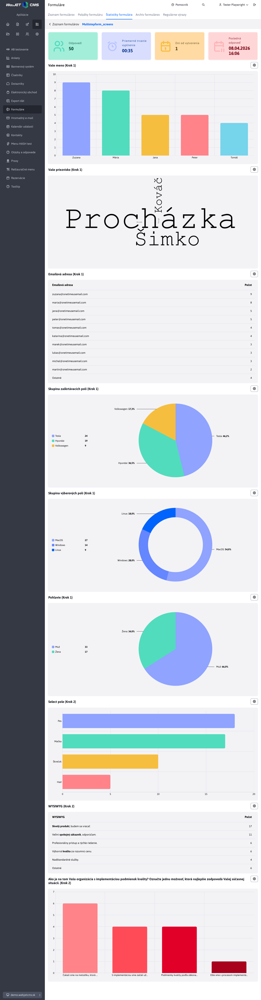

# Štatistiky pomocou grafov

Trieda `StatsByCharts` v súbore [stats-by-charts.js](../../../../../../src/main/webapp/apps/_common/charts/stats-by-charts.js) je pomocná obálka (wrapper) nad [chart-tools.js](../../../../../../src/main/webapp/admin/v9/src/js/libs/chart/chart-tools.js). Jej cieľom je zjednodušiť tvorbu viacerých grafov naraz zo štruktúrovaných dát prichádzajúcich z backendu (REST API).

## Štruktúra dát

Dáta musia byť vo formáte poľa obsahujúceho objekty – jeden objekt pre každý graf.

Každý objekt **musí obsahovať**:

- `id` – jedinečný identifikátor grafu
- `type` – hodnotu enumerácie [ChartType](../backend/README.md#typ-grafu), ktorá špecifikuje o aký typ grafu máme záujem
- `values` – pole hodnôt pre graf

Objekty **môžu navyše obsahovať**:

- `title` – nadpis, ktorý sa použije pre vygenerovaný graf
- `chart_colorScheme` – hodnota [farebnej schémy](../backend/README.md#farebná-schéma-grafov), ktorá sa má použiť pre **tento špecifický graf**
- `xAxeName` – názov poľa v objekte `values`, ktoré reprezentuje os X grafu
- `yAxeName` – názov poľa v objekte `values`, ktoré reprezentuje os Y grafu

Predvolené hodnoty `xAxeName` / `yAxeName` sa líšia podľa typu grafu:

| Typ grafu | `xAxeName` | `yAxeName` |
| --- | --- | --- |
| `PIE_CLASSIC` / `PIE_DONUT` | `"name"` | `"count"` |
| `BAR_VERTICAL` / `BAR_HORIZONTAL` | `"count"` | `"name"` |
| `WORD_CLOUD` | `"name"` | `"count"` |

Grafy `DOUBLE_PIE` a `TABLE` používajú namiesto `yAxeName` špecifické vlastnosti:

- pre typ `DOUBLE_PIE`: `yAxeName_inner` (predvolene `"count"`) a `yAxeName_outer` (predvolene `"count"`); os X ostáva `xAxeName` (predvolene `"name"`)
- pre typ `TABLE`: `paramsNames` – pole názvov polí zobrazených v tabuľke (predvolene `["name", "count"]`)

## Čo trieda robí

- Načíta amcharts knižnicu (`window.initAmcharts()`) automaticky pri prvom vytvorení grafov.
- Dynamicky vytvára DOM elementy (kontajner, `<div>` pre každý graf, tlačidlo nastavení).
- Podľa hodnoty `type` v dátach rozhodne, aký typ grafu sa má vykresliť. Rozpoznáva rozdiely medzi jednotlivými variantmi (napr. `pie_donut` vs. `pie_classic`) a patrične upraví nastavenie bez ďalšieho zásahu. Podporuje typy:
  - `pie_donut` / `pie_classic` -> koláčový graf (`PieChartForm`)
  - `bar_vertical` / `bar_horizontal` -> stĺpcový graf (`BarChartForm`)
  - `table` -> tabuľka (`TableChartForm`)
  - `word_cloud` -> slovný oblak (`WordCloudChartForm`)
- Udržuje mapu inštancií grafov (`chartsInstances`) pre neskoršiu aktualizáciu.
- Umožňuje aktualizáciu jednotlivého grafu bez obnovy celej stránky – stará inštancia sa zničí a nová sa vytvorí na tom istom mieste.
- Ku každému grafu automaticky pridá tlačidlo nastavení s voliteľnou callback funkciou.

!> **Upozornenie:** Grafy typu `LINE` triedou `StatsByCharts` **nie sú** podporované, nakoľko vyžadujú špecifické nastavenie zo strany programátora na frontend-ovej strane.

## Výhody oproti priamemu použitiu `chart-tools.js`

| | `chart-tools.js` priamo | `StatsByCharts` |
| --- | --- | --- |
| Inicializácia amcharts | manuálne `window.initAmcharts().then(...)` | automaticky |
| Vytvorenie DOM elementov | manuálne (`<div id="...">`) | automaticky |
| Viacero grafov | každý zvlášť | iterácia cez pole dát |
| Určenie typu grafu | manuálne (volíte správnu triedu) | podľa `type` v dátach |
| Aktualizácia grafu | manuálne zrušiť + znovu vytvoriť | `updateChart()` |
| Tlačidlo nastavení | manuálne | automaticky, s callback podporou |

`chart-tools.js` ostáva vhodnou voľbou, ak potrebujete plnú kontrolu nad individuálnym grafom (napr. jeden graf s vlastnou logikou, typ `LINE`). `StatsByCharts` je vhodná tam, kde backend vracia pole grafov s ich konfiguráciou.

## API

### Konštruktor

```javascript
new StatsByCharts(options)
```

| Parameter | Typ | Popis |
| --- | --- | --- |
| `options.targetSelector` | `string` | CSS selektor elementu, do ktorého sa vložia grafy (povinný) |
| `options.id` | `string` | Prefix pre unikátne ID grafov (predvolene `"stats-by-charts"`) |
| `options.chartSettingBtnFn` | `function` | Callback volaný po kliknutí na tlačidlo nastavení grafu; dostane objekt `chartDef` ako argument |

### Metódy

#### `createCharts(chartsDefinitions)`

Vytvorí všetky grafy naraz. Volajte po načítaní dát z REST API.

- `chartsDefinitions` – pole objektov s definíciou grafov (štruktúra opísaná nižšie).

#### `updateChart(newChartsDefinitions)`

Aktualizuje jeden alebo viac existujúcich grafov.

- Zničí starú inštanciu grafu, odstráni hlavičku a vykreslí nový graf s aktualizovanými dátami.

## Použitie – príklad

Nasledujúci príklad pochádza zo stránky štatistík formulárov [form-stats.html](../../../../../../src/main/webapp/apps/form/admin/form-stats.html).

### 1. Import triedy

```javascript
import { StatsByCharts } from '/apps/_common/charts/stats-by-charts.js';
```

### 2. Vytvorenie inštancie a grafov

```javascript
fetch("/rest/multistep-form-stat/get-stat-data?form-name=" + urlFormName)
    .then(response => response.json())
    .then(data => {
        let instance = new StatsByCharts({
            targetSelector: "#chartContainer",
            id: "form-stats",
            chartSettingBtnFn: (chartDef) => {
                // Otvorenie modálneho okna pre nastavenie grafu
                WJ.openIframeModalDatatable({
                    url: "/apps/form/admin/form-stats-table/?id=-1&formName=" + urlFormName + "&itemFormId=" + chartDef.id + "&showOnlyEditor=true",
                    width: 850,
                    height: 500,
                    buttonTitleKey: "button.save"
                });
            }
        });

        // Vykreslenie všetkých grafov naraz
        instance.createCharts(data.chartData);
    });
```

### 3. HTML kontajner

```html
<div id="chartContainer"></div>
```

Trieda sama vytvorí vnútornú štruktúru:

```html
<div id="chartContainer">
    <div id="form-stats">
        <div id="form-stats_{chartId}_container" class="stat-chart-wrapper">
            <button class="btn btn-sm btn-outline-secondary chart-more-btn">...</button>
            <div id="form-stats_{chartId}" class="amcharts"></div>
        </div>
        <!-- ďalší graf... -->
    </div>
</div>
```

### 4. Aktualizácia grafu po zmene nastavení

Graf je možné aktualizovať bez obnovy celej stránky volaním metódy `updateChart(data)`, kde `data` je pole jedného alebo viacerých objektov grafov v rovnakej štruktúre ako pri [vytváraní](#štruktúra-dát). Trieda podľa `id` automaticky nájde existujúcu inštanciu, zničí ju a vykreslí nanovo s novými dátami.

Príklad aktualizácie grafu/grafov:

```javascript
fetch("/get_new_chart_data")
    .then(response => response.json())
    .then(data => {
        instance.updateChart(data);
    })
    .catch(error => {
        console.error("Error fetching chart new data:", error);
    });
```

Ukážka vygenerovanej štatistiky z príkladu vyššie:

