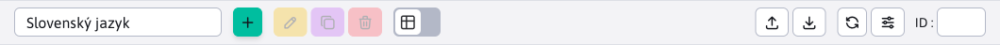

# WebJET JavaScript funkcie

WebJET v súbore webjet.js zapúzdruje API použitých knižníc. Cieľom je, aby sa nepoužívali priamo API volania z knižníc, ale zapúzdrené volania cez naše funkcie. Umožní nám to bez zmeny API prípadne vymeniť použitú knižnicu.


<!-- @import "[TOC]" {cmd="toc" depthFrom=1 depthTo=6 orderedList=false} -->

<!-- code_chunk_output -->

- [WebJET JavaScript funkcie](#webjet-javascript-funkcie)
  - [Notifikácie](#notifikácie)
  - [Potvrdenie akcie](#potvrdenie-akcie)
  - [Získanie hodnoty](#získanie-hodnoty)
  - [Formátovanie dátumu a času](#formátovanie-dátumu-a-času)
  - [Formátovanie čísel](#formátovanie-čísel)
  - [Iframe dialóg](#iframe-dialóg)
  - [Dialóg pre výber súboru/odkazu](#dialóg-pre-výber-súboruodkazu)
  - [Udržiavanie spojenia so serverom (refresher)](#udržiavanie-spojenia-so-serverom-refresher)
  - [Navigačná lišta](#navigačná-lišta)
  - [Karty v hlavičke](#karty-v-hlavičke)
  - [Kontrola práv](#kontrola-práv)
  - [Markdown parser](#markdown-parser)
  - [Perzistentné nastavenia používateľa](#perzistentné-nastavenia-používateľa)
    - [Použitie na frontende](#použitie-na-frontende)
    - [Použitie na backende](#použitie-na-backende)
  - [Animácia načítania](#animácia-načítania)
  - [Ostatné funkcie](#ostatné-funkcie)

<!-- /code_chunk_output -->

## Notifikácie

Pre notifikácie používame knižnicu [toastr](https://github.com/CodeSeven/toastr), pripravené sú nasledovné JS funkcie:

`WJ.notify(type, title, text, timeOut = 0, buttons = null, appendToExisting = false, containerId = null)` - zobrazí toast notifikáciu (ekvivalent ```window.alert```), parametre:

- ```type``` (String) - typ zobrazenej notifikácie, možnosti: ```success, info, warning, error```
- ```title``` (String) - titulok zobrazenej notifikácie
- ```text``` (String) - text zobrazenej notifikácie, nepovinné
- ```timeout``` (int) - čas, po ktorom sa notifikácia schová, nepovinné, hodnota 0 znamená, že sa notifikácia bude zobrazovať, pokiaľ ju používateľ nezatvorí
- ```buttons``` (json) - pole tlačidiel zobrazených pod textom notifikácie
- ```appendToExisting``` (boolean) - po nastavení na ```true``` je text pridaný do existujúcej notifikácie rovnakého typu. Ak ešte neexistuje, vytvorí sa nová notifikácia.
- ```containerId``` (String) - CSS ID kontajnera, do ktorého bude notifikácia vložená.

Pripravené sú aj skrátené verzie, odporúčame používať tie:

- ```WJ.notifySuccess(title, text, timeOut=0, buttons=null)```
- ```WJ.notifyInfo(title, text, timeOut=0, buttons=null)```
- ```WJ.notifyWarning(title, text, timeOut=0, buttons=null)```
- ```WJ.notifyError(title, text, timeOut=0, buttons=null)```

Povinný je parameter ```title```, ostatné sú nepovinné.


Príklady:

```javascript
//zobrazenie chybovej spravy
WJ.notifyError("Zvoľte si riadky na vykonanie akcie");

//zobrazenie chybovej spravy, ktora sa po 5 sekundach schova
WJ.notifyError("Vyberte adresár", null, 5000);

//zobrazenie chybovej spravy s doplnkovym textom a HTML kódom
WJ.notifyError('Nepodarilo sa to', 'Skúste to <strong>neskôr</strong>');
```

V datatabuľke môžete posielať [notifikácie zo servera](../datatables-editor/notify.md).

Ak potrebujete zobraziť tlačidlo zadáte ho ako JSON pole:

```javascript
[
    {
        title: "Editovať poslednú verziu", //button title
        cssClass: "btn btn-primary", //button CSS class
        icon: "ti ti-pencil", //optional: Tabler icon
        click: "editFromHistory(38, 33464)", //onclick function
        closeOnClick: true //close toastr on button click, default true
    }
]
```

Hodnota v `click` sa nastaví priamo na `onclick` atribúte tlačidla, nemie obsahovať znak ", odporúčame len volať vhodnú JS funkciu.

## Potvrdenie akcie

Pre potvrdenie akcie (ekvivalent ```window.confirm``` kde kliknutím na OK/Potvrdiť môžem vykonať zvolenú akciu) je pripravená JS funkcia ```WJ.confirm(options)```. V ```options``` objekte môžu byť nasledovné parametre:

- ```title``` (String) - titulok zobrazenej otázky
- ```message``` (String) - text zobrazenej otázky
- ```btnCancelText``` (String) - text zobrazený na tlačidle pre zrušenie (predvolene Zrušiť)
- ```btnOkText``` (String) - text zobrazený na tlačidle pre potvrdenie akcie (predvolene Potvrdiť)
- ```success``` (funkcia) - funkcia, ktorá sa vykoná po potvrdení akcie
- ```cancel``` (funkcia) - funkcia, ktorá sa vykoná po zrušení akcie

Príklady použitia:

```javascript
WJ.confirm({
    title: "Skutočne chcete zmazať údaje?",
    success: function() {
        console.log("deleting data...");
    }
});
```

## Získanie hodnoty

Pre získanie hodnoty (ekvivalent ```window.prompt``` kde je do dialógu potrebné zadať hodnotu) je pripravená funkcia ```WJ.propmpt(options)```. V ```options``` objekte je možné zadať rovnaké hodnoty ako pre [potvrdenie akcie](#potvrdenie-akcie).

Príklad použitia:

```javascript
WJ.confirm({
    title: "Zadajte hodnotu",
    success: function(value) {
        console.log("Zadana hodnota: ", value);
    }
});
```

## Formátovanie dátumu a času

Pre unifikované formátovanie dátumu a času sú dostupné nasledovné funkcie:

- ```WJ.formatDate(timestamp)``` - naformátuje zadaný ```timestamp``` ako dátum
- ```WJ.formatDateTime(timestamp)``` - naformátuje zadaný ```timestamp``` ako dátum a čas (hodiny:minúty)
- ```WJ.formatDateTimeSeconds(timestamp)``` - naformátuje zadaný ```timestamp``` ako dátum a čas vrátane sekúnd
- ```WJ.formatTime(timestamp)``` - naformátuje zadaný ```timestamp``` ako čas (hodiny:minúty)
- ```WJ.formatTimeSeconds(timestamp)``` - naformátuje zadaný ```timestamp``` ako čas vrátane sekúnd

## Formátovanie čísel

Pre unifikované formátovanie čísel sú dostupné nasledovné funkcie:

- `WJ.formatPrice(price)` - naformátuje zadané číslo ako menu zaokrúhlenú na 2 desatinné miesta, príklad: `WJ.formatPrice(1089) - 1 089,00`.

## Iframe dialóg

Pomocou volania ```WJ.openIframeModal(options)``` je možné otvoriť dialógové okno s iframe zadanej URL adresy. Neotvára sa tak ```popup``` okno, ale dialógové okno priamo v stránke. V ```options``` objekte môžu byť nasledovné parametre:

- ```url``` = URL adresa vloženého iframe
- ```width``` = šírka okna
- ```height``` = výška vloženého iframe (modal bude o hlavičku a pätičku vyšší)
- ```title``` = titulok okna
- ```buttonTitleKey``` = prekladový kľúč textu na primárnom tlačidle pre uloženie (predvolene kľúč ```button.submit``` - Potvrdiť)
- ```closeButtonPosition``` = pozícia tlačidla na zatvorenie okna
  - ```prázdna hodnota``` - ikona X v hlavičke okna
  - ```close-button-over``` - ikona X v hlavičke ale ponad obsah okna (nevytvára samostatný riadok)
  - pridaním ```nopadding```, čiže napr. ```closeButtonPosition: "close-button-over nopadding"``` sa zruší aj horné odsadenie v hlavičke
- ```okclick``` = callback po kliknutí na tlačidlo potvrdiť, neobsahuje žiadne parametre, hodnotu z iframe je potrebné si vytiahnuť v implementácii callback-u
- ```onload``` = callback po načítaní okna, ako parameter dostane ```event.detail``` obsahujúci objekt ```window``` s odkazom na okno v iframe

Dialógové okno má vlastné tlačidlo pre zatvorenie, v prípade potreby je možné využiť API volanie ```WJ.closeIframeModal()``` pre zatvorenie okna.

Pre okná obsahujúce datatabuľku existuje funkcia `openIframeModalDatatable(options)` ktorá nastavuje funkcie `okclick` a `onload` pre volanie uloženia a korektné zatvorenie okna po uložení záznamu v data tabuľke. Nastavená výška je automaticky znížená podľa veľkosti okna.

**Poznámky k implementácii**

HTML kód dialógu je staticky vložený v súbore [iframe.pug](../../../../src/main/webapp/admin/v9/views/modals/iframe.pug) a linkované do stránky v [layout.pug](../../../../src/main/webapp/admin/v9/views/partials/layout.pug). Iframe sa teda opakovane používa pre rôzne dialógy. V premennej ```modalIframe``` je odkaz na inštanciu dialógu.

Problémové bolo použitie dialógu v datatables editore, ktorý sám o sebe je dialóg. Modal-backdrop nemal nastavený vhodný z-index a bol za oknom editora, čiže nekorektne poziciovaný (neprekryl editor). Pri otvorení iframe dialógu preto nastavujeme na elemente ```.modal-backdrop``` CSS triedu ```modalIframeShown```, ktorá korektne nastavuje ```z-index``` na backdrop elemente.

## Dialóg pre výber súboru/odkazu

Pre jednoduché použitie zobrazenia dialógového okna výberu súboru/obrázku/odkazu na stránku (otvorenie ```elfinder``` dialógového okna) je možné použiť funkcie:

- ```WJ.openElFinder(options)``` - otvorí dialógové okno so zadanými nastaveniami ako sú použité pre Iframe dialóg (okrem url, ktoré je automaticky nastavené).
- ```WJ.openElFinderButton(button)``` - otvorí dialógové okno po kliknutí na tlačidlo ```button```. V rodičovskom elemente ```div.input-group``` automaticky vyhľadá formulárové vstupné pole a to použije pre získanie aktuálnej hodnoty a jej nastavenie po výbere. Podľa elementu ```label.col-form-label``` nastaví titulok okna.

Príklad použitia ```WJ.openElFinder```:

```javascript
WJ.openElFinder({
    link: conf._input.val(),
    title: conf.label,
    volumes: "images", //or link
    okclick: function(link) {
        //console.log("OK click");
        setValue(conf, link);
    }
});
```

Príklad HTML kódu pre použitie ```onclick="WJ.openElFinderButton(this);"```:

```html
<div class="input-group">
  <div class="input-group-prepend">
    <span class="input-group-text has-image" style="background-image: url(/images/investicny-vklad/business-3175110_960_720.jpg);">
      <i class="ti ti-photo"></i>
    </span>
  </div>
  <input id="DTE_Field_fieldE" maxlength="255" data-warninglength="" data-warningmessage="" value="/images/investicny-vklad/business-3175110_960_720.jpg" class="form-control" type="text">
  <div class="input-group-append">
    <button class="btn btn-outline-secondary" type="button" onclick="WJ.openElFinderButton(this);">
      <i class="ti ti-pencil"></i>
    </button>
  </div>
</div>
```

## Udržiavanie spojenia so serverom (refresher)

Aby nedochádzalo k vypršaniu prihlásenia používateľa (napr. pri dlhej editácii web stránky) je v minútovom intervale volaná REST služba ```/admin/rest/refresher```. Tá udrží session a zároveň kontroluje nové správy pre administrátora. Ak existujú nové správy zobrazí vyskakovacie okno.

Dostupné sú nasledovné funkcie:

- ```keepSession()``` - inicializačná funkcia, ktorá spustí časovač volania REST služby.
- ```keepSessionShowLogoffMessage()``` - zobrazí chybové hlásenie pri prerušení spojenia so serverom, zabezpečí, aby sa hlásenie nezobrazilo viac krát. Po 5 minútach presmeruje na prihlásenie.
- ```keepSessionShowTokenMessage(errorMessage)``` - zobrazí chybové hlásenie pri nesprávnom CSRF tokene, zabezpečí, aby sa hlásenie nezobrazilo viac krát.

**Poznámky k implementácii**

Chybové hlásenia sú zobrazené cez knižnicu toastr v samostatnom kontajneri ```toast-container-logoff``` v hornej časti obrazovky. Používajú ```window``` objekty pre ochranu pred viac násobným zobrazením hlásenia.

Inicializácia časovača je spustená z [app-init.js](../../../../src/main/webapp/admin/v9/src/js/app-init.js) volaním funkcie ```WJ.keepSession();```.

Ochrana pre CSRF tokeny a spojenie so serverom je okrem časovača nastavená aj v [head.pug](../../../../src/main/webapp/admin/v9/views/partials/head.pug) v nastavení ajax volaní pomocou funkcie ```$.ajaxSetup```. Pre HTTP chybu so stavom 401 je volaná funkcia ```WJ.keepSessionShowLogoffMessage()```, pre chybu 403 funkcia ```WJ.keepSessionShowTokenMessage(errorMessage)```.

## Navigačná lišta

Navigačnú lištu typicky s filtrom, alebo návratom späť, vygenerujete volaním JS funkcie ```JS.breadcrumb```, tá ako parameter dostáva konfiguračný JSON objekt vo formáte:

```javascript
{
    id: "regexp",
    tabs: [
        {
            url: '/apps/gdpr/admin/',
            title: '[[#{components.gdpr.menu}]]',
            active: false
        },
        {
            url: '/apps/gdpr/admin/regexps/',
            title: '[[#{components.gdpr.regexp.title}]]'
        }
    ],
    backlink: {
        url: "#/",
        title: WJ.translate('forms.formsList.js'),
    },
    showInIframe: false
}
```

kde:

- ```id``` - unikátny identifikátor
- ```tabs``` - pole zobrazených položiek navigačnej lišty
  - ```url``` - adresa stránky po kliknutí na položku
  - ```title``` - názov položky
  - ```active``` - (voliteľné) ak je false zobrazí sa ako neaktívna možnosť - používa sa pre pod-stránky aplikácie kde prvá položka odkazuje na úvodnú/hlavnú stránku aplikácie
- ```backlink``` - (voliteľné) odkaz na predchádzajúcu stránku (používa sa v ```master-detail``` zobrazení, napr. v detaile formuláru odkaz na zoznam formulárov)
- `showInIframe` - (voliteľné) ak je nastavené na `true`, alebo v kartách existuje atribút s hodnotou `title: '{filter}'` zobrazí sa hlavička aj v `iframe` elemente - typicky vo vlastnostiach aplikácie v editore stránok

Zároveň titulok položky, ktorá prvá nemá atribút ```active: false``` sa nastaví ako titulok web stránky (atribút ```title``` html kódu stránky).

**Zobrazenie výberu jazyka**

V niektorých prípadoch je potrebné zobraziť údaje v datatabuľke podľa vybraného jazyka (nie podľa jazyka aktuálne prihláseného administrátora). Príkladom je aplikácia GDPR->Cookie Manažér, kde sa jednotlivým ```cookies``` môže nastavovať opis pre rôzne jazyky.



Navigačná lišta umožňuje vložiť výber jazyka priamo do nej pomocou makra ```{LANGUAGE-SELECT}```:

```javascript
WJ.breadcrumb({
    id: "regexp",
    tabs: [
        {
            url: '/apps/gdpr/admin/',
            title: '[[#{components.gdpr.menu}]]',
            active: false
        },
        {
            url: '/apps/gdpr/admin/',
            title: '[[#{components.cookies.cookie_manager}]]'
        },
        {
            url: '#translation-keys-language',
            title: '{LANGUAGE-SELECT}',
            active: false
        }
    ]
})
```

do navigačnej lišty je takto dynamicky vložené výberové pole so zoznamom jazykov s ```id=breadcrumbLanguageSelect```. Následne môžete reagovať na zmenu jazyka nastavením URL adries pre REST služby:

```javascript
$("#breadcrumbLanguageSelect").change(function() {
    let lng = $(this).val();
    //console.log("Select changed, language=", lng);
    url = "/admin/rest/cookies?breadcrumbLanguage="+lng;
    cookiesDataTable.setAjaxUrl(url);
    cookiesDataTable.EDITOR.s.ajax.url = WJ.urlAddPath(url, '/editor');
    cookiesDataTable.ajax.reload();
});
```

Výber jazyka môžete vložiť aj priamo do nástrojovej lišty tabuľky, príklad vloženia ako prvej položky pred tlačidlo na pridanie záznamu:

```javascript
let select = $("div.breadcrumb-language-select").first();
$("#cookiesDataTable_wrapper .dt-header-row .row .col-auto .dt-buttons").prepend(select);
select.show();

$("#cookiesDataTable_wrapper .dt-header-row .row .col-auto .dt-buttons div.breadcrumb-language-select select").change(function() {
    let lng = $(this).val();
    //console.log("Select changed, language=", lng);
    url = "/admin/rest/cookies?breadcrumbLanguage="+lng;
    cookiesDataTable.setAjaxUrl(url);
    cookiesDataTable.EDITOR.s.ajax.url = WJ.urlAddPath(url, '/editor');
    cookiesDataTable.ajax.reload();
});
```

V REST rozhraní získate jazyk pomocou získania URL parametra ```breadcrumbLanguage```:

```java
@Override
public CookieManagerBean getOneItem(long id) {

    CookieManagerDB cookieMangerDB = new CookieManagerDB();

    String language = getRequest().getParameter("breadcrumbLanguage");
    Prop prop = Prop.getInstance(language);

    CookieManagerBean entity;

    if(id != -1) {
        entity = cookieMangerDB.getById((int) id);
        setTranslationKeysIntoEntity(entity, prop);
    } else {
        entity = new CookieManagerBean();
    }

    return entity;
}
```

**Vloženie značky pre externý filter**

Ak v navigačnej lište potrebujete mat externý filter je možné použiť ako titulok značku ```{TEXT}```. Ak titulok začína na znak ```{``` vloží sa text obalený do DIV kontajnera. To je následne možné použiť pre presun [externého filtra](../datatables/README.md#externý-filter) ako je napr. v aplikácii GDPR/Vyhľadávanie.


```html
<script>
    var searchDataTable;

    window.domReady.add(function () {

        WJ.breadcrumb({
            id: "regexpsearch",
            tabs: [
                {
                    url: '/apps/gdpr/admin/',
                    title: '[[#{components.gdpr.menu}]]',
                    active: false
                },
                {
                    url: '/apps/gdpr/admin/search/',
                    title: '[[#{components.gdpr.list}]]'
                },
                {
                    url: '#value',
                    title: '{filter}',
                    active: false
                }
            ]
        });

        ...

        $("#searchDataTable_extfilter").on("click", "button.filtrujem", function() {
            //umele vyvolanie reloadu, kedze je zapnute klientske strankovanie/filtrovanie
            searchDataTable.ajax.reload();
        });
    });
</script>

<div id="searchDataTable_extfilter">
    <div class="row datatableInit">
        <div class="col-auto dt-extfilter-title-value"></div>
        <div class="col-auto dt-extfilter dt-extfilter-value"></div>
    </div>
</div>
```

Pre [zvýraznenie menu položky](../../custom-apps/admin-menu-item/README.md#frontend) v ```master-detail``` stránkach je možné použiť funkciu ```WJ.selectMenuItem(href)```.

## Karty v hlavičke

V hlavičke sa štandardne zobrazujú navigačné karty ako položky navigácie druhej úrovne. V niektorých prípadoch (napr. v sekcii web stránky) sa ale používajú na filtrovanie zoznamu web stránok (Aktívne, Neschválené, Systémové...). Môžete použiť funkciu `WJ.headerTabs(config)` pre ich vygenerovanie:

```JavaScript
WJ.headerTabs({
    id: 'pages',
    tabs: [
        { url: '#pages', title: '[[\#{webpages.tab.pages}]]', active: true },
        { url: '#changes', title: '[[\#{webpages.tab.changes}]]' },
        { url: '#waiting', title: '[[\#{webpages.tab.waiting}]]' },
        { url: '#system', title: '[[\#{webpages.tab.system}]]' },
        { url: '#trash', title: '[[\#{webpages.tab.trash}]]' },
        { url: '#folders-dt', title: '[[\#{webpages.tab.folders}]]' }
    ]
});
```

Ak inicializujete karty neskôr (po inicializácii WebJETu) je potrebné ešte zavolať funkciu `window.initSubmenuTabsClick();` pre nastavenie udalostí. Príklad:

```javascript
WJ.headerTabs({
    id: 'tabsFilter',
    tabs: [
        { url: "javascript:elfinderTabClick('file')", id: "files", title: '[[\#{fbrowse.file}]]', active: true },
        { url: "javascript:elfinderTabClick('tools')", id: "tools", title: '[[\#{editor_dir.tools}]]', active: false },
        { url: "javascript:WJ.openPopupDialog('/components/sync/export_setup.jsp', 650, 500);", id: "export", title: 'Export - Import', active: false }
    ]
});
window.initSubmenuTabsClick();
```

Na udalosť zmeny karty môžete reagovať ako:

```javascript
$('#pills-linkcheck a[data-wj-toggle="tab"]').on('click', function (e) {
    let selectedTab = e.target.id;

    if(selectedTab === "pills-brokenLinks-tab") {
        linkCheckDataTable.setAjaxUrl(WJ.urlUpdateParam(linkCheckUrl, "tableType", "brokenLinks"));
        linkCheckDataTable.ajax.reload();
    } else if(selectedTab === "pills-hiddenPages-tab") {
        linkCheckDataTable.setAjaxUrl(WJ.urlUpdateParam(linkCheckUrl, "tableType", "hiddenPages"));
        linkCheckDataTable.ajax.reload();
    } else if(selectedTab === "pills-emptyPages-tab") {
        linkCheckDataTable.setAjaxUrl(WJ.urlUpdateParam(linkCheckUrl, "tableType", "emptyPages"));
        linkCheckDataTable.ajax.reload();
    }
});
```

## Kontrola práv

Pri zobrazení web stránky je vygenerovaný objekt ```window.nopermsJavascript``` so zoznamom práv, ktoré používateľ nemá povolené. Toto pole nikdy nepoužívajte priamo, pre kontrolu práv použite API volanie:

- ```WJ.hasPermission(permission)``` - vráti ```true```, ak aktuálne prihlásený používateľ má povolené právo ```permission```. Inak vráti false.

## Markdown parser

Funkcia ```parseMarkdown(markdownText, options)``` umožňuje konvertovať základný Markdown formát na HTML kód. Podporované sú nasledovné značky:

- ```#, ##, ###``` - nadpis 1-3 (```h1-h3```)
- ```> text``` - značka ```blockquote```
- ```**text**``` - tučné písmo
- ```*text*``` - kurzíva
- `````` - obrázok s alternatívnym textom
- ```[stranka.html](nazov)``` - odkaz na inú stránku (vyžaduje nastaviť ```options { link: true }```)
- ```- odrazka``` - ne-číslovaný zoznam
- ``` \`text\` ``` - blok kódu v texte, obalené do `<span class="code-inline">`
- ``` \`\`\`text\`\`\` ``` - blok kódu na viac riadkov, obalené do `<div class="code">`
- `````` - obrázok

Funkcia obsahuje parametre:

- ```markdownText``` - text vo formáte Markdown
- ```options``` - voliteľné nastavenia
  - ```link``` - predvolene sa do generovaného HTML kódu nevkladajú odkazy, nastavením na ```true``` sa vkladanie odkazov zapne
  - `badge` - nastavením na `true` bude prvé slovo pred znakom pomlčka v ne-číslovanom zozname obalené do `<span class="badge bg-secondary">`
  - `imgSrcPrefix` - URL adresa prefixu pre obrázok (doménové meno) ak sa obrázok číta z inej domény, rovnaký prefix sa použije aj pre odkazy

Príklad použitia:

```javascript
let tooltipText = WJ.parseMarkdown("Meno priečinka v URL adrese web stránok.\nZadajte **prázdnu hodnotu** pre automatické nastavenie podľa **názvu priečinku**.");
```

## Perzistentné nastavenia používateľa

Ak potrebujete ukladať niektoré nastavenia používateľa môžete použiť ```window.localStorage``` objekt. Ten ale zostane uložený len v prehliadači. Ak potrebujete nastavenia pre používateľa mať rovnaké vo všetkých prehliadačoch, alebo ich mať dostupné aj na serveri je potrebné využiť možnosti ```UserDetails.adminSettings```, ktoré sa ukladajú do databázovej tabuľky ```user_settings_admin```. Uložené sú vo formáte kľúč/hodnota, kde hodnota často býva JSON objekt.

Pre použitie je dostupné API pre JavaScript aj pre serverové spracovanie.

!>**Upozornenie**: do nastavení neukladajte veľké objekty, nastavenia sú vkladané do HTML kódu administrácie a veľké objekty by neúmerne zväčšovali objem prenášaných dát.

### Použitie na frontende

Pre prácu je dostupné API:

- ```WJ.getAdminSetting(key)``` - vráti reťazec nastavenia používateľa so zadaným kľúčom.
- ```WJ.setAdminSetting(key, value)``` - uloží zadanú hodnotu so zadaným kľúčom do nastavení používateľa.

Príklad použitia:

```javascript
export class JstreeSettings {
    STORAGE_KEY = "jstreeSettings_web-pages-list";

    //ziska objekt nastaveni a vrati ho ako JSON
    getSettings() {
        let storeItem = window.WJ.getAdminSetting(this.STORAGE_KEY);
        if (typeof storeItem != "undefined") {
            return JSON.parse(storeItem);
        }
        return {}
    }

    //overi, ci JSON hodnota .showId je true
    isIdShow() {
        let show = (true === this.getSettings().showId);
        //console.log("isIdShow=", show);
        return show;
    }

    //ulozi nastavenia
    saveSettings() {
        //ziskaj zakladny objekt, ak neexistuje, je to prazdny objekt
        let settings = self.getSettings();
        //nastav hdonoty podla checkboxov
        settings.showId = $("#jstree-settings-showid").is(":checked");
        settings.showPriority = $("#jstree-settings-showorder").is(":checked");
        settings.showPages = $("#jstree-settings-showpages").is(":checked");

        //console.log("settings: ", settings);

        window.WJ.setAdminSetting(this.STORAGE_KEY, JSON.stringify(settings));
    }
}
```

### Použitie na backende

Na backende je možné použiť triedu ```AdminSettingsService``` pre získanie údajov:

```java
AdminSettingsService ass = new AdminSettingsService(user);
boolean showPages = ass.getJsonBooleanValue("jstreeSettings_web-pages-list", "showPages");
```

Ukladanie dát zabezpečuje REST služba ```/admin/rest/admin-settings/```:

```java
@RestController
@PreAuthorize("@WebjetSecurityService.isAdmin()")
public class AdminSettingsRestController {

   @PostMapping("/admin/rest/admin-settings/")
   public boolean save(@RequestBody LabelValue settings, final HttpServletRequest request) {
      Identity user = UsersDB.getCurrentUser(request);
      AdminSettingsService ass = new AdminSettingsService(user);
      boolean saveok = ass.saveSettings(settings.getLabel(), settings.getValue());
      return saveok;
   }

}
```

## Animácia načítania

Ak zobrazenie stránky trvá dlhšie (napr. načítanie grafov v štatistike) je možné zobraziť animáciu načítania. V JavaScript kóde je možné využiť funkcie na zobrazenie a schovanie animácie:

```javascript
//show loader
WJ.showLoader();
WJ.showLoader("text");
WJ.showLoader(null, "#pills-dt-datatableInit-index > div.panel-body");

//hide loader
WJ.hideLoader();
```

Ak potrebujete skryť počas nahrávania určitý blok môžete mu nastaviť CSS triedu ```hide-while-loading```. Element sa automaticky schová ak bude zobrazená animácia nahrávania a následne po jej schovaní sa zobrazí.

```html
<div id="graphsDiv" class="hide-while-loading">
    <div id="visits" class="amcharts"></div>
</div>
```

## Ostatné funkcie

- ```WJ.showHelpWindow(link)``` - Volanie spôsobí zobrazenie okna s pomocníkom. Hodnota otvoreného odkazu sa získa z parametra `link` alebo z `window.helpLink`.
- ```WJ.changeDomain(select)``` - Vyvolá akciu zmeny zvolenej domény. Používa sa v hlavičke okna pri multidomain inštalácii s externými súbormi. V takomto režime sú k zvolenej doméne viazané súbory ale aj dáta aplikácií (napr. bannery, skripty).
- ```WJ.translate(key, ...params)``` - Funkcia na [preklad kľúča na text](jstranslate.md).
- ```WJ.openPopupDialog(url, width, height)``` - Otvorí vyskakovacie okno so zadaným URL a zadanou veľkosťou okna, odporúčame ale využiť [WJ.openIframeModal](#iframe-dialog) ak je to možné
- ```WJ.urlAddPath(url, pathAppend)``` - Pridá do (rest) URL cestu, kontroluje, či v URL nie je ```?param``` - napr. ```WJ.urlAddPath('/admin/rest/tree?click=groups', '/list')``` vznikne ```/admin/rest/tree/list?click=groups```.
- ```WJ.urlAddParam(url, paramName, paramValue)``` - Pridá do URL parameter. Kontroluje, či v URL už nejaký parameter je, a podľa toho pridá ? alebo &, hodnotu ```paramValue``` zakóduje pomocou ```encodeURIComponent```.
- ```WJ.urlUpdateParam(url, paramName, paramValue)``` - Aktualizuje zadaný parameter v URL adrese.
- ```urlGetParam(name, queryString=null)``` - získa hodnotu parametra v URL adrese. Ak nie je zadaná hodnota `queryString` získa sa z `window.location.search`.
- ```WJ.setJsonProperty(obj, path, value)``` - Nastaví (JSON) hodnotu v objekte podľa zadaného mena, akceptuje aj vnorené objekty typu ```editorFields.groupCopyDetails``` (ak ```editorFields``` zatiaľ neexistuje, vytvorí ho).
- ```WJ.getJsonProperty(obj, path)``` - Získa (JSON) hodnotu v objekte podľa zadaného mena, akceptuje aj vnorené objekty typu ```editorFields.groupCopyDetails```.
- ```WJ.dispatchEvent(name, detail)``` - Vyvolá udalosť na ```window``` objekte zadanú s názvom ```name```. JSON objekt ```detail``` pridá ako ```e.detail``` objekt do vyvolanej udalosti. Na udalosť je potrebné počúvať volaním typu ```window.addEventListener("WJ.DTE.close", function() { console.log("HAHA, yes"); });```
- ```WJ.htmlToText(htmlCode)``` - Skonvertuje zadaný HTML kód na čistý text. Interne vytvorí skrytý ```DIV``` element, ktorému nastaví HTML kód a následne z neho získa čistý text.
- ```WJ.initTooltip($element)``` - Inicializuje na zadanom jQuery elemente (alebo kolekcii) ```tooltip``` s MarkDown podporou.
- ```WJ.escapeHtml(string)``` - Nahradí nebezpečné znaky v HTML kóde za entity pre ich bezpečné vypísanie.
- ```WJ.base64encode(text)``` - zakóduje algoritmom `base64` zadaný text s podporou znakov v ```utf-8```.
- ```WJ.base64decode(encodedText)``` - dekóduje algoritmom `base64` zadaný text s podporou znakov v ```utf-8```.
- `WJ.debugTimer(message)` - vypíše hlásenie s časovým údajom od prvej správy. Hlásenia je potrebné zapnúť volaním `WJ.debugTimer(true)`, inak sa nezobrazia. Nie je tam potrebné zakomentovať všetky hlásenia v kóde.