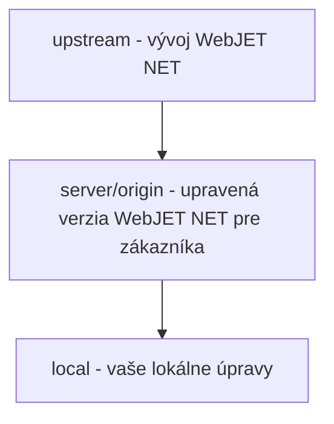

# Práca s Git/Gitlab

<!-- @import "[TOC]" {cmd="toc" depthFrom=1 depthTo=6 orderedList=false} -->

<!-- code_chunk_output -->

- [Práca s Git/Gitlab](#práca-s-gitgitlab)
  - [Inštalácia a nastavenie](#inštalácia-a-nastavenie)
  - [Naklonovanie repozitára zo servera na váš počítač](#naklonovanie-repozitára-zo-servera-na-váš-počítač)
  - [Práca vo VS Code](#práca-vo-vs-code)
  - [Branching](#branching)
    - [Implementácia novej požiadavky](#implementácia-novej-požiadavky)
    - [Release do produkcie](#release-do-produkcie)
    - [Oprava chyby v produkcii](#oprava-chyby-v-produkcii)
    - [Spojenie (merge) branch](#spojenie-merge-branch)
  - [Akceptovanie zmien (Merge Request)](#akceptovanie-zmien-merge-request)
    - [Ako a kedy vytvoriť Merge Request](#ako-a-kedy-vytvoriť-merge-request)
    - [Prechod z Work In Progress](#prechod-z-work-in-progress)
    - [Overenie merge konfliktov](#overenie-merge-konfliktov)
    - [Kontrola kvality kódu](#kontrola-kvality-kódu)
    - [Merge](#merge)

<!-- /code_chunk_output -->

>**tl;dr** Vysvetlenie používania GIT: základné pojmy, filozofia práce, workflow. Fungovanie Merge Requestov v Gitlabe, kontrola kvality kódu.

Gitlab je dostupný na adrese https://gitlab.web.iway.local. Ak ste doteraz pracovali len s SVN je potrebné si osvojiť hlavný rozdiel medzi SVN a GITom - **git je distribuovaný** verziovací softvér, každý  má na svojom počítači kópiu repozitára a môže s ním pracovať lokálne. Až keď máte prácu hotovú "pushnete" ju na vzdialený repozitár (na server).

Základné pojmy:

- git **clone** - prenesie (**naklonuje**) repozitár zo servera **na váš počítač**
- git **commit** - odošle (**uloží**) vykonané zmeny **do vášho** lokálneho **repozitára**. Je to podobné ako v SVN, ale zmeny sa zatiaľ neodošlú na server. Commitovať si teda môžete aj rozpracovanú prácu podľa potreby.
- git **branch** - vytvorí **novú vetvu v kóde**, viac v sekcii [Branching](#branching)
- git **push** - **odošle** vaše zmeny (commity) **na server**
- git **pull** - **aktualizuje** váš lokálny git repozitár **zo servera**
- git **merge** - **spojí zmeny** medzi vetvami (branch) kódu

V tomto návode sa snažíme o "laické" vysvetlenie pojmov, takže ospravedlňte netechnické výrazy. Hovoríme o serveri, aj keď git je prakticky distribuovaný a môže mať dokonca viac serverov a iných závislostí. Typicky budeme používať nasledovné výrazy:

- **local** - váš lokálny git repozitár - repozitár na vašom počítači
- **server** (označovaný aj ako **origin**) - primárny git repozitár z ktorého ste vykonali git clone do vášho počítača
- **upstream** - git repozitár, z ktorého je forknutý projekt na serveri

Aby ste pochopili rozdiel medzi serverom a upstream uvedomte si nasledovnú situáciu:

Máte vývoj "generického" produktu WebJET NET (upstream) a jeho kópiu pre zákazníka (server) vrátane vašej lokálnej kópie na počítači (local).



**Zákazník má upravenú verziu** WebJET NET ktorá je uložená v git repozitári na serveri. Táto verzia **vznikla rozvetvením (fork) z pôvodného WebJET NET repozitára**.

**Pre zákazníka** (na serveri) teda **programujete úpravy** pre daného klienta, môžete súbory meniť, mazať pridávať a **žiadno to neovplyvňuje vývoj "generického" produktu** WebJET NET. Vývoj produktu si žije vlastným životom, pridáva nové vlastnosti a funkcie. **Klient má zafixovanú verziu intranetu** zo servera.

V určitý moment príde **požiadavka na aktualizáciu intranetu** zákazníka. V tom momente na vykonáte **pull aktuálneho kódu z upstream servera** a aktualizujete kód zákazníka podľa zmien na upstream serveri, čiže podľa vývoja generického produktu. Pri spájaní kódu z upstream servera a vášho kódu zákazníka môže vzniknúť tzv. merge conflict, vo vašom IDE sa vám zobrazí možnosť ponechať zmeny, alebo ich aktualizovať podľa upstream servera.

## Inštalácia a nastavenie

Pred prvým použitím Gitlabu je potrebné nainštalovať GIT klienta a vygenerovať šifrovacie kľúče, keďže do gitu sa pripájate s použitím SSH kľúčov.

Podrobný manuál sa nachádza v [PDF dokumente na intranete](https://intra.iway.sk/files/dokumenty/webove-oddelenie/development/instalacia-git-vo-win.pdf). **POZOR** pri generovaní SSH kľúčov **neodporúčame zadávať heslo** (na screenshote je uvedené ako NejakeTvojeTajneHeslo007), pretože VS Code / git môže mať problém heslo zadať. Výhoda SSH kľúčov je práve v tom, že prináša komfort nezadávania hesla.

V skratke si nainštalujte [GIT klienta pre windows](https://git-scm.com/download/win) a následne v programe **GitBash** (pre MacOS v termináli) si vygenerujte SSH kľúče zadaním príkazu:

```shell
ssh-keygen -m PEM -t rsa -b 4096 -C tvoj.email@interway.sk
```

Priečinok pre uloženie klúčov potvrďte predvolený (priečinok ```.ssh``` vo vašom domovskom priečinku), pri výzve zadania **Passphrase nezadávajte** nič (potvrďte klávesou enter).

Následne po vygenerovaní kľúčov ešte zadajte príkazy na nastavenie vášho mena a emailu:

```shell
git config --global user.name "Meno Priezvisko"
git config --global user.email tvoj.email@interway.sk
```

**Súbor .pub** nie je potrebné posielať, **zadáte si ho sami do Gitlabu**. Prihláste sa a prejdite kliknutím na vašu ikonu vpravo hore do menu Settings, následne v ľavom menu zvoľte  [SSH Keys](https://gitlab.web.iway.local/profile/keys). Súbor id_rsa.pub otvorte v textovom editore a skopírujte jeho obsah do textového poľa Key, zadajte meno kľúča (ľubovoľné) a kliknite na Add key.

## Naklonovanie repozitára zo servera na váš počítač

Po nastavení kľúčov na komunikáciu s git serverom môžete naklonovať git repozitár na váš počítač.

> Odporúčam Vám si kvôli poriadku v lokálnom workspace **vytvárať podadresár pre klienta**, a až do neho naklonovať projekt. Budete mať workspace adresár **organizovaný podľa klientov a následne podľa projektov**.
>
> Workspace adresár s projektami pre vaše IDE odporúčam mať priamo v home adresári.

Adresu pre príkaz ```git clone``` získate priamo v gitlabe. Na úvodnej stránke projektu je v pravej hornej časti **modré tlačidlo Clone**. Kliknite naň a zobrazí sa vám kontextové menu, skopírujte časť z poľa Clone with SSH.

```
cd workspace
mkdir menoklienta
cd menoklienta
git clone git@gitlab.web.iway.local:menoklienta/projekt.git
cd projekt
```

Napríklad v gitlabe ste skopírovali adresu ```git@gitlab.web.iway.local:mpsvr/mpsvr-intranet.git```. Hodnota **mpsvr** je **menoklienta** a **mpsvr-intranet** je **meno projektu**. Postupujte teda nasledovne:

```
cd workspace
mkdir mpsvr
cd mpsvr
git clone git@gitlab.web.iway.local:mpsvr/mpsvr-intranet.git
cd mpsvr-intranet

#ak pouzivate VS Code mozete ho rovno spustit prikazom
code .
```

Zvykom je meno projektu prefixovať menom kllienta. Je to praktické z toho dôvodu, že vo VS Code sa vám v titulku/zozname projektov/otvorených okien zobrazuje len meno projektu a nie jeho rodičovský adresár. Ak meno projektu obsahuje aj meno klienta, lepšie sa v tom orientuje.

## Práca vo VS Code

**Vo VS Code sa branche zobrazujú v ľavo dole**, kliknutím na meno branche sa vám zobrazí zoznam všetkých branch. Branche, ktoré už máte lokálne na počítači sú označené ako master, alebo feature/xxx, **tie ktoré sú na serveri začínajú na prefix origin** (napr. origin/master, origin/feature/xxx). Branche začínajúce na upstream sú tie, ktoré zastrešujú vývoj produktu (napr. upstream/master, upstream/feature/xxx).

V okne **Source Control** sa vám zobrazuje zoznam zmenených súborov a kliknutím na ```...``` sa vám zobrazí ponuka (v okne sa 2x zobrazuje nadpis Source Control, kliknutie na ... je potrebné vpravo v druhom riadku nad poľom pre zadanie Commit Message).

**V menu Commit** je možnosť Commit na **uloženie práce**, v **menu Pull, Push** sú možnosti Pull a Push pre **odoslanie na server (push)/aktualizáciu zo servera (pull)** a v **menu Branch** je možnosť **Merge Branch** na [spojenie branchí](#spojenie-merge-branch).

## Branching

**Výhodou git-u je**, že môžete mať na vašom počítači **rozpracovaných niekoľko častí projektu (branch)**, tie commitujete na svojom počítači. Branch-e sú navzájom nezávislé (zmeny v jednej časti/v jednej branchi vám neovplyvňujú inú časť/inú branchu).

Predstavte si, že máte rozpracovanú nejakú väčšiu úpravu a zároveň dostanete požiadavku na drobnú úpravu v úplne inej časti kódu. **Commitnete rozpracovanú ulohu a prepnete sa do novej branche**, kde vykonáte druhú úpravu, tú commitnete a pushnete na server. Nemusíte riešiť, že inde máte rozpracovanú prvú ulohu a nemusíte si pamätať, čo všetko máte odoslať na server.

Základnou požiadavkou je teda vytvorenie branche pre každú úlohu, ktorú riešite. Pre vývoj používame metodológiu gitlab flow (zvyčajne bez develop branche). Používame nasledovné mená branch-í:

- **master** - hlavná brancha v ktorej sa nachádza len **schválený a otestovaný kód**. Master brancha **je zvyčajne chránená** a bežný vývojár do nej nemá právo pushnúť zmeny. Tie sa akceptujú cez tzv. [Merge request](#akceptovanie-zmien-merge-request)
- **feature/xxxxx-nazov-tiketu** - brancha v ktorej sa implementuje požadovaná zmena v tikete xxxxx. Meno branche začína na prefix feature/ a pokračuje číslom tiketu/požiadavky a jej krátkym nazvom (pre lepší prehľad)
- **release/yyyy.ww** - v branchi release sú uchované **produkčné (releasnuté) verzie** projektu. V reťazci ```yyyy.ww``` je číslo release, odporúčam používať formát rok.týždeň, číže napríklad 2020.43.
- **hotfix/xxxxx-nazov-tiketu** - obsahuje **rýchle opravy (hotfix) produkčnej** verzie. Typická situácia je bug na produkcii, ktorý je potrebné rýchlo opraviť.
- **develop** - pre niektoré projekty môže byť použitá aj develop brancha, ktorá **zastupuje rolu master branche a môže obsahovať aj rozpracované časti**, odporúčame ju ale nepoužívať, pretože skôr prináša chaos do vývoja.

Ukážeme si niekoľko príkladov ako postupovať počas vývoja. **Pred** každým **vytvorením novej branche** si musíte uvedomiť, že **ju vytvárate ako novú vetvu** z **branche**, ktorú máte **práve otvorenú**. Typicky teda sa musíte vopred prepnúť do potrebnej branche z ktorej sa vetvíte a aj ju aktualizovať zo servera.

Popis [workflow/branch modelu](https://intra.iway.sk/files/dokumenty/webove-oddelenie/development/gitflow-workflow.pdf) je aj v dokumente na intranete.

>**Upozornenie**: keď sa prepínate medzi branchami mení sa vám aj kód. Niektoré súbory su zmazané (lebo v danej branchi neexistujú) a niektoré sú pridané. Po zmene branch vám odporúčam spustiť príkaz **gradlew clean** pre zmazanie skompilovaných súborov a ak používate NPM vykonať aj **npm install** pre doinštalovanie potrebných knižníc. Pre npm odporúčame pripraviť aj gradle task **[gradlew npminstall](../../build.gradle)**, aby nebolo potrebné prechádzať do podadresárov s npm modulmi.

### Implementácia novej požiadavky

- commitnite aktuálne rozpracované súbory (ak na už pracujete na inej požiadavke)
- **prepnite** sa na **master** branch
- aktualizujte master branch zo servera cez ```git pull```
- vytvorte **novú branch** s menom **feature/IDTIKETU-kratke-meno-tiketu**, čiže napríklad ```feature/47419-monitorovanie-servera```

Brancha sa vám vytvorí lokálne, môžete pracovať na zmenách a lokálne commitovať kód. Keď budete hotoví môžete branchu **"odoslať na server"** pomocou ```git push```. Vaše IDE sa vás môže spýtať, či skutočne chcete branchu odoslať na server a prípadne aj zmeniť jej meno (to ale zachovajte rovnaké ako je u vás lokálne).

### Release do produkcie

Do produkcie typicky dávate aktuálny otestovaný kód z master branche. Prakticky by ste mohli rovno z master branche vytvoriť war archív a ten nasadiť na server. Nemali by ste ale **zafixovanú verziu nasadeného kódu** a zle by sa vám programovali hotfixy.

- **prepnite** sa na **master** branch
- aktualizujte master branch zo servera cez ```git pull```
- vytvorte **novú branch** s menom **release/yyyy.ww**, číže napríklad ```release/2020.43```
- pushnite branchu na server cez ```git push```

Takto vytvorená brancha je len **rozvetvenie z pôvodnej master branche**, zatiaľ neobsahuje žiadne zmeny, je to len **uchovanie stavu** pre potrebu hotfixu na produkcii.

### Oprava chyby v produkcii

Ak nastane chyba na produkcii a je potrebné vykonať hotfix:

- **prepnite** sa na **release branchu**, ktorá je použitá v produkcii, teda napr. ```release/2020.43```
- **pre istotu aktualizujte** branchu zo servera cez ```git pull```
- vytvorte **novú branch** s menom **hotfix/IDTIKETU-kratke-meno-tiketu**, čiže napríklad ```hotfix/47326-oprava-prihlasenia```

Teraz máte na svojom počítači rovnaký kód ako je na serveri, môžete implementovať opravy podľa požiadavky. Opravu následne odošlite na server cez ```git push```.

**POZOR:** zmeny v hotfix branchi je následne potrebné **spojiť (merge)** do danej **release branche a aj do master branche** (aby sa hotfix nestratil).

Na server vám následne stačí nasadiť len zmenené súbory. Po merge do release branch ale môžete nasadiť aj celú release branch.

### Spojenie (merge) branch

**Počas vývoja na feature/** branch môžete potrebovať **aktualizáciu kódu z master** branche (prípadne aj inej). Postupujte nasledovne:

- commitnite aktuálne rozpracované súbory
- **prepnite** sa na **master** branch
- aktualizujte master branch zo servera cez ```git pull```
- **prepnite sa nazad** na branch **feature/IDTIKETU-kratke-meno-tiketu** ktorú chcete podľa master branche aktualizovať
- spustite príkaz ```git merge``` a vyberte branch master

Čiže, **do branch feature/IDTIKETU-kratke-meno-tiketu spájate** kód branche **master**.

**Vo VS Code** uvedené operácie vykonáte v Source Control kliknutím na ```...``` napravo od textu Source Control (... v druhom riadku). Zobrazí sa vám menu Commit máte možnosť Commit, v Pull, Push máte možnosť Pull a v menu Branch máte možnosť Merge Branch.

Samozrejme, môžu vám vzniknúť konflikty (merge conflict), keď ste vykonali zmenu v súbore vy aj niekto iný v master branch. Konflikty je potrebné vyriešiť.

Vo VS Code sa vám **konflikty zobrazia v okne Source Control v bloku MERGE CHANGES**. Kliknutím na súbor sa vám zobrazí aj s možnosťami akceptovať vaše zmeny, akceptovať obe zmeny, akceptovať zmeny zo servera. V jednom súbore môže byť aj viacero takýchto zmien. Môžete ich upraviť aj manuálne, je to len text v editore ohraničený značkami ```<<< ----- >>>```. Po **vyriešení konfliktov** v súbore naň kliknite pravým tlačidlom a zvoľte možnosť ```Stage changes```. To upravený súbor pripraví na commit. Keď vyriešite konflikty vo všetkých súboroch commitnite zmeny kliknutím na ikonu kvačky (commit). Predvyplní sa vám popis ```Merge xxx with branch yyyy```.

## Akceptovanie zmien (Merge Request)

Pomocou funkcie Merge Request v gitlabe je možné **vykonať kontrolu kvality kódu (code review)** pred akceptovaním zmien vo feature/hotfix branch do master branch. Typicky je master branch chránená a môže do nej pushnúť zmeny len používateľ v skupine **maintainer**.

Funkcia je ale **užitočná už počas vývoja**, zobrazuje zoznam zmenených súborov a máte tak prehľad, čo všetko ste menili.

### Ako a kedy vytvoriť Merge Request

Merge Request vytvoríte v Gitlabe. V príslušnom projekte vyberte v ľavom menu **Repositury->Branches**. Pri každej branchi (okrem master) sa vám zobrazí **tlačidlo Merge request**, kliknite naň.

Vo formulári vyplňte **Title**, malo by byť **zhodné s menom branche**, napr. ```feature/47419-monitorovanie-servera```. Ak je brancha ešte nedokončená zadajte do title prefix **WIP:** (Work In Progress), čiže ```WIP: feature/47419-monitorovanie-servera```.

**Description** môžete vyplniť podľa zadania tiketu, v **Assignee** vyberte developera, ktorý vám bude robiť kontrolu kvality kódu (code review), alebo správcu repozitára (hlavného developera projektu). Počas Work In Progress môžete pole Assignee nechať prázdne.

Ostatné polia nevypĺňajte, polia v **Merge options nechajte nezaškrtnuté**.

Kliknutím na **Submit merge request** ho vytvoríte. Zoznam vytvorených Merge requestov zobrazíte kliknutím na položku Merge Requests v ľavom menu.

>Zhrnutie: Merge Request odporúčame vytvoriť hneď po pushnutí branche s prefixom WIP. Získate tak prehľad zmien v branchi a sami si môžete spraviť kontrolu kvality kódu.

### Prechod z Work In Progress

Ak máte Merge Request vytvorený s prefixom WIP: a vaša brancha je už **hotová a pripravená na revíziu/merge do master** branche kliknite na tlačidlo **Mark as ready** v danom Merge Requeste.

Nezabudnite tiež vyplniť pole Assignee (po kliknutí na tlačidlo Edit).

### Overenie merge konfliktov

V záložke Overview je vidno stav, či je možné vykonať merge branch do mastra. Ak je tlačidlo **Merge zelené, všetko je v poriadku**. Ak je zašednuté s textom **There are merge conflicts** je potrebné najskôr vyriešiť merge konflikty.

>Vždy odporúčam pred finálnym pushnutím zmien v branchi **vopred vykonať merge voči master branchi**. Dostanete tak do vašej feature branche aktuálny kód z mastra a overíte, že vaša zmena je v poriadku **spustením automatizovaných testov**. Ak vaša feature branch pokazila niektorú vlastnosť/test, je potrebné implementovať opravu.

### Kontrola kvality kódu

V Merge Requeste v záložke Changes je vidno zoznam zmien v súboroch. Pri prechode kurzora ponad riadku sa vám zobrazí na začiatku riadku **ikona pre pridanie komentáru**. Kliknutím na ikonu sa zobrazí textové pole pre pridanie komentáru.

Pomocou @meno môžete označiť riešiteľa komentáru. Pod komentárom sa zobrazujú tlačidlá **Start review** a **Add comment now**. Rozdiel je v tom, že pomocou **Start review** môžete pridať **viac komentárov** a odoslať notifikáciu naraz na konci. Pomocou **Add comment now** rovno **pridáte komentár a odošlete** aj notifikáciu.

V Merge Requeste sa vám zároveň v hornej časti zobrazuje hlásenie **X unresolved threads**, kde X je počet nevyriešených komentárov.

Ako developer by ste mali na komentáre reagovať. Zapracovať zmeny, tie pushnúť na server a následne daný komentár označiť ako vyriešený kliknutím na tlačidlo **Resolve thread**.

### Merge

Finálne merge do master branche vykoná správca projektu kliknutím na zelené tlačidlo **Merge**. Vaša branch dostane v zozname branchí ikonu **merged**.

Neodporúčame použiť možnosť **Squash commits** ani Delete source branch, tieto možnosti ponechajte nezaškrtnuté. Možnosť **Squash commits by "spojila" viaceré commit** vo vašej feature branchi do jedného a tak to mergla do master branche. Je to v poriadku, ak vo feature branchi uz nikdy nebudete robiť zmeny, ak by ste ale následne vo feature branchi spravili ďalší commit, tak sa pokazí história voči master branchi. Možnosť **Delete source branch** je zrejmá z názvu, zatiaľ platí pravidlo, že z dôvodu histórie staré branche nemažeme.


