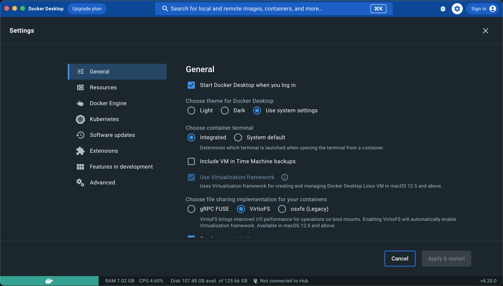

# Development Containers

[Development Containers](https://containers.dev) (devconatiners) je spôsob vývoja v kontajneroch. GUI vývojového prostredia beží na vašom počítači, ale jeho ```backend``` a kompletné spúšťanie kódu v kontajneroch.


Aktuálne je podporované vo [VS Code](https://code.visualstudio.com/docs/devcontainers/containers), pripravovaná je podpora pre [IntelliJ](https://youtrack.jetbrains.com/issue/IDEA-292050).

## Výhody použitia devcontainers

Hlavné výhody použitia devcontainers sú:

- Na počítači vyžaduje len inštaláciu Docker (nepotrebujete mať inštalovanú Javu, NodeJS atď).
- Zjednodušuje celkovú inštaláciu prostredia na počítači vývojára.
- Unifikuje prostredie medzi vývojármi - v kontajneri je inštalovaná presná verzia javy, NodeJS a ďalších nástrojov ako napr. na produkčnom prostredí.

Je to teda vhodné hlavne pre nasledovné scenáre:

- Pracujete na viacerých projektoch, každý používa inú verziu Java, NodeJS a je ťažké koordinovať verzie na vašom počítači.
- Občasne potrebujete pracovať na zastaralom projekte, kde sa používajú už nepodporované technológie a je ťažké ich držať na vašom počítači.
- Projekt potrebujete rýchlo spustiť/vyskúšať/overiť/otestovať.

Samozrejme vývoj má aj nevýhody - beh v kontajneri je o niečo pomalší, hlavne práca so súborovým systémom. Inštalácia ```node_modules``` je výrazne pomalšia (ale vykonávate ju typicky zriedka) a štart WebJET CMS je pomalší o cca 20%. Podobne ```git commit/push``` trvá niekoľko sekúnd dlhšie.

Po spustení projektu v kontajneri sú mapované štandardné HTTP porty 80,443,8080 na lokálny počítač, takže spustený WebJET z kontajnera zobrazíte štandardne vo vašom prehliadači rovnako, ako keby ste projekt spustili na vašom počítači.

Informáciu o spustení z kontajnera vidno vľavo dole kde je modrý text ```Dev Container: meno```.


## Používanie devcontainers

Používanie devcontainers je jednoduché, v IDE sa viete prepínať medzi prácou lokálne a prácou v kontajneri, súborový systém je zdieľaný.

<!-- tabs:start -->
#### **VS Code**

Pre VS Code je potrebné inštalovať rozšírenie `ms-vscode-remote.remote-containers`. Po inštalácii sa vám v ľavom dolnom rohu zobrazí modrá ikona `><` na prepnutie medzi lokálnym vývojom a vývojom v kontajneri. Kliknutím sa  zobrazí možnosť `Reopen in Container` pre otvorenie vývojového prostredia z kontajneru a naopak `Reopen Folder Locally` pre otvorenie lokálnej verzie ak ste v kontajneri.

V ľavej nástrojovej lište sa zobrazuje ikona ```Remote Explorer``` kde sa vám zobrazí zoznam kontajnerov, ktorý môžete v prípade potreby zmazať a vytvoriť nanovo.

Po spustení overte nainštalované rozšírenia, mala by sa vám zobraziť výzva na inštaláciu odporúčaných rozšírení. Skontrolovať ich môžete kliknutím v ľavej lište na ```Extensions``` a zadaním výrazu ```@recommended``` do vyhľadávania. V sekcii ```Workspace recommendations``` sa vám zobrazí zoznam odporúčaných rozšírení aj s možnosťou ich inštalácie.


Pri prvom otvorení projektu sa vám môžu zobraziť chyby kompilácie ```Mapper``` tried, stačí ale triedu otvoriť, spraviť zmenu (medzera, zmazanie medzery) a uložiť súbor a chyba sa opraví.

#### **IntelliJ**

Podpora pre [IntelliJ](https://youtrack.jetbrains.com/issue/IDEA-292050) je pripravovaná, táto sekcia bude doplnená neskôr.

<!-- tabs:end -->
## Nastavenia

Pre [optimálny beh devcontainers](https://code.visualstudio.com/remote/advancedcontainers/improve-performance) je potrebné vykonať nastavenia Docker a ďalších nástrojov.

<!-- tabs:start -->
#### **Windows**

Pre Windows nie sú potrebné špeciálne nastavenia Docker pre urýchlenie behu, môžete ale overiť informácie na vyššie uvedenom odkaze. Môže ale vzniknúť problém s rozdielnym [nastavením konca riadkov medzi Windows/Linux](https://code.visualstudio.com/docs/devcontainers/tips-and-tricks#_resolving-git-line-ending-issues-in-containers-resulting-in-many-modified-files).

#### **MacOS**

Pre MacOS je potrebné optimalizovať nastavenie Docker pre [rýchlejšiu prácu s diskom](https://www.docker.com/blog/speed-boost-achievement-unlocked-on-docker-desktop-4-6-for-mac/). Kliknite na ikonu Docker v menu lište a zvoľte možnosť ```Settings```, v karte ```General``` zvoľte možnosť ```VirtioFS``` v sekcii ```Choose file sharing implementation for your containers```. V karte ```Advanced``` zvoľte možnosť ```Allow the default Docker socket to be used``` a kliknite na tlačidlo ```Apply & Restart```.


<!-- tabs:end -->

V kontajneri môžete použiť DNS záznam ```host.docker.internal``` pre napojenie sa na váš počítač (napr. na váš lokálny databázový server).

## Gitlab/SSH kľúče

Aby vám aj v kontajneri fungovalo pripojenie na gitlab server s použitím SSH kľúčov je potrebné nastaviť [zdieľanie kľúčov](https://code.visualstudio.com/remote/advancedcontainers/sharing-git-credentials) pomocou ```ssh-agent``` medzi vaším počítačom a kontajnerom. Technicky by ste mohli skopírovať priamo SSH kľúč do priečinka ```/home/vscode/.ssh```, to ale nie je ideálne riešenie.

Najskôr je potrebné spustiť ssh-agent (jednorázová operácia):

<!-- tabs:start -->
#### **Windows**

Spustite ```local Administrator PowerShell``` a zadajte nasledovné príkazy:

```sh
# Make sure you're running as an Administrator
Set-Service ssh-agent -StartupType Automatic
Start-Service ssh-agent
Get-Service ssh-agent
```
#### **MacOS**

V MacOS je SSH agent spustený štandardne, malo by stačiť pridať SSH kľúče ako je uvedené nižšie.
<!-- tabs:end -->

A následne pridajte vaše SSH kľúče do ```ssh-agent``` príkazom:

```sh
ssh-add $HOME/.ssh/id_rsa
```

Zoznam pridaných kľúčov zobrazíte príkazom:

```sh
ssh-add -l
```

To môžete následne overiť aj v termináli kontajnera.

Po reštarte devcontainers by vám malo fungovať pripojenie na git/gitlab rovnako ako na vašom počítači. Uvedené nastavenia sú aj v skripte ```.devcontainer/localInit.sh```, ktorý sa vykoná pred každým spustením kontajnera, takže tieto príkazy nepotrebujete vykonávať manuálne.

Ak by ste mali problém s pripojením na git server, vždy sa môžete prepnúť na lokálnu verziu a ```pull/push``` operáciu vykonať lokálne.

## Spustenie prehliadača automatizovaných testov

Ak potrebujete vidieť prehliadač pre automatizované testy je potrebné nastaviť [preposielanie XServer/X11](https://www.oddbird.net/2022/11/30/headed-playwright-in-docker/) (manažér okien pre Linux) na váš počítač.


<!-- tabs:start -->
#### **Windows**

Na Windows je ```XServer``` podporovaný vrámci ```Windows Subsystem for Linux/WSL``` a mal by byť štandardne dostupný na Windows 10 aj 11. Pre overenie spustite ```WSL``` cez štart menu a zadajte nasledovný príkaz:

```sh
ls -a -w 1 /mnt/wslg
```

vo výpise by ste mali vidieť hodnotu ```.X11-unix```. Ak nie, prejdite do obchodu a stiahnite [aktuálnu verziu WSL](https://www.microsoft.com/store/productId/9P9TQF7MRM4R).

Žiaľ v konfigurácii je rozdiel medzi Windows a MacOS, v súbore ```.devcontainer/devcontainer.json``` upravte hodnotu ```"DISPLAY": "host.docker.internal:0"``` na ```"DISPLAY": ":0"```.

#### **MacOS**

Pre MacOS je najskôr potrebné nainštalovať [XQuartz](https://www.xquartz.org). Po inštalácii a reštarte prejdite v aplikácii ```XQuartz``` do ```Preferences -> Security``` a zaškrtnite možnosť ```Allow connections from network clients```.


Reštartnite znova počítač a následne zadajte v termináli príkaz:

```sh
xhost +localhost
```

pre povolenie pripojenia na ```XQuartz``` z lokálneho počítača. Nastavenie ```xhost +localhost``` je aj v skripte ```.devcontainer/localInit.sh```, ktorý sa vykoná pred každým spustením kontajnera, aby ste na to nezabudli.
<!-- tabs:end -->

Po nastavení sa vám bude zobrazovať okno z kontajnerizovaného Linux priamo na vašom počítači. Technicky viete v tomto režime spustiť akúkoľvek GUI aplikáciu inštalovanú v kontajneri.

Pri prvom spustení testov sa možno zobrazí chyba, že nie je nainštalovaný `playwright`, v termináli kontajnera spustite príkazy pre jeho inštaláciu:

```sh
npx playwright install
npx playwright install-deps
```

## Ukážkové súbory

Nasleduje zoznam ukážkových súborov, ktoré môžete použiť ako základ pre váš projekt. Všetky sa nachádzajú v priečinku ```.devcontainer```:

```devcontainer.json``` - samotná konfigurácia ```devcontainer```:

```json
// For format details, see https://aka.ms/devcontainer.json. For config options, see the
// README at: https://github.com/devcontainers/templates/tree/main/src/alpine
{
	"name": "webjetcms-devcontainer",
	// Or use a Dockerfile or Docker Compose file. More info: https://containers.dev/guide/dockerfile
	"image": "mcr.microsoft.com/devcontainers/base:ubuntu",
	"features": {
		//https://github.com/devcontainers/features/tree/main/src/java
		"ghcr.io/devcontainers/features/java:1": {
			"version": "8",
			"jdkDistro": "open",
			"installAnt": true,
			"antVersion": "1.10.12"
		},
		//https://github.com/devcontainers/features/tree/main/src/node
		"ghcr.io/devcontainers/features/node:1": {
			"nodeGypDependencies": true,
			"version": "16"
		}
	},
    "runArgs": [
		//publish ports
		"--publish=80:80",
		"--publish=443:443",
		"--publish=8080:8080"
    ],

	"initializeCommand" : ".devcontainer/localInit.sh || true",
	"postCreateCommand": ".devcontainer/postCreateCommand.sh",
	"postStartCommand": ".devcontainer/postStartCommand.sh",

	//https://www.oddbird.net/2022/11/30/headed-playwright-in-docker/
	"containerEnv": {
        "DISPLAY": "host.docker.internal:0"
    },

	// Use 'forwardPorts' to make a list of ports inside the container available locally.
	//"forwardPorts": []

	// Configure tool-specific properties.
	"customizations": {
		"extensions": [
			"SonarSource.sonarlint-vscode",
			"vscjava.vscode-gradle",
			"naco-siren.gradle-language",
			"mutantdino.resourcemonitor",
			"srmeyers.git-prefix"
		],
		"settings": {
			"window.title": "${activeEditorMedium}${separator}${rootName}",
			"editor.stickyScroll.enabled": true,
			"java.debug.settings.showStaticVariables": true
		}
	}

	// Uncomment to connect as root instead. More info: https://aka.ms/dev-containers-non-root.
	// "remoteUser": "root"
}
```

```localInit.sh``` - skript sa spúšťa na lokálnom počítači pred vytvorením kontajnera:

```sh
#!/bin/sh

#enable MacOS Xquartz connection
xhost +localhost

#add local SSH key to ssh-agent
ssh-add $HOME/.ssh/id_rsa
ssh-add -l
```

```postCreateCommand.sh``` - skript sa spustí po vytvorení kontajnera už v jeho vnútri, umožňuje inštalovať dodatočné programy:

```sh
#!/bin/sh
sudo apt update
sudo apt install iputils-ping
sudo apt -y install imagemagick
```

```postStartCommand.sh``` - skript sa vykoná pri každom spustení kontajnera, z dôvodu pomalého prekladu ```.local``` domén pridáva do ```/etc/hosts``` potrebné DNS záznamy:

```sh
#!/bin/sh

#set local DNS
sudo -- sh -c "echo '#LOCAL DNS FOR WEBJET' >> /etc/hosts"
sudo -- sh -c "echo '127.0.0.1    iwcm.interway.sk iwcm.iway.sk cms.iway.sk docs.interway.sk' >> /etc/hosts"
sudo -- sh -c "echo '1.2.3.4   gitlab.web.iway.local' >> /etc/hosts"
```
