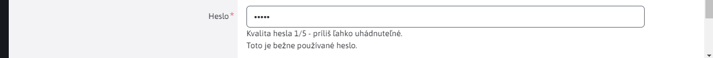

# Kvalita hesiel

Naša implementácia zapúzdruje knižnicu [zxcvbn-ts](https://zxcvbn-ts.github.io/zxcvbn/), ktorá hodnotí kvalitu hesla na základe viacerých parametrov. Okrem štandardných pravidiel ako **dĺžka** hesla, **veľké** písmená, **špeciálne** znaky kontroluje v hesle aj:

- postupnosť znakov na klávesnici, napr. ```asdf```
- dátumy a roky
- opakujúce sekvencie typu ```abcabc```
- bežné mená a priezviská
- známe heslá ako ```password```

Knižnica má **vstavaný slovník najpoužívanejších hesiel** a mien, voči ktorým kontroluje heslo.

Kontrola je implementovaná v administrácii pri vytváraní/úprave používateľa ale aj do prihlasovacej stránky v administrácii, na ktorej informuje používateľa o kvalite zadaného hesla.



## Príklad použitia

Automatické použitie v datatabuľke je jednoduché, konštruktor triedy ```WjPasswordStrength``` používa nasledovné možnosti:

- ```element``` - HTML DOM element, alebo ID elementu (ktorý sa následne získa ako ```document.querySelector```)

```javascript
(new WjPasswordStrength({element: "#DTE_Field_password"})).load();
```

Pri takomto použití sa automaticky na zadaný ```element``` inicializuje kontrola kvality hesla. K elementu sa vyhľadá príslušný ```div[data-dte-e=msg-info]``` do ktorého sa vypíše informácia o kvalite hesla.

## Funkcie

- ```load()``` - asynchrónne načíta slovník často používaných hesiel a po načítaní volá funkciu ```bindToElement()```.
- ```bindToElement(element)``` - inicializuje ```keyup``` udalosť na zadaný element pre kontrolu kvality hesla. Informáciu vypíše do príslušného ```div[data-dte-e=msg-info]```.
- ```checkPassword(password)``` - overí kvalitu zadaného hesla, výsledok vráti v JSON objekte.

## Implementačné detaily

Aktuálne knižnica ```zxcvbn-ts``` obsahuje len ```en,de,fr``` slovníky často používaných hesiel. V našej implementácii sa vo funkcii ```load()``` používa len ```en``` slovník.

Informácia o kvalite hesla využíva prekladové kľúče z WebJET-u ```wj-password-strength.warnings.``` a ```wj-password-strength.rating.```. Objekt ```zxcvbn``` je inicializovaný s prázdnym ```translations``` objektom a vracia priamo kľúče. Tie sú dosadené do WebJET prekladových kľúčov pre vypísanie informácie. Originálne knižnica ```zxcvbn``` neobsahuje preklady do jazykov potrebných pre WebJET, preto sme zvolili takéto riešenie. Naviac je možné texty cez WebJET priamo upravovať.

Knižnica je importovaná v ```app.js``` a dostupná globálne:

```javascript
import { WjPasswordStrength } from './libs/wj-password-strength';
global.WjPasswordStrength = WjPasswordStrength;
```

## Prihlasovacia obrazovka

Knižnica je využitá aj na prihlasovacej obrazovke do administrácie.

Keďže ale prihlasovanie je implementované v starom JSP formáte a zároveň nechceme už na prihlasovacej obrazovke sprístupniť JavaScript súbory plnej administrácie používa prihlasovacia obrazovka priamo ```zxcvbn-ts``` knižnicu. Keďže adresár ```node_modules``` nie je priamo dostupný sú počas ant buildu kopírované súbory z adresárov v ```node_modules/@zxcvbn-ts``` do adresárov v ```admin/skins/webjet8/assets/js/zxcvbn```, aby bola zabezpečená aktualizácia knižníc po aktualizácii cez ```npm update```.

Použitie knižnice je implementované priamo v ```logon-spring.js``` podobne ako v tejto knižnici, prekladové texty sú tiež zadané priamo v JSP súbore (ale cez prekladové kľúče synchronizované s administráciou).

