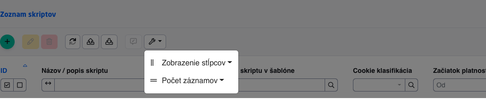
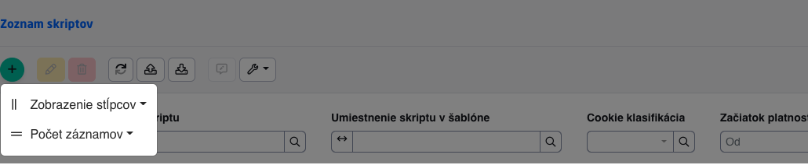

# Automatizované testovanie

Pre automatizované E2E testovanie je používaný framework [CodeceptJS](https://codecept.io). Testy sa píšu v JavaScript-e a prakticky ovládajú prehliadač v ktorom test prebieha. Viac informácií prečo sme zvolili tento framework je v sekcii [Playwright + CodeceptJS](#playwright--codeceptjs).


<!-- @import "[TOC]" {cmd="toc" depthFrom=2 depthTo=6 orderedList=false} -->

<!-- code_chunk_output -->

- [Automatizované testovanie](#automatizované-testovanie)
  - [Inštalácia](#inštalácia)
  - [Spustenie testovania](#spustenie-testovania)
    - [Codecept UI](#codecept-ui)
    - [Generovanie HTML reportu](#generovanie-html-reportu)
  - [Playwright + CodeceptJS](#playwright--codeceptjs)
    - [Konfigurácia](#konfigurácia)
  - [Písanie testov](#písanie-testov)
    - [Lokátory](#lokátory)
    - [Within](#within)
    - [Playwright metódy](#playwright-metódy)
    - [WebJET doplnkové funkcie](#webjet-doplnkové-funkcie)
    - [Čakanie na dokončenie](#čakanie-na-dokončenie)
    - [Pause](#pause)
    - [Prihlasovanie](#prihlasovanie)
    - [Assert knižnica](#assert-knižnica)
    - [Page objekty](#page-objekty)
    - [Detekcia prehliadača](#detekcia-prehliadača)
  - [Odobratie práva](#odobratie-práva)
  - [Vizuálne testovanie](#vizuálne-testovanie)
  - [Best practices](#best-practices)
    - [Názvoslovie](#názvoslovie)
    - [Testovacie dáta](#testovacie-dáta)
    - [Selektory](#selektory)
    - [Časovanie](#časovanie)
    - [Dĺžka scenára](#dĺžka-scenára)
    - [Debugovanie](#debugovanie)
  - [Zmazanie databázy](#zmazanie-databázy)
  - [Testovanie REST služieb](#testovanie-rest-služieb)

<!-- /code_chunk_output -->


## Inštalácia

```shell
cd src/test/webapp/
npm install
```

**POZOR**: pred spustením testovania je potrebné skompilovať JS/CSS admin časti WebJETu:

```shell
cd src/main/webapp/admin/v9/
npm install
npm run prod
```

a spustiť aplikačný server:

```shell
gradlew appRun
```

každý z uvedených príkazov vám odporúčam spustiť v samostatnom Termináli (menu Terminal->New Terminal). Medzi spustenými terminálmi si môžete prepínať v okne ```Terminal```.

## Spustenie testovania

Testovanie spustíte pomocou nasledovných príkazov:

```shell
cd src/test/webapp/

#spustenie vsetkych testov
npm run all

#spustenie konkrétneho testu a zastavenie v prípade chyby
npm run pause tests/components/gallery_test.js

#Spustenie konkrétneho scenára s hodnotou ```@current``` v názve
npm run current
```

Pre spustenie v prehliadači firefox použite prefix ```ff:``` pred názvom:

```shell
npm run ff:all
npm run ff:pause tests/components/gallery_test.js
npm run ff:current
```

Spustenie na inej URL s vypnutým zobrazením prehliadača a prehliadačom ```firefox```:

```shell
CODECEPT_URL="http://demotest.webjetcms.sk" CODECEPT_SHOW=false npm run all
```

**Poznámka:** v prehliadači Firefox sme mali problémy s rýchlosťou testov. Preto sa pre tento prehliadač v súbore ```codecept.conf.js``` nastaví premenná ```autodeayEnabled``` na hodnotu ```true``` a aktivuje sa doplnok ```autodelay```. Ten oneskoruje vykonanie funkcií ```amOnPage,click,forceClick``` o 200ms pred a 300ms po zavolaní príkazu. Tiež sme identifikovali zvláštne správanie prehliadača, ktorý pokiaľ nie je na popredí tak testy z ničoho nič prestanú fungovať a zobrazuje nezmyselné chyby. Pri jednorázovom spustení testu sa vždy test vykonal korektne. Prisudzujeme to nejakej optimalizácii vykonávania JavaScript kódu v prehliadači, keď nie je aktívny. Pri spustení s nezobrazením prehliadača je všetko v poriadku, preto pre spustenie všetkých testov vždy používajte nastavenie ```CODECEPT_SHOW=false```.

### Codecept UI

Codecept ponúka v beta verzii UI pre zobrazenie testovania, spustíte ho príkazom:

```shell
npm run codeceptjs:ui
```

a následne v prehliadači otvoríte stránku ```http://localhost:3001```.

### Generovanie HTML reportu

**Mochawesome**

V npm je nastavený [plugin pre generovanie HTML reportov](https://codecept.io/reports/#html). Vygenerujete ho spustením príkazu:

```shell
npm run codeceptjs --reporter mochawesome
```
a do adresára /build/test/report sa vygeneruje HTML report s výsledkom testu. Pre neúspešné testy sa vytvorí aj fotka obrazovky. Nastavenie je v [codecept.conf.js](../../../src/test/webapp/codecept.conf.js) v sekcii ```mocha```.

**Allure**

Report je možné generovať aj cez [allure](allure.md) spustením testu:

```shell
npm run codeceptjs --plugins allure
```

Po dokončení testu môžete zobraziť výsledky spustením ```allure``` servera:

```shell
allure serve ../../../build/test
```

## Playwright + CodeceptJS

Na testovanie sa používa [Playwright](https://github.com/microsoft/playwright/tree/master/docs) a [CodeceptJS](https://codecept.io/basics/).

Prečo Playwright?

- je to 3. generácia testovacieho frameworku (1. generácia Selenium, 2. generácia Puppeteer, 3. generácia Playwright)
- Microsoft kúpil autorov ```Puppeteer``` frameworku a oni vyvíjajú Playwright, takže majú skúsenosť
- podporuje ```chromium, firefox, webkit``` (2021 májova aktualizácia Windows prepne Edge na chromium jadro)
- vie emulovať rozlíšenia, user agenta, DPI

Prečo CodeceptJS?

- Playwright rovnako ako ```Puppeteer``` je komunikačný (low level) protokol pre ovládanie prehliadača (jeho automatizáciu)
- CodeceptJS je testovací framework, ktorý okrem iného vie používať Playwright
- testovací kód sa píše v JavaScript-e
- kód testov je veľmi [zrozumiteľný](https://codecept.io/playwright/#setup)
- má pokročilé možnosti [Lokátorov](https://codecept.io/locators/#css-and-xpath) - hľadanie elementov podľa textu, css, xpath
- má [GUI](https://codecept.io/ui/) (zatiaľ nevyskúšané) na písanie a zobrazenie výsledku testov

### Konfigurácia

Základná konfigurácia je v súbore ```codecept.conf.js```. Dôležité atribúty:

- ```url``` (http://iwcm.interway.sk) - adresa (doména) servera. Ten môžete zmeniť cez ```--override``` parameter a prepnúť testovanie z DEV na TEST/PROD prostredie.
- ```output``` (../../../build/test) - adresár do ktorého sa vám vygeneruje fotka obrazovky v prípade neúspešného testu (predvolený na ```build/test``` v koreňovom adresári)
- ```browser``` (chromium) - zvolený prehliadač na spustenie testov, môže byť ```chromium, firefox, webkit```
- ```emulate``` (zakomentovane) - [emulácia](https://github.com/Microsoft/playwright/blob/master/src/deviceDescriptors.ts) zariadenia
- ```screenshotOnFail``` - zapne/vypne vytváranie screenshotov v prípade neúspešného testu

## Písanie testov

Testy sa vytvárajú v pod adresároch tests, kde sú delené podľa jednotlivých modulov/aplikácií WebJETu. Sú písane v jazyku JavaScript, takže je možné využívať všetky možnosti, ktoré vám JavaScript ponuka.

Príklad komplexnejšieho testu na otestovanie prihlásenia [src/test/webapp/tests/admin/login.js](../../../src/test/webapp/tests/admin/login.js):

**Upozornenie:** do ```Feature``` zápisu zadávajte hodnotu vo formáte ```adresár.podadresár.meno-súboru``` pre korektné zobrazenie testov v stromovej štruktúre a ľahké dohľadanie súboru podľa vypísaného ```Feature``` v log súbore.

```javascript
Feature('admin.login');

//Before sa vola pred kazdym Scenarom, v kazdom scenati volam /admin/ a zadavam username tester
Before(({I}) => {
    I.amOnPage('/admin/');
    I.fillField("username", "tester");
});

//Kazdy scenar sa spusta samostatne a samostatne sa vyhodnocuje
Scenario('zle zadane heslo', ({I}) => {
    //do pola password vyplnim zle heslo
    I.fillField("password", "wrongpassword");
    //kliknem na tlacitko
    I.click("login-submit");
    //overim, ci sa zobrazi uvedena hlaska
    I.see("Zadané meno alebo heslo je nesprávne.");
});

Scenario('prihlasenie zablokovane', ({I}) => {
    I.fillField("password", "wrongpassword");
    I.click("login-submit");
    I.see("Pre nesprávne zadané prihlasovacie údaje je prihlásenie na 10+ sekúnd zablokované");
    I.say("Cakam 10 sekund na expirovanie zablokovanej IP adresy");
    //je potrebne cakat 10 sekund na expirovanie zleho hesla
    I.wait(13);
    //odkomentujte pre zobrazenie interaktivneho terminalu
    //pause();
});

Scenario('uspesne prihlasenie', ({I}) => {
    I.fillField("password", secret("************"));
    I.click("login-submit");
    I.see("WebJET 2021 info");
    //konecne som prihlaseny
    I.wait(1);
    //zobrazim dropdown s menom usera, ten vyberam cez CSS selector
    I.click({css: "li.dropdown.user"});
    //overim, ci vidim moznost Odhlasenia
    I.see("Odhlásenie");
    //kliknem na odhlasenie, vsimnite si, ze to selectujem podla textu linky
    I.click("Odhlásenie");
    //overim, ci sa zobrazi text Prihlasenie (som korektne odhlaseny)
    I.see("Prihlásenie");
});
```

Všimnite si, že v ukážke schválne používam rôzne lokátory/selektory (meno fieldu, text/label, CSS selector). To je jedna z výhod CodeceptJS. Viac o možnostiach Lokátorov je v [dokumentácii](https://codecept.io/locators/#css-and-xpath).

### Lokátory

Lokátory (selectory), ktoré vyberajú element na stránke sú dobre popísané v [oficiálnej dokumentácii](https://codecept.io/locators/).

```
{permalink: /'foo'} matches <div id="foo">
{name: 'foo'} matches <div name="foo">
{css: 'input[type=input][value=foo]'} matches <input type="input" value="foo">
{xpath: "//input[@type='submit'][contains(@value, 'foo')]"} matches <input type="submit" value="foobar">
{class: 'foo'} matches <div class="foo">
```

### Within

Pomocou zápisu ```within``` môžete obmedziť element, na ktorý sa použijú nasledovné príkazy:

```javascript
within("div.breadcrumb-language-select", () => {
    I.click("Slovenský jazyk");
    I.click("Chorvátsky jazyk");
});
```

zároveň väčšina príkazov umožňuje zapísať aj selektor do príkazu, vyššie uvedené sa dá zapísať aj ako:

```javascript
  I.click("Slovenský jazyk", "div.breadcrumb-language-select");
  I.click("Chorvátsky jazyk", "div.breadcrumb-language-select");
```

### Playwright metódy

V [oficiálnej dokumentácii](https://codecept.io/helpers/Playwright/) je zoznam všetkých možností ```I``` objektu. Krátke odkazy:

- [pressKey](https://codecept.io/helpers/Playwright/#presskey)
- [click](https://codecept.io/helpers/Playwright/#click)
- [forceClick](https://codecept.io/helpers/Playwright/#forceclick) - vynútené kliknutie bez čakania na udalosť, je potrebné použiť na custom ```checkboxy``` (inak sa tam zacyklí)
- [see](https://codecept.io/helpers/Playwright/#see) / [dontSee](https://codecept.io/helpers/Playwright/#dontsee)
- [seeElement](https://codecept.io/helpers/TestCafe/#seeelement) / [dontSeeElement](https://codecept.io/helpers/Detox/#dontseeelement)
- [fillField](https://codecept.io/helpers/Playwright/#fillfield)
- [selectOption](https://codecept.io/helpers/Playwright/#selectoption)
- [wait](https://codecept.io/helpers/Playwright/#wait)
- [selectOption](https://codecept.io/helpers/Playwright/#selectoption)
- [executeScript](https://codecept.io/helpers/Playwright/#executescript)
- [saveScreenshot](https://codecept.io/helpers/Playwright/#savescreenshot)

### WebJET doplnkové funkcie

Pre WebJET sme doplnili niekoľko užitočných funkcií:

- [I.formatDateTime(timestamp)](../../../src/test/webapp/steps_file.js) - naformátuje timestamp na dátum a čas s využitím moment knižnice
- [I.seeAndClick(selector)](../../../src/test/webapp/steps_file.js) - počká na zobrazenie elementu a následne naň klikne
- [I.clickIfVisible(selector)](../../../src/test/webapp/custom_helper.js) - ak je daný element zobrazený klikne naň, ak zobrazený nie je preskočí krok (nevyhodí chybu)
- [I.verifyDisabled(selector)](../../../src/test/webapp/custom_helper.js) - overí, či dané pole je neaktívne
- [I.wjSetDefaultWindowSize()](../../../src/test/webapp/steps_file.js) - nastaví predvolenú veľkosť okna po jeho zmene, je volané automaticky aj po prihlásení v prihlasovacej sekvencii v [codecept.conf.js](../../../src/test/webapp/codecept.conf.js)
- [Document.compareScreenshotElement(selector, screenshotFileName, width, height, tolerance)](../../../src/test/webapp/codecept.conf.js) - vykoná [vizuálne porovnanie](#vizuálne-testovanie)
- `I.waitForTime(time)` - čakanie do zadaného času (timestamp).
- `I.toastrClose()` - zatvorenie okna `toastr` notifikácie.
- `clickCss(name, parent=null)` - vykoná kliknutie rovnako ako `I.click` ale `name` považuje za CSS selektor - vykonanie je rýchlejšie, nie je potrebné použiť obalenie do `{css: name}`.
- `forceClickCss(name, parent=null)` - vykoná kliknutie rovnako ako `I.forceClick` ale `name` považuje za CSS selektor - vykonanie je rýchlejšie, nie je potrebné použiť obalenie do `{css: name}`.

Pre datatabuľku máme pripravené špeciálne funkcie. Sú implementované v [DT.js](../../../src/test/webapp/pages/DT.js):

- ```DT.waitForLoader(name)``` - čaká na zobrazenie a následné schovanie informácie "Spracúvam" v datatabuľke. Používa sa ako ```DT.waitForLoader("#forms-list_processing");```
- ```DT.filter(name, value, type=null)``` - nastaví hodnotu ```value``` do textového filtra stĺpca ```name``` datatabuľky. Ak je zadaný aj atribút ```type``` nastaví sa typ hľadania (napr. Začína na, Končí na, Rovná sa).
- ```DT.filterSelect(name, value)``` - nastaví hodnotu ```value``` do výberového poľa (select) filtra stĺpca ```name``` datatabuľky. Používa sa ako ```DT.filterSelect('cookieClass', 'Neklasifikované');```
- ```async I.getDataTableColumns(dataTableName)``` - vráti objekt DATA s definíciou datatabuľky, používa sa v automatickom testovaní datatabuľky
- ```async getDataTableId(dataTableName)``` - vráti ID datatabuľky, volá JS funkciu ```dataTable.DATA.id```
- [async I.getTotalRows()](../../../src/test/webapp/custom_helper.js) - vráti celkový počet záznamov v datatabuľke
- ```DT.deleteAll(name = "datatableInit")``` - zmaže aktuálne zobrazené záznamy, pred použitím vždy použite ```DT.filter``` pre filtrovanie potrebných údajov.

Pre Datatable Editor implementované v [DTE.js](../../../src/test/webapp/pages/DTE.js):

- ```DTE.waitForLoader(name)``` - čaká na schovanie ```loadera``` v editore (uloženie záznamu)
- ```DTE.waitForEditor(name)``` - čaká na zobrazenie editora, ak je definované name, použije sa datatabuľka s daným menom, predvolene ```datatableInit```
- ```DTE.selectOption.(name, text)``` - vyberie hodnotu v select boxe (korektným spôsobom zobrazením možností a následným kliknutím na možnosť)
- ```DTE.save(name)``` - klikne na tlačidlo Uložiť v editore, ak je definované name, použije sa datatabuľka s daným menom, predvolene ```datatableInit```
- ```DTE.cancel(name)``` - klikne na tlačidlo zatvorenia editora, ak je definované name, použije sa datatabuľka s daným menom, predvolene ```datatableInit```
- ```DTE.fillField(name, value)``` - vyplní štandardné pole, na rozdiel od volania ```I.fillField``` je možné do ```name``` parametra zadať priamo meno poľa na backende/json definícii.
- ```DTE.fillQuill(name, value)``` - vyplní hodnotu do poľa typy ```QUILL```.
- ```DTE.fillCkeditor(htmlCode)``` - nastaví HTML kód do aktuálne zobrazeného CKEditor-a.
- ```DTE.fillCleditor(parentSelector, value)``` - zadá text do WYSIWYG ```cleditor```. Hodnota ```parentSelector``` - odkaz na element v ktorom sa ```cleditor``` nachádza (napr. ```#forum```), ```value``` - hodnota na vyplnenie, POZOR, nevie to zatiaľ diakritiku z dôvodu použitia ```type``` príkazu.
Pre datatabuľku je možné vykonať aj [automatizovaný test](datatable.md).
- `DTE.appendField(name, value)` - doplní text to poľa v editore, rieši problém s použitím `I.appendField`, ktoré sa v editore nevykoná vždy správne.

Pre JsTree (stromovú štruktúru):

- ```I.jstreeClick(name)``` - klikne na zvolený text v jstree (dôležité použiť hlavne vo web stránkach kde je linka s rovnakým menom ako adresár aj v zozname stránok)
- ```I.createFolderStructure(randomNumber)``` - pripraví stromovú štruktúru adresára a dvoch pod adresárov na testovanie
- ```I.deleteFolderStructure(randomNumber)``` - zmaže stromovú štruktúru adresára a dvoch podadresárov pripravených cez ```I.createFolder```

```javascript
//povodne ZLE riesenie s I.wait
I.click("Pridať");
```

- ```I.jstreeNavigate(pathArray)``` - v poli ```pathArray``` je možné definovať mená jednotlivých uzlov v stromovej štruktúre, na ktoré funkcia postupne klikne napr.  ```I.jstreeNavigate( [ "English", "Contact" ] );```.

Pre overenie hodnôt v tabuľke môžete použiť funkcie:

- ```DT.checkTableCell(name, row, col, value)``` - overí v zadanej tabuľke (ID tabuľky) hodnotu ```value``` v zadanom riadku ```row``` a stĺpci ```col```. Riadky a stĺpce začínajú číslom 1.
- ```DT.checkTableRow(name, row, values)``` - overí v zadanej tabuľke (ID tabuľky) v zadanom riadku ```row``` hodnoty v poli ```values```. Riadky začínajú číslom 1. Napr. ```DT.checkTableRow("statsDataTable", 1, ["13", "2 022", "30", "533", "229", "1"]);```.

Funkcie implementované v ```Document``` objekte:

- ```switchDomain(domain)``` - prepne doménu na zadanú hodnotu.
- ```setConfigValue(name, value)``` - nastaví konfiguračnú premennú so zadaným názvom a hodnotou.
- ```resetPageBuilderMode()``` - zmaže zapamätaný režim editora (štandardný/PageBuilder).
- `notifyClose` - zatvorí `toastr` notifikáciu.
- `notifyCheckAndClose(text)` - overí text v `toastr` notifikácii a zatvorí ju.
- `editorComponentOpen()` - otvorí nastavenie aplikácie v editore stránok (okno `editor_component.jsp`).
- `editorComponentOk()` - klikne na tlačidlo OK pre uloženie nastavenia aplikácie.
- `scrollTo(selector)` - posunie obsah okna na zadaný element.

V ```Document``` objekte sú aj funkcie pre vytváranie [fotiek obrazovky](screenshots.md).

### Čakanie na dokončenie

Všeobecne sa neodporúča používať ```I.wait``` s fixnou dobou. Čas potrebný na čakanie môže byť odlišný na lokálnom počítači a v CI/CD pipeline. Naviac fixný čas môže zbytočne predlžovať dobu potrebnú na vykonanie testu.

Odporúčame použiť metódy [waitFor*](https://codecept.io/helpers/TestCafe/#waitforelement) a to hlavne ```waitForElement```, ```waitForText```, ```waitForVisible``` a ```waitToHide```.

Výhodné je použitie hlavne ```waitForText``` kde môžeme efektívne nahradiť ```I.wait``` a následné ```I.see``` za jeden príkaz:

```javascript
//povodne ZLE riesenie s I.wait
I.click("Pridať");
I.wait(1);
I.see("test-adresar-" + randomNumber, container);

//nove riesenie s I.waitForText, caka sa maximalne 10 sekund
I.click("Pridať");
I.waitForText("test-adresar-" + randomNumber, 10, container);
```

### Pause

Ak do kódu testu niekde dáte príkaz ```pause()```, tak sa zastaví vykonávanie testov a v Termináli sa vám zobrazí interaktívna konzola, v ktorej viete spúšťať príkazy. Takto dokážete pripraviť kroky testu a následne jednoducho príkazy skopírovať do JS súboru s testom.

```shell
 ...
 Interactive shell started
 Use JavaScript syntax to try steps in action
 - Press ENTER to run the next step
 - Press TAB twice to see all available commands
 - Type exit + Enter to exit the interactive shell
 - Prefix => to run js commands
 I.
```

pomocou 2x stlačenia TAB klávesy sa vám zobrazí nápoveda (zoznam možných príkazov). Tie môžete zadávať a sledovať, čo sa deje v prehliadači. Stlačením Enter klávesy sa test posunie na ďalší príkaz. Zadaním ```exit``` sa ukončí interaktívny terminál a test bude pokračovať automatizovane ďalej.

### Prihlasovanie

V súbore [codecept.conf.js](../../../src/test/webapp/codecept.conf.js) je definované aj prihlasovanie cez rozšírenie [autologin](https://codecept.io/plugins/#autologin):

```javascript
autoLogin: {
    enabled: true,
    saveToFile: true,
    inject: 'login',
    users: {
        admin: {
            login: (I) => {
            I.amOnPage('/admin/');
            I.fillField("username", "tester");
            I.fillField("password", secret("********"));
            I.click("login-submit");
            },
            check: (I) => {
                I.amOnPage('/admin/');
                I.see("WebJET 2021 info");
            }
        }
    }
}
```

Je možné definovať viacero používateľov (opakovať atribút admin), napr. registrovaného používateľa, administrátora s obmedzenými právami a podobne.

Prihlásenie je možné do testov vkladať pomocou ```Before``` funkcie:

```javascript
Feature('gallery');

Before(({login}) => {
    login('admin');
});

Scenario('zoznam fotografii', ({I}) => {
    I.amOnPage("/admin/v9/apps/gallery");
    I.click("test");
    I.see("koala.jpg");
});
```

### Assert knižnica

Dostupné je rozšírenie [codeceptjs-chai](https://www.npmjs.com/package/codeceptjs-chai) pre volanie assert funkcií:

Základné použitie:

```javascript
I.assertEqual(1, 1);
I.assertEqual('foo', 'foo');
I.assertEqual('foo', 'foo', 'Both the values are not equal');

I.assertNotEqual('foobar', 'foo', 'Both the values are equal');

I.assertContain('foobar', 'foo', 'Target value does not contain given value');
I.assertNotContain('foo', 'bar', 'Target value contains given value');

I.assertStartsWith('foobar', 'foo', 'Target value does not start with given value');
I.assertNotStartsWith('foobar', 'bar', 'Target value starts with given value');

I.assertEndsWith('foobar', 'bar', 'Target value does not ends with given value');
I.assertNotEndsWith('foobar', 'bar', 'Target value ends with given value');

I.assertLengthOf('foo', 3, 'Target data does not match the length');
I.assertLengthAboveThan('foo', 2, 'Target length or size not above than given number');
I.assertLengthAboveThan('foo', 4, 'Target length or size not below than given number');

I.assertEmpty('', 'Target data is not empty');

I.assertTrue(true, 'Target data is not true');
I.assertFalse(false, 'Target data is not false');

I.assertAbove(2, 1, 'Target data not above the given value');
I.assertAbove(1, 2, 'Target data not below the given value');
```

Ak je potrebné, môžete využiť aj [assert](https://www.npmjs.com/package/assert) knižnicu. Príklad použitia je v teste [gallery.js](../../../src/test/webapp/tests/components/gallery.js):

```javascript
const assert = require('assert');
...
assert.equal(+inputValueH, +area.h);
```

### Page objekty

Na vytvorenie univerzálnych testovacích scenárov je zložka [Pages] do ktorej sa generujú Page objekty
cez príkaz `npx codeceptjs gpo`, vytvorí sa page objekt pomocou ```Dependency Injection``` (podobne ako v Angular).

```javascript
const { I } = inject();

module.exports = {

  // insert your locators and methods here
}
```
Na to aby sme ho vedeli používať v testoch ho treba zaregistrovať v [codecept.conf.js].

```javascript
exports.config = {
    include: {
        I: './steps_file.js',
        PageObject: './pages/PageObject.js'
    }
}
```
Následne ho vieme vložiť do nášho testovacieho scenára.

```javascript
Scenario('test-scenario', ({I, PageObject}) => {
  PageObject.someMethod();
})
```
Je možné vložiť objekty do testov aj dynamicky cez `injectDependencies({})`.

```javascript
Scenario('test-scenario', ({I, PageObject}) => {
  I.fillField('Username', PageObject.username);
  I.pressKey('Enter');
}).injectDependencies({ PageObject: require('./PageObject.js') });
```

### Detekcia prehliadača

Ak sa vám testy správajú rozdielne v prehliadači Firefox alebo Chromium je možné v testoch použiť funkcie na overenie použitého prehliadača.

```javascript
if (Browser.isChromium()) {
  I.amOnPage("/admin/v9/apps/insert-script#/");
  ...
}

if (Browser.isFirefox()) {
  I.say("Firefox, skipping test");
  return;
}

if (Browser.isFirefox()) {
    //ff ma nejak inak kurzor a je potrebne este 2x ist hore
    I.pressKey('ArrowUp');
    I.pressKey('ArrowUp');
}
```

## Odobratie práva

Volaním adresy stránky s parametrom ```removePerm``` je možné za behu odobrať zadané právo prihlásenému používateľovi (bez uloženia zmien v právach), ak prihlasovacie meno používateľa začína na ```tester```. Je tak možné testovať zobrazenie stránky bez zadaného práva a overiť tak bezpečnosť volania REST služieb.

Odobratie práva je implementované vo funkcii ```DT.checkPerms(perms, url)``` v [DT.js](../../../src/test/webapp/pages/DT.js). Vyžaduje zadať právo a adresu stránky na ktorej sa právo testuje. Testo overuje zobrazenie notifikácie ```Prístup k tejto stránke je zamietnutý```.
 Voliteľný parameter ```datatableId``` reprezentuje ID/meno tabuľky v stránke (je potrebné zadať ak je v stránke viacero datatabuliek).

Príklad použitia:

```javascript
Scenario('zoznam stranok', ({ I, DT }) => {
    I.waitForText("Newsletter", 20);
    I.click("Newsletter", container);
    I.see("Testovaci newsletter");

    //over prava
    DT.checkPerms("menuWebpages", "/admin/v9/webpages/web-pages-list/");
});
```

Do parametra ```removePerm``` je možné zadať aj viacero práv oddelených čiarkou.

Pri datatabuľkách je možné nastavovať aj práva na [jednotlivé tlačidlá](../datatables/README.md#tlačidlá-podľa-práv) (pridať, editovať, duplikovať, zmazať). Testovať tak môžete aj jednotlivo vypnuté práva. Pre overenie práv na backende je ale potrebné testovať aj REST službu. Pridaním výrazu ```forceShowButton``` do parametra ```removePerm``` pri používateľovi s prihlasovacím menom začínajúcim na ```tester``` sa tlačidlá v datatabuľke zobrazia. Je tak možné otestovať zobrazenie chybového hlásenia z REST služby (že skutočne záznam nejde pridať/editovať/zmazať). Príklad je vo ```webpage-perms.js```:

```javascript
Scenario('stranky-overenie prav na tlacidla', ({ I, login, DT, DTE }) => {
    login("admin");
    I.amOnPage("/admin/v9/webpages/web-pages-list/?removePerm=addPage,pageSave,deletePage,pageSaveAs");
    I.dontSeeElement("#datatableInit_wrapper button.buttons-create");
    I.dontSeeElement("#datatableInit_wrapper button.buttons-edit");
    I.dontSeeElement("#datatableInit_wrapper button.btn-duplicate");
    I.dontSeeElement("#datatableInit_wrapper button.buttons-remove");

    //over v dialogu
    I.click("Jet portal 4 - testovacia stranka");
    DTE.waitForEditor();
    I.dontSeeElement("#datatableInit_modal div.DTE_Form_Buttons button.btn-primary");

    I.amOnPage("/admin/v9/webpages/web-pages-list/?removePerm=addPage,pageSave,deletePage,pageSaveAs,forceShowButton&groupid=67");
    DT.waitForLoader();
    //skus pridat
    I.click("#datatableInit_wrapper button.buttons-create");
    I.click("#pills-dt-datatableInit-basic-tab");
    I.fillField("Názov web stránky", auto_webPage);
    DTE.save();
    I.see("Pridať web stránku - nemáte právo na pridanie web stránky");
    DTE.cancel();

    //skus editovat
    I.jstreeNavigate(["Test stavov", "Nedá sa zmazať"]);
    I.click("Nedá sa zmazať", "#datatableInit");
    DTE.waitForEditor();
    I.click("#pills-dt-datatableInit-basic-tab");
    I.seeInField("Názov web stránky", "Nedá sa zmazať");
    DTE.save();
    I.see("Nemáte právo na editáciu web stránky");
    DTE.cancel();

    //skus zmazat
    DT.filter("title", "Nedá sa zmazať");
    I.click("table.datatableInit button.buttons-select-all");
    I.click("#datatableInit_wrapper button.buttons-remove");
    DT.waitForEditor();
    I.see("Naozaj chcete zmazať položku?");
    DTE.save();
    I.see("Nemáte právo na editáciu web stránky");
});
```

**Technické informácie:**

Odobratie práva je implementované v [ThymeleafAdminController.removePermissionFromCurrentUser](../../../src/main/java/sk/iway/iwcm/admin/ThymeleafAdminController.java). Pri zadaní URL parametra ```removePerm``` sú upravené práva aktuálne prihláseného používateľa vrátane Spring kontextu.

## Vizuálne testovanie

Funkciu vizuálneho testovania je potrebné použiť na overenie zobrazenia, ktoré sa nedá overiť testovaním textu (napr. korektná pozícia výberového menu). Využitý je [plugin pixelMatchHelper](https://github.com/stracker-phil/codeceptjs-pixelmatchhelper), ktorý vie porovnať referenčnú fotku obrazovky s aktuálnou a zároveň vie zvýrazniť zmeny.

Pre zjednodušenie použitia sme pripravili funkciu ```Document.compareScreenshotElement(selector, screenshotFileName, width, height, tolerance)```, ktorá zabezpečí potrebné kroky. Má parametre:

- ```selector``` - ```selector``` elementu, z ktorého sa má spraviť snímka (nerobí sa z celej obrazovky, ale len zo zadaného elementu)
- ```screenshotFileName``` - meno súboru snímky, automaticky sa porovná s rovnakým menom obrázku v adresári ```src/test/webapp/screenshots/base```. Pre meno súboru použitie prefix ```autotest-``` pre lepšie dohľadanie vytvorenej snímky
- ```width``` (voliteľné) - šírka okna prehliadača
- ```height``` (voliteľné) - výška okna prehliadača
- ```tolerance``` (voliteľné) - miera tolerancie rozdielov voči referenčnému obrázku (0-100)

Príklad použitia:

```javascript
Document.compareScreenshotElement("#insertScriptTable_wrapper", "autotest-insert-script-settings.png", 1280, 270);
```

Pri prvom spustení pravdepodobne nebude existovať referenčný obrázok. Test ale vytvorí aktuálnu snímku a uloží ho do adresára ```build/test``` (preto odporúčame meno obrázku prefixovať textom autotest- aby sa obrázok dal ľahko nájsť medzi screenshotmi chýb z testovania). Ak chcete obrázok použiť ako referenčný skopírujte ho do adresára ```src/test/webapp/screenshots/base```. Následne pri ďalšom spustení bude porovnaný referenčný obrázok s web stránkou.

Identifikované rozdiely sú generované do obrázkov v adresári ```src/test/webapp/screenshots/diff``` pre jednoduché overenie chyby. Test zároveň pri identifikovaní rozdielov vyhlási chybu ako akýkoľvek iný testovací scenár.

Príklad chyby zobrazenia (zlá pozícia výberového menu) - referenčný base obrázok:



chybné zobrazenie v stránke:



výsledné porovnanie so zvýraznením rozdielnej oblasti (ružová farba):


**Poznámky k implementácii**

Porovnanie obrázkov je zapúzdrené do funkcie ```Document.compareScreenshotElement``` implementovanej v ```Document.js```. Pri zadaní veľkosti okna vykoná zmenu veľkosti a po vytvorení screenshotu vráti okno do východzej veľkosti volaním funkcie ```I.wjSetDefaultWindowSize()``` (táto je pre konzistenciu volaná aj po každom prihlásení).

## Best practices

Pre úspešné a opakované spúšťanie testov odporúčame dodržať nasledovné body:

### Názvoslovie

- scenár začínate funkciou ```Feature('xxx');``` kde ako xxx použite meno súboru s testom. Ak nastane chyba ľahko tak vyhľadáte príslušný súbor s testom.

### Testovacie dáta

- pripravte a zmažte si testovacie dáta
- všetky vytvorené objekty musia obsahovať text ```autotest``` pre identifikovanie objektov vytvorených automatizovaným testom
- odporúčame použiť volanie ```I.getRandomText()``` pre získanie unikátneho suffixu, použitie vidno napr. v [group-internal.js](../../../src/test/webapp/tests/webpages/group-internal.js) kde sú definované premenné a sú naplnené v ```Before``` funkcii
- je ideálne, ak testovacie dáta vytvoríte v samostatnom scenári a aj ich zmažete v samostatnom scenári. Ak teda padne niektorý test, tak zmazanie dát sa vykoná aj tak.

```javascript
var auto_name, auto_folder_internal, auto_folder_public, sub_folder_public;

Before(({ I, login }) => {
     login('admin');
     I.amOnPage('/admin/v9/webpages/web-pages-list#/');

     if (typeof auto_name=="undefined") {
          var randomNumber = I.getRandomText();
          auto_name = 'name-autotest-' + randomNumber;
          auto_folder_internal = 'internal_folder-autotest-' + randomNumber;
          auto_folder_public = 'public_folder-autotest-' + randomNumber;
          sub_folder_public = 'sub_folder_public-autotest-' + randomNumber;
     }
});
```

### Selektory

Je dôležité používať korektné selektory, text/element sa môže v stránke nachádzať viac krát a následne test náhodne padá. Používajte pripravené funkcie ako ```I.jstreeClick(name)``` pre stromovú štruktúru a funkcie začínajúce na DT./DTE. pre datatabuľku a editor napr. ```DTE.selectOption(name, text)``` alebo ```DT.filterSelect(name, value)```.

Odporúčame si selektor vyskúšať v JS konzole prehliadača s využitím jQuery, napríklad:

```javascript
//tlacidlo na pridanie zaznamu
$(".btn.btn-sm.buttons-create.btn-success.buttons-divider");

//v konzole bude vidno, ze vo web strankach je takych tlacidiel viacero:
//1xjstree a 2xdatatabulka z ktorej jedna je neviditelna pre adresare)
//je preto potrebne selektor zuzit tak, aby obsahoval vhodny parent kontajner

//zuzene len na column so stromovou strukturou - najde korektne len jedno tlacidlo
$("div.tree-col .btn.btn-sm.buttons-create.btn-success.buttons-divider")
```

### Časovanie

Časovanie vykonávania je veľmi dôležité, na inom počítači, alebo na serveri môže test bežať inou rýchlosťou. Je potrebné korektne čakať na dokončenie asynchrónnych volaní na server. Podobne môže byť problém s čakaním na otvorenie dialógového okna, uloženie dát a podobne.

Nepoužívajte fixný čas typu ```I.wait(1)``` ale používajte volania ```I.waitFor...``` alebo naše ```DT.waitFor...```. Viac je v sekcii [Čakanie na dokončenie](#čakanie-na-dokončenie) a [WebJET doplnkové funkcie](#webjet-doplnkové-funkcie).

Typické príklady:

```javascript
//kliknutie na tlacidlo Pridat a cakanie na otvorenie editora
I.click(add_button);
DTE.waitForEditor("groups-datatable");

//cakanie na loading datatabulky
DT.waitForLoader
//cakanie na otvorenie editora
DTE.waitForEditor
//cakanie na ulozenie editora
DTE.waitForLoader
```

**Každé volanie**, ```I.click('Uložiť');``` musí čakať na uloženie cez ```DTE.waitForLoader```.

### Dĺžka scenára

Pokúste sa mať jednotlivé scenáre krátke, nespájajte nesúvisiace časti do jedného scenára. Môžete si ale pripraviť testovacie dáta a tie znova použiť vo viacerých scenároch (ušetrí sa tak čas vytvárania a mazania dát medzi scenármi).

Scenár je možné spúšťať aj samostatne použitím ```--grep``` parametra viď [Spustenie testovania](#spustenie-testovania).

### Debugovanie

Test môžete spustiť s parametrom ```-p pauseOnFail```, ak nastane chyba automaticky sa zobrazí interaktívna konzola. V nej môžete overiť stav prehliadača a prípadne vyskúšať opravný príkaz, ktorý následne premietnete aj do testu.

Z tohto dôvodu nepoužívajte ```After``` funkciu v scenári, pretože tá sa vykoná pred vyvolaním interaktívnej konzoly po chybe a okno prehliadača už nebude v rovnakom stave.

## Zmazanie databázy

Databáza používaním testov rastie, keďže adresáre aj web stránky sa po zmazaní presunú do koša. Je dôležité tieto údaje z databázy raz za kvartál zmazať. Môžete použiť nasledovný SQL príkaz:

```sql
DELETE FROM emails_campain WHERE subject LIKE '%-autotest%';
OPTIMIZE TABLE emails_campain;
DELETE FROM groups WHERE group_name LIKE '%sk-mirroring-subfolder%' OR group_name LIKE '%sk-mir-subfolder%' OR group_name LIKE '%-autotest%' OR group_name LIKE '%_autotest%' OR group_name LIKE '%test-adresar-2%';
OPTIMIZE TABLE groups;
DELETE FROM groups_scheduler WHERE group_name LIKE '%sk-mirroring-subfolder%' OR group_name LIKE '%sk-mir-subfolder%' OR group_name LIKE '%-autotest%' OR group_name LIKE '%_autotest%' OR group_name LIKE '%test-adresar-2%';;
OPTIMIZE TABLE groups_scheduler;
DELETE FROM documents WHERE (doc_id NOT IN (7611, 18426, 2664, 27827, 29195, 29289, 64425, 50222)) AND (title LIKE '%sk-mirroring-subfolder%' OR title LIKE '%sk-mir-subfolder%' OR title LIKE '%-autotest%' OR title LIKE '%_autotest%' OR title LIKE 'test-adresar-%' OR title='Nová web stránka' OR title LIKE 'page-%' OR title LIKE 'dobré ráno-%' OR title LIKE 'good morning-%');
OPTIMIZE TABLE documents;
DELETE FROM documents_history WHERE title LIKE '%sk-mirroring-subfolder%' OR title LIKE '%sk-mir-subfolder%' OR title LIKE '%-autotest%' OR title LIKE '%_autotest%' OR title LIKE 'test-adresar-%' OR title='Nová web stránka' OR title LIKE 'page-%' OR title LIKE 'Test_volnych_poli_sablony%';
DELETE FROM documents_history WHERE doc_id=4 AND history_id>26 AND actual=0 AND publicable=0;
OPTIMIZE TABLE documents_history;
DELETE FROM _adminlog_ WHERE log_id>10 AND log_id NOT IN (58993, 58730, 103758, 103756);
OPTIMIZE TABLE _adminlog_;
DELETE FROM monitoring WHERE monitoring_id > 1219015;
OPTIMIZE TABLE monitoring;
DELETE FROM enumeration_data WHERE child_enumeration_type_id IS NOT NULL;
DELETE FROM enumeration_data WHERE parent_enumeration_data_id IS NOT NULL;
DELETE FROM enumeration_data WHERE string1 like '%testTest%';
DELETE FROM enumeration_data WHERE string1 like 'string1%';
OPTIMIZE TABLE enumeration_data;
UPDATE enumeration_type SET child_enumeration_type_id=NULL WHERE name like '%AutoTest%' AND enumeration_type_id>2283;
DELETE FROM enumeration_type WHERE name like '%AutoTest%' AND enumeration_type_id>2283;
OPTIMIZE TABLE enumeration_type;
```

## Testovanie REST služieb

CodeceptJS podporuje aj [testovanie REST služieb](https://codecept.io/helpers/REST/). Nastavenie je v ```codecept.conf.js```:

```javascript
exports.config = {
  helpers: {
    REST: {
      defaultHeaders: {
        'x-auth-token': 'dGVzd.....g8'
      },
    },
    JSONResponse: {},
  }
}
```

Príklad volania REST služieb a testovania vráteného stavu, prihlásenia a JSON objektu:

```javascript
Before(({ I }) => {
    I.amOnPage('/logoff.do?forward=/admin/');
});

Scenario("API volanie", ({ I }) => {
    I.sendGetRequest('/admin/rest/web-pages/all?groupId=25');
    I.seeResponseCodeIs(200);
    I.seeResponseContainsKeys(['numberOfElements', 'totalPages']);
    I.seeResponseContainsJson({
        content: [
            {
                "id":11,
                "groupId":25,
                "title":"Produktová stránka"
            }
        ]
    })
});

Scenario("API volanie zle heslo", ({ I }) => {
    I.sendGetRequest('/admin/rest/web-pages/all?groupId=25', {
        'x-auth-token': 'dGVzd7VyOmNrTzaIfXRid05bTEldfGx3OURUa2sqQ1pOVnJ+Njg8'
    });
    I.seeResponseCodeIs(401);
});
```

