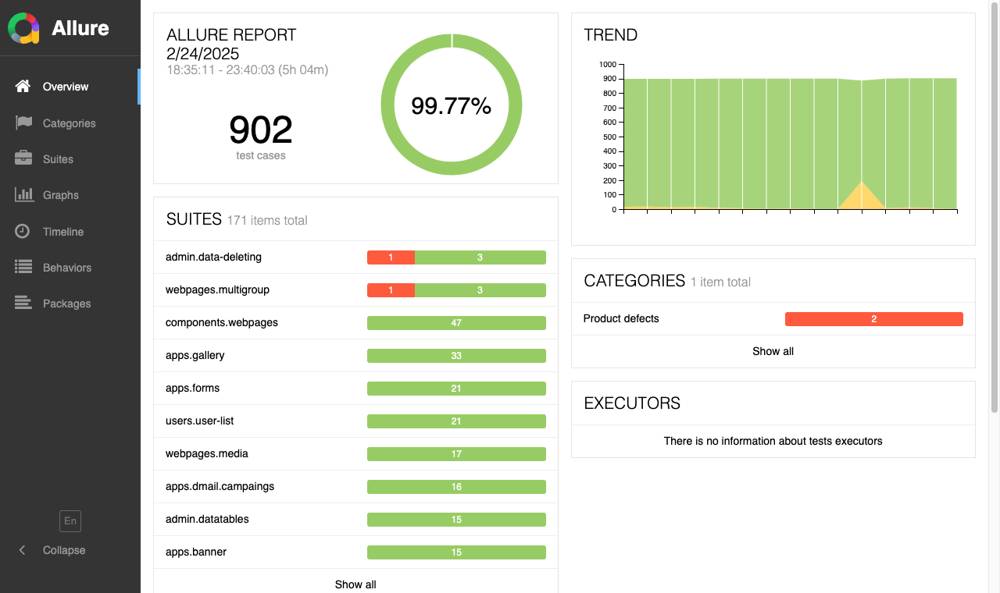

# Reporty cez Allure

Počas automatizovaného testu sa generuje aj report vo formáte pre [Allure](https://docs.qameta.io/allure/). Zverejnené sú pre [chromium](http://docs.webjetcms.sk/allure/chromium/) aj pre [firefox](http://docs.webjetcms.sk/allure/firefox/).

Generovanie vstupných dát pre report je zabezpečené rozšírením [codecept-allure](https://codecept.io/plugins/).



Zobrazené sú nasledovné údaje:

- ```Overview``` - základný prehľad stavu a histórie
- ```Categories``` - zobrazuje kategorizovaný zoznam chýb, kategórie sa definujú podľa [regulárnych výrazov](https://docs.qameta.io/allure/#_categories_2) vrátenej chyby v súbore ```src/test/webapp/allure/categories.json```
- ```Suites``` - zoznam jednotlivých testov, vidno jednotlivé vykonané kroky
- ```Graphs``` - grafy aktuálneho a historického vývoja
- ```Timeline``` - časové zobrazenie vykonania jednotlivých testov
- ```Behaviors``` - umožňuje členenie testov na ```Epic, Feature, Story```, co WebJET CMS sa aktuálne nepoužíva
- ```Packages``` - stromová reprezentácia jednotlivých testov

## Spustenie reportu

Proces generovania reportu je komplikovanejší z dôvodu zachovania histórie. To vyžaduje získať predchádzajúci report (prečinok ```history```) pred generovaním reportu.

Celý proces je v skripte ```npx-allure.sh```, ktorý pred spustením testu stiahne posledné výsledky z dokumentačného servera a po vykonaní testu ich na dokumentačný server uloží.

Skript sa používa s parametrami:

- ```CODECEPT_BROWSER``` - meno použitého prehliadača - ```chromium``` alebo ```firefox``` (predvolene ```chromium```)
- ```CODECEPT_URL``` - URL adresa domény, ktorá sa bude testovať (predvolene ```demotest.webjetcms.sk```)
- ```HOST_USER``` - meno SSH používateľa pre stiahnutie histórie a uloženie výsledku
- ```HOST_NAME``` - doménové meno servera pre SSH spojenie histórie a uloženia výsledku
- ```HOST_DIR``` - priečinok s reportom na serveri, k mene priečinka sa pridáva ešte meno použitého prehliadača

```sh
#spustenie s chrome a predvolenou domenou
npx-allure.sh
#spustenie s firefox a predvolenou domenou
npx-allure.sh firefox
#spustenie s firefoxom a domenou iwcm.interway.sk
npx-allure.sh firefox http://iwcm.interway.sk
#spustenie s chrome a domenou demo.webjetcms.sk
npx-allure.sh chromium http://demo.webjetcms.sk
```

## Technické informácie

Ako je napísané vyššie, pre zachovanie histórie je potrebné pred generovaním reportu získať priečinok ```history``` z predchádzajúcej verzie. To je v skripte zabezpečené použitím ```rsync``` z dokumentačnej stránky.

Okrem toho sa pri spustení generuje súbor ```build/test/environment.properties``` s menom použitého prehliadača a použitou doménou. To sa zobrazí na karte ```Overview``` v časti ```environment```.

Spúšťanie testov a generovanie reportu je zabezpečené pomocou CI-CD v súbore ```gitlab-ci.yml``` spustením gradle úlohy ```rune2etest``` a ```rune2etestfirefox```.