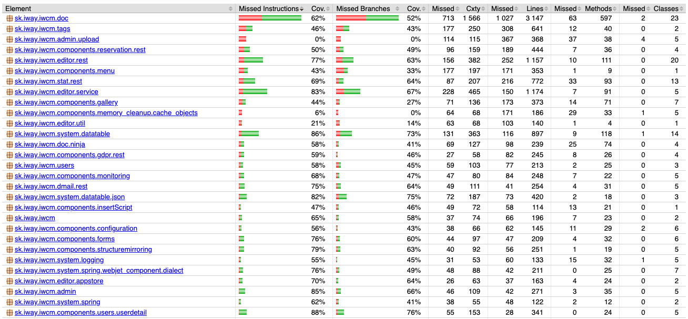

# Pokrytie kódom

> Meranie pokrytia kódom testami vyjadruje percento kódu, ktorý je vykonaný počas testovacích scenárov. Čim je väčšie percento pokrytia kódu testovacími scenármi, tým nižšia je šanca, že kód obsahuje nezistené softvérové chyby.

<div class="video-container">
    <iframe width="560" height="315" src="https://www.youtube.com/embed/vJkto5AcQeA" title="YouTube video player" frameborder="0" allow="accelerometer; autoplay; clipboard-write; encrypted-media; gyroscope; picture-in-picture; web-share" allowfullscreen></iframe>
</div>

WebJET obsahuje integrovanú knižnicu [jacoco](https://github.com/jacoco/jacoco), ktorá počas behu sleduje, ktorá časť kódu je vykonaná a následne vygeneruje podrobný report v HTML formáte. V ňom môžete prechádzať jednotlivými balíkmi až do úrovne java tried a metód s podrobným zvýraznením, ktoré časti kódu sa počas testov vykonali a ktoré nie.

Špecifikum je sledovanie pokrytia kódu testami aj **počas štandardného behu aplikačného servera**, pokrytie sa teda meria počas bežnej práce a teda aj **počas vykonania automatizovaných e2e testov**.

Pre časť kódu, ktorá sa počas testov nevykonala odporúčame pridať ďalšie testovacie scenáre.



Môžete si pozrieť [naposledy vygenerovaný stav pokrytia testami](http://docs.webjetcms.sk/latest/codecoverage-report/index.html).

## Použitie

Pri štandardnom použití vo VS Code sa automaticky po vykonaní úloh ```appStart``` vygeneruje report do ```./build/jacoco/report/index.html```. Ak sa nevygeneruje (ak napr. úlohu zastavíte cez ```CTRL+C```) spustite ```gradlew generateJacocoReport``` pre vygenerovanie reportu. Pre úlohu ```appStartDebug``` je ```jacoco``` vypnuté, pretože nefungoval HotSwap, môžete sa ale rozhodnúť, čo je pre vás dôležitejšie.

V termináli sa vám zobrazí odkaz na otvorenie reportu v prehliadači. Môžete tak ľahko už počas písania testov sledovať, ako sa vám darí pokryť testami kód príslušných služieb.

Pripravený je aj skript ```./ant/codecoverage.sh``` pre kompletné vygenerovanie reportu. Skript spustí štandardné JUnit testy ale aj automatizované e2e testy. Využitá je úloha ```appBeforeIntegrationTest```, ktorá naštartuje aplikačný server na pozadí, aby mohli pokračovať automatizované testy. Aplikačný server je zastavený pomocou úlohy ```appAfterIntegrationTest```, ktorá zároveň spustí generovanie HTML reportov.

```shell
#!/bin/sh

echo ">>>>>>>>>>> Compiling project"
cd ..
gradlew clean
gradlew compileJava
gradlew npminstall
gradlew npmbuild

echo ">>>>>>>>>>> Executing JUnit test"
gradlew test

echo ">>>>>>>>>>> Starting app server"
gradlew appBeforeIntegrationTest

echo ">>>>>>>>>>> Executing e2e/codeceptjs tests"
cd src/test/webapp
npm run singlethread
npm run parallel8
cd ../../..

sleep 30

echo ">>>>>>>>>>> Stopping app server"
gradlew appAfterIntegrationTest
```

Výsledkom je súbor ```build/jacoco/test.exec``` s výsledkami JUnit testov a ```build/jacoco/appBeforeIntegrationTest.exec``` s výsledkami e2e/codeceptjs testov. Report je vygenerovaný spojením výsledkov zo všetkých ```.exec``` súborov v priečinku ```build/jacoco```.

## Detaily implementácie

Rozšírenie ```jacoco``` je pridané v ```build.gradle``` a je nastavené pre použitie v testoch, ale aj pri štandardnom spustení aplikačného servera. Mierne zvyšuje záťaž na procesor a pamäť, v prípade potreby môžete rozšírenie vypnúť nastavením atribútu ```enabled``` na ```false``` v ```tasks.appStart``` a ```tasks.appStartDebug```.

Takéto nastavenie ale má tú výhodu, že počas bežnej práce vývojára je priebežne generovaný report pokrytia kódu a dá sa skontrolovať po každom zastavení aplikačného servera pomocou nastavenia ```finalizedBy tasks.generateJacocoReport```. Aplikačný server štandardne zastavíte pomocou ```gradlew appStop```. Ak sa aplikačný server zastavíte napr. pomocou ```CTRL+C``` môžete report vygenerovať manuálne volaním ```gradlew generateJacocoReport```.

Použitá verzia [jacoco](https://github.com/jacoco/jacoco/releases) sa nastavuje v premennej ```toolVersion```, nastavením na hodnotu ```+``` sa automaticky použije najnovšia dostupná verzia.

```groovy
plugins {
    ...
    id 'jacoco'
}

jacoco {
    //set latest version
    toolVersion = "+"
}
gretty {
    ...
    afterEvaluate {
        tasks.appStart {
            file("${rootDir}/build/jacoco/appStart.exec").delete()
            jacoco {
                enabled = true
            }
            finalizedBy tasks.generateJacocoReport
        }
        tasks.appStartDebug {
            file("${rootDir}/build/jacoco/appStartDebug.exec").delete()
            jacoco {
                //enabled = true
            }
            //finalizedBy tasks.generateJacocoReport
        }
        tasks.appAfterIntegrationTest {
            finalizedBy tasks.generateJacocoReport
        }
    }
}

task('generateJacocoReport', type: JacocoReport) {

  executionData fileTree(project.rootDir.absolutePath).include("**/build/jacoco/*.exec")

  sourceDirectories.setFrom project.files(project.sourceSets.main.allSource.srcDirs)
  classDirectories.setFrom project.sourceSets.main.output

  def reportDir = project.reporting.file("${rootDir}/build/jacoco/report")
  reports {
    html.destination = reportDir
  }
  doLast {
    System.out.println "Jacoco report for server created: file://${reportDir.toURI().path}/index.html"
  }
}
```

Kľúčové je nastavenie ```afterEvaluate``` pre gretty. To aktivuje ```jacoco``` aj pre úlohy ```appStart``` a prípadne aj pre ```appStartDebug```, pretože [štandardne je jacoco](https://gretty-gradle-plugin.github.io/gretty-doc/Code-coverage-support.html) aktívne len pre úlohu ```appBeforeIntegrationTest```.

Úloha ```generateJacocoReport``` vygeneruje HTML report do priečinka ```./build/jacoco/report```. V termináli zobrazí odkaz na otvorenie súboru v prehliadači:

```groovy
gradlew generateJacocoReport

> Task :generateJacocoReport
Jacoco report for server created: file:///Users/xxx/Documents/workspace/webjet/build/jacoco/report/index.html
```

v prehliadači teda stačí, keď otvoríte uvedený odkaz ```file:///Users/xxx/Documents/workspace/webjet/build/jacoco/report/index.html``` pre zobrazenie vygenerovaného reportu.


