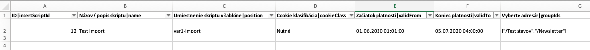

# Testovanie importu do datatabuľky

Pripravili sme aj možnosť automaticky testovať import dát do datatabuľky. Test vykoná nasledovné operácie:

- overí, že v tabuľke nie sú zadané dáta
- naimportuje dáta a overí ich zobrazenie/filtrovanie
- upraví povinné polia (pridá výraz ```-changed```) a overí ich zobrazenie po uložení
- znova naimportuje dáta s párovaním podľa zadaného stĺpca, overí že dáta už neobsahujú ```-changed``` text

Implementácia je podobná ako pre [Automatické testovanie DataTables](datatable.md). Pre prípravu je potrebné:

- vytvoriť testovací záznam v tabuľke (ideálne, aby mal vyplnených čo najviac údajov)
- exportovať tabuľku do Excelu, v ňom ponechajte len hlavičku a testovací záznam
- v Exceli upravte údaje nasledovne:
  - hodnotu ID stĺpca ponechajte, bude sa tak overovať prepísanie pôvodného záznamu (nesmie sa importom prepísať)
  - ostatné stĺpce patrične upravte, odporúčame doplniť výraz ```-import-test```
  - určite jeden unikátny stĺpec (napr. meno) ktorý sa bude používať na overenie Aktualizovať existujúce záznamy

Takto pripravený Excel súbor pre poriadok uložte do rovnakého adresára ako máte testovací script a aj ho rovnako pomenujte (len samozrejme s .xlsx príponou). Príkladom je ```insert-script.js``` a ```insert-script.xlsx```.



Príklad testu:

```javascript
Scenario('insert script-import', async ({ I, DataTables }) => {
     I.waitForText('Zoznam skriptov', 5);
     await DataTables.importTest({
          dataTable: 'insertScriptTable',
          requiredFields: ['name', 'position'], //pre tuto tabulku mame fixne definovane, aby sa vyplnili len tieto atributy, pokuste sa nechat prazdne aby sa vyplnili vsetky
          file: 'tests/components/insert-script.xlsx',
          updateBy: 'Názov / popis skriptu - name',
          rows: [
               {
                    name: "Test import"
               }
          ]
     });
});
```

Okrem štandardných parametrov [automatizovaného testu datatabuľky](datatable.md) sú použité doplňujúce parametre:

- ```file``` - cesta k xlsx súboru s testovacími dátami importu
- ```updateBy``` - hodnota použitá pre testovanie Aktualizovať existujúce záznamy
- ```rows``` - pole obsahujúce meno stĺpca a hodnotu, ktorá sa použije na kontrolu/filtrovanie v tabuľke po importe
- `preserveColumns` - zoznam stĺpcov, ktoré sa nenachádzajú v Excel súbore. Budú počas zmeny nastavené na náhodnú hodnotu a následne pri aktualizácii importom sa overí, že hodnota sa neprepísala/zachovala. Napr. `preserveColumns: [ 'title', 'deliveryFirstName','deliveryLastName' ]`.

Dôležitý je parameter ```rows``` v ktorom definujete zoznam stĺpcov, ktoré sa použijú na filtrovanie záznamov po importe. Hodnota sa musí zhodovať s hodnotou v Excel súbore.