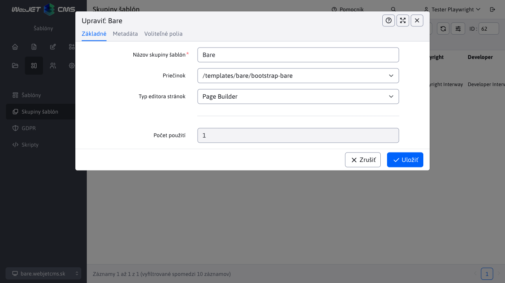
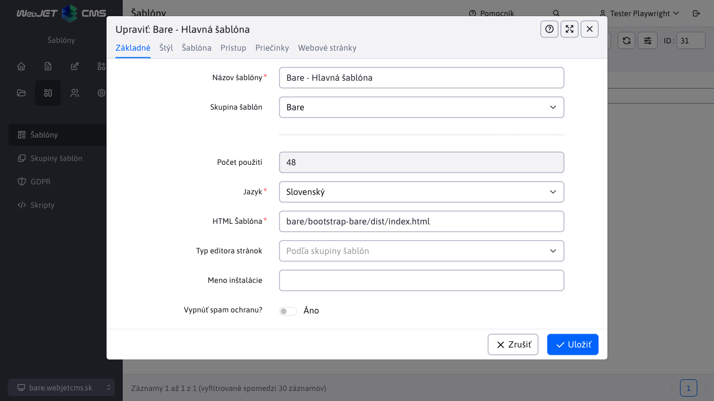
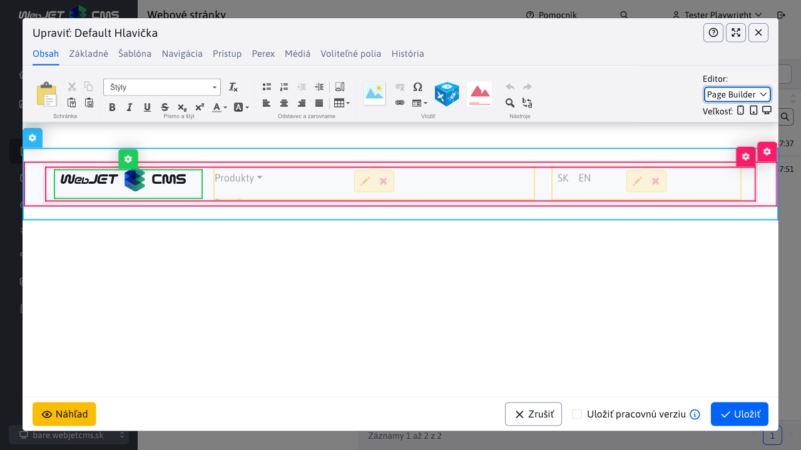
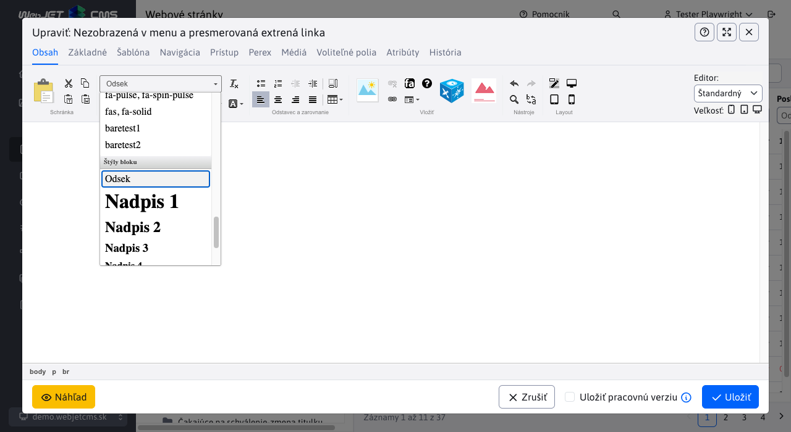

# Bare šablóna

Základná ukážková šablóna pre WebJET CMS s využitím [Thymeleaf šablón](http://docs.webjetcms.sk/v2022/#/frontend/thymeleaf/README) napísaných vo formáte [PugJS](http://docs.webjetcms.sk/v2022/#/developer/frameworks/pugjs). Je založená na [Start Bootstrap - Bare](https://startbootstrap.com/template/bare/).

Odporúčame ju použiť ako základ AKEJKOĽVEK novej šablóny pre WebJET CMS.

Zdrojový kód šablóny môžete získať vo [WebJET CMS github repozitári](https://github.com/webjetcms/templates-bare).


## Použitie vo WebJET CMS

Šablónu stiahnite a umiestnite do priečinka ```templates/bare/bootstrap-bare/``` (ak používate gradle projekt tak samozrejme ešte do ```src/main/webapp```). Ak ju umiestnite do iného priečinka je potrebné upraviť cesty v zdrojových kódoch, stačí keď vyhľadáte tento reťazec v súboroch a cestu upravíte.

Všetky cesty, ktoré píšete do ```.pug/.scss/.js``` súborov používate vrátane prefixu ```/templates/bare/....```, čiže akoby pre použitie vo WebJETe. Ak spustíte lokálnu verziu cez ```npm run start```, cesty ale majú prefix ```/``` (keďže koreňový priečinok je vlastne ```dist```). V súbore ```node_scripts/bs-config.js``` je nastavené presmerovanie, ak zmeníte cestu k šablóne nezabudnite ju upraviť aj v tomto súbore.

V termináli prejdite do priečinka ```src/main/webapp/templates/bare/bootstrap-bare``` a vygenerujte ```dist``` verziu príkazom:

```sh
npm install
npm run build
```

Pred vytvorením novej domény/štruktúry stránok vo WebJET CMS odporúčame najskôr vytvoriť šablóny.

### Skupina šablón

Vytvorte novú skupinu šablón s názvom ```Bare```, nastavte polia:

- ```Priečinok``` nastavte na ```/templates/bare/bootstrap-bare``` (prípadne na priečinok kde máte šablónu umiestnenú)
- ```Typ editora stránok``` nastavte na hodnotu ```Page Builder```.



V karte metadáta nastavte:

- ```Autor, Copyright, Developer, Generator``` na vaše údaje (používajú sa v šablóne)


### Šablóna

Vytvorte novú šablónu ```Bare - Hlavná šablóna```, nastavte polia:

- ```Názov šablóny``` na hodnotu ```Bare - Hlavná šablóna```
- ```HTML Šablóna``` na hodnotu ```bare/bootstrap-bare/dist/index.html``` (ak sa vám priečinok dist vo výbere nezobrazuje skontrolujte, či ste vygenerovali ```dist``` verziu po stiahnutí šablóny).



V karte Štýl nastavte

- ```Hlavný CSS štýl``` na hodnotu ```/templates/bare/bootstrap-bare/dist/css/ninja.min.css```.


### Štruktúra web stránok

Ak ste nevytvorili ešte novú doménu/štruktúru stránok, teraz **vytvorte novú doménu** a nastavte jej šablónu ```Bare - Hlavná šablóna```:

- kliknite na Web stránky-Zoznam web stránok
- kliknite na ikonu ```+``` pre pridanie nového priečinka
- zadajte Názov priečinku ```Slovensky```
- zadajte Názov položky v menu ```sk```
- zadajte do URL adresa hodnotu ```sk```
- nastavte Nadradený priečinok na koreňový priečinok (hodnotu ```/```)
- nastavte doménu


V karte Šablóna:

- v poli Šablóna pre web stránky vyberte ```Bare - Hlavná šablóna```


Ak už doménu/štruktúru stránok máte vytvorenú, odporúčame upraviť existujúce priečinky - v karte Šablóna priečinku nastavte ```Bare - Hlavná šablóna``` a zapnite možnosť ```Aplikovať na všetky existujúce podpriečinky a podstránky```. Toto nastavte aj v karte ```Systém``` na existujúce priečinky.

### Nastavenie hlavičky a pätičky

Prejdite do sekcie Web stránky - Zoznam web stránok, kliknite na kartu Systém a prejdite do priečinka Hlavičky. Otvorte stránku ```Základná hlavička``` v editore. V karte Šablóna skontrolujte, že stránka používa šablónu ```Bare - Hlavná šablóna``` (ak nie, nastavte a stránku uložte a znova otvorte v editore). Zmažte všetko čo sa v stránke nachádza a následne pridajte Page Builder blok ```Header-menu```.

Zobrazia sa vám 3 stĺpce:

- WebJET logo - to môžete zmeniť za vhodné logo vašej stránky
- Menu aplikácia - pravdepodobne nemá správne nastavený koreňový priečinok, kliknite na ikonu ceruzky v aplikácii a v okne nastavenia aplikácie zmeňte ```Koreňový adresár``` na adresár vašej domény. Zatiaľ ale nemáte vytvorenú štruktúru stránok aplikácia teda zatiaľ nebude nič zobrazovať.
- Prepínanie jazykovej mutácie - zobrazuje prepínač jazykovej mutácie ```SK - EN```, ak jazykové mutácie nepoužívate, aplikáciu môžete vymazať.



Podobne postupujte pre nastavenie pätičky (stránka ```Základná pätička```), zmažte všetko a vložte blok ```footer-footer```. Okrem štandardných textových stĺpcov kde môžete jednoducho upraviť text podľa vašich potrieb obsahuje pätička aplikácie:

- Prihlásenie do ```newslettra``` (hromadného emailu) - používa sa zjednodušená varianta len s poľom pre zadanie emailu. Zjednodušený registračný formulár registruje do všetkých emailových skupín, ktoré majú zapnutú možnosť ```Povoliť pridávanie/odoberanie zo skupiny samotným používateľom``` a ```Vyžadovať potvrdenie e-mailovej adresy```.
- GDPR cookies - aplikácia pre nastavenie cookies, ich zoznam berie z aplikácie GDPR-Cookie manažér v ktorej nastavíte zoznam cookies, ktoré web stránka používa. Môžete importovať [základný zoznam cookies](cookies.xlsx).

Prejdite do Šablóny-zoznamu šablón a hlavičku/pätičku nastavte šablóne ```Bare - Hlavná šablóna``` (v karte Šablóna nastavte polia Hlavička a Pätička).

Poznámka: šablóna obsahuje menu v hlavičke, preto položky Hlavná a bočná navigácia ponechajte v nastavení šablóny prázdne.

### Nastavenie jazykových mutácií

Šablóna je pripravená pre jazykové mutácie, využíva aplikáciu Zrkadlenie štruktúry. Odporúčame v zozname web stránok (karta Priečinky) vytvoriť koreňové priečinky ```Slovensky``` a ```English```.

Priečinkom nastavte pole ```URL adresa``` na hodnotu ```sk``` alebo ```en```, rovnako nastavte ```Názov položky v menu``` na hodnotu ```sk``` alebo ```en``` (táto položka sa zobrazí v hlavičke v prepínači jazykov) a v karte Šablóna pole ```Jazyk``` na príslušnú hodnotu. Následne postupujte podľa návodu pre [nastavenie zrkadlenia](http://docs.webjetcms.sk/v2022/#/redactor/apps/docmirroring/README).

Pre druhú jazykovú mutáciu vytvorte kópie hlavičky/pätičky, pre ich automatické použitie v príslušnej jazykovej verzii pridajte prefix ```EN-``` k názvu stránky (napr. stránku ```Default Hlavička``` zduplikujte na ```EN-Default Hlavička```). V stránke upravte nastavenie aplikácií (koreňový priečinok pre aplikáciu menu).

### Vytvorenie stránok

Šablóna obsahuje viaceré pripravené bloky, v stránke ich pridáte jednoducho cez PageBuilder.

## Pre web dizajnéra

Preštudujte si nižšie uvedené body, ak chcete upraviť kód šablóny (HTML, CSS, JavaScript).

### Stromová štruktúra

Všetky súbory šablóny sa nachádzajú v priečinku src, ten obsahuje nasledovnú štruktúru:

- ```assets``` - obrázky, ikony a písma, odporúčame dodržať navrhnutú štruktúru pod priečinkov. V priečinku ```images``` sa nachádzajú ukážkové obrázky pre bloky PageBuilder.
- ```js``` - JavaScript súbory, hlavný súbor je ```ninja.js```.
- ```pug``` - HTML kód šablón vo formáte [PugJS](https://pugjs.org/).
  - ```includes``` - zdieľané bloky medzi šablónami (napr. hlavička zdieľaná medzi šablónou hlavnej stránky a pod stránky).
  - ```pagebuilder``` - bloky pre [PageBuilder](http://docs.webjetcms.sk/v2022/#/frontend/page-builder/blocks). V blokoch odporúčame využívať v maximálnej možnej miere možnosť ```include```. Do ```container``` blokov vkladajte existujúce ```column``` bloky a do ```section``` existujúce ```container``` bloky. Pri zmene ```column``` bloku sa zmena prejaví aj v ```container``` a ```section``` blokoch.
- ```scss``` - CSS štýly vo formáte pre [Ninja](http://docs.webjetcms.sk/v8/#/ninja-starter-kit/)

Dizajnové šablóny sú kompilované z pug formátu do HTML formátu pre použitie cez [Thymeleaf](http://docs.webjetcms.sk/v2022/#/frontend/thymeleaf/README). Pre prototypovanie s použitím ```npm run start``` odporúčame dodržať možnosť ```include``` blokov pre PageBuilder do šablón. Naraz tak overíte zobrazenie stránky aj s obsahom a zároveň overíte aj zobrazenie blokov. V ideálnom stave použijete v prototype všetky bloky na jednej stránke. Ľahko tak vizuálne overíte ich funkčnosť a zobrazenie pri zmene CSS štýlov, alebo HTML kódu.

### Generovanie dist verzie

```dist``` adresár vygenerujete nasledovnými príkazmi:

```sh
#vygenerovanie dist adresara
npm run build

#vygenerovanie dist adresara, spustenie sledovania zmien v suboroch cez browser-sync a spustenie chrome
#v tomto rezime je spusteny prehliadac pocuvajuci na zmeny v suboroch
#POZOR: je napojeny len na ciste HTML subory, nie na plny WebJET, bezi teda bez Thymeleaf sablon
#vyhodne na prototypovanie HTML/CSS bez potreby spustenia celeho WebJET CMS
npm run start
```

jednotlivé ```npm``` skripty sú definované v [package.json](https://github.com/webjetcms/templates-bare/blob/master/package.json) v elemente ```scripts``` a vykonané z ```node_scripts/*.js``` adresára:

- ```npm run build``` - vygeneruje kompletný ```dist``` adresár.
- ```npm run build:assets``` - nanovo vygeneruje súbory z adresára ```assets``` (obrázky, ikony písma).
- ```npm run build:pug``` - nanovo vygeneruje HTML súbory zo zdrojových pug súborov.
- ```npm run build:scripts``` - nanovo vygeneruje JavaScript súbory zo src adresára.
- ```npm run build:scss``` - vygeneruje css súbory zo zdrojových ```scss``` súborov.
- ```npm run clean``` - zmaže ```dist``` adresár.
- ```npm run start``` - spustí režim prototypovania - vygeneruje ```dist``` adresár, sleduje zmeny v súboroch a otvorí prehliadač s prototyp verziou.
- ```npm run start:debug``` - spustí režim prototypovania s ```debug``` režimom prehliadača.

Konfigurácia pre režim prototypovania ```browser-sync``` sa nachádza v súbore [node-scripts/bs-config.js](https://github.com/webjetcms/templates-bare/blob/master/node_scripts/bs-config.js). Tam je prípadne potrebné upraviť cestu pre nahradzovanie adries písiem/obrázkov, ktoré sú linkované s plnou URL adresou v CSS súboroch (keďže počas prototypovania sa URL adresa stránok odlišuje voči adrese vo finálnej verzii cez WebJET CMS).

### Spracovanie JavaScript súborov

Aby bolo možné používať priamo npm moduly v súbore [ninja.js](https://github.com/webjetcms/templates-bare/blob/master/src/js/ninja.js) je použitý [browserify](https://www.npmjs.com/package/browserify) s rozšírením [esmify](https://www.npmjs.com/package/esmify). Spracovanie je v súbore [render-scripts.js](https://github.com/webjetcms/templates-bare/blob/master/node_scripts/render-scripts.js).

Dôvod je, aby sa všetky použité JavaScript knižnice vo web stránke dali spravovať cez npm (čiže ľahko aktualizovať).

V súbore ```ninja.js``` teda môžete použiť ```import/require``` pre importovanie potrebných knižníc pre zobrazenie stránky.

Následne môžete použiť [npm-check-updates](https://www.npmjs.com/package/npm-check-updates) pre kontrolu verzií a ľahkú aktualizáciu.

### Zoznam štýlov pre editor

V editore je možné okrem základných formátovacích prvkov Odstavec a Nadpis 1-6 pridať potrebné CSS štýly. Z dôvodu komplexnosti ```ninja.min.css``` sa tieto zapisujú do súboru ```src/scss/editor.scss``` ktorý je generovaný do ```dist/css/editor.css```.



Podporované je základné aplikovanie štýly na ľubovoľný element, ale aj štýlovanie konkrétnych HTML elementov:

```css
.blue {
    color: blue;
}
.zvyrazneny-text {
    background-color: yellow;
}

a {
    &.btn.btn-primary {
        /*bootstrap default*/
    }
    &.btn.btn-secondary {
        /*bootstrap default*/
    }
}

table {
    &.table {
        &.table.table-dark {
            /*bootstrap default*/
        }
        &.table.table-striped {
            /*bootstrap default*/
        }
        &.table-bordered {
            /*bootstrap default*/
        }
    }
}
```

Ak sa kurzor nachádza v tabuľke zobrazia sa vo výberovom poli Štýl aj možnosti štýlov pre tabuľku:


Pri použití viacerých CSS štýlov naraz (napr. ```btn btn-primary```) sa aplikujú na aktuálne zvolený element všetky. Štýly, ktoré sa aplikujú len na element sa vo výberovom poli nezobrazia, pokiaľ nie je daný element označený, alebo sa v ňom nenachádza kurzor.

Pokiaľ ```editor.css``` nevkladáte aj do dizajnu šablóny, tak sa jeho štýly pri zobrazení web stránky neaplikujú. Štandardne sa teda používa len ako zoznam definícií štýlov.

Ak chcete, môžete definovať štýl zobrazený vo výberovom poli v editore aj priamo v ostatných súboroch. Takto definovaný štýl ale musí obsahovať ako prvý komentár ```/* editor */```. Príklad je v súbore ```src/scss/3-base/_link.scss```:

```css
a {
    &.btn.more-info {
        /* editor */
        font-size: 150%;
        background-color: var(--bs-orange);
        color: var(--bs-white);
    }
}
```

vo výberovom poli sa následne zobrazí možnosť nastavenia CSS štýlu ```btn more-info``` na A elemente. Výhoda takéhoto použitia je v tom, že máte na jednom mieste definíciu pre editor aj samotné štýly.

Pri aplikovaní CSS štýlu, ktorý nemá nastavený žiaden HTML tag sa štýl aplikuje na rodičovský element v ktorom sa nachádza kurzor. Ak chcete štýl aplikovať iba na označený text (selekciu) je potrebné ho definovať pre HTML tag ```span```:

```css
span.more-info {
    /* editor */
    font-size: 150%;
    background-color: orange;
    color: white;
}
```

následne je možné označiť text a aplikovať tento štýl len na označený text. Ak by nemal HTML značku ```span``` aplikoval by sa na rodičovský element, čiže typicky na celý odstavec - ```p```.

Ak vám nevyhovuje predvolený názov štýlu vo výberovom poli, môžete ho zmeniť pridaním komentára:

```css
span.more-info {
    /* editor title: Nice Editor Title */
    font-size: 150%;
    background-color: orange;
    color: white;
}
```

prípadne v skrátenej forme priamo s komentárom na konci riadku definície štýlu:

```css
span.more-info { /* Nice Editor Title */
    font-size: 150%;
    background-color: orange;
    color: white;
}
```

Podporované je aj aplikovanie viacerých štýlov naraz. Použije sa, ak je v CSS definovaný aj element:

```css
p.paragraph-green {
    color: green;
}
p.paragraph-red-border {
    border: 1px solid red;
}
p.paragraph-yellow-background {
    background-color: yellow;
}
```

používateľ si môže zvoliť ľubovoľnú kombináciu týchto štýlov na element `p`. Ak je už štýl na elemente aplikovaný, opätovným zvolením sa štýl odstráni. Môžete tak jednoducho aplikovať viaceré štýly naraz.

## Tvorba PageBuilder blokov

Ak potrebujete vytvoriť nový blok pre PageBuilder postupujte podľa tohto návodu.

### Štruktúra priečinkov

Bloky sa nachádzajú v ```scr/pug/pagebuilder``` a sú v pod priečinkoch ```column,container,section``` podľa typu bloku. Následne sú organizované podľa ich významu, priečinky môžete pomenovať ľubovoľne podľa vašej potreby. Pod názvom tohto priečinku sa potom zobrazia v knižnici blokov.

Odporúčame postupovať zo spodu, čiže najskôr vytvoriť bloky v ```column``` priečinku, tie následne pomocou include vložiť do ```container``` a to následne do ```section```.

Napríklad súbor ```src/pagebuilder/column/card/card.pug```:

```javascript
.col-md-6
    .card
        .card-body
            h5.card-title Special title treatment
            p.card-text With supporting text below as a natural lead-in to additional content.
            a.btn.btn-primary(href='#') Go somewhere
```

súbor ```src/pug/pagebuilder/container/cards/cards.pug```

```pugjs
.container
    .row
        include ../../column/card/card
        include ../../column/card/card

```

súbor ```src/pug/pagebuilder/section/cards/cards.pug```

```pugjs
section
    include ../../container/cards/cards
```

výhoda takéhoto postupu je v tom, že ak upravíte niečo v ```column``` pug súbore, prejaví sa vďaka použitiu ```include``` príkazu zmena aj v ```container``` aj v ```section``` verzii.

### Generovanie náhľadov PageBuilder blokov

Ak upravíte pug súbor bloku pre PageBuilder môžete vygenerovať náhľadové obrázky volaním adresy ```/components/grideditor/phantom/generator.jsp```. Použite nasledovné nastavenia:

- šírka: 1000
- výška: 600
- zoom: 1
- docid: 383
- JSP šablóna: ```/templates/bare/bootstrap-bare/dist/index.html```

Náhľadové obrázky sa vygenerujú do rovnakej štruktúry ako sú pug súbory blokov. Zároveň sa vygenerujú aj do ```dist``` priečinka. Pri build procese sa obrázky kopírujú v skripte ```render-assets.js```. Pri manuálnej zmene obrázka môžete spustiť len tento skript príkazom:

```sh
npm run build:assets
```

Generovanie vyžaduje nainštalovaný [PhantomJS](https://phantomjs.org/download.html), umiestnenie a nastavenie konf. premenných je v súbore ```localconf.jsp```.

## Copyright and License

Copyright 2013-2021 Start Bootstrap LLC. Code released under the [MIT](https://github.com/StartBootstrap/startbootstrap-bare/blob/master/LICENSE) license.
