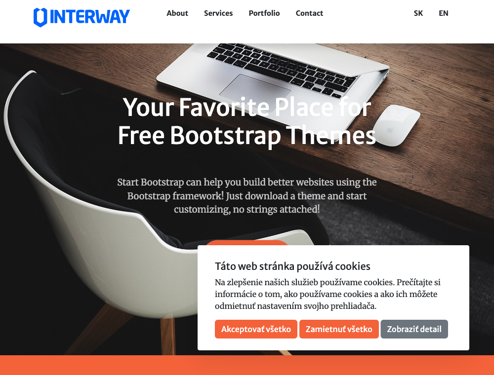
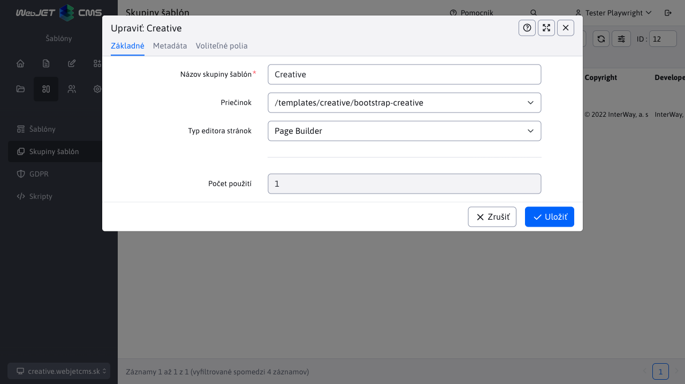
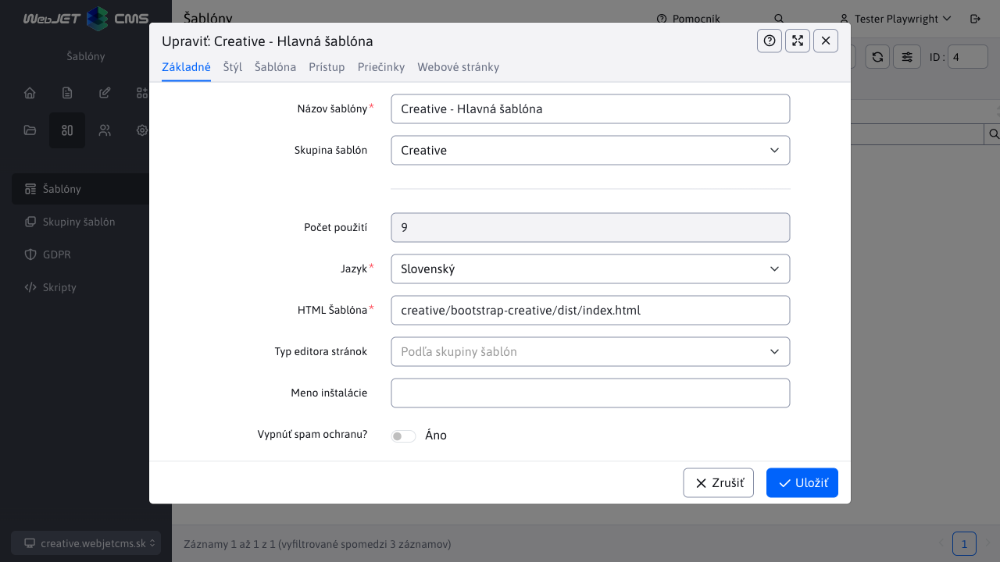
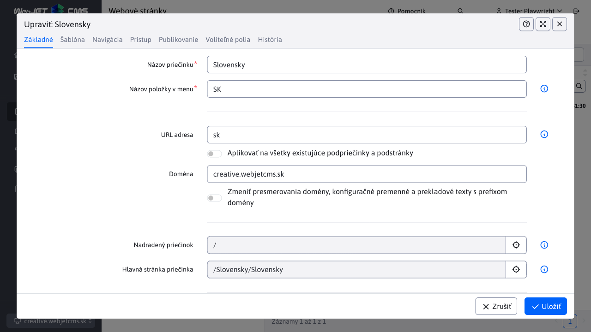
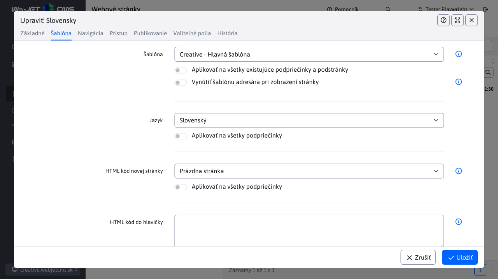

# Creative šablóna

Základná jednostránková (```singlepage```) ukážková šablóna pre WebJET CMS s využitím [Thymeleaf šablón](http://docs.webjetcms.sk/v2022/#/frontend/thymeleaf/README) napísaných vo formáte [PugJS](http://docs.webjetcms.sk/v2022/#/developer/frameworks/pugjs). Je založená na [Start Bootstrap - Creative]().

Zdrojový kód šablóny môžete získať vo [WebJET CMS github repozitári](https://github.com/webjetcms/templates-creative).



## Použitie vo WebJET CMS

Použitie je rovnaké ako pri [Bare šablóne](../template-bare/README.md#použitie-vo-webjet-cms), rozdiel je samozrejme v názvoch - všade nahraďte ```bare``` za ```creative```. Priečinok so šablónou je ```src/main/webapp/templates/creative/bootstrap-creative/```, použité cesty v šablóne a skupine šablón začínajú na ```/templates/creative/bootstrap-creative/```.

### Skupina šablón

Postupujte podľa návodu pre Bare šablónu s upravenou cestou ```/templates/creative/bootstrap-creative/```.



### Šablóna

Postupujte podľa návodu pre Bare šablónu s upravenou cestou ```creative/bootstrap-creative/dist/index.html```. V karte štýl nastavte Hlavný CSS štýl na ```/templates/creative/bootstrap-creative/dist/css/ninja.min.css```.



### Štruktúra web stránok

Postupujte podľa návodu pre Bare šablónu.



V karte Šablóna:

- v poli Šablóna pre web stránky vyberte ```Creative - Hlavná šablóna```



### Nastavenie hlavičky a pätičky

Postupujte podľa návodu pre Bare šablónu. Keďže sa jedná o jednostránkovú šablónu, pripravené menu obsahuje priamo zadané kotvy (odkazy). Tie môžete upravovať, sú tvorené ako odrážkový zoznam. Kliknutím na existujúci názov sa zobrazí okno pre nastavenie textu a prípadného odkazu.

Nový môžete vytvoriť tak, že kliknete na existujúci odkaz, okno nastavenia odkazu zatvoríte kliknutím na Zrušiť a následne sa kurzorom posuniete na miesto kde chcete nový odkaz. Stlačte ```Enter``` pre vytvorenie novej odrážky (aj keď sa zobrazuje v riadku) a napíšte text. Ten následne označte a kliknite na ikonu vytvorenia odkazu. V okne zadajte URL adresu (napr. ```#mojblok```) a v karte Rozšírené zadajte do poľa Triedy štýlu hodnotu ```nav-link```.

Bloku v editore stránok môžete nastaviť ID (na ktoré sa potom v menu odkážete v poli URL adresa) kliknutím na ikonu ozubeného kolesa v modrom bloku (sekcia) a následným zvolením ikony ceruzky v zobrazenom menu. Kliknite na Pokročilé a v karte Selektor môžete nastaviť ID bloku (napr. ```mojblok```).

## Pre web dizajnéra

Postupujte podľa návodu pre Bare šablónu, v Creative je naviac použitý [Font Awesome](https://fontawesome.com). Kopírovanie jeho písiem je nastavené v ```src/main/webapp/templates/creative/bootstrap-creative/node_scripts/render-assets.js``` a importované do CSS z NPM modulu v ```src/main/webapp/templates/creative/bootstrap-creative/src/scss/ninja.scss```.