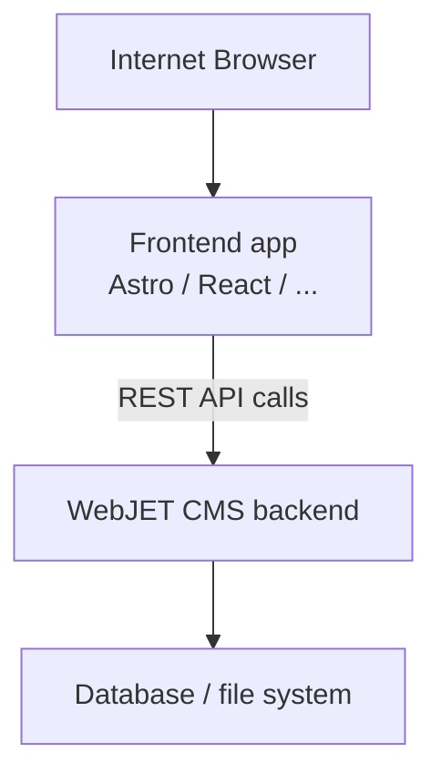

# Headless režim

WebJET CMS podporuje **headless** prevádzkový režim, v ktorom slúži ako čisto `backend` CMS. Obsah, navigácia, vyhľadávanie a formuláre sú dostupné cez REST API. Frontend aplikácia (napr. Astro, Next.js, Vue, React alebo akýkoľvek HTTP klient) si dáta stiahne a zobrazuje ich podľa vlastných šablón.


V jednom WebJET CMS v môžete mať viacero (desiatky) domén a následne mať menšie web stránky vytvorené v rôznych technológiách, ktoré konzumujú a zobrazujú obsah z CMS systému.

## Ako to funguje



- Všetky REST služby sú dostupné na ceste `/rest/headless/v1/`.
- Autentifikácia je riešená cez session cookies – frontend musí cookies zo CMS posúvať späť prehliadaču (`Set-Cookie` hlavičky).

Na serverovej strane sú vykonané aj aplikácie, ktoré môžu byť tiež integrované. Typicky ale vyžadujú `jQuery/Bootstrap`, samozrejme môžete [naprogramovať vlastnú aplikáciu](../../custom-apps/README.md) s technológiou, ktoru na frontend používate.


## Konfiguračné premenné

Nastavenia sa konfigurujú v administrácii WebJET CMS → **Nastavenia → Konfigurácia** (alebo v `conf/constants.properties`).

| Premenná | Popis | Príklad hodnoty |
| --- | --- | --- |
| `accessControlAllowOriginUrls` | Cesty (URL vzory), pre ktoré sa nastavuje CORS hlavička `Access-Control-Allow-Origin`. Oddeľte čiarkou. | `/rest/headless/*,/rest/*` |
| `accessControlAllowOriginValue` | Povolené origin domény pre CORS. Môže obsahovať viac hodnôt oddelených čiarkou – backend automaticky vyberie zhodu podľa `Referer` hlavičky požiadavky. | `https://frontend.example.com` |

### Príklad nastavenia CORS

Aby frontend aplikácia bežiaca na `https://frontend.example.com` mohla volať API, nastavte:

```txt
accessControlAllowOriginUrls=/rest/*
accessControlAllowOriginValue=https://frontend.example.com
```

Ak máte viacero frontend (staging + produkcia):

```txt
accessControlAllowOriginValue=https://frontend.example.com,https://staging.example.com
```

Backend automaticky vyberie správnu hodnotu podľa `Referer` hlavičky prichádzajúcej požiadavky.

## Zabezpečenie a XSRF

Backend kontroluje `Referer` hlavičku pri POST požiadavkách (ochrana pred XSRF útokom). Frontend musí pri server-side volaní posielať aj `Referer` hlavičku zo skutočnej požiadavky prehliadača. V ukážkovej Astro aplikácii to rieši pomocná funkcia `createFetchOptions(request)` v `src/lib/api.ts`.

Pre klientske (browser) volania nie je XSRF kontrola aktívna, keďže `Referer` posiela prehliadač sám.

## Konfigurácia frontend

Frontend aplikácia sa konfiguruje cez `.env` súbor (jednotný formát pre viaceré frameworky).

### Nastavenie API endpoint

Vytvorte `.env` súbor v koreňovom adresári projektu:

```bash
# .env
PUBLIC_API_BASE=https://cms.iway.sk/rest/headless/v1
```

**Poznámka:** Prefix `PUBLIC_` je potrebný pre Astro – znamená, že premenná bude dostupná aj v prehliadači. V klientskom kóde sa získava ako:

```typescript
const apiBase = import.meta.env.PUBLIC_API_BASE;
```

### Konfigurácia podľa prostredia

Môžete vytvoriť viacero `.env` súborov:

- `.env` – predvolené nastavenia
- `.env.local` – lokálne nastavenia (nebude commitnuté do Gitu)
- `.env.production` – produkčné nastavenia (ak frontend zostavujete s `--mode production`)

Príklad `.env.example`:

```bash
# .env.example
# Headless CMS API endpoint (full path including /rest/headless/v1)
# Update this to match your Headless CMS server
PUBLIC_API_BASE=https://cms.example.com/rest/headless/v1

# Optional variables
#HEADLESS_PROXY_PREFIXES=/images/,/files/,/thumb/,/shared/,/components,/FormMailAjax.action,/rest/,/apps/form/mvc/
#HEADLESS_HOST=127.0.0.1
#HEADLESS_PORT=3000
#HEADLESS_HTTPS=true
#HEADLESS_HTTPS_CERT=./.cert/localhost.pem
#HEADLESS_HTTPS_KEY=./.cert/localhost-key.pem

# Disable SSL certificate verification for local development with self-signed certificates
#NODE_TLS_REJECT_UNAUTHORIZED=0
```

## Proxy pre statický obsah

Frontend aplikácia zvyčajne potrebuje tiež slúžiť obrázky, súbory a `/thumb` priamo z CMS backendu. Odporúčame nakonfigurovať reverse proxy pre prefixy:

```txt
/images/
/files/
/thumb/
/shared/
/components/
/rest/
```

V ukážkovej Astro aplikácii je proxy nakonfigurovaná automaticky v `astro.config.mjs`:

- **Backend origin sa počíta automaticky** z `PUBLIC_API_BASE` (odstránením `/rest/headless/v1`).

Ďalšie dostupné premenné v `.env` súbore:

| premenná | Popis | Predvolená hodnota |
| --- | --- | --- |
| `PUBLIC_API_BASE` | Úplná cesta na Headless API | `https://cms.example.com/rest/headless/v1` |
| `HEADLESS_PROXY_PREFIXES` | Prefixy URL, ktoré sa proxy-ujú na backend | `/images/,/files/,/thumb/,/shared/,/components,/FormMailAjax.action,/rest/,/apps/form/mvc/` |
| `HEADLESS_HOST` | Host, na ktorom počúva frontend server | `127.0.0.1` |
| `HEADLESS_PORT` | Port frontend-u | `3000` |
| `HEADLESS_HTTPS` | Zapne HTTPS pre frontend server (`true`/`false`) | `false` |
| `HEADLESS_HTTPS_CERT` | Cesta k SSL certifikátu (PEM) | `./.cert/localhost.pem` |
| `HEADLESS_HTTPS_KEY` | Cesta k SSL kľúču (PEM) | `./.cert/localhost-key.pem` |

## Ďalšie zdroje

- [Zoznam REST služieb](services.md)
- [Ukážková Astro aplikácia](example.md)
