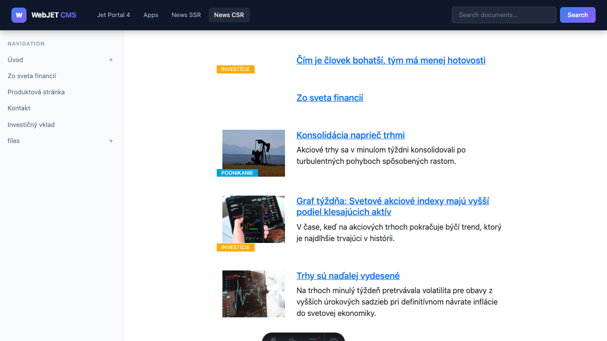

# Ukážková headless aplikácia (Astro)

V adresári [docs/examples/headless-astro/](../../../examples/headless-astro/) sa nachádza kompletná ukážková aplikácia postavená na frameworku **[Astro 7](https://astro.build)**, ktorá demonštruje headless integráciu s WebJET CMS.


## Technológie

- **Astro 7** – SSR (server-side rendering) framework
- **Bootstrap 5** – CSS framework
- **TypeScript** – typovaný JavaScript
- **Node.js** – runtime prostredie pre server

## Spustenie

```bash
cd docs/examples/headless-astro
npm install
npm run dev
```

Aplikácia štandardne beží na `http://localhost:3000`. CMS backend a ďalšie nastavenia sa konfigurujú cez súbor `.env` v adresári projektu. Skopírujte `.env.example` ako základ:

```bash
cd docs/examples/headless-astro
cp .env.example .env
```

Upravte `.env` podľa vašej inštalácie:

```bash
# Headless CMS API endpoint (full path including /rest/headless/v1)
# Update this to match your Headless CMS server
PUBLIC_API_BASE=https://cms.example.com/rest/headless/v1

#Optional variables
#HEADLESS_PROXY_PREFIXES=/images/,/files/,/thumb/,/shared/,/components,/FormMailAjax.action,/rest/,/apps/form/mvc/
#HEADLESS_HOST=127.0.0.1
#HEADLESS_PORT=3000
#HEADLESS_HTTPS=true
#HEADLESS_HTTPS_CERT=./.cert/localhost.pem
#HEADLESS_HTTPS_KEY=./.cert/localhost-key.pem

# Disable SSL certificate verification for local development with self-signed certificates
#NODE_TLS_REJECT_UNAUTHORIZED=0
```

## HTTPS režim v lokálnom vývoji

Ak backend posiela session cookie s príznakom `Secure`, frontend musí bežať na HTTPS, inak prehliadač cookie zahodí.

### 1. Vygenerovanie self-signed certifikátu

```bash
cd docs/examples/headless-astro
npm run cert:generate
```

Tento príkaz vytvorí súbory:

- `.cert/localhost.pem`
- `.cert/localhost-key.pem`

### 2. Zapnutie HTTPS v `.env`

Do súboru `.env` pridajte (alebo odkomentujte):

```bash
HEADLESS_HTTPS=true
HEADLESS_HTTPS_CERT=./.cert/localhost.pem
HEADLESS_HTTPS_KEY=./.cert/localhost-key.pem
```

### 3. Spustenie Astro servera cez HTTPS

```bash
cd docs/examples/headless-astro
npm run dev:https
```

Frontend potom beží na adrese `https://127.0.0.1:3000` (resp. podľa `HEADLESS_HOST` a `HEADLESS_PORT`).

### Poznámky

- Pri self-signed certifikáte je pri prvom otvorení stránky bežné bezpečnostné upozornenie v prehliadači.
- Pre Astro 7 použite Node.js verziu minimálne `22.12.0`.

## Štruktúra projektu

```txt
src/
  lib/
    api.ts         – TypeScript klient pre všetky headless REST endpointy
  layouts/
    Layout.astro   – Spoločný layout s navigáciou a search boxom
  middleware.ts      – Smerovanie CMS stránok: presmerovania 404 na /cms/[...slug]
  pages/
    index.astro        – Domovská stránka
    cms/
      [...slug].astro  – CMS renderer (obsah z CMS podľa URL, volaný cez middleware)
    news.astro         – Novinky (server-side rendering)
    news-client.astro  – Novinky (client-side rendering, volanie z browsera)
    search.astro       – Fulltext vyhľadávanie
  styles/
    global.css     – Globálne CSS štýly
```

## Stránky a ich funkcie

### `/` – Domovská stránka (`index.astro`)


Zobrazí úvodnú stránku s:

- Uvítacou sekciou s opisom headless demo
- Kartičkami odkazov na ukážky (novinky, vyhľadávanie)
- Dynamickým zoznamom top navigačných položiek z CMS

Používa API: `getNavigation()`

---

### Dynamické CMS stránky (`cms/[...slug].astro` + `middleware.ts`)


Obsah z CMS je obsluhovaný kombináciou middleware a CMS render:

- **`middleware.ts`** zachytí každú 404 odpoveď od dedikovaných stránok a prepisuje URL na `/cms/render?path=<originálna-cesta>` (interný Astro `rewrite`).
- **`cms/[...slug].astro`** je CMS renderer – číta parameter `path`, zavolá API `GET /rest/headless/v1/pages/by-path?path=<cesta>` a zobrazí HTML obsah.

CMS catch-all je úmyselne umiestnený pod `/cms/`, nie v root `pages/`. Vďaka tomu neprepisuje dedikované stránky (napr. `/news`, `/search`) a Astro správne zobrazí skutočnú chybu pri chybe kompilovania dedikovanej stránky (bez silent fallback na CMS).

Vlastnosti:

- Automatický fallback na 404 ak stránka neexistuje v CMS
- SEO meta tagy (`<title>`, `<meta description>`) zo SEO metadát stránky
- Navigácia načítaná z CMS
- Posielanie `Set-Cookie` hlavičiek (session cookies) prehliadaču

Používa API: `getPage()`, `getNavigation()`

---

### `/news` – Novinky SSR (`news.astro`)


Server-side rendered zoznam noviniek zo skupiny s ID `24`. Renderovanie prebieha na serveri pri každej požiadavke (Astro SSR).

Vlastnosti:

- Zobrazí thumbnail obrázok novinky (ak je nastavený)
- Zobrazí perex text
- Zobrazí štítky podľa `perexGroups` (napr. `Investície`, `Podnikanie`)
- Odkaz na detail novinky

Používa API: `listNews()` (POST `/rest/headless/v1/news`), `getNavigation()`

**Príklad konfigurácie noviniek:**

```typescript
const NEWS_GROUP_ID = 24;
const NEWS_PAGE_SIZE = 10;

await listNews({
  groupIds: [NEWS_GROUP_ID],
  publishType: 'new',
  order: 'date',
  ascending: false,
  pageSize: NEWS_PAGE_SIZE,
  offset: 0,
}, Astro.request);
```

---

### `/news-client` – Novinky CSR (`news-client.astro`)



Client-side rendered zoznam noviniek. HTML stránka sa načíta prázdna a JavaScript v prehliadači volá API priamo z browsera.

Vlastnosti:

- Volanie API zo strany klienta (fetch z prehliadača)
- DOM manipulácia bez `innerHTML` (bezpečné generovanie HTML)
- Zobrazenie loading stavu počas načítavania
- Zobrazenie chybovej správy pri neúspechu

Používa API: `POST /rest/headless/v1/news` (volané priamo z browsera)

> Poznámka: Pre client-side volania musí mať backend nakonfigurovanú CORS politiku v konfiguračnej premennej `accessControlAllowOriginValue`. Napríklad:

```txt
{HTTP_PROTOCOL}://{SERVER_NAME}:{HTTP_PORT}
http://headless.example.com:3000,https://headless.example.com:8443
```

---

### `/search` – Vyhľadávanie (`search.astro`)


Server-side fulltext vyhľadávanie cez CMS. Výsledky sa zobrazujú ihneď po odoslaní search formulára.

Vlastnosti:

- Vyhľadávanie podľa zadaného výrazu z URL parametra `?q=`
- Stránkovanie výsledkov
- Zobrazenie počtu nájdených výsledkov
- Snippet s kontextom nájdeného textu
- Stav „žiadne výsledky" a prázdny stav (bez zadaného výrazu)

Používa API: `search()` (GET `/rest/headless/v1/actions/search`), `getNavigation()`

---

## Layout (`Layout.astro`)

Spoločný layout pre všetky stránky obsahuje:

- Ľavý panel s navigáciou načítanou z CMS
- Search box v hlavičke (odošle na `/search?q=...`)
- Bootstrap 5 CSS
- Globálne CSS štýly
- Správu `<title>` a meta tagov

---

## API klient (`src/lib/api.ts`)

Centrálny TypeScript súbor, ktorý obaľuje všetky headless REST volania. Kľúčová vlastnosť je funkcia `createFetchOptions(request)`, ktorá:

1. Posúva `Cookie` hlavičku z prichádzajúceho requestu na backend (zachovanie session)
2. Posúva `Referer` hlavičku (ochrana pred XSRF zamietnutím zo strany backendu)

```typescript
import { getPage, getNavigation, search, listNews } from '../lib/api';
```

### Dostupné funkcie

| Funkcia | Endpoint | Popis |
| --- | --- | --- |
| `getPage(path, lng?, request?)` | GET `/pages/by-path` | Načíta obsah stránky |
| `getNavigation(request?, rootPath?, rootGroupId?, depth?)` | GET `/navigation` | Načíta navigačný strom |
| `search(query, request?, page?, size?)` | GET `/actions/search` | Fulltext hľadanie |
| `listNews(request, request_?)` | POST `/news` | Načíta zoznam noviniek |

---

## Proxy konfigurácia (`astro.config.mjs`)

Konfigurácia automaticky proxy-uje požiadavky na obrázky, `/thumb`, súbory a REST API na CMS backend. To umožňuje, aby frontend aplikácia servírovala celý obsah z jednej domény a predišlo sa problémom s CORS pre statické súbory.

```txt
// Prefixy, ktoré sa presmerujú na CMS backend
/images/, /files/, /thumb/, /shared/, /components, /FormMailAjax.action, /rest/, /apps/form/mvc/
```


## Nasadenie na server (Node.js)

Ukážka je nastavená na SSR režim s Node adaptérom (`@astrojs/node`) a v produkcii sa spúšťa ako Node server.

### 1. Build aplikácie

```bash
cd docs/examples/headless-astro
nvm use 22.12
npm ci
npm run build
```

### 2. Spustenie produkčného servera

```bash
cd docs/examples/headless-astro
npm run start
```

Skript `start` spúšťa `node ./dist/server/entry.mjs`.

### 3. Premenné prostredia pre produkciu

Minimálne nastavte:

```bash
PUBLIC_API_BASE=https://cms.vasadomena.sk/rest/headless/v1
HEADLESS_HOST=0.0.0.0
HEADLESS_PORT=3000
```

Odporúčanie pre produkciu:

- Nenechávajte zapnuté `NODE_TLS_REJECT_UNAUTHORIZED=0`.
- Pred Node server dajte reverzný proxy server (napr. Nginx/Apache) a TLS ukončujte na 443.

## Nasadenie na Vercel alebo Cloudflare

Pre tieto platformy zmeňte Astro adapter podľa cieľa nasadenia.

### Vercel

1. Nainštalujte adapter:

```bash
npm install @astrojs/vercel
```

1. V `astro.config.mjs` zmeňte import a adapter konfiguráciu:

```javascript
import vercel from '@astrojs/vercel';

export default defineConfig({
  output: 'server',
  adapter: vercel(),
  // ...ostatná konfigurácia
});
```

1. Deploy rieši Vercel build pipeline, lokálny `npm run start` už netreba.

### Cloudflare (Workers)

1. Nainštalujte adapter:

```bash
npm install @astrojs/cloudflare
```

1. V `astro.config.mjs` zmeňte import a adapter konfiguráciu:

```javascript
import cloudflare from '@astrojs/cloudflare';

export default defineConfig({
  output: 'server',
  adapter: cloudflare(),
  // ...ostatná konfigurácia
});
```

1. Následne nasadzujete ako Cloudflare Worker (typicky cez `wrangler`).

Poznámka: Pri zmene adaptera ponechajte `output: 'server'`, ale vždy používajte len jeden adapter podľa cieľovej platformy.
