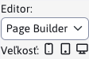

# Bloky

Súčasťou Page Builder je aj vkladanie pripravených blokov. Ich zoznam sa automatický načíta z adresára ```/templates/INSTALL_NAME/skupina_sablon/menosablony/pagebuilder```. **Vždy odporúčame pripraviť sadu blokov pre šablónu.**

V koreňovom adresári pre bloky môžete mať nasledovné pod adresáre:

- ```section``` - pre bloky sekcií (modré označenie v Page Builderi)
- ```container``` - pre kontajnery (červené označenie v Page Builderi)
- ```column``` - pre stĺpce (zelené označenie v Page Builderi)

V každom z týchto podadresárov je potrebné ešte vytvoriť **skupiny blokov ako ďalšie pod adresáre**, napr. ```Contact, Features```. Až v týchto pod adresároch vytvárate jednotlivé HTML bloky. Príkladom je teda adresárová štruktúra:

```java
- section
  - Contact
    - contact01.html
    - contact01.jpg
    - form.html
    - form.jpg
  - Features
    - promo.html
    - promo.jpg
    - pricelist.html
    - pricelist.jpg
- container
  - Teams
    - teams01.html
    - teams01.jpg
    - teams02.html
    - teams02.jpg
- column
  - Text-With-Picture
    - left.html
    - left.jpg
    - right.html
    - right.jpg
```

## Nastavenie šírky stĺpcov

Editor umožňuje nastaviť šírky stĺpca podľa zvoleného zariadenia. V nástrojovej lište pri prepínači typu editora je možnosť nastaviť veľkosť (šírku) zariadenia.



- Desktop - je určený pre šírku väčšiu/rovnú ako 1200 bodov (nastavuje CSS triedu ```col-xl```).
- Tablet - je určený pre šírku 768-1199 bodov (nastavuje CSS triedu ```col-md```)
- Mobil - je určený pre šírku menšiu ako 768 bodov (nastavuje CSS triedu ```col-```)

Správne nastavenie bloku obsahuje prednastavené všetky šírky, napr. `col-12 col-md-6 col-xl-3`:

```html
<section>
  <div class="container">
    <div class="row">
      <div class="col-12">
        <h2 class="text-center">Etiam orci</h2>
      </div>
    </div>
    <div class="row">
      <div class="col-12 col-md-6 col-xl-3 text-center">
        <p class="text-center">
          
        </p>
        <h3>Etiam orci</h3>
        <p>Suspendisse interdum dolor justo, ac venenatis massa suscipit nec. Vivamus dictum malesuada mollis.</p>
      </div>
      <div class="col-12 col-md-6 col-xl-3  text-center">
        <p class="text-center">
          
        </p>
        <h3>Aenean </h3>
        <p>Aliquam elementum ut ante vitae dapibus. Interdum et malesuada fames ac ante ipsum primis in faucibus.</p>
      </div>
      <div class="col-12 col-md-6 col-xl-3  text-center">
        <p class="text-center">
          
        </p>
        <h3>Maecenas</h3>
        <p>Sed sollicitudin eros quis leo imperdiet, id congue lorem ornare. Suspendisse eleifend at ante id ultrices.</p>
      </div>
      <div class="col-12 col-md-6 col-xl-3  text-center">
        <p class="text-center">
          
        </p>
        <h3>Suspendisse</h3>
        <p>Nullam ornare, magna in ultrices mattis, lectus neque mollis libero, vitae varius mauris metus a risus.</p>
      </div>
    </div>
  </div>
</section>
```

## Podpora Thymeleaf kódu

Dôležité je si uvedomiť, že bloky sa do stránky vložia bez vykonania Thymeleaf kódu (technicky sa vloží priamo kód z html súboru do editora). Pri vložení sú aktuálne ale podporované nasledovné thymeleaf atribúty:

- ```data-iwcm-write``` - pre podporu vkladania aplikácií
- ```data-iwcm-remove``` - pre podporu vkladania aplikácií
- ```data-th-src``` - vkladanie obrázku
- ```data-th-href``` - vkladanie odkazu

Zároveň pri vkladaní sú vykonané nasledovné ninja objekty (zapísané napr. ako ```src="./assets/images/logo.png" data-th-src="${ninja.temp.basePathImg}logo.png"```):

- ```${ninja.temp.basePath}```
- ```${ninja.temp.basePathAssets}```
- ```${ninja.temp.basePathCss}```
- ```${ninja.temp.basePathJs}```
- ```${ninja.temp.basePathPlugins}```
- ```${ninja.temp.basePathImg}```

Ak pre vašu prácu potrebujete vykonanie iných Thymeleaf značiek môžete nám zaslať požiadavku cez funkciu Spätná väzba na úvodnej strane administrácie.

## Generovanie náhľadových obrázkov

Všimnite si, že ku každému HTML bloku existuje aj obrázok s rovnakým názvom. Ak existuje, zobrazí sa v Page Builder v zozname blokov ako obrázok bloku. Obrázky je možné pripraviť manuálne, ale aj automaticky vygenerovať volaním skriptu ```/components/grideditor/phantom/generator.jsp```.

Skript vkladá jednotlivé bloky do zadanej JSP šablóny so simuláciou zadaného ```docid``` a vytvára screenshoty. Vyžaduje nainštalovaný program [PhantomJS](https://phantomjs.org) a v konfiguračnej premennej ```grideditorPhantomjsPath``` nastavenú cestu k adresáru kde je ```PhantomJS``` nainštalovaný.

## Spoločné bloky

Žiaľ aktuálne neexistuje možnosť vkladania blokov do seba. Môže existovať požiadavka vkladať ```section``` blok obsahujúci určitý ```container``` blok, pričom je potrebné mať možnosť vložiť aj rovnaký ```container``` blok samostatne. V takom prípade vzniká duplicita HTML kódu blokov v adresári ```section``` aj ```container```.

Odporúčame bloky generovať pomocou [PugJS](https://pugjs.org).

## CSS triedy pre obrázok

Ak má obrázok nastavenú CSS triedu ```fixedSize-w-h-ip``` je automaticky po zmene adresy obrázka nastavený zadaný rozmer ```w``` a ```h```, ak je zadaný aj posledný údaj ```ip``` nastaví sa aj [bod záujmu](../../frontend/thumb-servlet/README.md). Napr. CSS trieda ```fixedSize-160-160-5``` automaticky generuje obrázok rozmeru 160 x 160 bodov s nastaveným bodom záujmu 5. Triedu odporúčame nastaviť na všetky ilustračné obrázky, pri ktorých je dôležitý ich rozmer.

Pri kliknutí na obrázok s CSS triedou ```fixedSize/w-100/autoimg``` sa ihneď otvorí okno vlastností obrázku pre jeho jednoduchú výmenu. Redaktor tak nemusí kliknúť na obrázok a následne v nástrojovej lište na ikonu zmeny obrázka.

Ak obrázok obsahuje v URL adrese výraz `placeholder` alebo `stock` neotvorí sa dialógové okno výberu obrázka do priečinka s týmto obrázkom, ale do priečinka Média tejto stránky. Používateľ tak môže ľahko nahrať nový obrázok.

## Podpora kariet

Pre pohodlnú editáciu kariet (```tabs```) je podporované ich automatické generovanie z HTML štruktúry. Každá karta je reprezentovaná kontajnerom. Kontajnery je ľahko možné duplikovať a presúvať, z ich obsahu sa automaticky generujú karty.

Element ```UL``` je potrebné označiť CSS triedou ```pb-autotabs```. JavaScript kód v súbore ```/admin/webpages/page-builder/scripts/pagesupport.js``` zabezpečí generovanie kariet po pridaní elementu / každých 5 sekúnd. Meno karty berie z ```title``` atribútu kontajnera, alebo z elementu s CSS triedou ```pb-tab-title``` (čo je pohodlnejšie na editáciu).

Samotné karty nie sú teda editovateľné, generujú sa automaticky. Editovateľný je len obsah ```tab``` kontajneru. Všimnite si, že v ukážkovom kóde UL element neobsahuje žiadne ```LI taby```, tie sa vygenerujú automaticky. V HTML kóde zostanú následne vygenerované a aj sa korektne uložia. Na stránke zostane zobrazená karta tak, ako bola zobrazený počas editácie (je na to potrebné myslieť).

Všimnite si použitie CSS triedy ```pb-not-container``` na hlavnom kontajner elemente. To zabezpečí, že tento element nebude označený ako kontajner a za kontajnery budú považované až jednotlivé karty. Každá karta používa CSS triedu ```pb-custom-container```, čo zabezpečí zobrazenie červeného rámu/nástrojovej lišty kontajnera.

Pri zvolení možnosti presunutia tabu (v nástrojovej lište kontajnera) sa automaticky zobrazia všetky karty, aby bolo možné ľahko označiť kartu, kde sa má presunúť. To je zabezpečené CSS štýlom Page Builder.

Ukážkový kód bloku (v ```section``` adresári):

```html
<section>
   <div class="container pb-not-container">

         <div class="tabsBox">
            <ul class="nav nav-tabs pb-autotabs"></ul>
         </div>

         <div class="tab-content">
           <div class="tab-pane fade active show pb-custom-container">
             <div class="row">
                <div class="col-12 pb-col-12 pb-tab-title">
                  <h3>Tab 1</h3>
               </div>
               <div class="col-12 pb-col-12">
                  <p>Text 1</p>
               </div>

             </div>

           </div>

           <div class="tab-pane fade pb-custom-container">
             <div class="row">
                <div class="col-12 pb-col-12 pb-tab-title">
                  <h3>Tab 2</h3>
               </div>
               <div class="col-12 pb-col-12">
                  <p>Text 2</p>
               </div>

             </div>
           </div>

           <div class="tab-pane fade pb-custom-container">
             <div class="row">
                <div class="col-12 pb-col-12 pb-tab-title">
                  <h3>Tab 3</h3>
               </div>
               <div class="col-12 pb-col-12">
                  <p>Text 3</p>
               </div>

             </div>
           </div>
         </div>

   </div>
 </section>
```

## Podpora accordion

```Accordion``` pracuje podobne ako karty, Page Builder zabezpečí korektné vygenerovanie potrebných atribútov a ich automatickú obnovu pri zduplikovaní položky ```accordion-u```. Funkčnosť je napojená na CSS triedu ```pb-autoaccordion``` a implementovaná podobne ako pre karty. Podobne sa používajú aj kontajnery.

Ukážkový kód:

```html
<section>
  <div class="container pb-not-container pb-autoaccordion">

    <h2 class="text-center pb-editable">Nadpis nad accordionom</h2>

    <div class="card pb-custom-container">
      <div class="card-header">
        <a class="accordionLink" data-toggle="collapse">
          <div class="pb-editable">
            <p>Nadpis accordionu 1</p>
          </div>
        </a>
      </div>
      <div class="collapse">
        <div class="card-body">
          <div class="row">
            <div class="pb-col-12">
              <p>Text accodrionu 1</p>
            </div>
          </div>
        </div>
      </div>
    </div>

    <div class="card pb-custom-container">
      <div class="card-header">
        <a class="accordionLink" data-toggle="collapse">
          <div class="pb-editable">
            <p>Nadpis accordionu 2</p>
          </div>
        </a>
      </div>
      <div class="collapse">
        <div class="card-body">
          <div class="row">
            <div class="pb-col-12">
              <p>Text accodrionu 2</p>
            </div>
          </div>
        </div>
      </div>
    </div>

  </div>
</section>
```

## Karty v accordion

Pri požiadavke vnárania objektov typu karta do ```accordion-u``` je možné využiť vlastnosť Page Builder - označuje aj **vnorené kontajnery**. Je potrebné uvažovať, čo bude možné editovať, ako duplikovať jednotlivé položky a podobne. Prakticky funguje vkladanie kariet do ```accordion-ov``` (čo je kontajner) ako vloženie ďalšieho ```columnu``` do kontajnera (pričom vložený ```column``` ďalej obsahuje vnorené kontajnery jednotlivých tabov).

V príklade si všimnite, že hlavný ```column``` má CSS štýl ```pb-not-editable``` aby automaticky nebol editovateľný CK editorom a zároveň CSS triedu ```pb-always-mark```. Ne editovateľný column sa štandardne neoznačí zeleným rámom, bez tejto možnosti by ale nebolo možné pridať za karty ďalší column, alebo celé karty zmazať (neboli by dostupné nástroje columnu).

Pri vložení HTML kódu obsahujúceho výraz ```container``` ako column objektu je spustený ```PageBuilder.mark_grid_elements();``` pre označenie všetkých elementov (aby sa zobrazili nástrojové lišty aj pre vnorené kontajnery).

Ukážkový kód kariet pre accordion (v adresári column):

```html
<div class="col-12 pb-not-editable pb-always-mark">
   <div class="tabsBox" role="tablist">
      <ul class="nav nav-tabs pb-autotabs"></ul>
   </div>

   <div class="tab-content">
      <div class="tab-pane fade active show pb-custom-container">
         <div class="row">
            <div class="col-12 pb-tab-title">
               <h3>Tab 1</h3>
            </div>
            <div class="col-12">
               <p>Tab text 1</p>
            </div>

         </div>
      </div>

      <div class="tab-pane fade pb-custom-container">
         <div class="row">
            <div class="col-12 pb-tab-title">
               <h3>Tab 2</h3>
            </div>
            <div class="col-12">
               <p>Tab text 2</p>
            </div>
         </div>
      </div>
   </div>

</div>
```

po vložení vznikne vo web stránke štruktúra typu:

```html
<section>
  <div class="container pb-not-container pb-autoaccordion">

    <h2 class="text-center pb-editable">Nadpis nad accordionom</h2>

    <div class="card pb-custom-container">
      <div class="card-header">
        <a class="accordionLink" data-toggle="collapse">
          <div class="pb-editable">
            <p>Nadpis accordionu 1</p>
          </div>
        </a>
      </div>
      <div class="collapse">
        <div class="card-body">
          <div class="row">
            <div class="pb-col-12">
              <p>Text accodrionu 1</p>
            </div>

            <div class="col-12 pb-not-editable pb-always-mark">
              <div class="tabsBox" role="tablist">
                  <ul class="nav nav-tabs pb-autotabs"></ul>
              </div>
              <div class="tab-content">
                  <div class="tab-pane fade active show pb-custom-container">
                    <div class="row">
                        <div class="col-12 pb-tab-title">
                          <h3>Tab 1</h3>
                        </div>
                        <div class="col-12">
                          <p>Tab text 1</p>
                        </div>
                    </div>
                  </div>
                  <div class="tab-pane fade pb-custom-container">
                    <div class="row">
                        <div class="col-12 pb-tab-title">
                          <h3>Tab 2</h3>
                        </div>
                        <div class="col-12">
                          <p>Tab text 2</p>
                        </div>
                    </div>
                  </div>
              </div>

            </div>

          </div>
        </div>
      </div>
    </div>

  </div>
</section>
```

## Podpora menu

PageBuilder vie generovať menu položky do bootstrap menu, zabezpečuje to funkcia `pbAutoMenu` v `pagesupport.js`. Menu položky generuje do `ul.pb-automenu` zo všetkých `section` elementov vo web stránke. Pracuje nasledovne:

- `section.pb-not-automenu` je vynechané so zoznamu.
- Názov položky v menu sa berie z:
  - elementu s CSS štýlom `.section-title`
  - ak nie je nájdený berie sa z `h1` elementu
  - ak nie je nájdený, berie sa atribút `title` na `section` elemente
- Ak section nemá nastavený `id` atribút, je nastavený podľa poradového čísla sekcie.

Z nájdených údajov sa vygenerujú položky `li.nav-item` do `ul.pb-automenu`.

Ukážkový blok s menu:

```html
<section class="pb-not-automenu">
    <div class="container pb-not-container md-tabs">
        <nav class="navbar navbar-expand-lg navbar-light bg-light">
            <div class="container-fluid">
                <a class="navbar-brand" href="#">Navbar</a>
                <button class="navbar-toggler" type="button" data-bs-toggle="collapse" data-bs-target="#navbarNav"
                    aria-controls="navbarNav" aria-expanded="false" aria-label="Toggle navigation">
                    <span class="navbar-toggler-icon"></span>
                </button>
                <div class="collapse navbar-collapse" id="navbarNav">
                    <ul class="navbar-nav pb-automenu">
                        <li class="nav-item">
                            <a class="nav-link active" aria-current="page" href="#">Home</a>
                        </li>
                        <li class="nav-item">
                            <a class="nav-link" href="#">Features</a>
                        </li>
                        <li class="nav-item">
                            <a class="nav-link" href="#">Pricing</a>
                        </li>
                        <li class="nav-item">
                            <a class="nav-link disabled" href="#" tabindex="-1" aria-disabled="true">Disabled</a>
                        </li>
                    </ul>
                </div>
            </div>
        </nav>
    </div>
</section>
```

V ukážke sa elementy `Home, Features, Pricing a Disabled` nahradia za obsah v PageBuilder stránke. Obsah sa automaticky aktualizuje po pridaní, zmazaní alebo presune sekcie vo web stránke. Názov sa aktualizuje raz za 5 sekúnd, ak teda zmeníte `h1` nadpis počkajte chvíľu na vygenerovanie novej verzie menu.

Kompletná ukážka HTML kódu web stránky s ukážkovými sekciami:

```html
<section class="pb-not-automenu">
    <div class="container pb-not-container md-tabs">
        <nav class="navbar navbar-expand-lg navbar-light bg-light">
            <div class="container-fluid"><a class="navbar-brand" href="#">Navbar</a><button aria-controls="navbarNav"
                    aria-expanded="false" aria-label="Toggle navigation" class="navbar-toggler"
                    data-bs-target="#navbarNav" data-bs-toggle="collapse" type="button"><span
                        class="navbar-toggler-icon"></span></button>
                <div class="collapse navbar-collapse" id="navbarNav">
                    <ul class="navbar-nav pb-automenu">
                        <li class="nav-item"><a aria-current="page" class="nav-link active" href="#">Home</a></li>
                        <li class="nav-item"><a class="nav-link" href="#">Features</a></li>
                        <li class="nav-item"><a class="nav-link" href="#">Pricing</a></li>
                        <li class="nav-item"><a aria-disabled="true" class="nav-link disabled" href="#" tabindex="-1">Disabled</a></li>
                    </ul>
                </div>
            </div>
        </nav>
    </div>
</section>

<section>
    <div class="container">
        <div class="row">
            <div class="col-md-12">
                <h1>Úvod</h1>
            </div>
        </div>
    </div>
</section>

<section>
    <div class="container">
        <div class="row">
            <div class="col-md-12">
                <p class="section-title">Stred</p>
                <h1>Toto nie je nadpis</h1>
            </div>
        </div>
    </div>
</section>

<section title="TITLE nadpis">
    <div class="container">
        <div class="row">
            <div class="col-md-12">
                <p>Záver</p>
            </div>
        </div>
    </div>
</section>
```