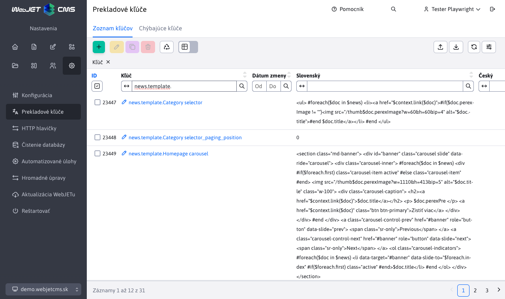
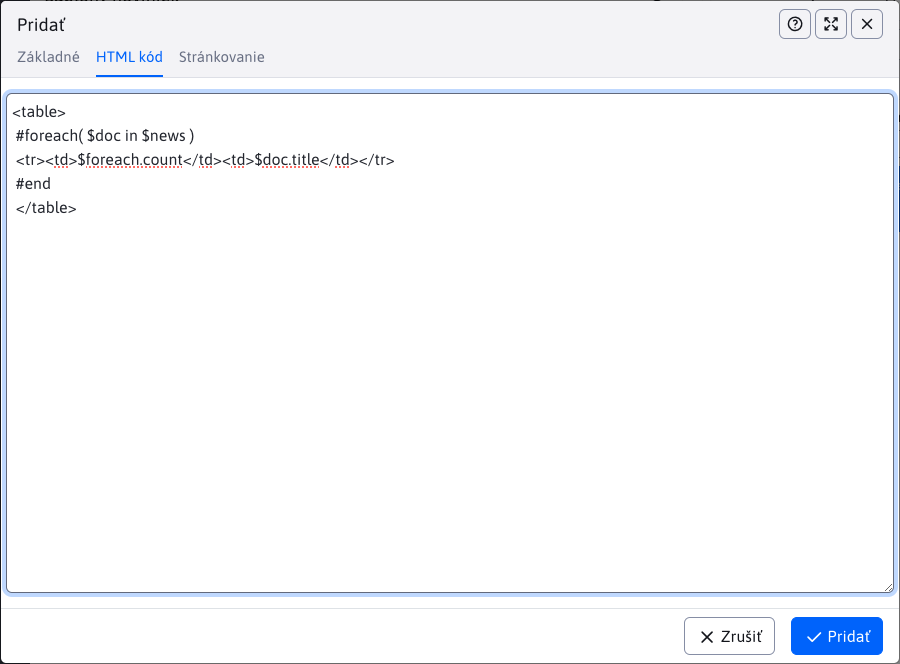

# Novinky

Sekcia **Novinky** umožňujú spravovať dizajnové šablóny pre aplikáciu [Novinky](../../../redactor/apps/news/README.md). Podporované sú všetky akcie vrátane exportu a importu. Na prístup k sekcii potrebujete právo Novinky - úprava šablón.

Sekcia nahrádza pôvodný spôsob definovania šablón noviniek pomocou prekladových kľúčov, ktoré sa začínali prefixom `news.template.`.

!> **Upozornenie:** pri prvom spustení sa **automaticky** konvertujú prekladové kľúče s prefixom `news.template.` na šablóny noviniek do tabuľky.

## Editor

Pri akcii vytvárania ako aj editácie má editor rovnakú štruktúru polí:

- **Názov šablóny**, povinné pole s **jedinečným** názov šablóny noviniek
- **Obrázok šablóny**, pole pre výber obrázka
- **HTML kód**, kód šablóny
- **HTML kód stránkovania**, kód stránkovania
- **Umiestnenie stránkovania**
- **Šablónovací nástroj**, výber šablónovacieho nástroja (zatiaľ podporovaný iba `Velocity`)

## Vkladanie kódu

Pri vytváraní alebo editácii šablóny noviniek máte možnosť využiť ponuku pred-pripravených kódov. Tieto kódy slúžia k uľahčeniu práce a zobrazia sa po **pravom kliku** na pole **HTML kód** alebo **HTML kód stránkovania**, čím sa vyvolá okno s ponukou. Každá sekcia má ešte svoju pod-sekciu, kde sú už ponuky pripravených kódov.

!> **Upozornenie:** ponuka pre polia **HTML kód** a **HTML kód stránkovania** sa líši.

Po kliknutí na ponúkaný kód sa tento pred-pripravený kód vloží do poľa nad ktorým ste akciu pravým klikom vyvolali. Takto si viete jednoducho vytvoriť šablónu.

