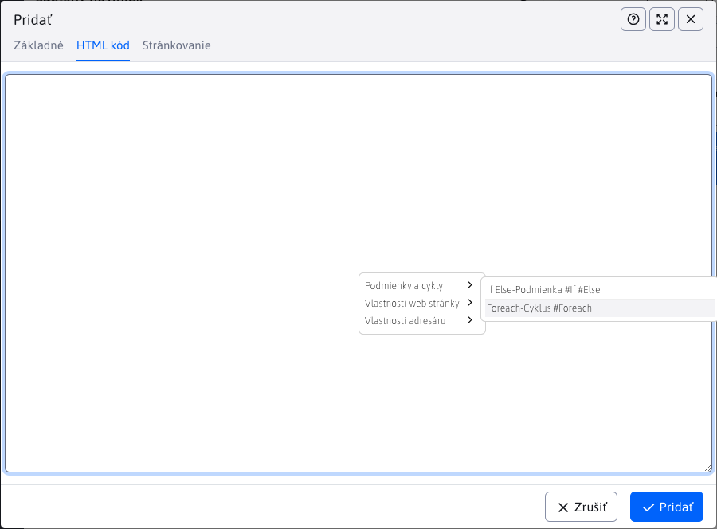

# Šablóny noviniek

Šablóny noviniek spravujú dizajnové šablóny (HTML kód) pre aplikáciu [Novinky](../../../redactor/apps/news/README.md). Podporované sú všetky akcie vrátane exportu a importu. Na prístup k sekcii potrebujete právo Novinky - úprava šablón.


Sekcia nahrádza pôvodný spôsob definovania šablón noviniek pomocou prekladových kľúčov, ktoré sa začínali prefixom `news.template.`.


!> **Upozornenie:** pri prvom spustení sa **automaticky** konvertujú prekladové kľúče s prefixom `news.template.` na šablóny noviniek do tabuľky.

## Editor

Dostupné sú nasledovné polia:

- **Názov šablóny** - povinné pole s **jedinečným** názov šablóny noviniek
- **Obrázok šablóny** - pole pre výber ilustračného obrázka zobrazených noviniek (pre lepšiu orientáciu pri výbere šablóny v aplikácii novinky)
- **Šablónovací nástroj** - výber šablónovacieho nástroja (zatiaľ podporovaný iba `Velocity`)
- **Vložiť triedy do Velocity šablóny** - pole pre vloženie názvu triedy, ktorá bude dostupná v šablóne, napr. pre zobrazenie diskusie je potrebné pridať triedu `sk.iway.iwcm.forum.ForumDB`. Triedy môžete oddeliť čiarkou alebo novým riadkom. V kóde potom môžete použiť napr. `$ForumDB.isActive($doc.getDocId())` pre prístup k metódam triedy.
- **HTML kód** - kód šablóny
- **Umiestnenie stránkovania** - miesto kam sa vloží stránkovanie
- **HTML kód stránkovania** - kód stránkovania


## Vkladanie kódu

Pri vytváraní alebo editácii šablóny noviniek máte možnosť využiť ponuku pripravených kódov. Tieto kódy slúžia k uľahčeniu práce a zobrazia sa po **pravom kliku** na pole **HTML kód** alebo **HTML kód stránkovania**, čím sa vyvolá okno s ponukou. Každá sekcia má ešte svoju pod-sekciu, kde sú už ponuky pripravených kódov.



Po kliknutí na ponúkaný kód sa zvolený kód vloží do poľa nad ktorým ste akciu pravým klikom vyvolali. Takto si viete jednoducho vytvoriť šablónu.


!> **Upozornenie:** ponuka pre polia **HTML kód** a **HTML kód stránkovania** sa líši.

## Príklady kódu

Šablóny noviniek používajú [Velocity Engine](https://velocity.apache.org/engine/2.3/vtl-reference.html) pre zobrazenie, je teda možné definovať cykly, podmienky a iný programový kód. Pripravené sú šablóny s jedným, dvoma aj troma stĺpcami. Šablóny odporúčame editovať len používateľmi, ktorý vedia čo robia a poznajú syntax `Velocity Engine`. Odporúčame vychádzať z pripravených šablón a prípadne ich len upravovať. Štandardný redaktor by nemal mať právo na editáciu šablón noviniek, mal by ich len používať.

Niekoľko ukážok práce s pokročilými objektami:

```velocity
//nastavenie premennej podla pageParams objektu:
#set ($anonymousQuestions = $pageParams.getBooleanValue("anonymousQuestions", false))

//nastavenie premennej:
#set ($fileType = $media.mediaLink.split("[.]"))

//prechod cez zoznam perex skupin a nastavenie CSS triedy podla mena perex skupiny
<div class="grid-item grid-item-$doc.docId
#foreach($perexGroup in $doc.perexGroupNames)
    #if ($perexGroup == "news-red")
    grid-item-red
    #elseif ($perexGroup == "news-green")
    grid-item-green
    #elseif ($perexGroup == "news-blue")
    grid-item-blue
    #end
#end
" data-doc-id="$doc.docId">

//nacitanie medii a vypis
#foreach($media in $MediaDB.getMedia($doc, "files"))
    #set ($fileType = $media.mediaLink.split("[.]"))
    #if($fileType[1].equals('jpg') || $fileType[1].equals('png') || $fileType[1].equals('gif')) <a rel='wjimageviewer' href="$media.mediaLink"  > </a> #end
#end

//nacitanie medii a vypis
<div class="row"> #foreach($media in $MediaDB.getMedia($doc, "files"))
    #set ($fileType = $media.mediaLink.split("[.]"))
    #if(!$fileType[1].equals('jpg') && !$fileType[1].equals('png') && !$fileType[1].equals('gif')) <a href="$media.mediaLink" class="col-md-4 text-truncate icon-$fileType[1]" target="_blank"> $media.mediaTitleSk</a> #end
#end </div>

//vypis diskusnych prispevkov
//vyzaduje pridanie sk.iway.iwcm.forum.ForumDB do parametra Vlozit triedu do Velocity sablony
#set($forumDb = $ForumDB.getForumFieldsForDoc(null, $doc.docId))
#set($commentCount = $forumDb.size())
#set($showComment = 3)
#set($e = $commentCount - $showComment)
#foreach($forum in $forumDb)
    <div class="comment" #if($foreach.count > $e)style="display:block;"#end>
    <div class="comment-header"> $forum.autorFullName <span>$forum.questionDateDisplayDate $forum.questionDateDisplayTime</span> </div>
    <p>$forum.question</p>
</div>
#end

//vypis texu podla prihlaseneho/neprihlaseneho pouzivatela
#if ($actionBean.getCurrentUser()) LOGGED #end
#if (!$actionBean.getCurrentUser()) NOT-LOGGED #end

//zoznam vsetkych stranok ako odkazy - standardne $pages pouziva format 1 2 3 ... 7 8 9, pagesAll obsahuje 1 2 3 4 5 6 7 8 9
//v pages je objekt PaginationInfo, obsahuje property label, pageNumber, url, active, actual, first, last, link a getLi() pre ziskanie celeho HTML kodu LI elementu
$pagesAll
//celkovy pocet stran strankovania, napr 23, da sa ziskat aj z $lastPage.pageNumber
$totalPages

//custom paging
<ul class="pagination justify-content-center">
     #foreach($page in $pages)
     <li class="pagination__item">
         <a href="$page.url"
            class="pagination__link btn btn--square#if($page.actual) pagination__link--active#end"
            aria-label="Strana $page.label">
            $page.label
         </a>
     </li>
     #end
</ul>

//podmienene zobrazenie ak je zadany perex obrazok
#if ($doc.perexImage!="")<a href="$context.link($doc)"></a>#end
```

Ak potrebujete zobrazovať dátum prvého uloženia web stránky nastavte konf. premennú `editorAutoFillPublishStart` na hodnotu `true`. Po nastavení bude editor automaticky vypĺňať pole Dátum začiatku v karte Perex v editore aktuálnym dátumom. Tento dátum je možné v prípade potreby aj manuálne zmeniť. Následne v šablóne môžete použiť nasledovné objekty:

```velocity
//datum a cas posledneho ulozenia
$doc.lastUpdateDate $doc.lastUpdateTime

//datum a cas vytvorenia
$doc.publishStartString
```

Dostupné sú štandardne nasledovné objekty:

```java
vc.put("docDetails", doc);
vc.put("currentUser", user);
vc.put("news", newsList);
vc.put("actionBean", this);
vc.put("context", this);
vc.put("prop", prop);
vc.put("Tools", Tools.class);
vc.put("DocDB", sk.iway.iwcm.doc.DocDB.class);
vc.put("GroupsDB", sk.iway.iwcm.doc.GroupsDB.class);
vc.put("MediaDB", sk.iway.spirit.MediaDB.class);
vc.put("pageParams", new PageParams(getRequest()));
vc.put("dateTool", new DateTool());
```

Ak potrebujete, môžete do šablóny pridať ďalšie triedy pomocou poľa **Vložiť triedy do Velocity šablóny** v editore šablóny noviniek.
