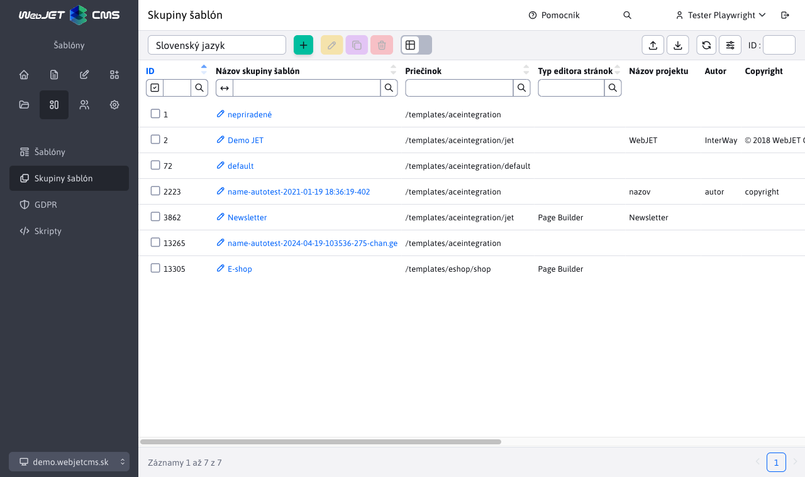

# Skupiny šablón

Skupiny šablón umožňujú **nastavovať metadáta viacerým šablónam**, ako je napr. názov projektu, autor, copyright atď. Zoskupenie šablón je vhodné hlavne v projektoch, kde sa nachádza viacero domén s rozdielnymi dizajnmi/šablónami.

## Zoznam skupín šablón

Zoznam skupín šablón zobrazuje prehľad vytvorených skupín, predvolene existuje skupina nepriradené.

## Editor skupiny šablón

## Karta Základné

- Názov skupiny šablón - jednoznačný názov skupiny šablón.
- Priečinok - hlavný priečinok, v ktorom sa nachádzajú súbory šablóny (JSP/HTML súbor s dizajnom, CSS štýly, JavaScript súbory).
- Typ editora stránok:
    - Štandardný - hlavný editor stránok s formátovaním textu, vkladaním obrázkov, odkazov atď.
    - HTML editor - používa sa pre špeciálne stránky, ktoré potrebujú používať presný HTML editor.
    - Page Builder - režim editácie stránky skladajúcej sa z [pripravených blokov](../page-builder/README.md).
    - `Grid Editor` - predchodca režimu Page Builder, bude v roku 2024 odstránený.
- Počet použití - počet šablón v tejto skupine.

## Karta Metadáta

- Umožňuje nastaviť metadáta používané v [hlavičke sablón](../thymeleaf/webjet-objects.md#ninja-šablóna).
- Prefix textových kľúčov - zadaním prefixu je možné modifikovať prekladové kľúče aplikácií vložených v stránke. Príklad: ak aplikácia používa prekladový kľúč `components.inquiry.answers` a v skupine šablón nastavíte prefix `jetportal`, tak sa vyhľadá pri zobrazení aplikácie kľúč `jetportal.components.inquiry.answers` a ak existuje, použije sa. Ak preklad pre tento kľúč neexistuje, použije sa samozrejme pôvodná hodnota z kľúča `components.inquiry.answers`. Môžete tak ľahko zmeniť text zobrazený v aplikácii v určitej skupine šablón.

## Karta voliteľné polia

Skupine je možné definovať [voliteľné polia](../webpages/customfields/README.md), ktorých použitie záleží od dizajnéra šablóny.
