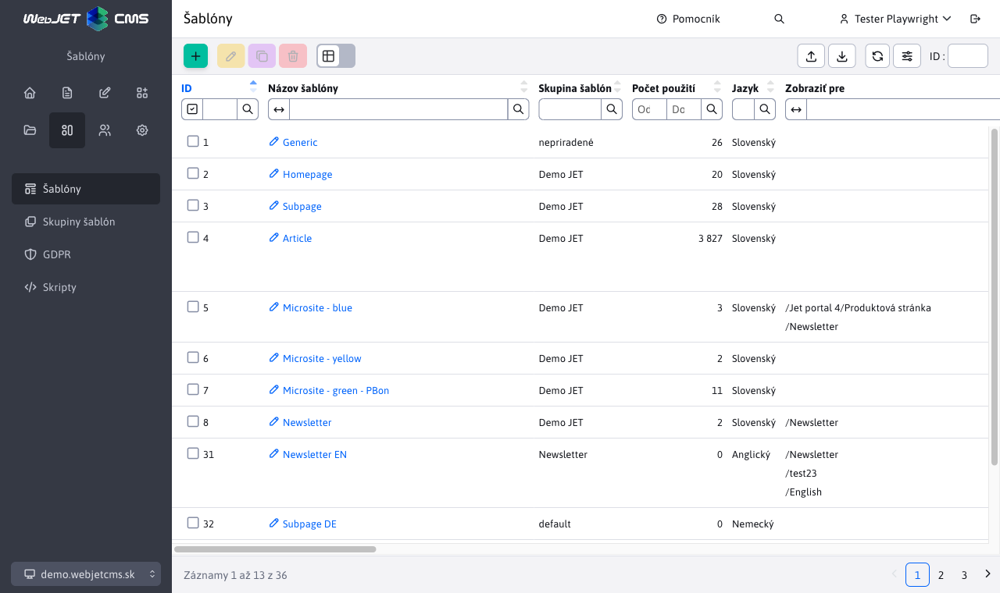

# Šablóny

Šablóny sa vytvárajú v admin časti Web JET v sekcii Šablóny po kliknutí na menu Zoznam šablón.

## Zoznam šablón

Stĺpec počet použití zobrazuje počet stránok, ktoré danú šablónu používajú. Ak je to 0 stránok, tak môžete šablónu vymazať. Ak chcete vymazať šablónu, ktorá je použitá na niektorých stránkach, použite funkciu zlúčenie šablón (pole Zlúčiť túto šablónu do v karte Šablóna v editore). Takto všetky stránky a priečinky, používajúce aktuálne editovanú šablónu budú zmenené na zvolenú šablónu.

## Editor šablóny

### Karta základné

- Skupina šablón - priradenie šablóny do [skupiny šablón](template-groups.md).
- HTML šablóna definuje aká JSP/HTML šablóna sa použije (HTML šablóna musí byť uložená v priečinku `/templates` a mať príponu `jsp` alebo `html`).
- Typ editora stránok - definuje aký typ editora stránok sa použije, pre komplexné web stránky sa typicky používa [Page Builder](../page-builder/README.md). Predvolene sa dedí hodnota nastavená v skupine šablón.
- Meno inštalácie - pri zobrazení šablóny je možné zmeniť meno inštalácie, čo ovplyvňuje použité verzie aplikácií - umožňuje pre šablónu použiť špecificky upravenú aplikáciu v priečinku `/components/MENO_INSTALACIE/aplikacia/`.
- Vypnúť spam ochranu - spam ochranu vypnite, ak sa stránka v tejto šablóne načítava pomocou REST služby, prípadne ak sa jedná o stránku použitú pre hromadný email.

### Karta Štýl

- Hlavný CSS štýl - zoznam odkazov na CSS súbor, ktoré šablóna používa. Uvedený CSS sa použije aj na získanie zoznamu CSS štýlov pre výber v editore stránok.
- Druhoradý CSS štýl - doplnkový CSS štýl, nepoužije sa pre výberové menu Štýly v editore stránok.
- HTML kód umožňuje definovať dodatočný HTML kód, ktorý sa vloží na koniec stránky (respektíve na miesto definované v HTML šablóne).

CSS súbory je možné zadávať každý na nový riadok alebo oddelené čiarkou.

Editor stránok v admin časti automaticky hľadá súbor `/templates/template-name/dist/css/editor.css` ktorý načíta spolu s CSS štýlom šablóny. V súbore `editor.css` môžete predefinovať určité vlastnosti, ktoré sa majú použiť len v editore.

### Karta Šablóna

- Priradenie web stránok použitých ako hlavička, pätička atď.

Do html šablóny sa na určené miesta vložia web stránky definujúce hlavičku, pätičku a menu, čím vznikne šablóna. Do šablóny sa následne vloží navigačná lišta a samotný text web stránky, čím vznikne výsledná web stránka zaslaná do prehliadača internetu návštevníka.

- Zlúčiť túto šablónu do - umožňuje nahradiť práve zobrazenú šablónu zvolenou vo výberovom poli v existujúcich stránkach a priečinkoch. Aby nedošlo k nekonzistencii použite túto funkciu pred zmazaním šablóny.

### Karta Prístup

Umožňuje definovať priečinky, pre ktoré sa šablóna bude zobrazovať na výber pri editácii web stránky.

### Karta Priečinky

Pri existujúcej šablóne zobrazuje zoznam priečinkov, ktoré majú nastavenú zobrazenú šablónu ako predvolenú šablónu pre vytvorenie novej web stránky.

### Karta Web stránky

Pri existujúcej šablóne zobrazuje zoznam web stránok, ktoré šablónu používajú.

## Zobrazenie pre špecifické zariadenie

WebJET podporuje možnosť úpravy šablóny pre špecifické zariadenie. To je štandardne `phone, tablet, pc` podľa pripojeného zariadenia, je možné ho ale ovplyvniť pomocou URL parametra `?forceBrowserDetector=blind` napr. pre optimalizovanú šablónu pre slabozrakých.

Typ zariadenia sa deteguje na serveri podľa HTTP hlavičky `User-Agent`. Telefón sa deteguje pri nájdení výrazu `iphone`, alebo `mobile` a súčasne výrazu `android`. Tablet ako `ipad||tablet||kindle` alebo ak obsahuje `android` a neobsahuje `mobile`.

Pri zobrazení web stránky na telefóne sa hľadá nastavená šablóna pre web stránku s výrazom `device=phone`. Ak má stránka šablónu `Homepage` vyhľadá sa šablóna `Homepage device=phone`. Ak existuje, použije sa.

V takto optimalizovanej šablóne môžete použiť inú stránku v hlavičke, alebo iný HTML súbor šablóny.

Podobne automaticky sa postupuje aj pre hľadanie web stránok hlavičiek/pätičiek, ak je nastavená stránka `Default header` automaticky sa vyhľadá `Default header device=phone`. Ak existuje, použije sa. Nemusíte tak vytvárať samostatné šablóny, stačí vytvoriť vhodnú web stránku s upravenou hlavičkou/pätičkou.