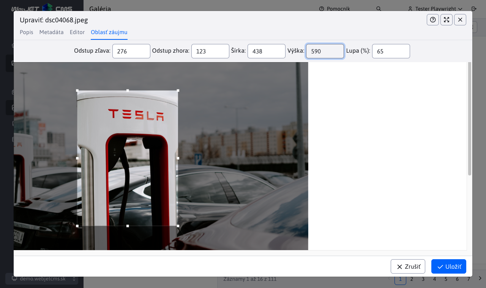

## Použitie bodu záujmu

Pre `/thumb` sa použitie [nastavený bod záujmu](../../redactor/apps/gallery/README.md) pridaním URL parametra `ip` (interest point). Oblasť záujmu sa dá nastaviť na ľubovoľný obrázok, nielen ten v galérií kliknutím na editáciu v editore stránok, alebo v prieskumníkovi.

Pre ukážku je označená oblasť záujmu pomerne vysoká, aby bolo zrejmé ako sa vykonáva posun pri generovaní obrázkov najmä štvorcového rozmeru voči označenej oblasti.

Ak nie je označená žiadna oblasť považuje sa za označený celý obrázok.

Všimnite si, že je tesne označený stojan Tesla.

## Fixná šírka

Máte zadaný len parameter `w`, výška `h` sa dopočíta podľa pomeru strán pôvodného výrezu.

Vygeneruje sa obrázok široký 200 bodov, výška sa dopočíta (čiže výsledok môže byť ľubovoľne vysoký - podľa pomeru strán oblasti) a použije sa len zvolená oblasť. Výsledný obrázok má rozmer `200x270` bodov:

`/thumb/images/gallery/test-vela-foto/dsc04131.jpg?w=200&ip=1`

## Fixná výška

Máte zadaný len parameter `h`, šírka `w` sa dopočíta podľa pomeru strán pôvodného výrezu.

To isté ako `ip=1` len máme zadanú iba výšku, šírka sa dopočíta, výsledný obrázok má rozmer `148x200` bodov:

`/thumb/images/gallery/test-vela-foto/dsc04131.jpg?h=200&ip=2`

## Fixná šírka a výška vyplnená farbou

Výrez sa zmestí celý do zvolenej veľkosti `w` a `h` **nie** je centrovaný a zvyšok je zafarbený farbou z parametra `c` (predvolene biela)

Máte zadanú PRESNÚ veľkosť obrázku, do ktorej sa zvolená oblasť musí zmestiť, obrázok ale môže byť reálne menší ako zadaná časť, v tomto prípade `300x200` bodov, pravá strana sa zafarbí zadanou farbou (v ukážke predvolená biela bez zadaného `c` parametra).

`/thumb/images/gallery/test-vela-foto/dsc04131.jpg?w=300&h=200&ip=3`

## Fixná šírka a výška vyplnená farbou - centrovaný

Výrez sa zmestí celý do zvolenej veľkosti `w` a `h`, je centrovaný a zvyšok je zafarbený farbou z parametra `c` (predvolene biela)

Máte zadanú PRESNÚ veľkosť obrázku, do ktorej sa zvolená oblasť musí zmestiť, obrázok ale môže byť reálne menší ako zadaná časť. V tomto prípade `300x200` bodov, okolie sa zafarbí zvolenou farbou, takže obrázok má VŽDY zadaný rozmer (nebude poskakovať). Farba sa zadáva ako hex hodnota parametrom `c` (bez znaku #).

`/thumb/images/gallery/test-vela-foto/dsc04131.jpg?w=300&h=200&ip=4&c=ffff00`

## Centrovaný s pomerom strán - zmenšený

Zmenši výrez a vycentruje tak, aby bol dodržaný pomer strán požadovanej veľkosti.

Máte oblasť 271x362 a chcete štvorec 200x200, výsledný obrázok je centrovaná časť z oblasti v požadovanom pomere strán ako max veľkosť. Čiže celú oblasť ako keby posunieme smerom dole a centrujeme (POZOR: nezoberieme z nej 200x200, ale štvorec 271x271 podľa požadovaného pomeru strán). Ako keby približujete zvolenú oblasť smerom do jej stredu kým nemáte vyplnený celý výrez (podľa pomeru strán, nie rozmeru). Najskôr sa teda spraví orez podľa pomeru strán a následne zmenšenie do požadovanej veľkosti.

`/thumb/images/gallery/test-vela-foto/dsc04131.jpg?w=200&h=200&ip=5`

Všimnite si, že oproti označenej oblasti je obrázok z dôvodu rozdielneho pomeru strán označenej oblasti a požadovaného rozmeru orezaný z hornej a spodnej časti (vidno menej ako je označená oblasť).

## Centrovaný s pomerom strán - zväčšený

Zvolený výrez bude komplet vo výsledku ale celkovo sa výrez zväčší podľa pomeru strán požadovanej veľkosti.

V podstate podobné ako `ip=5`, ale oblasť sa nezmenšuje, ale keďže obrázok má aj okolie tak ju naopak zväčšíme podľa požadovaného pomeru strán. Čiže vo výsledku bude vždy CELÁ zvolená oblasť, ale bude rozšírená do okolia (ideálne centrovaná, ak je ale oblasť na kraji posunie sa):

`/thumb/images/gallery/test-vela-foto/dsc04131.jpg?w=200&h=200&ip=6`

Všimnite si, že oproti označenej oblasti je obrázok z dôvodu rozdielneho pomeru strán označenej oblasti a požadovaného rozmeru rozšírený vpravo a vľavo (vidno viac ako je označená oblasť).

## Vypnutie nastavenej hodnoty bodu záujmu

V niektorých prípadoch je vhodné nepoužiť nastavenú hodnotu bodu záujmu, napr. chcete použiť `ip=4`, čiže presný rozmer obrázku vyplnený bielou farbou, ale nechcete použiť nastavenú oblasť záujmu (teda použiť čo najväčšiu časť obrázku). Do URL adresy stačí pridať parameter `noip=true` a nastavená hodnota sa nepoužije.

`/thumb/images/gallery/test-vela-foto/dsc04068.jpeg?w=300&h=200&ip=4&noip=true&c=ffff00`

