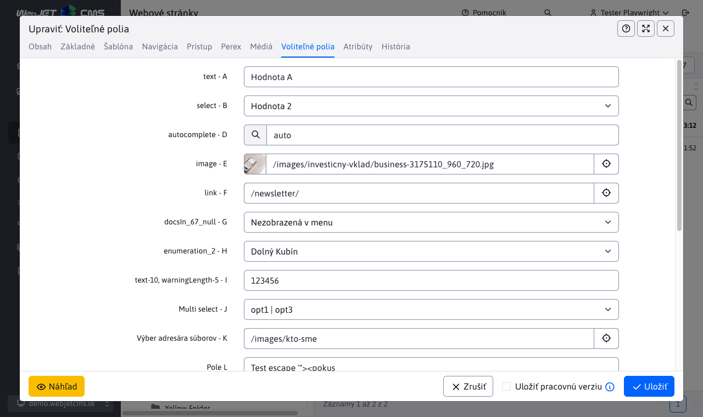
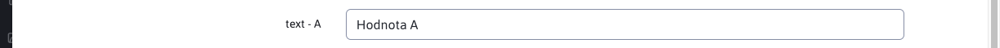
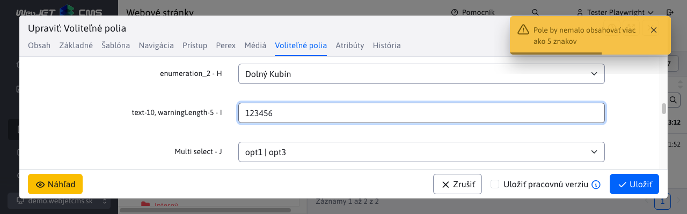
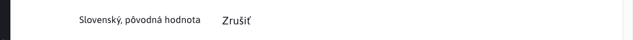
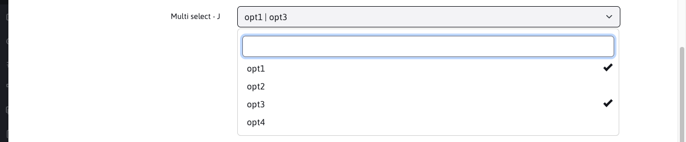
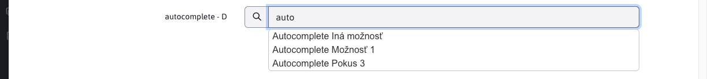
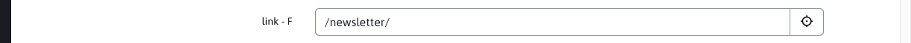
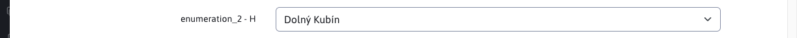
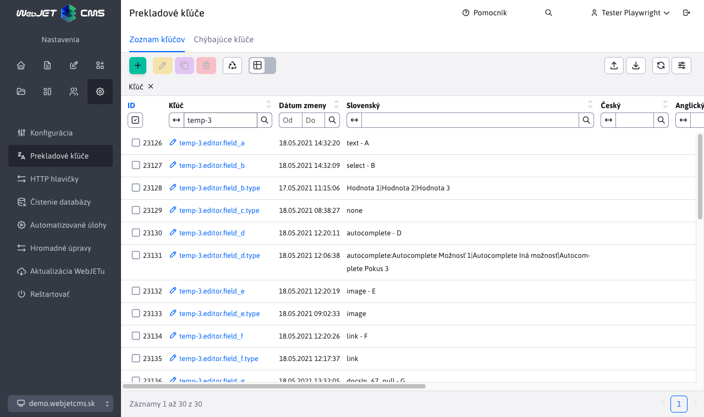

# Voliteľné polia

Niektoré dialógové okná majú kartu voliteľné polia kde je možné nastavovať voliteľné atribúty (hodnoty, texty) podľa vašej potreby. Hodnoty je následne možné preniesť a použiť v dizajnovej šablóne ako:

```html
Web stránka:
<iwcm:write name="field_a"/> až <iwcm:write name="field_t"/>

Adresár:
<iwcm:write name="group_field_a"/> až <iwcm:write name="group_field_d"/>
```

Názvy Pole A - Pole X je možné zmeniť v konfigurácii v časti editácia textov. Stačí modifikovať kľúče:

- ```editor.field_x``` - pre web stránku
- ```temp-ID.editor.field_x``` - pre web stránku so šablónou `ID`, napr. `temp-3.editor.field_a` zmení názov voľného poľa A len pre web stránky, ktoré používajú šablónu s `ID` 3.
- ```groupedit.field_x``` - pre adresár
- ```user.field_x``` - pre používateľa
- ```components.qa.field_x``` - pre aplikáciu Otázky a odpovede
- ```components.banner.field_x``` - pre aplikáciu Bannerový systém
- ```components.media.field_x``` - pre aplikáciu Média
- ```components.perex.field_x``` - pre aplikáciu Značky
- ```components.invoice.field_x``` - pre aplikáciu Elektronický obchod

Technické informácie sa nachádzajú v [dokumentácii pre programátora](../../../developer/datatables-editor/customfields.md).

## Typy polí

Polia sa štandardne zobrazujú ako textové, pomocou zmeny definície cez prekladové kľúče je možné typy polí zmeniť.



!>**Upozornenie:**, **nastavenie typu** sa musí nastaviť vždy pre predvolený jazyk (nastavený v konfiguračnej premennej ```defaultLanguage```), aj keď WebJET je používaný v inom jazyku.

### Text



Typ poľa ```text``` je štandardné textové pole. Je ale možné limitovať maximálnu veľkosť poľa a aj po zadanom počte znakov zobraziť varovanie:

- ```editor.field_x.type=text``` - štandardné textové pole s veľkosťou maximálne 255 znakov
- ```editor.field_x.type=text-10``` - štandardné textové pole s veľkosťou maximálne 10 znakov
- ```editor.field_x.type=text-160, warningLength-50``` - štandardné textové pole s veľkosťou maximálne 160 znakov, po zadaní 50 znakov sa zobrazí varovanie o prekročení odporúčanej dĺžky textu (napr. pole opis Google odporúča mať dlhé 50-160 znakov)

Pri dosiahnutí zadaného počtu znakov v nastavení ```warninglength``` sa zobrazí varovanie. Príklad takéhoto varovania :



Text samotného varovania sa získava z prekladového kľúča, ktorý si musíte pripraviť a pozostáva z `prefix.field_x.warningText`. Kľuč predchádzajúcej hlášky sa zadefinoval ako ```editor.field_J.warningText=hláška...```.

### Textová oblasť

Typ poľa ```textarea``` je štandardná textová (viac riadková) oblasť.

- ```editor.field_x.type=textarea``` - štandardná textová oblasť


### Ne-editovateľný text

Pre zobrazenie jednoduchého textu môžete nastaviť ty poľa na hodnotu ```label```. Hodnota sa len zobrazí bez možnosti jej editácie.

- ```editor.field_x.type=label``` - ne-editovateľný text



### Výberové pole


Pre možnosť výberu z vopred definovaných hodnôt je možné do ```.type``` zadať možné hodnoty oddelené znakom ```|```:

```editor.field_x.type=Hodnota 1|Hodnota 2|Hodnota 3```

Ak chcete mať možnosť **nastaviť prázdnu hodnotu** začnite zoznam možností hodnotou ```|```:

```editor.field_x.type=|Hodnota 1|Hodnota 2|Hodnota 3```

### Výberové pole viac možností



V prípade potreby použitia výberu viacerých možností sa pred hodnotu doplní ```multiple```:

```editor.field_x.type=multiple:Hodnota 1|Hodnota 2|Hodnota 3```

Hodnoty sa potom ukladajú do pola oddelené pomocou znaku ```|```

```Hodnota 1|Hodnota 3```

### Boolovská hodnota

Pre možnosť zadania Boolovskej/binárnej hodnoty zadajte do ```.type``` možnosť ```boolean```.

### Číslo

Pre možnosť zadania číselnej hodnoty zadajte do ```.type``` možnosť ```number```.

### Dátum

Pre možnosť zadania dátumu zadajte do ```.type``` možnosť ```date```.

### Nezobraziť

Ak potrebujete nepoužívané polia skryť môžete použiť pole typu ```none```.

```editor.field_x.type=none```

### Autocomplete



Pole typu ```autocomplete``` funguje podobne ako výberové pole, ale umožňuje zadať aj inú hodnotu ako sú predvolené možnosti. Funkcia sa zapne prefixom ```autocomplete:``` v možných hodnotách oddelených znakom ```|```. Zároveň predvolené možnosti sa zobrazujú postupne po zadaní aspoň 3 znakov:

```temp-3.editor.field_d.type=autocomplete:Autocomplete Možnosť 1|Autocomplete Iná možnosť|Autocomplete Pokus 3```

### Výber obrázka


Pole pre výber obrázka má typ ```image```. Zobrazí štandardný dialóg pre nahratie/výber existujúceho obrázku.

```editor.field_x.type=image```

### Výber odkazu



Podobne ako pre obrázok je nastavením ```.type``` na hodnotu ```link``` možné otvoriť výber odkazu na súbor, alebo inú web stránku:

```editor.field_x.type=link```

### Výber existujúcej stránky z adresára


Pre výber existujúcej stránky (jej ```docId```) je možné použiť typ ```docsIn_GROUPID```:

- ```editor.field_x.type=docsIn_67``` - zobrazí výber stránky z adresára 67
- ```editor.field_x.type=docsIn_67_null``` - pridaním ```null``` na koniec typu je možné vybrať aj prázdnu možnosť (nenastaviť žiadnu stránku)

### Číselník



Prepojenie na číselník je cez typ ```enumeration_X``` kde X je ID typu číselníka. Ako hodnota sa nastaví ID záznamu z číselníka:

- ```editor.field_x.type=enumeration_2``` - zobrazí ako výberové pole možnosti z typu číselníka 2

### Výber adresára súborového systému


Pre výber adresára v súborovom systéme nastavením ```.type``` na hodnotu ```dir```. Po kliknutí na ikonu kríža na konci textového poľa sa zobrazí dialógové okno pre výber adresára v súborovom systéme.

```editor.field_x.type=dir```

### Unikátny identifikátor

Typ poľa `uuid` umožňuje generovať unikátny identifikátor. Ak má pole pri zobrazení prázdnu hodnotu, vygeneruje sa nový `uuid`, podobne, keď zmažete hodnotu a prejdete kurzorom do iného poľa vygeneruje sa nová hodnota.


### Farba

Typ poľa `color` umožňuje vybrať farbu vrátane nastavenia priesvitnosti.


## Prepojenie na šablónu

V niektorých prípadoch je potrebné mať definované rôzne názvy a možnosti voliteľných polí podľa šablóny stránky/adresára alebo podľa skupiny šablón. WebJET umožňuje nastaviť prekladové kľúče s prefixom ```temp-ID.``` pre šablónu, alebo s prefixom prekladových textov nastavených v skupine šablón:

- ```temp-ID.editor.field_x=Pole X``` - nastavenie názvu poľa pre šablónu so zadaným ```ID```
- ```temp_group_prefix.editor.field_x=Pole X``` - nastavenie názvu poľa pre skupinu šablón, ktorá má nastavený Prefix textových kľúčov na hodnotu ```temp_group_prefix```



## Prepojenie na doménu

Prekladové kľúče je možné modifikovať aj podľa aktuálnej domény. Stačí nastaviť konfiguračnú premennú ```constantsAliasSearch``` na ```true```, čo aktivuje vyhľadávanie konfiguračných premenných a prekladových kľúčov s doménovým prefixom. Ak máte napr. doménu ```demo.webjetcms.sk``` je možné vytvoriť konfiguračné premenné typu ```demo.webjetcms.sk-installName``` ale aj prekladové kľúče typu ```demo.webjetcms.sk-editor.field_x.type=link```.

Doména sa ale môže meniť, preto odporúčame vytvoriť tzv. doménové aliasy. Tie je možné nastaviť viacerým doménam na rovnakú hodnotu (napr. pre test a produkčné domény) a pri zmene domény nie je potrebné premenovať všetky kľúče a konfiguračné hodnoty. Alias definujete v konfigurácii ako novú premennú s názvom ```multiDomainAlias:demo.webjetcms.sk``` a hodnotou napr. ```demo```. Následne v prefixoch kľúča môžete použiť prefix ```demo``` namiesto celej domény.
