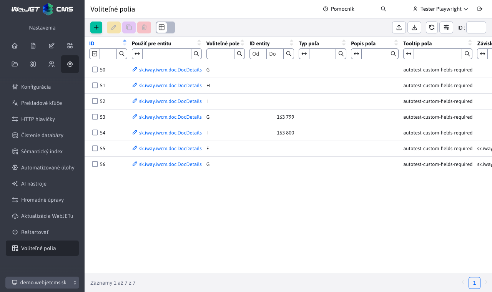
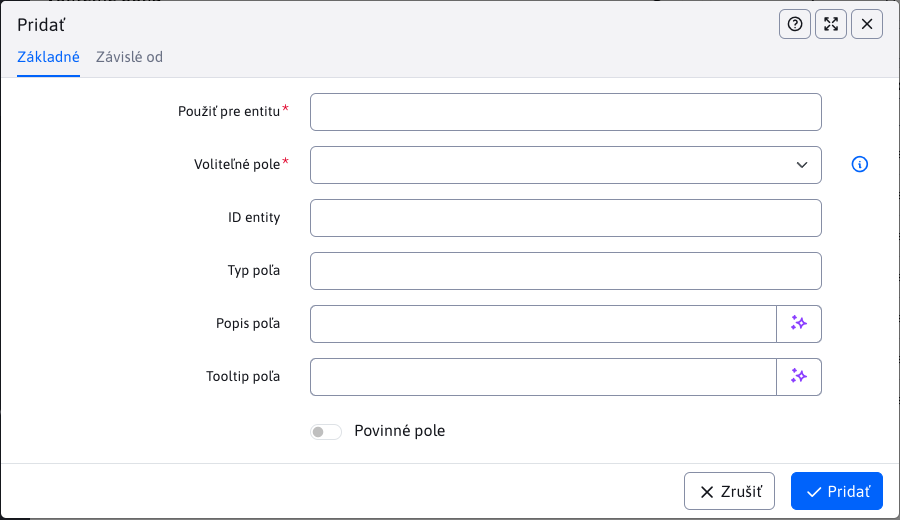

# Tabuľka Voliteľné polia

Tabuľka Voliteľné polia umožňuje centrálne nastaviť vlastnosti voliteľných polí pre rôzne entity v systéme. Nastavenia sa nachádzajú v menu `Nastavenia` pod položkou `Voliteľné polia`. Pomocou tejto tabuľky je možné meniť typ poľa, popis, povinnosť, tooltip aj typovo špecifické parametre bez potreby editácie prekladových kľúčov.

## Stĺpce tabuľky

Tabuľka obsahuje nasledovné stĺpce:

| Stĺpec | Popis |
| --- | --- |
| **Použiť pre entitu** | Názov triedy entity (napr. `sk.iway.iwcm.doc.DocDetails`), pre ktorú sa nastavenie aplikuje. Pole podporuje autocomplete - po zadaní aspoň 1 znaku sa zobrazia návrhy dostupných entít, ktoré využívajú voliteľné polia. |
| **Voliteľné pole** | Písmeno abecedy (A-Z), ktorým sa identifikuje voliteľné pole. Zodpovedá názvom polí `field_A`, `field_B` atď. |
| **ID entity** | Voliteľné ID konkrétnej entity (napr. ID stránky). Ak nie je zadané, nastavenie sa aplikuje globálne pre všetky entity danej triedy. |
| **Typ poľa** | Typ voliteľného poľa (napr. `text`, `textarea`, `boolean`, `number` atď.). |
| **Popis poľa** | Popis (label), ktorý sa zobrazí pri voliteľnom poli v editore (môžete zadať prekladový kľuč). |
| **Tooltip poľa** | Text nápovedy, ktorý sa zobrazí po prejdení myšou ponad ikonu <i class="ti ti-info-circle"></i>. |
| **Povinné pole** | Ak je nastavené na `true`, pole bude povinné a pri uložení entity sa skontroluje, či je vyplnené. |

## Podporované typy poľa

V poli **Typ poľa** sú dostupné typy:

- `text`, `textarea`, `select`, `multiselect`, `boolean`, `number`, `date`, `none`
- `autocomplete`, `image`, `link`, `json_group`, `json_doc`, `dir`, `docsIn`, `enumeration`, `uuid`, `color`

## Nastavenia podľa typu

Pri zmene typu poľa sa v editore dynamicky zobrazia doplnkové polia, ktoré patria len k danému typu:

| Typ poľa | Doplnkové nastavenia |
| --- | --- |
| `text` | **Maximálna dĺžka textu**, **Dĺžka textu pre zobrazenie varovania**, **Text varovania** |
| `select`, `multiselect` | **Možnosti pre výberové pole** (editor typu `OPTIONS`, riadky `label:value`) |
| `autocomplete` | zoznam možností (editor typu `BASIC_OPTIONS`, riadky s jednou hodnotou) |
| `docsIn` | **Výber priečinka webových stránok** (určí zdroj stránok pre výber) |
| `enumeration` | **Prepojenie na číselník** (`ID číselníka`, `label` stĺpec, `value` stĺpec) |

Ak je pri typoch `select`, `multiselect`, `docsIn`, `enumeration`, `json_group`, `json_doc` vypnuté **Povinné pole**, editor automaticky ponúkne aj prázdnu hodnotu.

V karte Závislé od je možné nastaviť polia:

| Stĺpec | Popis |
| --- | --- |
| **Závislé od entity** | Názov triedy od ktorej je toto nastavenie závislé, používa sa len pre `DocDetails` webové stránky kde je možné mať závislosť na šablóne, nastavte `sk.iway.iwcm.doc.TemplateDetails` |
| **ID závislej entity** | ID entity od ktorej je nastavenie závislé, ak sa má voliteľné pole takto nastaviť len pre šablónu s ID 6 nastavte hodnotu 6 |

## Priorita nastavení

Nastavenia sa aplikujú podľa priority:

1. **Globálne nastavenia** - záznamy bez vyplneného `ID entity` platia pre všetky entity danej triedy.
2. **Špecifické nastavenia** - záznamy s vyplneným `ID entity` majú vyššiu prioritu a prepíšu globálne nastavenia pre daný identifikátor.
3. **Závislé od** - pre niektoré entity (napr. `DocDetails`) sa automaticky aplikuje aj kontext šablóny (`TemplateDetails`) podľa použitého ID šablóny, ktorý má najvyššiu prioritu.

Napr. pre web stránku (`DocDetails`) je možné nastaviť pole A ako povinné globálne (bez ID entity), ale pre stránky so šablónou s konkrétnym ID môže byť táto povinnosť prepísaná.

## Validácia

Kombinácia polí `Použiť pre entitu`, `Voliteľné pole`, `ID entity`, `Závislé od entity` a `ID závislej entity` musí byť jedinečná. Systém nedovolí vytvoriť duplicitný záznam s rovnakou kombináciou týchto hodnôt.

## Povinné polia

Ak je pre voliteľné pole zapnutý príznak `Povinné pole`, systém automaticky:

- Označí pole ako povinné v editore (zobrazí sa vizuálne označenie povinného poľa).
- Pri ukladaní entity skontroluje, či je pole vyplnené. Ak nie je, zobrazí chybovú hlášku a uloženie sa nepovolí.
