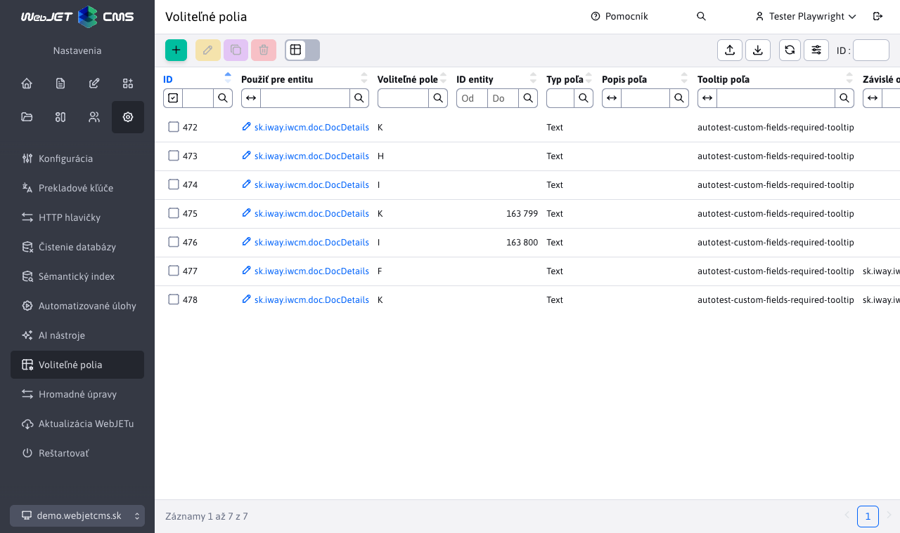
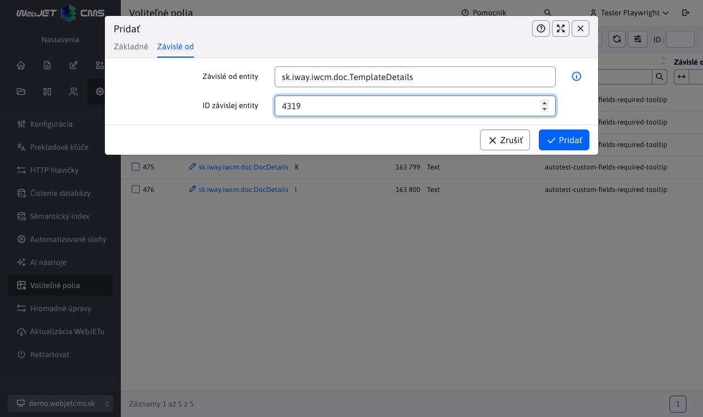

# Tabuľka Voliteľné polia

Tabuľka Voliteľné polia umožňuje centrálne nastaviť vlastnosti voliteľných polí pre rôzne entity v systéme. Nastavenia sa nachádzajú v menu `Nastavenia` pod položkou `Voliteľné polia`. Pomocou tejto tabuľky je možné meniť typ poľa, popis, povinnosť, tooltip aj typovo špecifické parametre bez potreby editácie prekladových kľúčov.



## Stĺpce tabuľky

Tabuľka obsahuje nasledovné stĺpce:

| Stĺpec | Popis |
| --- | --- |
| **Použiť pre entitu** | Názov triedy entity (napr. `sk.iway.iwcm.doc.DocDetails`), pre ktorú sa nastavenie aplikuje. Pole podporuje autocomplete - po zadaní aspoň 1 znaku sa zobrazia návrhy dostupných entít, ktoré využívajú voliteľné polia. |
| **Voliteľné pole** | Písmeno abecedy (A-Z), ktorým sa identifikuje voliteľné pole. Zodpovedá názvom polí `field_A`, `field_B` atď. |
| **ID entity** | Voliteľné ID konkrétnej entity (napr. ID stránky). Ak nie je zadané, nastavenie sa aplikuje globálne pre všetky entity danej triedy. |
| **Typ poľa** | Typ voliteľného poľa (napr. `text`, `textarea`, `boolean`, `number` atď.). |
| **Popis poľa** | Popis (label), ktorý sa zobrazí pri voliteľnom poli v editore (môžete zadať prekladový kľúč). |
| **Tooltip poľa** | Text nápovedy, ktorý sa zobrazí po prejdení myšou ponad ikonu <i class="ti ti-info-circle"></i>. |
| **Povinné pole** | Ak je nastavené na `true`, pole bude povinné a pri uložení entity sa skontroluje, či je vyplnené. |


## Podporované typy poľa

V poli **Typ poľa** sú dostupné typy:

| Typ | Zobrazenie | Výber |
| --- | --- | --- |
| `text` | Textové pole | Jednohodnotové |
| `textarea` | Textová oblasť (viac riadkov) | Jednohodnotové |
| `select` | Výberové pole (dropdown) | Jednohodnotové |
| `multiselect` | Výberové pole s možnosťou výberu viacerých hodnôt | Viachodnotové (hodnoty oddelené `\|`) |
| `radio` | Zoznam rádio tlačidiel | Jednohodnotové |
| `checkbox` | Zoznam zaškrtávacích polí | Viachodnotové (hodnoty oddelené `\|`) |
| `boolean` | Prepínač áno/nie | Jednohodnotové |
| `number` | Číselné pole | Jednohodnotové |
| `date` | Výber dátumu | Jednohodnotové |
| `autocomplete` | Textové pole s návrhmi | Jednohodnotové |
| `image` | Výber obrázka | Jednohodnotové |
| `link` | Výber odkazu | Jednohodnotové |
| `json_group` | Výber priečinku webových stránok | Jednohodnotové |
| `json_doc` | Výber webovej stránky | Jednohodnotové |
| `dir` | Výber priečinku súborového systému | Jednohodnotové |
| `docsIn` | Výber existujúcej stránky z adresára | Jednohodnotové |
| `uuid` | Automaticky generovaný unikátny identifikátor | Jednohodnotové |
| `color` | Výber farby vrátane priesvitnosti | Jednohodnotové |
| `none` | Pole sa nezobrazí | — |

!>**Upozornenie:** Typ `enumeration` už nie je samostatne dostupný typ poľa v tabuľke. Prepojenie na číselník sa nastavuje ako **zdroj možností** pri typoch `select`, `multiselect`, `radio` a `checkbox` (viď [Zdroj možností](#zdroj-možností)).

## Nastavenia podľa typu

Pri zmene typu poľa sa v editore dynamicky zobrazia doplnkové polia, ktoré patria len k danému typu:

| Typ poľa | Doplnkové nastavenia |
| --- | --- |
| `text` | **Maximálna dĺžka textu**, **Dĺžka textu pre zobrazenie varovania**, **Text varovania** |
| `select`, `multiselect`, `radio`, `checkbox` | **Zdroj možností** (prepínač **Statické možnosti** / **Číselník**) |
| `autocomplete` | zoznam možností (editor typu `OPTIONS_SIMPLE`, riadky s jednou hodnotou) |
| `docsIn` | **Výber priečinka webových stránok** (určí zdroj stránok pre výber) |

### Správanie povinného poľa podľa typu

Ak je pri typoch `select`, `docsIn`, `json_group`, `json_doc` vypnuté **Povinné pole**, editor automaticky ponúkne aj prázdnu hodnotu. Pri typoch `radio` a `checkbox` vypnuté povinné pole znamená, že používateľ nemusí vybrať žiadnu možnosť.

### Zdroj možností

Pri typoch `select`, `multiselect`, `radio` a `checkbox` si viete zmeniť zdroj možností pomocou prepínača **Zdroj možností**:

- **Statické možnosti** - zobrazí pole **Možnosti pre výberové pole** (editor typu `OPTIONS`, riadky `label:value`). Používa sa pre pevný zoznam možností zadaný priamo v nastavení.
- **Číselník** - zobrazí pole **Prepojenie na číselník** s nastavením `ID číselníka`, `label` stĺpca a `value` stĺpca. Možnosti sa načítajú dynamicky z vybraného číselníka.

#### Statické možnosti

Statické možnosti sa zadávajú v poli **Možnosti pre výberové pole** vo formáte `label:value`, každá možnosť na novom riadku. Ak je `label` a `value` rovnaký, stačí zadať jednu hodnotu:

```
Slovensko:sk
Česko:cz
Rakúsko:at
```

#### Prepojenie na číselník

Pri výbere zdroja **Číselník** sa zobrazí pole **Prepojenie na číselník**, kde sa nastavuje:

- **ID číselníka** - identifikátor typu číselníka, z ktorého sa načítajú možnosti
- **Label stĺpec** - vlastnosť z číselníka použitá ako zobrazený text (predvolene `string1`)
- **Value stĺpec** - vlastnosť z číselníka použitá ako uložená hodnota (predvolene `string1`)

Môžete použiť ktorúkoľvek vlastnosť z číselníka: `string1` až `string12`, `decimal1` až `decimal4`, `boolean1` až `boolean4`, `date1` až `date4`, `id`.

### Rozdiel medzi select/multiselect a radio/checkbox

Typy `select` a `radio` umožňujú výber práve jednej hodnoty, ale líšia sa zobrazením:

- **`select`** - zobrazí sa ako rozbaľovací zoznam (dropdown)
- **`radio`** - zobrazí sa ako zoznam rádio tlačidiel, všetky možnosti sú viditeľné naraz

Typy `multiselect` a `checkbox` umožňujú výber viacerých hodnôt:

- **`multiselect`** - zobrazí sa ako rozbaľovací zoznam s možnosťou výberu viacerých položiek
- **`checkbox`** - zobrazí sa ako zoznam zaškrtávacích polí, všetky možnosti sú viditeľné naraz

Pri viachodnotových typoch (`multiselect`, `checkbox`) sa vybrané hodnoty ukladajú do poľa oddelené znakom `|`.

### Spätná kompatibilita s typom enumeration

Staršie záznamy s typom `enumeration` sa pri otvorení v editore automaticky zobrazia ako typ `select` so zdrojom možností `Číselník`. Po ich najbližšom uložení sa typ uloží ako `select`. Pôvodná konfigurácia číselníka zostane zachovaná.

## Karta Závislé od

V karte **Závislé od** je možné nastaviť polia:

| Stĺpec | Popis |
| --- | --- |
| **Závislé od entity** | Názov triedy od ktorej je toto nastavenie závislé, používa sa len pre `DocDetails` webové stránky kde je možné mať závislosť na šablóne, nastavte `sk.iway.iwcm.doc.TemplateDetails` |
| **ID závislej entity** | ID entity od ktorej je nastavenie závislé, ak sa má voliteľné pole takto nastaviť len pre šablónu s ID 6 nastavte hodnotu 6 |



## Priorita nastavení

Nastavenia sa aplikujú podľa priority:

1. **Globálne nastavenia** - záznamy bez vyplneného `ID entity` platia pre všetky entity danej triedy.
2. **Špecifické nastavenia** - záznamy s vyplneným `ID entity` majú vyššiu prioritu a prepíšu globálne nastavenia pre daný identifikátor.
3. **Závislé od** - pre niektoré entity (napr. `DocDetails`) sa automaticky aplikuje aj kontext šablóny (`TemplateDetails`) podľa použitého ID šablóny, ktorý má najvyššiu prioritu.

Napr. pre web stránku (`DocDetails`) je možné nastaviť pole A ako povinné globálne (bez ID entity), ale pre stránky so šablónou s konkrétnym ID môže byť táto povinnosť prepísaná.

## Validácia

Kombinácia polí `Použiť pre entitu`, `Voliteľné pole`, `ID entity`, `Závislé od entity` a `ID závislej entity` musí byť jedinečná. Systém nedovolí vytvoriť duplicitný záznam s rovnakou kombináciou týchto hodnôt.

## Povinné polia

Ak je pre voliteľné pole zapnutý príznak `Povinné pole`, systém automaticky:

- Označí pole ako povinné v editore (zobrazí sa vizuálne označenie povinného poľa).
- Pri ukladaní entity skontroluje, či je pole vyplnené. Ak nie je, zobrazí chybovú hlášku a uloženie sa nepovolí.

Pre typy `checkbox` sa kontrola povinnosti vyhodnocuje tak, že musí byť zaškrtnutá aspoň jedna možnosť. Pre typy `radio` musí byť vybraná práve jedna možnosť.
