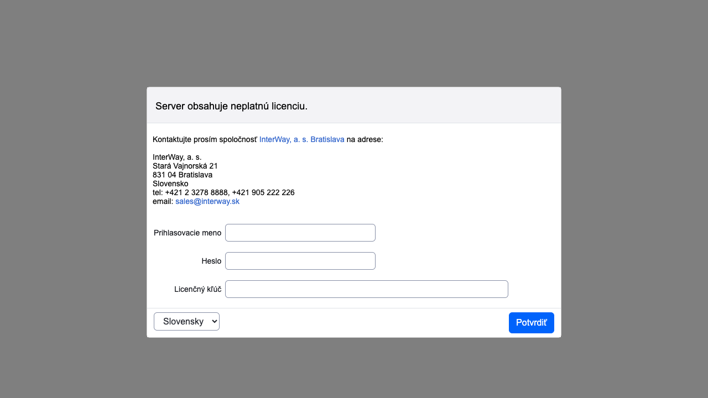
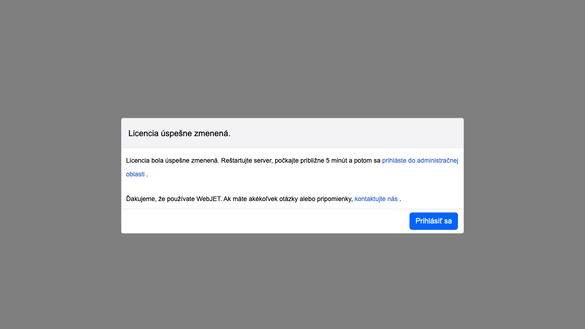

# Nastavenie licenčného čísla

Licenčné číslo pre WebJET sa zadáva v sekcii Nastavenia/Konfigurácia do konf. premennej `lisense`. K hlavnej licencii je možné mať nastavené doplnkové licencie pre ďalšie domény (napr. pri použití Enterprise licencie) v konf. premennej `licenseDomains` kde sa zadáva každá doplnková licencia domény na nový riadok.

## Nesprávne licenčné číslo

Ak WebJET obsahuje licenčné číslo s exspirovaným dátumom platnosti, nesprávnym doménovým menom, alebo licenčné číslo je nesprávne zadané, zobrazí sa po prihlásení do administrácie možnosť aktualizovať licenčné číslo, v logoch servera sa pri štarte zobrazí:

```log
[webjet][s.i.i.InitServlet][INFO][0] 2023-10-02 09:27:30 - -----------------------------------------------
[webjet][s.i.i.InitServlet][INFO][0] 2023-10-02 09:27:30 - WebJET initializing, root: /www/tomcat/webapps/webjet
[webjet][s.i.i.InitServlet][INFO][0] 2023-10-02 09:27:30 -
[webjet][s.i.i.InitServlet][INFO][0] 2023-10-02 09:27:30 - VERSION: 9
[webjet][s.i.i.InitServlet][INFO][0] 2023-10-02 09:27:30 - Checking database connection:
[webjet][s.i.i.InitServlet][INFO][0] 2023-10-02 09:27:30 -    Database connection: [OK]
[webjet][s.i.i.InitServlet][INFO][0] 2023-10-02 09:27:30 - INIT (db): license=xxxxxxxxxxxxxxxxxxxxxxxxxxxxxxx
[webjet][s.i.i.InitServlet][INFO][0] 2023-10-02 09:27:30 - License is valid until: 01.06.2022 23:59:59
[webjet][s.i.i.InitServlet][INFO][0] 2023-10-02 09:27:30 - ERROR: License is out of date, please contact
  InterWay (www.interway.sk)
  for new license.
```

Ak sa možnosť zadať licenčné číslo nezobrazí automaticky po otvorení administračnej časti otvorte adresu `/wjerrorpages/setup/license`.



Zadajte prihlasovacie údaje pre overenie oprávnení do administrácie a nový licenčný kľúč. Kliknite na OK pre uloženie. Zobrazí sa potvrdenie uloženia:



Ak sa aplikačný server nereštartuje automaticky, vykonajte reštart aplikačného servera. Pri novom štarte sa použije zadané licenčné číslo.

## Zadanie licenčného čísla priamo do databázy

V prípade nemožnosti zadania licenčného čísla cez web rozhranie môžete použiť nasledovný SQL príkaz priamo na databázovom serveri:

```sql
UPDATE _conf_ SET value='xxx' WHERE name='license';
```

pre Oracle použite zápis:

```sql
UPDATE webjet_conf SET value='xxx' WHERE name='license';
```

## Exspirácia licencie

WebJET vie automatický zistiť blížiaci sa koniec platnosti Vaše licencie. Ak zistí, že platnosť licencie vyprší do 2 (alebo menej) mesiacov, zobrazí upozornenie v úvodnej časti.

