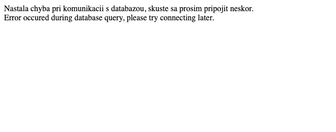
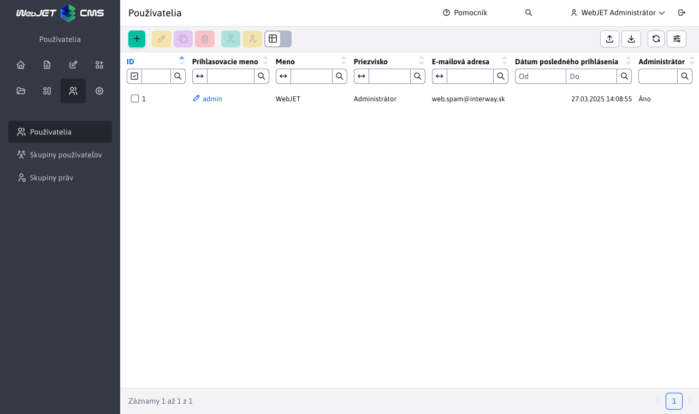
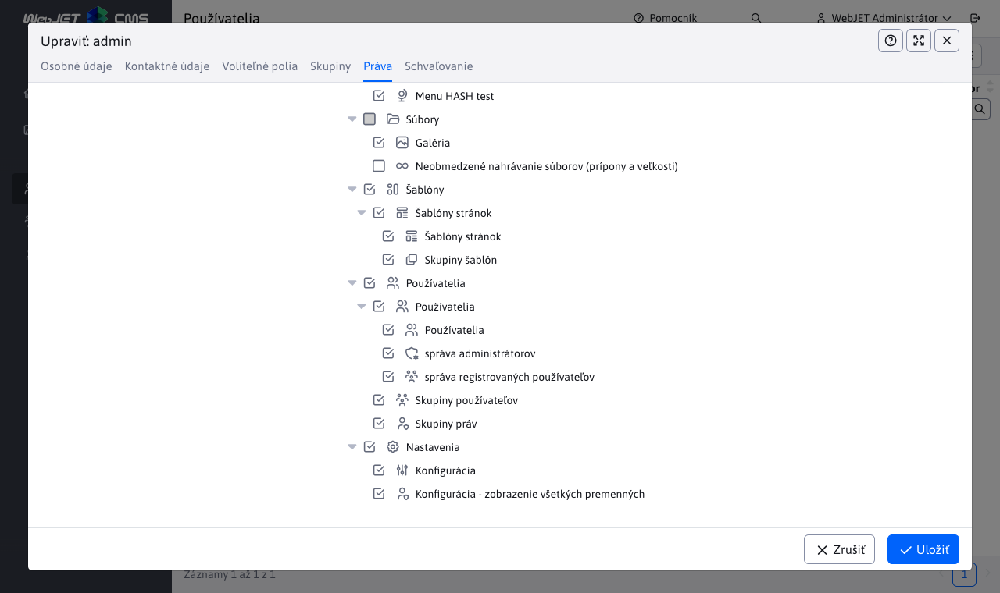

# Zriadenie novej inštalácie

Návod na zriadenie novej inštalácie/čistej databázy pre nový projekt vo WebJETe. Inštalácia je z bezpečnostných dôvodov povolená len na doméne `localhost`, po inštalácii môžete používať štandardné doménové meno.

## Predpoklady

- lokálne funkčný WebJET (nakonfigurovaný Tomcat, web aplikácia)
- prístup na DB server s právami pre zriadenie novej DB schémy (alebo už zriadená DB schéma)

## Základné požiadavky na server

- Server s minimálne 8 GB pamäte (pre aplikácie s väčšou záťažou minimálne 12GB), procesor aspoň `Dual Core 2 GHz` (pre servery s väčšou záťažou Quad core), miesto na disku aspoň 40GB.
- Databáza `MySQL/MariaDB verzie 5.0+` (s kódovaním UTF-8), alebo databáza `Microsoft SQL 2012+` alebo databáza `Oracle 11g+` alebo `PostgreSQL 16+`.
- [Open JDK](https://adoptium.net/temurin/releases/) verzie 17 a aplikačný server [Tomcat](https://tomcat.apache.org/download-90.cgi) 9.
- Pripojenie na SMTP server pre posielanie emailov.
- Funkčný DNS server.
- Pre urýchlenie generovania náhľadových obrázkov odporúčame nainštalovanú knižnicu [ImageMagick](https://imagemagick.org/script/download.php).

Pre inštalácie produktov ako je `NET, LMS, DSK` sú uvedené minimálne požiadavky vhodné pre inštalácie do 50 používateľov (súčasne pracujúcich 25). Pre vyšší počet používateľov je potrebné vhodne navýšiť pamäť RAM aj CPU - pre každých ďalších súčasne pracujúcich 50 používateľov +4GB pamäte a 1CPU. Pre viac ako 200 používateľov odporúčame clustrové riešenie.

Pre inštalácie produktov ako je `NET, LMS, DSK` je na serveri potrebné povoliť `websocket` spojenie a inštalovať server [RabbitMQ](https://www.rabbitmq.com/).

## Vytvorenie DB schémy

- pripojte sa na DB server a vytvorte novú databázu / schému (ak ešte nie je zriadená)
- v súbore `src/main/resources/poolman.xml` v gradle projekte, alebo `/WEB-INF/classes/poolman.xml` pri použití hotového WAR súboru, nastavte databázové pripojenie:

[MariaDB](https://mariadb.com/kb/en/library/about-mariadb-connector-j/):

```xml
<?xml version="1.0" encoding="UTF-8"?>

<poolman><management-mode>local</management-mode>
    <datasource>
      <dbname>iwcm</dbname>
      <driver>com.mysql.jdbc.Driver</driver>
      <url>jdbc:mysql://MENO-SQL-SERVERA/MENO-SCHEMY</url>
      <username>DB-LOGIN</username>
      <password>DB-HESLO</password>
  </datasource>
</poolman>
```

[Microsoft SQL](http://jtds.sourceforge.net/faq.html):

```xml
<?xml version="1.0" encoding="UTF-8"?>

<poolman><management-mode>local</management-mode>
  <datasource>
      <dbname>iwcm</dbname>
      <driver>net.sourceforge.jtds.jdbc.Driver</driver>
      <url>jdbc:jtds:sqlserver://MENO-SQL-SERVERA:1433/MENO-SCHEMY;encoding=utf-8</url>
      <username>DB-LOGIN</username>
      <password>DB-HESLO</password>
  </datasource>
</poolman>
```

[Oracle](https://docs.oracle.com/en/database/oracle/oracle-database/23/jajdb/):

```xml
<?xml version="1.0" encoding="UTF-8"?>

<poolman><management-mode>local</management-mode>
  <datasource>
      <dbname>iwcm</dbname>
      <driver>oracle.jdbc.OracleDriver</driver>
      <url>jdbc:oracle:thin:@MENO-SQL-SERVERA:1521/MENO-INSTANCIE</url>
      <username>DB-LOGIN</username>
      <password>DB-HESLO</password>
  </datasource>
</poolman>
```

[PostgreSQL](https://jdbc.postgresql.org/documentation/use/):

```xml
<?xml version="1.0" encoding="UTF-8"?>

<poolman><management-mode>local</management-mode>
    <datasource>
        <dbname>iwcm</dbname>
        <driver>org.postgresql.Driver</driver>
        <url>jdbc:postgresql://localhost/DB-NAME?currentSchema=webjet_cms</url>
        <username></username>
        <password></password>
    </datasource>
</poolman>
```

Podporované sú nasledovné XML elementy:

- `dbname` - meno databázového pripojenia, pre WebJET CMS tabuľky musí mať hodnotu `iwcm`, v XML ale môžete nastaviť viac `datasource` elementov a vytvoriť tak pripojenie aj do ďalších databáz, nastavte sem unikátne meno
- `driver` - java trieda databázového ovládača
- `url` - URL adresa vo formáte pre `JDBC` pripojenie
- `username` - prihlasovacie meno
- `password` - prihlasovacie heslo

Voliteľne je možné nastaviť:

- `initialConnections` - predvolený počet otvorených databázových spojení (predvolene 0)
- `minimumSize` - minimálny počet neustále otvorených databázových spojení (predvolene 0)
- `maximumSize` - maximálny počet otvorených databázových spojení (predvolene 50)
- `connectionTimeout` - počet sekúnd, kedy je spojenie považované za neuzavreté (predvolene 300)
- `autoCommit` - ak je nastavené na true nastaví sa `connection.setAutoCommit(true);` (predvolene `false`)
- `testQuery` - testovací SQL výraz pre overenie funkčnosti spojenia. Pre `JDBC` ovládače v4 sa používa volanie `isValid()`, pre staršie ovládače je potrebné nastaviť. Hodnota `true` nastaví predvolený výraz `SELECT 1` (použije sa automaticky pre `jtds` ovládač). Je ale možné nastaviť váš vlastný SQL výraz.

## Naplnenie DB schémy

WebJET obsahuje vstavanú konfiguráciu, ktorá vie naplniť prázdnu DB schému.

- spustite WebJET / Tomcat
- pri štarte WebJET zahlási chybu (viacero chýb)

```log
[27.11 8:32:49 {webjet} {InitServlet}] -----------------------------------------------
[27.11 8:32:49 {webjet} {InitServlet}] WebJET initializing, root: ...
[27.11 8:32:49 {webjet} {InitServlet}]
[27.11 8:32:49 {webjet} {InitServlet}] Checking database connection:
[27.11 8:32:49 {webjet} {InitServlet}]    Database connection: [OK]
java.sql.SQLSyntaxErrorException: Table 'MENO-SCHEMY._conf_' doesn't exist
...
[27.11 8:32:49 {webjet} {InitServlet}] ERROR: Server not configured.
[27.11 8:32:49 {webjet} {InitServlet}] ERROR: Server not configured.
[27.11 8:32:49 {webjet} {InitServlet}] ERROR: Server not configured.
...
```

Pri pokuse o prihlásenie alebo prístup k web stránke WebJET-u zobrazí chybové hlásenie:



- V prehliadači otvorte URL adresu [inštalácie](http://localhost/wjerrorpages/setup/setup).

> WebJET všetko čo začína na `/wjerrorpages/` spracuje aj keď nie je naštartovaný. Automaticky poskytuje statický súbor [/wjerrorpages/dberror.html](http://localhost/wjerrorpages/dberror.html) pri akejkoľvek GET požiadavke. V adresári `/wjerrorpages/` je možné mať aj obrázky, odporúčame ich ale radšej vložiť cez `data:` zápis priamo do `dberror.html`.

- Vyššie uvedená URL má výnimku a je povolené jej použitie aj pri nekorektne naštartovanom WebJETe (ale len na doméne `localhost` alebo `iwcm.interway.sk`).
- Zobrazí sa vám dialóg inštalácie WebJETu:


- Skontrolujte/zadajte údaje pre nastavenie databázového pripojenia (predvolia sa hodnoty zo súboru poolman.xml). Inštalácia vytvára spojenie priamo na uvedené hodnoty (ignoruje hodnoty v poolman.xml), preto ich potrebuje. Ak ale súbor `poolman.xml` už existuje, neprepíše ho, čiže pre ďalší štart sa už použijú hodnoty v `poolman.xml`. Ak súbor neexistuje, vytvorí sa podľa zadaných hodnôt.
- Zadajte unikátny názov inštalácie (bez medzier a diakritiky, napr. `interway2023`) a licenčné číslo (ak nepoužívate Open Sorce verziu) a skontrolujte ostatné hodnoty.
- Kliknite na OK pre spustenie inštalácie. Ak validácia zadaných hodnôt prebehne úspešne, uvidíte nasledujúce hlásenie:


Na pozadí WebJET naplní iniciálne dáta (podľa `/WEB-INF/sql/blank_web_DBTYPE.sql`) a následne vykoná reštart. Ak sa reštart nevykoná automaticky (server nemá nastavené automatické reštartovanie) reštartnite aplikačný server manuálne.

V logu by ste mali vidieť niečo ako:

```log
fillEmptyDatabaseMySQL
fillEmptyDatabaseMySQL 1
fillEmptyDatabaseMySQL 2
hasDatabase=false

#
# Table structure for table '_conf_'
#

CREATE TABLE _conf_ (
  name varchar(255) NOT NULL default '',
  value varchar(255) NOT NULL default '',
  UNIQUE KEY name (name)
) ENGINE=MyISAM;

...


#
# Dumping data for table 'users'
#

INSERT INTO users VALUES("1", "", "", "Administrátor", "admin", "d7ed8dc6fc9b4a8c3b442c3dcc35bfe4", "1", NULL, "Interway s.r.o.", "Hattalova 12/a", "", "lubos.balat@interway.sk", "83103", "Slovakia", "0903-450445", "1", "", NULL, NULL, NULL, NULL, NULL, NULL, NULL, NULL, NULL, NULL, NULL)
Executing:
INSERT INTO users VALUES("2", "", "Obchodny", "Partner", "partner", "34f414bd2609b73403ea09787fb0aac4", "0", "2", "Interway s.r.o.", "Hattalova 12/a", "", "lubos.balat@interway.sk", "83103", "Slovensko", "0903-945990", "1", "", NULL, NULL, NULL, NULL, NULL, NULL, NULL, NULL, NULL, NULL, NULL)
Executing:
INSERT INTO users VALUES("3", "", "VIP", "Klient", "vipklient", "d1a9b4b9977e4829011396ec9dd2cf6a", "0", "1", "Interway s.r.o.", "Hattalova 12/a", NULL, "lubos.balat@interway.sk", "83103", "Slovensko", "0903-945990", "1", NULL, NULL, NULL, NULL, NULL, NULL, NULL, NULL, NULL, NULL, NULL, NULL)
[27.11 9:24:31 {webjet} {InitServlet}] RESTART request ret=true
[27.11 9:24:31 {webjet} {InitServlet}] RESTART request ret=true
```

Po reštarte sa vykoná aktualizáciu schémy podľa `autoupdate.xml`:

```
PathFilter init
PathFilterInit - customPath: /Users/jeeff/Documents/DISK_E/webapps-server/ppa
[27.11 9:25:05 {webjet} {InitServlet}] init start
[27.11 9:25:05 {webjet} {InitServlet}] contextDbName=null
Constants - clearValues
[27.11 9:25:05 {webjet} {InitServlet}] dbName=iwcm
[27.11 9:25:05 {webjet} {InitServlet}] -----------------------------------------------
[27.11 9:25:05 {webjet} {InitServlet}] WebJET initializing, root: /Users/jeeff/Documents/workspace-idea/webjet8/WebContent/
[27.11 9:25:05 {webjet} {InitServlet}]
[27.11 9:25:05 {webjet} {InitServlet}] Checking database connection:
[27.11 9:25:05 {webjet} {InitServlet}]    Database connection: [OK]

...

[27.11 9:25:06 {webjet}] update database call
[27.11 9:25:06 {webjet}] ----- Updating database [DBType=3] -----
[27.11 9:25:06 {webjet}]    18.5.2004 [jeeff] vo vyhladavani statistiky sa eviduje remote host [27.11 9:25:06 {webjet}] count=1 [27.11 9:25:06 {webjet}] [1/1] [27.11 9:25:06 {webjet}] [OK] [27.11 9:25:06 {webjet}] [OK]
[27.11 9:25:06 {webjet}]    24.5.2004 [jeeff] tabulka s tipmi dna [27.11 9:25:06 {webjet}] count=1 [27.11 9:25:06 {webjet}] [1/1] [27.11 9:25:06 {webjet}] [OK] [27.11 9:25:06 {webjet}] [OK]
[27.11 9:25:06 {webjet}]    9.6.2004 [joruz] zoznam alarmov pre notifikaciu registracie [27.11 9:25:06 {webjet}] count=1 [27.11 9:25:06 {webjet}] [1/1] [27.11 9:25:06 {webjet}] [OK] [27.11 9:25:06 {webjet}] [OK]

...

[27.11 9:25:39 {webjet}] MeninyImport constructor
[27.11 9:25:39 {webjet}]  -> loading prop [sk]: /text.properties
[27.11 9:25:41 {webjet}] ExcelImportJXL doImport: sheet=meniny
[27.11 9:25:41 {webjet}] header[0]=day;
[27.11 9:25:41 {webjet}] header[1]=month;
[27.11 9:25:41 {webjet}] header[2]=name;
[27.11 9:25:41 {webjet}] header[3]=lng;
[27.11 9:25:41 {webjet}]    importujem meniny: 1.1 (Nový rok, Deň vzniku SR) [sk]
[27.11 9:25:41 {webjet}]    importujem meniny: 2.1 Alexandra [sk]
[27.11 9:25:41 {webjet}]    importujem meniny: 3.1 Daniela [sk]
[27.11 9:25:41 {webjet}]    importujem meniny: 4.1 Drahoslav [sk]
[27.11 9:25:41 {webjet}]    importujem meniny: 5.1 Andrea [sk]
[27.11 9:25:41 {webjet}]    importujem meniny: 6.1 Antónia (Zjavenie pána, Traja králi) [sk]

...

[27.11 9:26:07 {webjet}] 10 tasks should run on this node
[27.11 9:26:07 {webjet}] ---------------- INIT DONE --------------
PathFilterInit - customPath: /Users/jeeff/Documents/DISK_E/webapps-server/ppa
[27.11 9:26:07 {webjet}] ---------------- INIT DONE indexed --------------
[27.11 9:26:07 {webjet}] runRefresh start

...

[webjet][s.i.i.s.s.BaseSpringConfig][INFO][0] 2023-09-29 12:18:13 - -------> Configure security, http=org.springframework.security.config.annotation.web.builders.HttpSecurity@364552cf
[webjet][s.i.i.s.s.SpringSecurityConf][INFO][0] 2023-09-29 12:18:13 - configure - SpringAppInitializer - end - sk.iway.iwcm.system.spring.BaseSpringConfig
[webjet][s.i.i.s.s.SpringSecurityConf][INFO][0] 2023-09-29 12:18:13 - configure - SpringAppInitializer - start - sk.iway.webjet.v9.V9SpringConfig
[webjet][s.i.i.s.s.SpringSecurityConf][INFO][0] 2023-09-29 12:18:13 - configure - SpringAppInitializer - end - sk.iway.webjet.v9.V9SpringConfig
[webjet][s.i.i.s.s.SpringSecurityConf][INFO][0] 2023-09-29 12:18:13 - configure - SpringAppInitializer - start - sk.iway.webjet_init.SpringConfig
[webjet][s.i.i.s.s.SpringSecurityConf][INFO][0] 2023-09-29 12:18:13 - configure - SpringAppInitializer - end - sk.iway.webjet_init.SpringConfig
```

V tomto momente je WebJET inicializovaný a spustený do štandardného stavu.

## Prihlásenie do administrácie

Prihláste sa do [admin sekcie](http://localhost/admin/) s menom ```admin``` a heslom ```heslo```:


WebJET vás vyzve na zmenu hesla:


Po prihlásení sa vám na úvodnej obrazovke môže zobraziť hlásenie, že nebola vykonaná konverzia databázy. Kliknite na linku [Spustiť konverziu](http://localhost/admin/update/update_webjet7.jsp) pre konverziu databázy. Ak sa vám hlásenie nezobrazí, je inštalačná databáza už pripravená v novom formáte, pokračujte [nastavením práv](#nastavenie-práv).


V stránke s konverziou spustite na konci [hashovanie hesiel](http://localhost/admin/update/update_passwords.jsp) pre prepnutie režimu ukladania hesiel na bezpečný `hash`.

Tiež odporúčame zmazať `STAT` tabuľky ako je uvedené v stránke (nie sú potrebné), napríklad vložením príkazov do [/admin/updatedb.jsp](http://localhost/admin/updatedb.jsp).

```sql
DROP TABLE stat_browser;
DROP TABLE stat_country;
DROP TABLE stat_site_days;
DROP TABLE stat_site_hours;
DROP TABLE stat_doc;
DROP TABLE stat_views;
```

Zatvorte kartu, v ktorej máte konverziu.

## Nastavenie práv

V pôvodnom okne prejdite do časti [Používatelia -> Zoznam používateľov](http://localhost/admin/v9/users/user-list/), pomocou navigácie v ľavom menu.



Otvorte si editáciu **admin** používateľa. Po zobrazení okna skontrolujete v kartách **Osobné údaje** a **Kontaktné údaje** svoje údaje.


V karte **Práva** povoľte potrebné práva. Minimálne pridajte práva:

- Konfigurácia
- Konfigurácia - zobrazenie všetkých premenných



Po nastavení práv sa odhláste pre aplikovanie nových práv a znova sa prihláste. Po prihlásení prejdite do sekcie [Nastavenia/Konfigurácia](http://localhost/admin/v9/settings/configuration/) a nastavte nasledovné konf. premenné:

- Ak je server v prostredí InterWay, alebo je umiestnený za proxy serverom/load balancerom nastavte premennú `serverBeyoundProxy` na hodnotu `true`. WebJET v tomto režime očakáva IP adresu návštevníka v HTTP hlavičke `x-forwarded-for` a použitý protokol v `x-forwarded-proto`.
- Môžete nastaviť premennú `logLevel` na hodnotu `debug` pre podrobnejšie logovanie.
- Odporúčame nastaviť premennú `webEnableIPs` na zoznam prefixov IP adries, z ktorých budete na web pred spustením pristupovať (napr. 127.0.0.1,10.,192.168.,195.168.35.4,195.168.35.5).

Ďalej pokračujte podľa návodu pre [nastavenie šablón](../../frontend/setup/README.md).