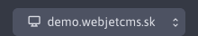
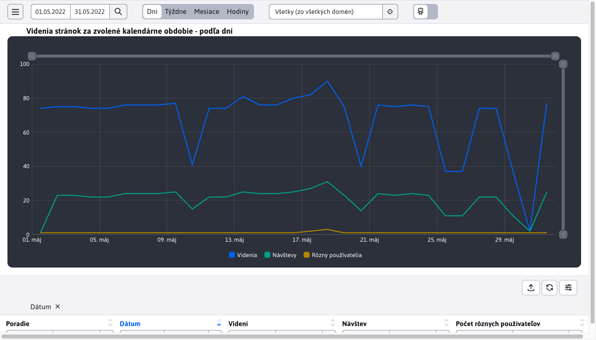
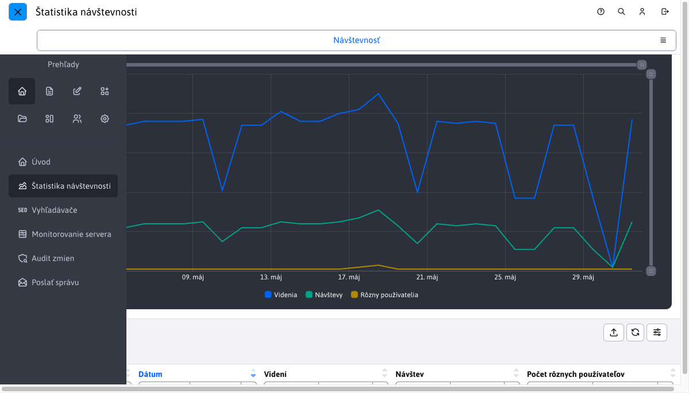
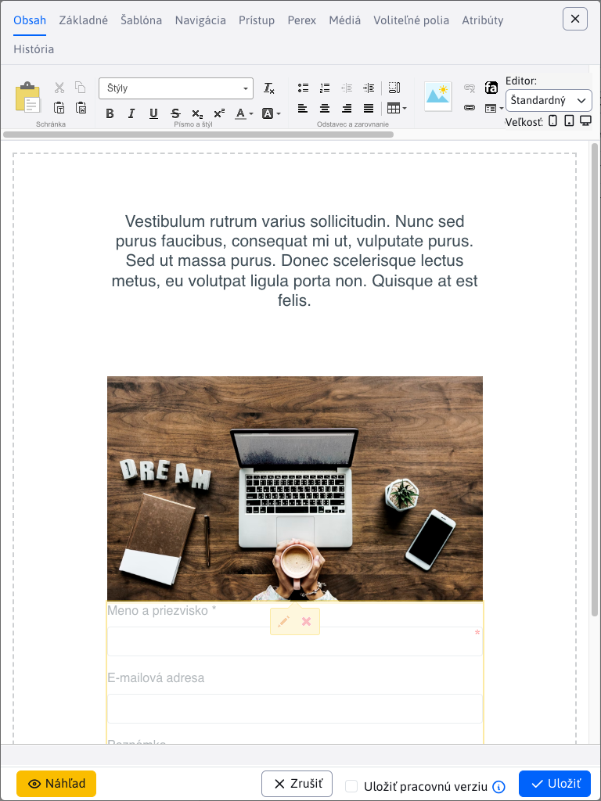
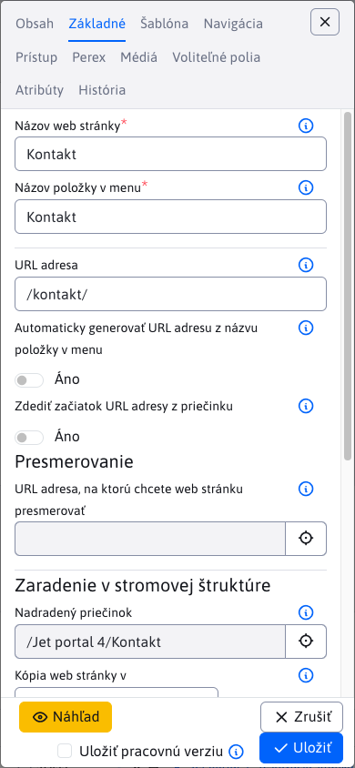

# Hlavné ovládacie prvky

Rozloženie administrácie je štandardné. V hornej časti sa nachádza hlavička, v ľavej časti menu. Tretia úroveň menu je zobrazená ako navigačné karty v hlavičke.


## Hlavička

V hornej časti sa nachádza hlavička:


obsahuje nasledovné možnosti:

- Odkaz na otvorenie pomocníka.
-  Ikonu na otvorenie stránky [Vyhľadávanie](search/README.md)
- Meno aktuálne prihláseného používateľa, kliknutím na meno zobrazíte nasledovné možnosti:
  - Profil - upraviť vlastný profil (meno, email... - po zmene profilu je potrebné sa odhlásiť a znova prihlásiť).
  - Dvojstupňové overovanie - možnosť aktivovať dvoj stupňové overovanie pomocou aplikácie ```Google Authenticate``` pri prihlasovaní do administrácie. Zvyšuje sa tak bezpečnosť vášho konta, pretože okrem hesla je pre prihlásenie potrebné zadať aj kód z vášho mobilného zariadenia. Odporúčame nastaviť na všetky kontá, cez ktoré je možné spravovať používateľské účty a práva. Ak používate overovanie voči `ActiveDirectory/SSO` serveru môžete menu položku vypnúť nastavením konf. premennej `2factorAuthEnabled` na hodnotu `false`.
  - Správa šifrovacích kľúčov - umožňuje vytvoriť nový šifrovací kľúč pre šifrovanie formulárov a zadať existujúci kľúč pre ich dešifrovanie. Vyžaduje právo Formuláre.
  - Odhlásenie - odhlásenie z administrácie.
-  Ikonu na odhlásenie z administrácie.

V hlavičke sa môžu zobrazovať karty na prechod do tretej úrovne menu.

## Menu

V ľavej časti pod logom WebJETu sú ikony reprezentujúce hlavné sekcie menu. Rozhodli sme sa pre takúto reprezentáciu prvej úrovne menu, aby sme nemuseli mať hlboko vnorené menu položky:


Kliknutím na ikonu hlavnej sekcie sa zobrazia menu položky zvolenej sekcie:


Výber domény s ktorou pracujete (pri viac doménovej inštalácii) sa nachádza v spodnej časti ľavého menu.



## Zobrazenie na mobilných zariadeniach

Administrácia sa prispôsobuje mobilným zariadeniam. Pri šírke okna menej ako 1200 bodov sa schová hlavička stránky a ľavé menu:



hlavičku a menu zobrazíte kliknutím na ikonu hamburger menu  vľavo hore. Následne sa menu a hlavička zobrazí ponad stránku. Navigačné karty sa v hlavičke zobrazia ako výberové menu.



menu zatvoríte kliknutím na ikonu zatvorenia menu .

Editor v datatabuľke pri šírke okna menej ako 992 bodov (tabletové zobrazenie) sa zobrazí na plnú veľkosť okna:



Pri okne užšom ako 576 bodov sa presunú aj názvy polí z ľavej strany nad pole pre lepšie zobrazenie napr. na mobilnom telefóne:

