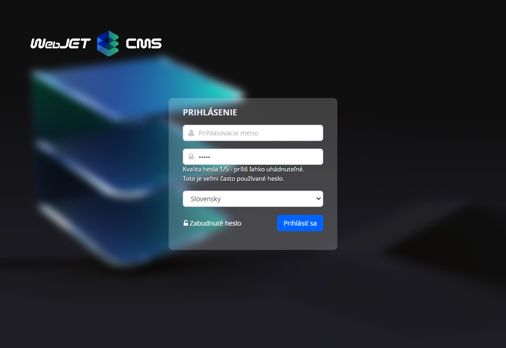
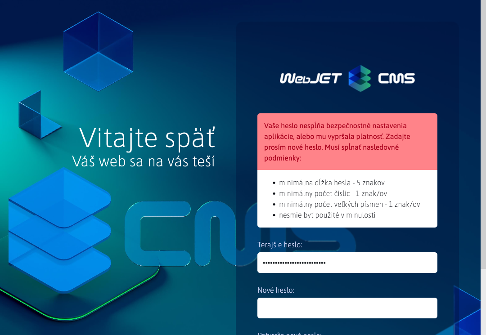
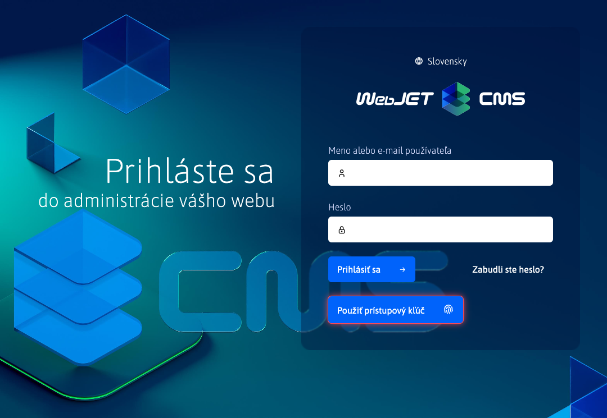
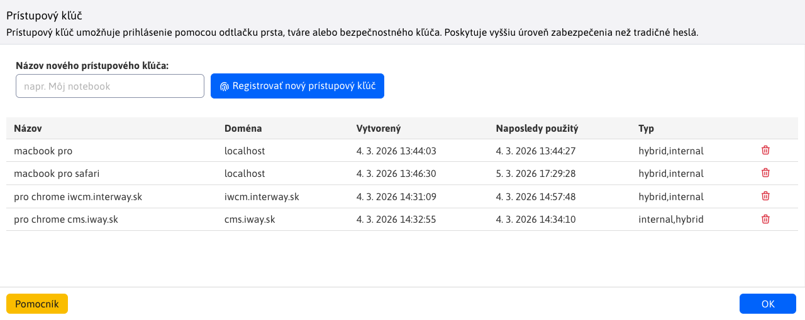
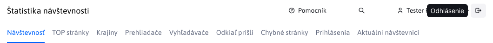
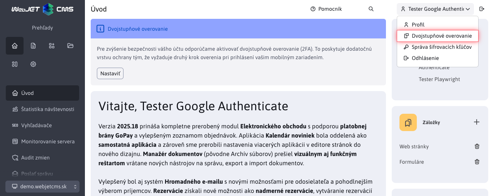
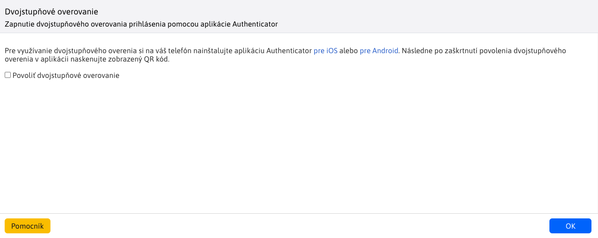
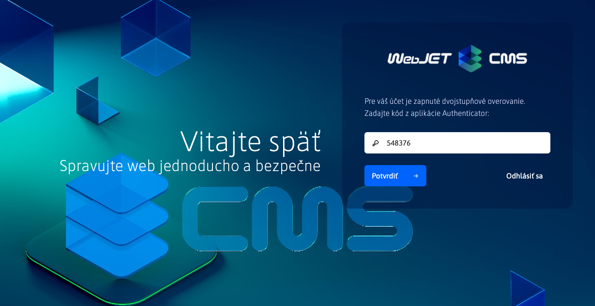

# Prihlásenie a odhlásenie

## Prihlásenie

### Prihlásenie menom a heslom

Do administrácie WebJET CMS sa prihlásite na adrese ```https://vasa-domena.sk/admin/```. Zobrazí sa prihlasovacia obrazovka:



v ktorej zadajte vaše prihlasovacie meno a heslo. Do prihlasovacieho dialógu je integrovaná kontrola kvality hesla, ak vaše heslo nedosahuje kvalitu minimálne 4 je potrebné heslo po prihlásení zmeniť na bezpečnejšie heslo (musí obsahovať viaceré veľké a malá písmená, číslice a špeciálne znaky ako ```.-_?/```).

Kliknutím na odkaz **Zabudnuté heslo** sa zobrazí formulár na zmenu hesla. Zadajte vašu emailovú adresu, ak je evidovaná v systéme dostanete na email odkaz na zmenu hesla. Kliknite na odkaz v maile, ktorý ste dostali pre zobrazenie formuláru na zmenu hesla.

Podľa nastavenia systému môže uplynúť platnosť vášho hesla, alebo nemusí už spĺňať bezpečnostné požiadavky. Vtedy sa po zadaní správneho hesla zobrazí výzva na zadanie nového hesla:



Zadajte nové heslo tak, aby spĺňalo požadované kritéria.

### Použiť prístupový kľúč

**Prístupový kľúč** (angl. *PassKey*) je moderná metóda prihlásenia, ktorá nahrádza tradičné heslo. Využíva asymetrické šifrovanie (štandard WebAuthn/FIDO2) – do systému sa ukladá iba verejná časť kľúča, súkromná zostáva uložená vo vašom zariadení. Prístupový kľúč je viazaný na konkrétnu doménu, čo zabraňuje phishingovým útokom.



#### Výhody oproti heslu

- **Vyššia bezpečnosť** – na serveri nie je uložené žiadne heslo, ktoré by mohlo uniknúť pri bezpečnostnom incidente.
- **Odolnosť voči phishingu** – kľúč funguje iba na adrese, pre ktorú bol vytvorený, na podvrhnutej stránke sa nepoužije.
- **Žiadne zabudnuté heslo** – prihlásenie funguje biometriou (odtlačok prsta, rozpoznanie tváre) alebo PIN-om zariadenia.
- **Rýchle prihlásenie** – nie je potrebné zadávať meno, heslo ani kód z autentifikátora.

#### Ako sa prihlásiť prístupovým kľúčom

Na prihlasovacej stránke kliknite na tlačidlo **Použiť prístupový kľúč**. Následne vás prehliadač vyzve na overenie totožnosti pomocou biometrie alebo PIN-u vášho zariadenia.


**Windows (Windows Hello)**

Systém zobrazí výzvu Windows Hello. Overte sa odtlačkom prsta, rozpoznaním tváre alebo zadaním PIN-u zariadenia. Po úspešnom overení budete automaticky prihlásený.

**macOS / iOS (Touch ID / Face ID)**

Systém zobrazí výzvu Touch ID alebo Face ID. Priložte prst na snímač alebo pozerajte do kamery. Po úspešnom overení budete automaticky prihlásený.

**Mobilné zariadenie (Android / iOS)**

Systém zobrazí výzvu na odomknutie zariadenia (odtlačok prsta, tvár alebo PIN). Po úspešnom overení budete automaticky prihlásený.

#### Pridanie nového prístupového kľúča

Prístupový kľúč pridáte po prihlásení kliknutím na vaše **meno v pravej hornej časti** hlavičky administrácie


a výberom položky **Prístupový kľúč**.


Zobrazí sa správca prístupových kľúčov.



1. Do poľa **Názov nového prístupového kľúča** zadajte pomenovanie (napr. Môj notebook), aby ste kľúče ľahko rozlíšili.
2. Kliknite na tlačidlo **Registrovať nový prístupový kľúč**.
3. Prehliadač vás vyzve na overenie totožnosti biometriou alebo PIN-om zariadenia.
4. Po úspešnom overení sa kľúč zobrazí v zozname zaregistrovaných kľúčov.

Zaregistrovaný kľúč môžete kedykoľvek odstrániť kliknutím na ikonu koša v príslušnom riadku zoznamu.

!>**Upozornenie:** Prístupový kľúč je viazaný na konkrétne zariadenie a prehliadač. Ak sa chcete prihlasovať z viacerých zariadení, zaregistrujte ho na každom zariadení zvlášť, alebo využite cloud synchronizačnú službu na prenos kľúčov medzi zariadeniami (napríklad iCloud Kľúčenka, Google Password Manager).

Možnosť prihlasovania prístupovým kľúčom môžete vypnúť nastavením konfiguračnej premennej `password_passKeyEnabled` na hodnotu `false`.

## Odhlásenie

Odkaz na odhlásenie sa nachádza v hlavičke administrácie v pravej hornej časti ako ikona :



Kliknutím na ikonu odhlásenia sa odhlásite z WebJET CMS. Z dôvodu bezpečnosti odporúčame, aby ste sa **vždy po skončení práce odhlásili** a nielen zatvorili okno v prehliadači.

!>**Upozornenie:** pri menšej veľkosti okna sa nezobrazuje hlavička, kliknite na ikonu hamburger menu  pre zobrazenie hlavičky.

## Dvojstupňové overovanie

**Dvojstupňové overovanie** tiež známe ako **Dvojfaktorová autorizácia (2FA)** pomocou aplikácie `Google Authenticator` (alebo `Microsoft Authenticator`) zvyšuje bezpečnosť vášho konta, pretože okrem hesla je pre prihlásenie potrebné zadať aj kód z vášho mobilného zariadenia.

!>**Upozornenie:** Odporúčame nastaviť na všetky kontá, cez ktoré je možné spravovať používateľské účty a práva.

Pre používanie **dvojstupňového overovania** musíte mať nastavenú konfiguračnú premennú `2factorAuthEnabled` na hodnotu `true`.

Ak používate overovanie voči `ActiveDirectory/SSO` serveru, môžete funkcionalitu vypnúť nastavením konf. premennej `2factorAuthEnabled` na hodnotu `false`.

!>**Upozornenie:** ak chcete každého administrátora donútiť k využívaniu **dvojstupňového overovania**, stačí ak nastavíte konfiguračnú premennú `isGoogleAuthRequiredForAdmin` na hodnotu `true`.

### Nastavenie dvojstupňového overovania

Nastavenie `2FA` nájdete kliknutím na meno používateľa v pravej hornej časti


následne sa zobrazí menu, v ktorej zvolíte možnosť **Dvojstupňové overovanie**



Zobrazí sa Vám okno s nastavením dvojstupňového overovania.



Pre ďalší krok, budete potrebovať nainštalovanú aplikáciu. V okne už sú pripravené linky pre aplikáciu `Google Authenticator`

- <a href="https://itunes.apple.com/us/app/google-authenticator/id388497605" target="_blank">Google Authenticator pre iOS</a>
- <a href="https://play.google.com/store/apps/details?id=com.google.android.apps.authenticator2" target="_blank">Google Authenticator pre Android</a>

ale môžete používať aj `Microsoft Authenticator` alebo inú aplikáciu podporujúcu `TOTP` kódy.

- <a href="https://apps.apple.com/us/app/microsoft-authenticator/id983156458" target="_blank">Microsoft Authenticator pre iOS</a>
- <a href="https://play.google.com/store/search?q=microsoft%20auth&c=apps" target="_blank">Microsoft Authenticator pre Android</a>

Následne v okne zaškrtnite možnosť **Povoliť dvojstupňové overovanie**, čím sa Vám zobrazí `QR` kód. Pomocou mobilnej aplikácie naskenujte tento `QR` kód, prípadne pridajte overenie zadaním vygenerovaného kľúča.


!>**Upozornenie:** nezabudnite stlačiť **OK** pre uloženie nastavenia.

### Prihlásenie so zadaním kódu

Pri nasledujúcom prihlásení zadáte svoje štandardné prihlasovacie údaje


a ak sa **dvojstupňové overovanie** úspešne nastavilo, po zadaní mena a hesla budete ešte vyzvaný na zadanie kódu z autentifikačnej aplikácie.



Môže nastať situácia, kedy zadanému kód vyprší platnosť, kým sa stihnete prihlásiť. V takom prípade musíte zadať nový kód vygenerovaný aplikáciou.


Ak zadáte platný kód, budete úspešne prihlásený.

### Strata mobilného zariadenia

Pri strate zariadenia môžete stratiť prístup k účtu, preto odporúčame v aplikácii nastaviť zálohovanie dát, pre ich jednoduchú obnovu na novom zariadení. Ak používate viacej zariadení, je možné QR kód pri nastavení dvoj faktorovej autentifikácie pridať do viacerých zariadení, alebo rôznych aplikácií naraz.