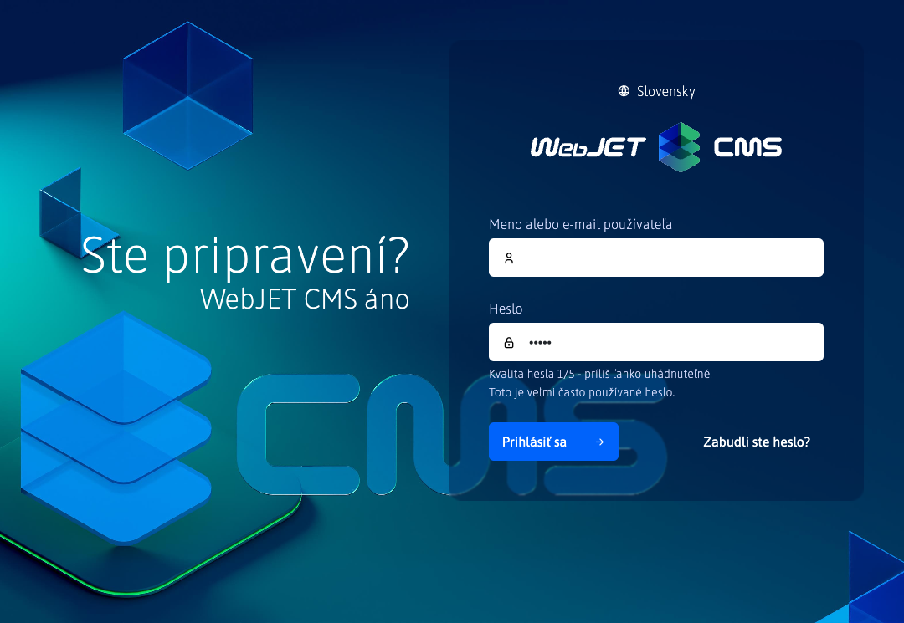
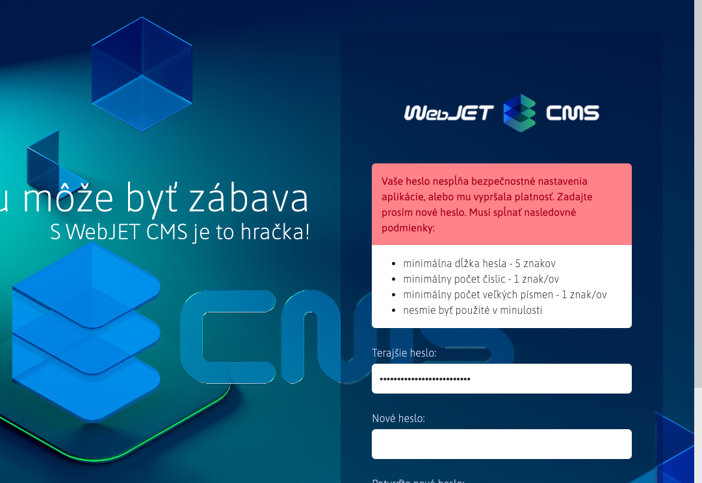

# Prihlásenie a odhlásenie

## Prihlásenie

Do administrácie WebJET CMS sa prihlásite na adrese ```https://vasa-domena.sk/admin/```. Zobrazí sa prihlasovacia obrazovka:



v ktorej zadajte vaše prihlasovacie meno a heslo. Do prihlasovacieho dialógu je integrovaná kontrola kvality hesla, ak vaše heslo nedosahuje kvalitu minimálne 4 je potrebné heslo po prihlásení zmeniť na bezpečnejšie heslo (musí obsahovať viaceré veľké a malá písmená, číslice a špeciálne znaky ako ```.-_?/```).

Kliknutím na odkaz **Zabudnuté heslo** sa zobrazí formulár na zmenu hesla. Zadajte vašu emailovú adresu, ak je evidovaná v systéme dostanete na email odkaz na zmenu hesla. Kliknite na odkaz v maile, ktorý ste dostali pre zobrazenie formuláru na zmenu hesla.

Podľa nastavenia systému môže uplynúť platnosť vášho hesla, alebo nemusí už spĺňať bezpečnostné požiadavky. Vtedy sa po zadaní správneho hesla zobrazí výzva na zadanie nového hesla:



Zadajte nové heslo tak, aby spĺňalo požadované kritéria.

## Odhlásenie

Odkaz na odhlásenie sa nachádza v hlavičke administrácie v pravej hornej časti ako ikona :


Kliknutím na ikonu odhlásenia sa odhlásite z WebJET CMS. Z dôvodu bezpečnosti odporúčame, aby ste sa **vždy po skončení práce odhlásili** a nielen zatvorili okno v prehliadači.

!>**Upozornenie:** pri menšej veľkosti okna sa nezobrazuje hlavička, kliknite na ikonu hamburger menu  pre zobrazenie hlavičky.

## Dvojstupňové overovanie

**Dvojstupňové overovanie** tiež známe ako **Dvojfaktorová autorizácia (2FA)** pomocou aplikácie `Google Authenticator` (alebo `Microsoft Authenticator`) zvyšuje bezpečnosť vášho konta, pretože okrem hesla je pre prihlásenie potrebné zadať aj kód z vášho mobilného zariadenia.

!>**Upozornenie:** Odporúčame nastaviť na všetky kontá, cez ktoré je možné spravovať používateľské účty a práva.

Pre používanie **dvojstupňového overovania** musíte mať nastavenú konfiguračnú premennú `2factorAuthEnabled` na hodnotu `true`.

Ak používate overovanie voči `ActiveDirectory/SSO` serveru, môžete funkcionalitu vypnúť nastavením konf. premennej `2factorAuthEnabled` na hodnotu `false`.

!>**Upozornenie:** ak chcete každého administrátora donútiť k využívaniu **dvojstupňového overovania**, stačí ak nastavíte konfiguračnú premennú `isGoogleAuthRequiredForAdmin` na hodnotu `true`.

### Nastavenie dvojstupňového overovania

Nastavenie `2FA` nájdete kliknutím na meno používateľa v pravej hornej časti


následne sa zobrazí menu, v ktorej zvolíte možnosť **Dvojstupňové overovanie**


Zobrazí sa Vám okno s nastavením dvojstupňového overovania.


Pre ďalší krok, budete potrebovať nainštalovanú aplikáciu. V okne už sú pripravené linky pre aplikáciu `Google Authenticator`

- <a href="https://itunes.apple.com/us/app/google-authenticator/id388497605" target="_blank">Google Authenticator pre iOS</a>
- <a href="https://play.google.com/store/apps/details?id=com.google.android.apps.authenticator2" target="_blank">Google Authenticator pre Android</a>

ale môžete používať aj `Microsoft Authenticator` alebo inú aplikáciu podporujúcu `TOTP` kódy.

- <a href="https://apps.apple.com/us/app/microsoft-authenticator/id983156458" target="_blank">Microsoft Authenticator pre iOS</a>
- <a href="https://play.google.com/store/search?q=microsoft%20auth&c=apps" target="_blank">Microsoft Authenticator pre Android</a>

Následne v okne povoľte možnosť **Povoliť dvojstupňové overovanie**, čím sa Vám zobrazí `QR` kód. Pomocou stiahnutej aplikácie naskenujte tento `QR` kód, prípadne pridajte overenie vygenerovaným kľúčom.


!>**Upozornenie:** nezabudnite stlačiť **OK** pre uloženie nastavenia.

Pri nasledujúcom pokuse o prihlásenie zadáte svoje štandardné prihlasovacie údaje


ak sa **dvojstupňové overovanie** úspešne nastavilo, po prihlásení budete ešte vyzvaný na zadanie kódu z autentifikačnej aplikácie.


môže nastať situácia, kedy zadanému kód vyprší platnosť, kým sa stihnete prihlásiť. V takom prípade musíte zadať nový kód vygenerovaný aplikáciou.


Ak zadáte platný kód, budete úspešne prihlásený.

### Odporúčanie

Pri strate zariadenia môžete stratiť prístup k účtu, preto odporúčame v aplikácii nastaviť zálohovanie dát.