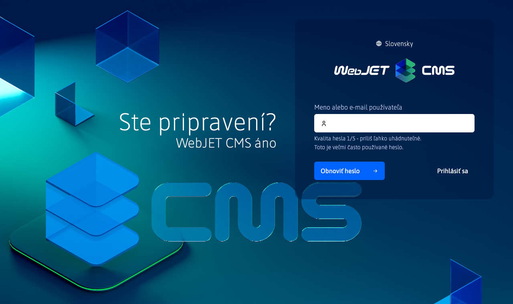
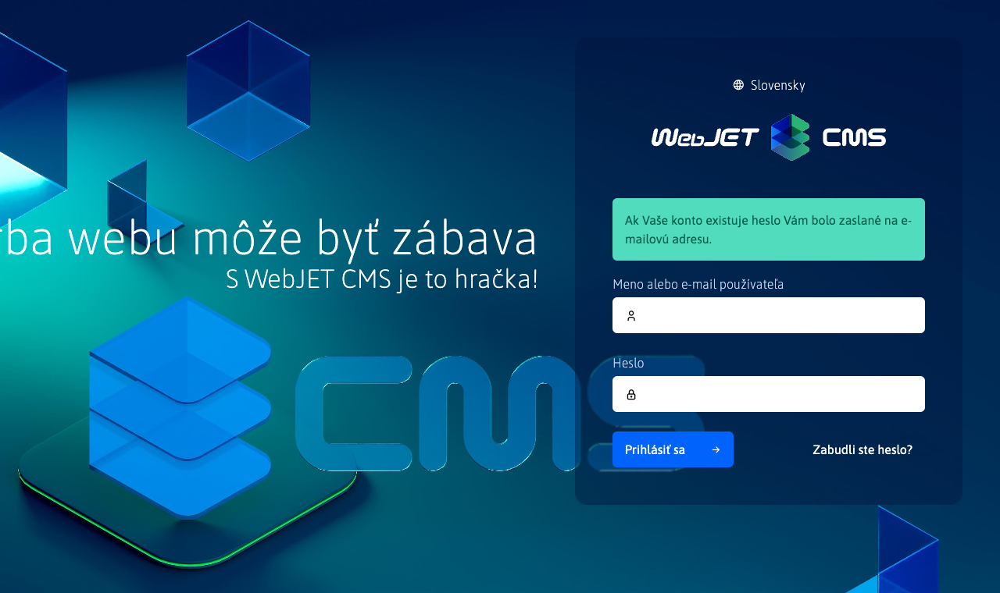
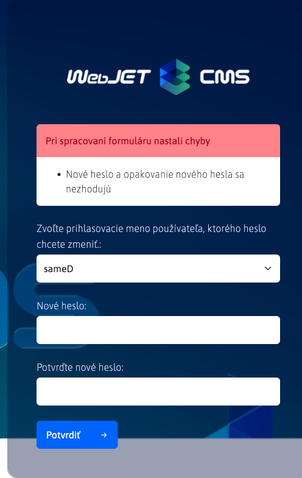
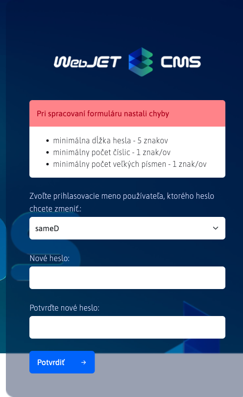
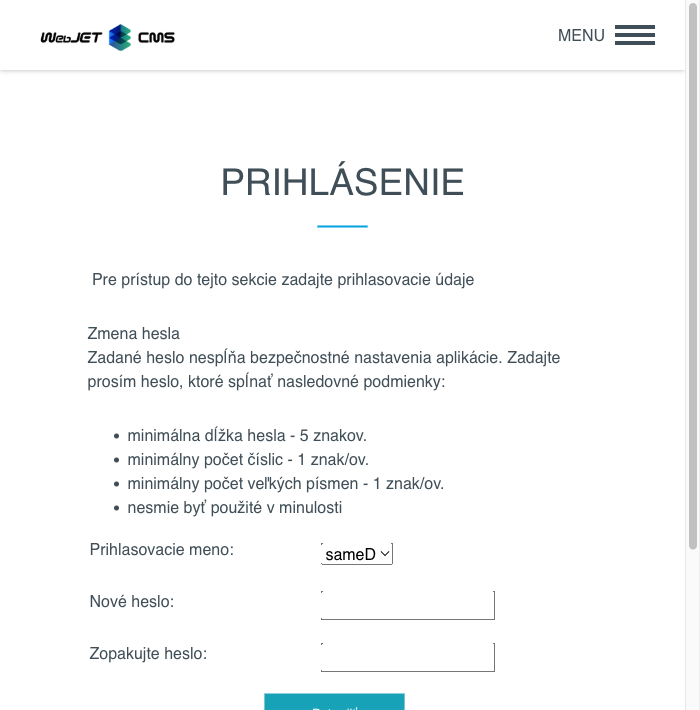
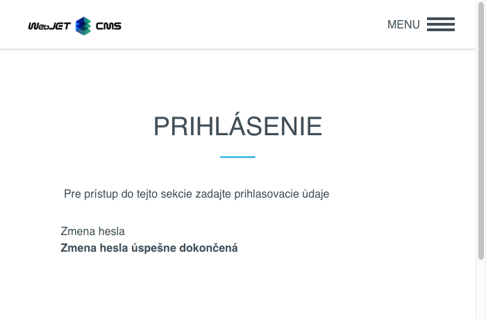
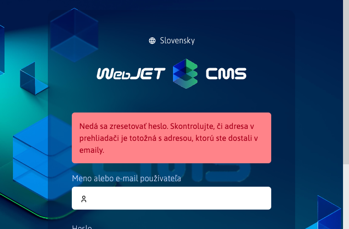
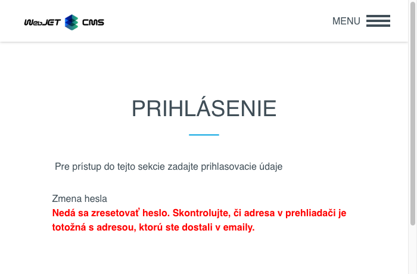
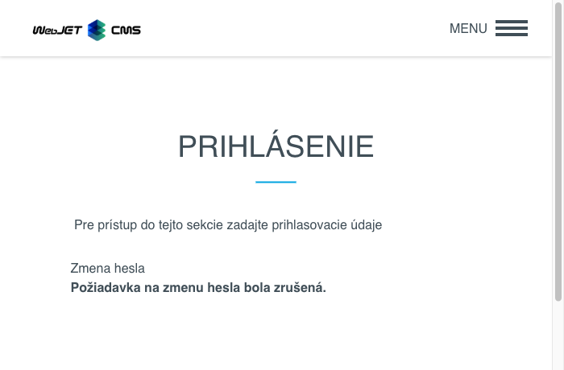

# Zabudnuté heslo

V prípade ak ste zabudli svoje heslo môžete ho obnoviť nasledujúcim spôsobom.

## Admin sekcia

Ak ste zabudli svoje heslo pre admin sekciu, môžete požiadať o obnovenie hesla na prihlasovacej stránke.

Kliknutím na na možnosť  sa zobrazí formulár pre obnovenie hesla.

Do poľa musíte zadať Vašu **emailovú adresu** alebo **prihlasovacie meno**. Žiadosť odošlete stlačením tlačidla . Zobrazená notifikácia Vás upozorní, že ak konto existuje, bude zaslaný email na patričnú e-mailovú adresu.

## Zákaznícka zóna

Ak ste zabudli svoje heslo pre zákaznícku zónu, môžete požiadať o obnovenie hesla na prihlasovacej stránke.

Kliknutím na na možnosť **Zabudli ste vaše heslo?** sa zobrazí skryté pole pre obnovenie.

Pred                            |  Po
:------------------------------:|:-------------------------:
   |  

Do poľa musíte zadať Vašu **emailovú adresu** alebo **prihlasovacie meno**. Žiadosť odošlete stlačením tlačidla . Zobrazená notifikácia Vás upozorní, že ak konto existuje, bude zaslaný email na patričnú e-mailovú adresu.

## Email k zmene hesla

Zaslaný email obsahuje 2 odkazy:

- odkaz pre zmenu hesla, **Ak si chcete zmeniť heslo, kliknite sem do 30 minút.**
- odkaz na zrušenie akcie zmeny hesla, **Ak ste nepožiadali o zmenu hesla môžete túto akciu zrušiť kliknutím sem.**

Meno a email adresu z ktorej je odoslaný email s odkazom na zmenu hesla je možné nastaviť cez konfiguračné premenné `passwordResetDefaultSenderEmail` a `passwordResetDefaultSenderName`.

### Akcia zmeny hesla

Kliknutím na prvý odkaz, **Ak si chcete zmeniť heslo, kliknite sem do 30 minút.**, sa dostanete na stránku k zmene hesla.

Admin sekcia                    |  Používateľská sekcia
:------------------------------:|:-------------------------:
  |  

!> **Upozornenie:** prihlasovacie meno je typu výberové pole z dôvodu možnosti registrácie viacerých prihlasovacích mien s rovnakým emailom (napr. prihlásenie do administrácie a zákaznícke konto). Výberové pole tak obsahuje všetky prihlasovacie mená, ktoré zdieľajú zadanú emailovú adresu. **Heslo bude zmenené iba používateľovi, ktorého prihlasovacie meno zvolíte.**

Následne musíte zadať nové heslo a znovu ho zadať pre overenie. Ak sa hesla nebudú zhodovať alebo nebudú spĺňať minimálne požiadavky na kvalitu hesla, budete upozornení.

Heslo sa nezhoduje               |  Slabé heslo
:-------------------------------:|:--------------------------------:
   |  
    |  

Ak sa heslo pre zvoleného používateľa úspešne zmení, zobrazí sa nasledujúce hlásenie.

Admin sekcia                    |  Používateľská sekcia
:------------------------------:|:-------------------------:
  | 

!> **Upozornenie:** po úspešnej zmene hesla sa odkaz, ktorým ste sa dostali k formuláru na zmenu **stáva nefunkčným**, čiže nebude sa dať použiť na opätovnú zmenu hesla pre toho istého alebo iného používateľa. Odkaz sa stáva taktiež nefunkčný, ak ste akciu nevykonali do 30 minút od prijatia emailu.

Admin sekcia                            |  Používateľská sekcia
:--------------------------------------:|:---------------------------------:
 | 

### Akcia zrušenia zmeny

Kliknutím na druhý odkaz **Ak ste nepožiadali o zmenu hesla môžete túto akciu zrušiť kliknutím sem.** sa opäť dostanete na stránku, ktorá Vám oznámi že akcia zmeny hesla bola zrušená, čím sa prvý odkaz na zmenu hesla **stala nefunkčná**.

Admin sekcia                        |  Používateľská sekcia
:----------------------------------:|:---------------------------------:
 | 

## Poznámky k implementácii

- zmena hesla funguje cez záznam auditu, kde pri žiadosti o zmenu hesla sa vytvorí záznam typu `USER_CHANGE_PASSWORD`, ktorý má v popise text `Vyžiadanie zmeny hesla`
- pri akcii o zmenu hesla sa overí, či tento auditný záznam existuje a či nie je starší ako 30 minút, ak neexistuje alebo je starší, odkaz k zmene hesla už nebude fungovať a záznam ostane existovať
- pri použití odkazu k zrušeniu zmeny hesla sa vymaže tento záznam z auditu
- ak email použitý pre zmenu hesla je spojený s viacerými účtami, v auditnom zázname je vždy prihlasovacie meno najnovšieho používateľa, ktorým je možné cez tento email zmeniť heslo
- po úspešnej akcii zmeny hesla sa záznam z auditu vymaže