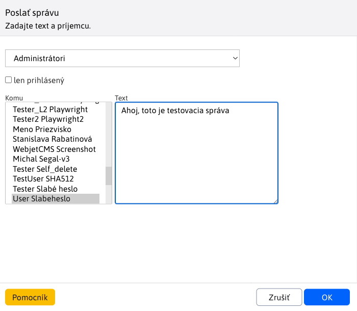

# Poslať správu

Kliknutím na možnosť **Poslať správu** sa vám otvorí nové okno, cez ktoré môžete poslať správu viacerým používateľom. Správa sa zobrazuje vo vyskakovacom okne v administrácii, kde je následne možné na správu odpovedať.

Pokiaľ vyskakovacie okno ešte nie je otvorené, nová správa sa kontroluje pri načítaní obsahu okna administrácie a následne každú minútu.

!> **Upozornenie:** Ak máte zablokované vyskakovacie okná, okno s novou správou sa nezobrazí.

## Možnosti pri písaní správy

- **Výberové pole skupina** - skupina používateľov, ktorých zoznam sa zobrazí v poli **Komu**.
- **Len prihlásený** - ak zaškrtnete, správa sa zobrazí len, ak je zvolený používateľ aktuálne prihlásený.
- **Komu** - zoznam mien, ktorým chcete správu poslať; viac mien označíte stlačením klávesy **CTRL** a kliknutím myšou na meno.
- **Text** - text správy.

Kliknutím na **OK** sa zašle zadaná správa zvoleným používateľom.
